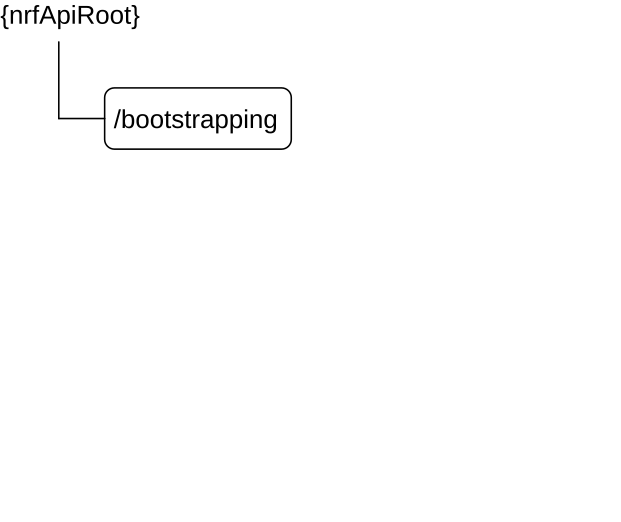

# 6.4 Nnrf_Bootstrapping Service API

## 6.4.1 API URI

URIs of this API shall have the following root:

{nrfApiRoot}

where {nrfApiRoot} represents the concatenation of the "scheme" and "authority" components of the NRF, as defined in IETF RFC 3986 \[17\].

## 6.4.2 Usage of HTTP

### 6.4.2.1 General

HTTP/2, as defined in IETF RFC 9113 \[9\], shall be used as specified in clause 5 of 3GPP TS 29.500 \[4\].

HTTP/2 shall be transported as specified in clause 5.3 of 3GPP TS 29.500 \[4\].

HTTP messages and bodies this API shall comply with the OpenAPI \[10\] specification contained in Annex A.

### 6.4.2.2 HTTP standard headers

#### 6.4.2.2.1 General

The mandatory standard HTTP headers as specified in clause 5.2.2.2 of 3GPP TS 29.500 \[4\] shall be supported.

#### 6.4.2.2.2 Content type

The following content types shall be supported:

\- The JSON format (IETF RFC 8259 \[22\]). The use of the JSON format shall be signalled by the content type "application/json". See also clause 5.4 of 3GPP TS 29.500 \[4\].

\- The Problem Details JSON Object (IETF RFC 9457 \[11\]). The use of the Problem Details JSON object in a HTTP response body shall be signalled by the content type "application/problem+json".

\- The 3GPP hypermedia format as defined in 3GPP TS 29.501 \[5\]. The use of the 3GPP hypermedia format in a HTTP response body shall be signalled by the content type "application/3gppHal+json".

#### 6.4.2.2.3 Cache-Control

A "Cache-Control" header should be included in HTTP responses, as described in IETF RFC 9111 \[20\], clause 5.2. It shall contain a "max-age" value, indicating the amount of time in seconds after which the received response is considered stale.

#### 6.4.2.2.4 ETag

An "ETag" (entity-tag) header should be included in HTTP responses, as described in IETF RFC 9110 \[40\], clause 8.8.3. It shall contain a server-generated strong validator, that allows further matching of this value (included in subsequent client requests) with a given resource representation stored in the server or in a cache.

#### 6.4.2.2.5 If-None-Match

An NF Service Consumer should issue conditional GET requests towards the Nnrf_Bootstrapping service, by including an If-None-Match header in HTTP requests, as described in IETF RFC 9110 \[40\], clause 13.1.2, containing one or several entity tags received in previous responses for the same resource.

### 6.4.2.3 HTTP custom headers

#### 6.4.2.3.1 General

In this release of this specification, no custom headers specific to the Nnrf_Bootstrapping Service API are defined. For 3GPP specific HTTP custom headers used across all service-based interfaces, see clause 5.2.3 of 3GPP TS 29.500 \[4\].

## 6.4.3 Resources

### 6.4.3.1 Overview

The structure of the Resource URIs of the Nnrf_Bootstrapping service is shown in figure 6.4.3.1-1.

Figure 6.4.3.1-1: Resource URI structure of the Nnrf_Bootstrapping API

Table 6.4.3.1-1 provides an overview of the resources and applicable HTTP methods.

Table 6.4.3.1-1: Resources and methods overview

<table>
<colgroup>
<col style="width: 16%" />
<col style="width: 42%" />
<col style="width: 10%" />
<col style="width: 30%" />
</colgroup>
<thead>
<tr class="header">
<th>Resource name</th>
<th>Resource URI</th>
<th>HTTP method or custom operation</th>
<th>Description</th>
</tr>
</thead>
<tbody>
<tr class="odd">
<td>
Bootstrapping

(Document)
</td>
<td>{nrfApiRoot}/bootstrapping</td>
<td>GET</td>
<td>Retrieve a collection of links pointing to other services exposed by NRF.</td>
</tr>
</tbody>
</table>

### 6.4.3.2 Resource: Bootstrapping (Document)

#### 6.4.3.2.1 Description

This resource represents a collection of links pointing to other services exposed by NRF.

This resource is modelled as the Document resource archetype (see clause C.3 of 3GPP TS 29.501 \[5\]).

#### 6.4.3.2.2 Resource Definition

Resource URI: **{nrfApiRoot}/bootstrapping**

This resource shall support the resource URI variables defined in table 6.4.3.2.2-1.

Table 6.4.3.2.2-1: Resource URI variables for this resource

| Name       | Definition       |
|------------|------------------|
| nrfApiRoot | See clause 6.4.1 |

#### 6.4.3.2.3 Resource Standard Methods

#### 6.4.3.2.3.1 GET

This method retrieves a list of links pointing to other services exposed by NRF. This method shall support the URI query parameters specified in table 6.4.3.2.3.1-1.

Table 6.4.3.2.3.1-1: URI query parameters supported by the GET method on this resource

|      |           |     |             |             |
|------|-----------|-----|-------------|-------------|
| Name | Data type | P   | Cardinality | Description |
| n/a  | n/a       |     |             |             |

This method shall support the request data structures specified in table 6.4.3.2.3.1-2 and the response data structures and response codes specified in table 6.4.3.2.3.1-3.

Table 6.4.3.2.3.1-2: Data structures supported by the GET Request Body on this resource

|           |     |             |             |
|-----------|-----|-------------|-------------|
| Data type | P   | Cardinality | Description |
| n/a       |     |             |             |

Table 6.4.3.2.3.1-3: Data structures supported by the GET Response Body on this resource

<table>
<colgroup>
<col style="width: 16%" />
<col style="width: 9%" />
<col style="width: 14%" />
<col style="width: 19%" />
<col style="width: 39%" />
</colgroup>
<tbody>
<tr class="odd">
<td>Data type</td>
<td>P</td>
<td>Cardinality</td>
<td>
Response

codes
</td>
<td>Description</td>
</tr>
<tr class="even">
<td>BootstrappingInfo</td>
<td>M</td>
<td>1</td>
<td>200 OK</td>
<td>The response body contains a "_links" object containing the URI of each service exposed by the NRF. The response may also contain the status of the NRF and the features supported by each NRF service.</td>
</tr>
<tr class="odd">
<td colspan="5">NOTE: The mandatory HTTP error status codes for the GET method listed in Table 5.2.7.1-1 of 3GPP TS 29.500 [4] other than those specified in the table above also apply, with a ProblemDetails data type (see clause 5.2.7 of 3GPP TS 29.500 [4]).</td>
</tr>
</tbody>
</table>

## 6.4.4 Custom Operations without associated resources

There are no custom operations defined without any associated resources for the Nnrf_Bootstrapping service in this release of the specification.

## 6.4.5 Notifications

There are no notifications defined for the Nnrf_Bootstrapping service in this release of the specification.

## 6.4.6 Data Model

### 6.4.6.1 General

This clause specifies the application data model supported by the API.

Table 6.4.6.1-1 specifies the data types defined for the Nnrf_Bootstrapping service-based interface protocol.

Table 6.4.6.1-1: Nnrf_Bootstrapping specific Data Types

| Data type         | Clause defined | Description                                                        |
|-------------------|----------------|--------------------------------------------------------------------|
| BootstrappingInfo | 6.4.6.2.2      | Information returned by NRF in the bootstrapping response message. |
| Status            | 6.4.6.3.2      | Overal status of the NRF.                                          |

Table 6.4.6.1-2 specifies data types re-used by the Nnrf_Bootstrapping service-based interface protocol from other specifications, including a reference to their respective specifications and when needed, a short description of their use within the Nnrf service-based interface.

Table 6.4.6.1-2: Nnrf_Bootstrapping re-used Data Types

| Data type         | Reference            | Comments                                                                                                                                                                                       |
|-------------------|----------------------|------------------------------------------------------------------------------------------------------------------------------------------------------------------------------------------------|
| LinksValueSchema  | 3GPP TS 29.571 \[7\] | 3GPP Hypermedia link                                                                                                                                                                           |
| NfInstanceId      | 3GPP TS 29.571 \[7\] | Identifier (UUID) of the NF Instance. The hexadecimal letters of the UUID should be formatted by the sender as lower-case characters and shall be handled as case-insensitive by the receiver. |
| ProblemDetails    | 3GPP TS 29.571 \[7\] |                                                                                                                                                                                                |
| SupportedFeatures | 3GPP TS 29.571 \[7\] |                                                                                                                                                                                                |

### 6.4.6.2 Structured data types

#### 6.4.6.2.1 Introduction

This clause defines the structures to be used in resource representations.

#### 6.4.6.2.2 Type: BootstrappingInfo

Table 6.4.6.2.2-1: Definition of type BootstrappingInfo

<table>
<colgroup>
<col style="width: 21%" />
<col style="width: 16%" />
<col style="width: 4%" />
<col style="width: 11%" />
<col style="width: 45%" />
</colgroup>
<thead>
<tr class="header">
<th>Attribute name</th>
<th>Data type</th>
<th>P</th>
<th>Cardinality</th>
<th>Description</th>
</tr>
</thead>
<tbody>
<tr class="odd">
<td>status</td>
<td>Status</td>
<td>O</td>
<td>0..1</td>
<td>
Status of the NRF (operative, non-operative, ...)

The NRF shall be considered as operative if this attribute is absent.
</td>
</tr>
<tr class="even">
<td>_links</td>
<td>map(LinksValueSchema)</td>
<td>M</td>
<td>1..N</td>
<td>Map of LinksValueSchema objects, where the keys are the link relations, as described in Table 6.4.6.3.3.1-1, and the values are objects containing an "href" attribute, whose value is an absolute URI corresponding to each link relation.</td>
</tr>
<tr class="odd">
<td>nrfFeatures</td>
<td>map(SupportedFeatures)</td>
<td>O</td>
<td>1..N</td>
<td>
Map of features supported by the NRF, where the keys of the map are the NRF services (as defined in clause 6.1.6.3.11), and where the value indicates the features supported by the corresponding NRF services.

When present, the NRF shall indicate all the features of all the services it supports.

(NOTE)
</td>
</tr>
<tr class="even">
<td>oauth2Required</td>
<td>map(boolean)</td>
<td>O</td>
<td>1..N</td>
<td>
When present, this IE shall indicate whether the NRF requires Oauth2-based authorization for accessing its services.

The key of the map shall be the name of an NRF service, e.g. "nnrf-nfm" or "nnrf-disc".

The value of each entry of the map shall be encoded as follows:

- true: OAuth2 based authorization is required.

- false: OAuth2 based authorization is not required.

The absence of this IE means that the NRF has not provided any indication about its usage of Oauth2 for authorization.
</td>
</tr>
<tr class="odd">
<td>nrfSetId</td>
<td>NfSetId</td>
<td>O</td>
<td>0..1</td>
<td>NRF Set Id</td>
</tr>
<tr class="even">
<td>nrfInstanceId</td>
<td>NfInstanceId</td>
<td>O</td>
<td>0..1</td>
<td>NRF Instance Id</td>
</tr>
<tr class="odd">
<td colspan="5">NOTE: The absence of the nrfFeatures attribute in the BootstrappingInfo shall not be interpreted as if the NRF does not support any feature.</td>
</tr>
</tbody>
</table>

### 6.4.6.3 Simple data types and enumerations

#### 6.4.6.3.1 Introduction

This clause defines simple data types and enumerations that can be referenced from data structures defined in the previous clauses.

#### 6.4.6.3.2 Enumeration: Status

Table 6.4.6.3.2-1: Enumeration Status

| Enumeration value | Description              |
|-------------------|--------------------------|
| "OPERATIVE"       | The NRF is operative     |
| "NON_OPERATIVE"   | The NRF is not operative |

#### 6.4.6.3.3 Relation Types

#### 6.4.6.3.3.1 General

This clause describes the possible relation types defined within NRF API. See clause 4.7.5.2 of 3GPP TS 29.501 \[5\] for the description of the relation types.

Table 6.4.6.3.3.1-1: supported registered relation types

<table>
<colgroup>
<col style="width: 27%" />
<col style="width: 72%" />
</colgroup>
<tbody>
<tr class="odd">
<td>Relation Name</td>
<td>Description</td>
</tr>
<tr class="even">
<td>self</td>
<td>The "href" attribute of the object associated to this relation type contains the URI of the same resource returned in the response body (i.e. the "bootstrapping" resource).</td>
</tr>
<tr class="odd">
<td>manage</td>
<td>
The "href" attribute of the object associated to this relation type contains the URI of the resource used in the Nnrf_NFManagement API to register/deregister/update NF Instances profiles in the NRF (i.e. the "nf-instances" store resource).

(NOTE)
</td>
</tr>
<tr class="even">
<td>subscribe</td>
<td>
The "href" attribute of the object associated to this relation type contains the URI of the resource used in the Nnrf_NFManagement API to manage subscriptions to the NRF (i.e. the "subscriptions" collection resource).

(NOTE)
</td>
</tr>
<tr class="odd">
<td>discover</td>
<td>The "href" attribute of the object associated to this relation type contains the URI of the resource used in the Nnrf_NFDiscovery API (i.e. the "nf-instances" collection resource).</td>
</tr>
<tr class="even">
<td>authorize</td>
<td>The "href" attribute of the object associated to this relation type contains the URI of the Oauth2 Access Token Request endpoint, used to request authorization to other APIs in the 5G Core Network.</td>
</tr>
<tr class="odd">
<td colspan="2">NOTE: The URIs of the "manage" and "subscribe" "href" attributes shall have the same apiRoot (i.e. authority and prefix) since these service operations belong to the same service.</td>
</tr>
</tbody>
</table>
