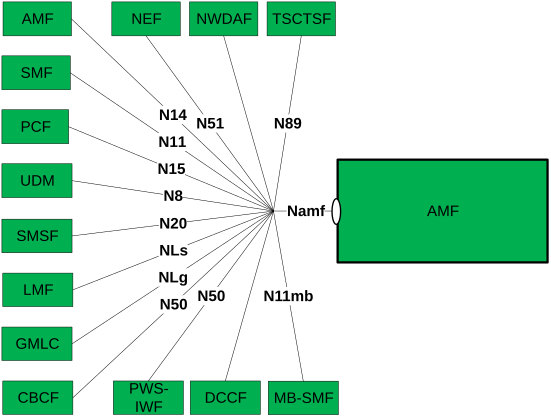

# 4 Overview

## 4.1 Introduction

Within the 5GC, the AMF offers services to the SMF, other AMF, PCF, SMSF, LMF, GMLC, CBCF, PWS-IWF, NWDAF, DCCF, NEF, TSCTSF and MB-SMF via the Namf service based interface (see TS 23.501 \[2\], TS 23.502 \[3\], TS 23.041 \[20\], TS 23.288 \[38\] and TS 23.247 \[55\]).

Figure 4.1-1 provides the reference model (in service based interface representation and in reference point representation), with focus on the AMF and the scope of the present specification.

Figure 4.1-1: Reference model – AMF

The functionalities supported by the AMF are listed in clause 6.2.1 of TS 23.501 \[2\].
