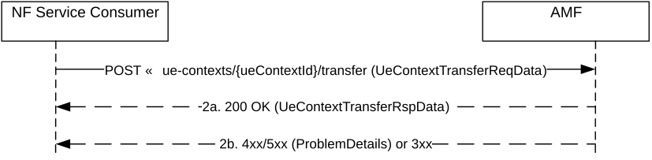

# 5.2.2.2.1 UEContextTransfer

## 5.2.2.2.1.1 General

The UEContextTransfer service operation is used during the following procedure:

\- General Registration procedure (see TS 23.502 \[3\], clause 4.2.2.2.2)

\- Registration with Onboarding SNPN (see TS 23.502 \[3\], clause 4.2.2.2.4)

The UEContextTransfer service operation is invoked by a NF Service Consumer, e.g. a target AMF, towards the AMF (acting as source AMF), when the target AMF receives a Registration Request with the UE's 5G-GUTI included and the serving AMF has changed since last registration, to retrieve the UE Context, e.g. the UE's SUPI and MM Context, in the source AMF.

The NF Service Consumer (e.g. the target AMF) shall retrieve the UE Context by invoking the "transfer" custom method on the URI of an "Individual ueContext" resource identified by UE's 5G-GUTI, see clause 6.1.3.2.4. See also Figure 5.2.2.2.1.1-1.

Figure 5.2.2.2.1.1-1 UE Context Transfer

1\. The NF Service Consumer, e.g. target AMF, shall send a HTTP POST request to invoke "transfer" custom method on an "Individual ueContext" resource URI. The content of the request shall be an object of "UeContextTransferReqData" data type.

If UE Context Transfer is triggered by UE initial registration, mobility registration, disaster roaming initial registration or disaster roaming mobility registration, the NF Service Consumer, e.g. target AMF, shall set the reason attribute to "INIT_REG" or "MOBI_REG" and include the integrity protected registration request message which triggers the UE context transfer in the content.

2a. On success:

\- if the reason attribute is "INIT_REG" and integrity check is successful, the (source) AMF shall respond with the status code "200 OK". The content of the response shall be an object of "UeContextTransferRspData" data type, containing:

case a) the representation of the requested UE Context as follows:

\- without PDU Session Contexts associated to the access type indicated in the request by the NF Service Consumer (e.g. target AMF); and

\- with PDU Session Contexts associated to the other access type, if the UE is registered for the other access type in the (source) AMF, unless the source AMF determines based on the PLMN ID or SNPN ID of the (target) AMF that there is no possibility for relocating the N2 interface for non-3GPP access to the (target) AMF;

or

case b) the representation of the requested UE Context only containing the "supi" attribute, if the UE is registered in a different access type in the (source) AMF and the source AMF determines based on the PLMN ID of the (target) AMF that there is no possibility for relocating the N2 interface to the (target) AMF.

\- If the reason attribute is "MOBI_REG" and integrity check is successful, the (source) AMF shall respond with the status code "200 OK". The content of the response shall be an object of "UeContextTransferRspData" data type, containing:

a\) the representation of the complete UE Context including available MM and PDU Session Contexts. The source AMF shall transfer the complete UE context including both access types if the UE is registered for both 3GPP and non-3GPP accesses and if the target PLMN is the same as the source PLMN; or

b\) the representation of the requested UE Context including the available MM and PDU Session Contexts for the 3GPP access type, if the UE is registered for both 3GPP and non-3GPP accesses in the (source) AMF and the source AMF determines based on the PLMN ID or SNPN ID of the (target) AMF that there is no possibility for relocating the N2 interface for non-3GPP access to the (target) AMF.

NOTE: The source AMF can determine that it is not possible to relocate the N2 interface to the target AMF when both AMFs pertain to different PLMNs or SNPNs.

The UE context shall contain trace control and configuration parameters, if signalling based trace has been activated (see TS 32.422 \[30\]).

The NF Service Consumer, e.g. target AMF, starts tracing according to the received trace control and configuration parameters, if trace data is received in the UE context indicating that signalling based trace has been activated. Once the NF Service Consumer receives subscription data, trace requirements received from the UDM supersedes the trace requirements received from the AMF.

The UE context shall contain analytics subscription parameters, if the (source) AMF has created analytics subscription(s) towards NWDAF related to the UE (see clause 5.2.2.2.2 of TS 23.502 \[3\]) and both the source and the target AMFs support the "ASUC" feature. The NF Service Consumer, e.g. target AMF, may take over the analytics subscription(s).

The UE context shall contain event subscriptions information in the following cases:

a\) Any NF Service Consumer has subscribed for UE specific event; and/or

b\) Any NF Service Consumer has subscribed for UE group specific events to which the UE belongs. In this case the event subscriptions provided in the UE context shall contain the event details applicable to this specific UE in the group (e.g maxReports in options IE).

The NF Service Consumer, e.g. target AMF, shall:

\- in case a) create event subscriptions for the UE specific events;

\- in case b) create event subscriptions for the group Id if there are no existing event subscriptions for that group Id, subscription change notification URI (subsChangeNotifyUri) and the subscription change notification correlation Id (subsChangeNotifyCorrelationId). If there is already an existing event subscription for the group Id, and for the given subscription change notification URI (subsChangeNotifyUri) and subscription change notification correlation Id (subsChangeNotifyCorrelationId), then an event subscription shall not be created at the NF Service Consumer. The individual UE specific event details (e.g maxReports in options IE) within that group shall be taken into account.

\- for both the cases, for each created event subscription, allocate a new subscription Id, if necessary (see clause 6.5.2 of TS 29.500 \[4\]), and if allocated, send the new subscription Id to the notification endpoint for informing the subscription Id creation, along with the notification correlation Id for the subscription Id change. If the UEContextTransfer service operation is performed towards the old AMF as part of the EPS to 5GS mobility registration procedure using N26 interface (see clause 4.11.1.3.3 of TS 23.502 \[3\]), the target AMF may also initiate event subscription synchronization procedure with UDM, as specified in clause 5.3.2.4.2, when both the target AMF and the UDM support the "ESSYNC" feature.

NOTE: Subscription Id can be reused if the mobility is between AMFs of same AMF Set.

> If the UE context being transferred from the source AMF is the last UE context that belongs to a UE group Id related subscription, then the source AMF shall not delete the UE group Id related subscription until the expiry of that event subscription (see clause 5.3.2.2.2).
>
> The target AMF may authorize the event subscriptions transferred from the source AMF as specified in clause 13.4.1.4 of TS 33.501 \[27\]. Based on local policy, the target AMF may consider that transferred subscriptions containing no or an invalid access token are not authorized. Transferred subscriptions that are not authorized by the target AMF shall not be regarded active; if the target AMF supports the STEN (Subscription Termination Event Notification) feature, and if the notification of event subscription termination was requested by the NF service consumer, the target AMF shall send a notification to the NF service consumer to report the termination of the subscription with the subscription termination cause "SUBSCRIPTION_NOT_AUTHORIZED".
>
> The source AMF shall not transfer those PDU sessions which are not supported by the target AMF, e.g. the MA-PDU sessions shall not be transferred if the target AMF does not support ATSSS.

The UE context shall contain SNPN Onboarding indication, if the UE is registered for onboarding in an SNPN as described in clause 4.2.2.2.4 of TS 23.502 \[3\]. The NF Service Consumer, i.e. target AMF, may start an implementation specific timer to deregister the onboarding registered UE, i.e. if the received UE context contains SNPN Onboarding indication.

If there are ongoing Network Slice Deregistration Inactivity Timer(s) for the UE, the source AMF shall include the information (e.g. the expiry time) of the ongoing Network Slice Deregistration Inactivity Timer(s) in the UE context. The target AMF should resume the ongoing Network Slice Deregistration Inactivity Timer(s) if received for the S-NSSAI(s) that are allowed for the UE in the target AMF. The source AMF shall include the configured deregistration inactivity timer value(s) in the UE context within the "amPolicyInfoContainer" attribute, if received from PCF.

2b. On failure or redirection, one of the HTTP status code listed in Table 6.1.3.2.4.4.2-2 shall be returned. For a 4xx/5xx response, the message body shall contain a ProblemDetails structure with the "cause" attribute set to one of the application errors listed in Table 6.1.3.2.4.4.2-2.

## 5.2.2.2.1.2 Retrieve UE Context after successful UE authentication

When a successful UE authentication has been performed after a previous integrity check failure, the NF service consumer (e.g. the target AMF) shall retrieve the UE context by invoking "transfer" service operation on the URI of the "Individual ueContext" resource identified by UE's SUPI. The same requirements in clause 5.2.2.2.1.1 shall be applied with following modifications:

1\. Same as step 1 of figure 5.2.2.2.1.1-1, with following differences:

\- The {ueContextId} in the URI shall be composed using UE's SUPI, and

\- The "reason" attribute in request body shall be set to "MOBI_REG_UE_VALIDATED", and

\- The request body shall not include registration request message from UE.

2\. Same as step 2a of figure 5.2.2.2.1.1-1, with following differences:

\- The (source) AMF shall skip integrity check and shall respond with the status code "200 OK "with the UE Context excluding SeafData and including available PDU Session Contexts
