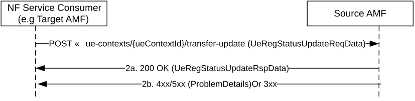

# 5.2.2.2.2 RegistrationStatusUpdate

## 5.2.2.2.2.1 General

The RegistrationStatusUpdate service operation is used during the following procedure:

\- General Registration procedure (see TS 23.502 \[3\], clause 4.2.2.2.2)

\- Registration with AMF re-allocation procedure (see TS 23.502 \[3\], clause 4.2.2.2.3)

The RegistrationStatusUpdate service operation is invoked by a NF Service Consumer, e.g. the target AMF, towards the NF Service Producer, i.e. the source AMF, to update the status of UE registration at the target AMF, thereby indicating the result of previous UE Context transfer for a given UE (see clause 5.2.2.2.1.1).

The target AMF shall update the NF Service Producer (i.e. source AMF) with the status of the UE registration at the target AMF due to a previous UE Context transfer. The NF Service Consumer (e.g. target AMF) shall use the HTTP method POST to invoke the "transfer-update" custom operation on the URI of an "Individual ueContext" resource, see clause 6.1.3.2.4. See also Figure 5.2.2.2.2.1-1.

Figure 5.2.2.2.2.1-1 Registration Status Update

1\. The NF service consumer (e.g. target AMF), shall send a POST request to invoke the "transfer-update" custom operation on the URI of an "Individual ueContext" resource, to update the source AMF with the status of the UE registration at the target AMF. The UE's 5G-GUTI is included as the UE identity.

The request content shall include the transferStatus attribute set to "TRANSFERRED" if the UE context transfer was completed successfully (including the case where only the supi was transferred to the target AMF during the UE context transfer procedure) or to "NOT_TRANSFERRED" otherwise.

If any network slice(s) become no longer available and there are PDU Session(s) associated with them, the target AMF shall include these PDU session(s) in the toReleaseSessionList attribute in the content. If the continuity of the PDU Session(s) cannot be supported between networks (e.g. SNPN-SNPN mobility, inter-PLMN mobility where no HR agreement exists), the target AMF shall include these PDU session(s) with release cause in the toReleaseSessionInfo attribute in the content.

If the target AMF selects a new PCF for AM Policy and/or UE policy other than the one which was included in the UeContext by the old AMF, the target AMF shall set pcfReselectedInd to true.

NOTE: AMF selects the same PCF instance for AM policy and for UE policy, as described in clause 6.3.7.1, TS 23.501 \[2\].

The NF service consumer shall include the smfChangeInfoList attribute including the UE's PDU Session ID(s) for which the I-SMF or V-SMF has been changed or removed, if any, with for each such PDU session, the related smfChangeIndication attribute set to "CHANGED" or "REMOVED", if the I-SMF or V-SMF is changed or removed respectively.

If the target AMF receives analytics subscription parameters from the source AMF, and one or more analytics subscription(s) are not taken over by the target AMF, the target AMF shall include these analytics subscription(s) in the analyticsNotUsedList IE. The source AMF should unsubscribe the analytics subscriptions included in analyticsNotUsedList IE for the UE.

Once the update is received, the source AMF shall:

\- remove the individual ueContext resource and release any PDU session(s) in the toReleaseSessionList attribute, if the transferStatus attribute included in the POST request body is set to "TRANSFERRED" and if the source AMF transferred the complete UE Context including all MM contexts and PDU Session Contexts. The source AMF may choose to start a timer to supervise the release of the UE context resource and may keep the individual ueContext resource until the timer expires. If the pcfReselectedInd is set to true, the source AMF shall terminate the AM Policy Association and/or the UE Policy Association that the source AMF has to the old PCF.

\- keep the UE context only including the MM context and PDU session(s) associated to the non-3GPP access, if the transferStatus attribute included in the POST request body is set to " TRANSFERRED" and if the source AMF did not transfer the MM context and PDU Session Contexts for the non-3GPP access type; the AMF shall release any PDU session(s) in the toReleaseSessionList attribute. The source AMF may choose to start a timer and keep the MM context and PDU session(s) associated to the 3GPP access until the timer expires.

\- keep the UE Context as if the context transfer procedure had not happened if the transferStatus attribute included in the POST request body is set to "NOT_TRANSFERRED".

2a. On Success: The source AMF shall respond with the status code "200 OK" if the request is accepted. If the smfChangeInfoList attribute was received in the request, the source AMF shall release the SM context at the I-SMF or V-SMF only, for all the PDU sessions listed in the smfChangeInfoList attribute with the smfChangeIndication attribute set to "CHANGED" or "REMOVED".

If some PDU sessions are not supported by the target AMF and thus not transferred to the target AMF, the source AMF shall release these PDU sessions after this step.

2b. On failure or redirection, one of the HTTP status code listed in Table 6.1.3.2.4.5.2-2 shall be returned. For a 4xx/5xx response, the message body shall contain a ProblemDetails structure with the "cause" attribute set to one of the application errors listed in Table 6.1.3.2.4.5.2-2, where applicable.
