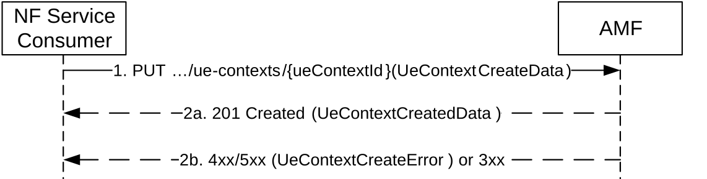
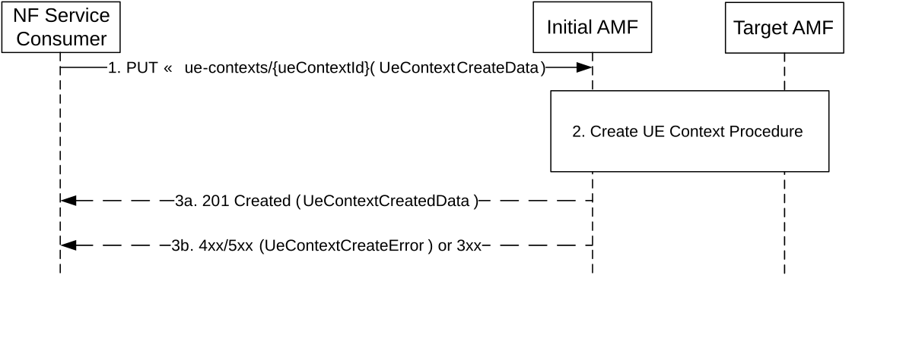

# 5.2.2.2.3 CreateUEContext

## 5.2.2.2.3.1 General

The CreateUEContext service operation is used during the following procedure:

\- Inter NG-RAN node N2 based handover (see TS 23.502 \[3\], clause 4.9.1.3, and clause 4.23.7)

The CreateUEContext service operation is invoked by a NF Service Consumer, e.g. a source AMF, towards the AMF (acting as target AMF), when the source AMF can't serve the UE and selects the target AMF during the handover procedure, to create the UE Context in the target AMF.

The NF Service Consumer (e.g. the source AMF) shall create the UE Context by using the HTTP PUT method with the URI of the "Individual UeContext" resource (See clause 6.1.3.2.3.1). See also Figure 5.2.2.2.3.1-1.

Figure 5.2.2.2.3.1-1 Create UE Context

1\. The NF Service Consumer, e.g. source AMF, shall send a PUT request, to create the ueContext in the target AMF. The content of the PUT request shall contain a UeContextCreateData structure, including a N2 Information Notification callback URI.

The UE context shall contain trace control and configuration parameters, if signalling based trace has been activated (see TS 32.422 \[30\]).

The source AMF shall transfer the complete UE context including both access types if the UE is registered for both 3GPP and non-3GPP accesses and if the target PLMN is the same as the source PLMN.

The source AMF shall transfer only UE context for 3GPP access if the source AMF determines there is no possibility for relocating the N2 interface for non-3GPP access to the (target) AMF, e.g. when the target AMF is in another PLMN.

For a UE supporting 5G-SRVCC, the NF Service Consumer (i.e. AMF) shall include the Mobile Station Classmark 2, STN-SR, C-MSISDN and Supported Codec List in the request, if available, as specified in TS 23.502 \[3\].

The UE context shall contain analytics subscription parameters, if the (source) AMF has created analytics subscription(s) towards NWDAF related to the UE (see clause 5.2.2.2.11 of TS 23.502 \[3\]) and both the source and the target AMFs support the "ASUC" feature. The NF service producer, e.g. target AMF, may take over the analytics subscription(s).

The UE context shall contain SNPN Onboarding indication and the target AMF shall support SNPN Onboarding, if the UE is registered for onboarding in an SNPN as described in clause 4.2.2.2.4 of TS 23.502 \[3\].

If there are ongoing Network Slice Deregistration Inactivity Timer(s) for the UE, the source AMF shall include the information (e.g. the expiry time) of the ongoing Network Slice Deregistration Inactivity Timer(s) in the UE context. The source AMF shall also include the configured deregistration inactivity timer value(s) in the UE context within the "amPolicyInfoContainer" attribute, if received from PCF.

2a. On success, the target AMF shall respond with the status code "201 Created" if the request is accepted, together with a HTTP Location header to provide the location of a newly created resource. The content of the PUT response shall contain the representation of the created UE Context. If the target AMF selects a new PCF for AM Policy other than the one which was included in the UeContext by the old AMF, the target AMF shall set pcfReselectedInd to true. If the pcfReselectedInd is set to true, the source AMF shall terminate the AM Policy Association to the old PCF.

The target AMF starts tracing according to the received trace control and configuration parameters, if trace data is received in the UE context indicating that signalling based trace has been activated. Once the AMF receives subscription data, trace requirements received from the UDM supersedes the trace requirements received from the NF Service Consumer.

If the target AMF receives analytics subscription parameters from the source AMF, and one or more analytics subscription(s) are not taken over by the target AMF, the target AMF shall include these analytics subscription(s) in the analyticsNotUsedList IE. The source AMF may unsubscribe the analytics subscriptions included in analyticsNotUsedList IE for the UE.

The UE context shall contain event subscriptions information in the following cases:

a\) Any NF Service Consumer has subscribed for UE specific event; and/or

b\) Any NF Service Consumer has subscribed for UE group specific events to which the UE belongs. In this case the event subscriptions provided in the UE context shall contain the event details applicable to this specific UE in the group (e.g maxReports in options IE).

The target AMF shall:

\- in case a) create event subscriptions for the UE specific events;

\- in case b) create event subscriptions for the group Id if there are no existing event subscriptions for that group Id, subscription change notification URI (subsChangeNotifyUri) and the subscription change notification correlation Id (subsChangeNotifyCorrelationId). If there is already an existing event subscription for the group Id and for the given subscription change notification URI (subsChangeNotifyUri) and subscription Id change notification correlation Id (subsChangeNotifyCorrelationId), then an event subscription shall not be created at the target AMF. The individual UE specific event details (e.g maxReports in options IE) within that group shall be taken into account.

\- for both the cases, for each created event subscription, allocate a new subscription Id, if necessary (see clause 6.5.2 of TS 29.500 \[4\]), and if allocated send the new subscription Id to the notification endpoint for informing the subscription Id creation, along with the notification correlation Id for the subscription Id change.

NOTE: Subscription Id can be reused if the mobility is between AMFs of same AMF Set.

> If the UE context being transferred from the NF service consumer (e.g. source AMF) is the last UE context that belongs to a UE group Id related subscription, then the NF service consumer (e.g. source AMF) shall not delete the UE group Id related subscription until the expiry of that event subscription (see clause 5.3.2.2.2).
>
> The target AMF may authorize the event subscriptions transferred from the source AMF as specified in clause 13.4.1.4 of TS 33.501 \[27\]. Based on local policy, the target AMF may consider that transferred subscriptions containing no or an invalid access token are not authorized. Transferred subscriptions that are not authorized by the target AMF shall not be regarded active; if the target AMF supports the STEN (Subscription Termination Event Notification) feature, and if the notification of event subscription termination was requested by the NF service consumer, the target AMF shall send a notification to the NF service consumer to report the termination of the subscription with the subscription termination cause "SUBSCRIPTION_NOT_AUTHORIZED".
>
> If the target AMF receives SNPN Onboarding indication from the source AMF, the target AMF may start an implementation specific timer to deregister the onboarding registered UE, i.e. if the received UE context contains SNPN Onboarding indication.

The source AMF shall release those PDU sessions not supported by the target AMF and thus not transferred to the target AMF.

If the source AMF includes the information of ongoing Network Slice Deregistration Inactivity Timer(s) in the UE context, the target AMF should resume the ongoing Network Slice Deregistration Inactivity Timer(s) if received for the S-NSSAI(s) that are allowed for the UE in the target AMF.

2b. On failure or redirection, one of the HTTP status code listed in Table 6.1.3.2.3.1-3 shall be returned. For a 4xx/5xx response, the message body shall contain a UeContextCreateError structure, including:

\- a ProblemDetails structure with the "cause" attribute set to one of the application errors listed in Table 6.1.3.2.3.1-3. The cause in the error attribute shall be set to HANDOVER_FAILURE, if all of the PDU sessions are failed, e.g. no response from the SMF within a maximum wait timer;

\- NgAPCause, if available;

\- N2 information carrying the Target to Source Failure Transparent Container, if this information has been received from the target NG-RAN and if the source AMF supports the NPN feature.

## 5.2.2.2.3.2 Create UE Context with AMF Relocation

During inter-PLMN N2 Handover, the initial AMF may relocate the UE context to a target AMF (e.g. due to slices cannot be served by initial AMF). This clause describes the procedure for this scenario.

The NF Service Consumer (e.g. the source AMF) shall create the UE Context by using the HTTP PUT method with the URI of the "Individual UeContext" resource (See clause 6.1.3.2.3.1). See also Figure 5.2.2.2.3.2-1.

Figure 5.2.2.2.3.2-1 Create UE Context with AMF Relocation

Same requirement of clause 5.2.2.2.3.1 applies, with following modifications:

1\. Same as step 1 of clause 5.2.2.2.3.1.

2\. The initial AMF selects a target AMF and perform CreateUeContext procedure (see clause 5.2.2.2.3.1).

\- the request body shall include the information received from the source AMF in step 1, including the serving network, the supported features, etc.

\- if the received serving network (from the source AMF) is different from the PLMN of the target AMF, the resource URI in the Location header in 201 Create response shall contain the inter-PLMN API Root.

3a. Same as step 2a of clause 5.2.2.2.3.1, with following modifications:

\- the request body shall contain the UE Context and other information received from the target AMF in step 2.

\- the Location header shall contain the resource URI received in the "201 Created" response from target AMF in step 2.

\- the initial AMF shall insert a 3gpp-Sbi-Producer-Id header indicating the target AMF.

3b. Same as step 2b of clause 5.2.2.2.3.1.
