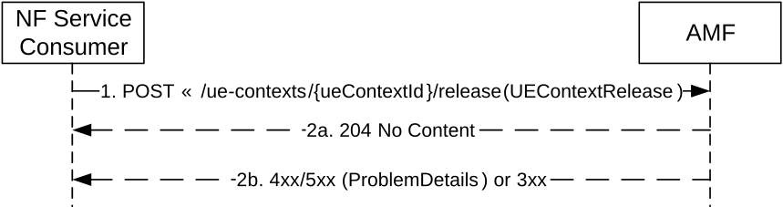

# 5.2.2.2.4 ReleaseUEContext

## 5.2.2.2.4.1 General

The ReleaseUEContext service operation is used during the following procedure:

\- Inter NG-RAN node N2 based handover, Cancel procedure (see TS 23.502 \[3\], clause 4.9.1.4)

The ReleaseUEContext service operation is invoked by a NF Service Consumer, e.g. a source AMF, towards the AMF (acting as target AMF), when the source AMF receives the Handover Cancel from the 5G-AN during the handover procedure, to release the UE Context in the target AMF.

The NF Service Consumer (e.g. the source AMF) shall release the UE Context by using the HTTP "release" custom operation with the URI of the "Individual UeContext" resource (See clause 6.1.3.2.4.2). See also Figure 5.2.2.2.4.1-1.

Figure 5.2.2.2.4.1-1 Release UE Context

1\. The NF Service Consumer, e.g. source AMF, shall send a POST request, to release the ueContext in the target AMF. The content of the POST request shall contain the UEContextRelease.

2a. On success, the target AMF shall return "204 No Content" with an empty content in the POST response.

2b. On failure or redirection, one of the HTTP status code listed in Table 6.1.3.2.4.2.2-2 shall be returned. For a 4xx/5xx response, the message body shall contain a ProblemDetails structure with the "cause" attribute set to one of the application error listed in Table 6.1.3.2.4.2.2-2.
