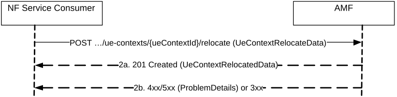

# 5.2.2.2.5 RelocateUEContext

## 5.2.2.2.5.1 General

The RelocateUEContext service operation is used during the following procedure:

\- EPS to 5GS handover using N26 interface with AMF re-allocation (see TS 23.502 \[3\], clause 4.11.1.2.2).

The RelocateUEContext service operation is invoked by a NF Service Consumer, e.g. an initial AMF, towards the AMF (acting as target AMF), during an EPS to 5GS handover with AMF re-allocation, to relocate the UE Context in the target AMF.

The NF Service Consumer (e.g. the initial AMF) shall relocate the UE Context in the target AMF by invoking the "relocate" custom method on the URI of an "Individual ueContext" resource (see clause 6.1.3.2.4). See also Figure 5.2.2.2.5.1-1.

Figure 5.2.2.2.5.1-1 Relocate UE Context

1\. The NF Service Consumer, e.g. initial AMF, shall send a POST request to relocate the UE context in the target AMF. The content of the POST request shall contain a UeContextRelocateData structure.

The UE context shall contain trace control and configuration parameters, if signalling based trace has been activated (see TS 32.422 \[30\]).

For an EPS to 5GS handover procedure, the NF Service Consumer shall carry per PDU session the S-NSSAI for serving PLMN, the MME Control Plane Address and the TEID in the request. If S-NSSAI for interworking is configured and used in initial AMF for the PDU session, the initial AMF shall also carry the configured S-NSSAI for interworking to the target AMF, as specified in clause 4.11.1.2.2 of TS 23.502 \[3\]. In Home Routed roaming case, the S-NSSAI for serving PLMN is derived by the initial AMF based on the S-NSSAI for home PLMN retrieved from SMF+PGW-C, as specified in TS 23.502 \[3\].

2a. On success, the target AMF shall respond with the status code "201 Created" if the request is accepted, together with a HTTP Location header to provide the location of the newly created resource. The content of the POST response shall contain the representation of the created UE Context.

The target AMF starts tracing according to the received trace control and configuration parameters, if trace data is received in the UE context indicating that signalling based trace has been activated. Once the AMF receives subscription data, trace requirements received from the UDM supersedes the trace requirements received from the NF Service Consumer.

2b. On failure to relocate the UE context or redirection, one of the HTTP status code listed in Table 6.1.3.2.4.6.2-2 shall be returned. For a 4xx/5xx response, the message body shall contain a ProblemDetails structure with the "cause" attribute set to one of the application errors listed in Table 6.1.3.2.4.6.2-2.

If the target RAN rejects the Handover Request, the target AMF shall send Forward Relocation Response message directly to the source MME over the N26 interface, carrying the appropriate cause value.
