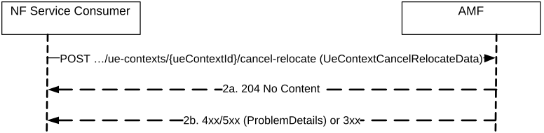

# 5.2.2.2.6 CancelRelocateUEContext

## 5.2.2.2.6.1 General

The CancelRelocateUEContext service operation is used during the following procedure:

\- EPS to 5GS Handover with AMF re-allocation, Handover Cancel procedure (see TS 23.502 \[3\], clause 4.11.1.2.3)

The CancelRelocateUEContext service operation is invoked by a NF Service Consumer (i.e. initial AMF), towards the AMF (acting as target AMF), when the initial AMF receives Forward Cancel Request from the source MME during EPS to 5GS Handover with AMF re-allocation procedure, to trigger the target AMF to release the UE Context.

The NF Service Consumer (i.e. the initial AMF) shall cancel the UE Context Relocation by using the HTTP "cancel-relocate" custom operation with the URI of the "Individual UeContext" resource (See clause 6.1.3.2.4.2). See also Figure 5.2.2.2.6.1-1.

Figure 5.2.2.2.6.1-1 Cancel Relocate UE Context

1\. The NF Service Consumer, i.e. initial AMF, shall send a POST request, to release the ueContext in the target AMF. The content of the POST request shall contain the UeContextCancelRelocateData that needs to be passed to the target AMF.

2a. On success, the target AMF shall return "204 No Content" with an empty content in the POST response.

2b. On failure or redirection, one of the HTTP status code listed in Table 6.1.3.2.4.7.2-2 shall be returned. For a 4xx/5xx response, the message body shall contain a ProblemDetails structure with the "cause" attribute set to one of the application error listed in Table 6.1.3.2.4.7.2-2.
