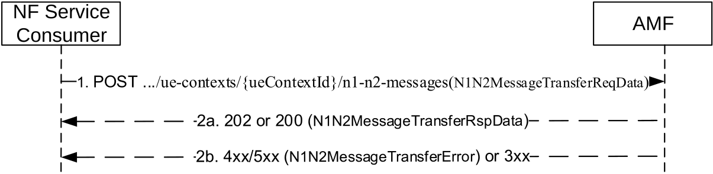

# 5.2.2.3.1 N1N2MessageTransfer

## 5.2.2.3.1.1 General

The N1N2MessageTransfer service operation is used by a NF Service Consumer to transfer N1 and/or N2 information to the UE and/or 5G-AN through the AMF in the following procedures:

\- Network triggered Service Request (see clause 4.2.3.3 of TS 23.502 \[3\])

\- PDU Session establishment (see clause 4.3.2 of TS 23.502 \[3\])

\- PDU Session modification (see clause 4.3.3 of TS 23.502 \[3\])

\- PDU Session release (see clause 4.3.4 of TS 3GPP 23.502 \[3\])

\- Session continuity, service continuity and UP path management (see clause 4.3.5 of TS 23.502 \[3\])

\- Inter NG-RAN node N2 based handover (see clause 4.9.1.3 of TS 23.502 \[3\])

\- SMS over NAS procedures (see clause 4.13.3 of TS 23.502 \[3\]

\- UE assisted and UE based positioning procedure (see clause 6.11.1 of TS 23.273 \[42\])

\- Network assisted positioning procedure (see clause 6.11.2 of TS 23.273 \[42\])

\- LCS Event Report, Event Reporting in RRC INACTIVE state procedures, LCS Cancel Location and LCS Periodic-Triggered Invoke procedures (see clause 6.3, clause 6.7 and clause 6.20.3 of TS 23.273 \[42\])

\- UE configuration update procedure for transparent UE policy delivery (see clause 4.2.4.3 of TS 23.502 \[3\])

\- UPF anchored Mobile Terminated Data Transport in Control Plane CIoT 5GS Optimisation (see clause 4.24.2 of TS 23.502 \[3\])

\- NEF Anchored Mobile Terminated Data Transport (see clause 4.25.5 of TS 23.502 \[3\])

\- System interworking procedures with EPC (see clause 4.3 in TS 23.501 \[2\] and clause 4.11 in TS 23.502 \[3\])

\- SMF triggered N3 data transfer establishment procedure (see clause 4.2.10.2 of TS 23.502 \[3\])

\- 5G-RG requested PDU Session Establishment via W-5GAN (see clause 7.3.1 of TS 23.316 \[48\])

\- 5G-RG or Network requested PDU Session Modification via W-5GAN (see clause 7.3.2 of TS 23.316 \[48\])

\- 5G-RG or Network requested PDU Session Release via W-5GAN (see clause 7.3.3 of TS 23.316 \[48\])

\- FN-RG related PDU Session Establishment via W-5GAN (see clause 7.3.4 of TS 23.316 \[48\])

\- CN-initiated selective deactivation of UP connection of an existing PDU Session associated with W-5GAN Access (see clause 7.3.5 of TS 23.316 \[48\])

\- FN-RG or Network Requested PDU Session Modification via W-5GAN (see clause 7.3.6 of TS 23.316 \[48\])

\- FN-RG or Network Requested PDU Session Release via W-5GAN (see clause 7.3.7 of TS 23.316 \[48\])

\- Non-5G capable device behind 5G-CRG and FN-CRG requested PDU Session Establishment via W-5GAN (see clause 4.10a of TS 23.316 \[48\])

\- Non-5G capable device behind 5G-CRG and FN-CRG or Network Requested PDU Session Modification via W-5GAN (see clause 4.10a of TS 23.316 \[48\])

\- Non-5G capable device behind 5G-CRG and FN-CRG or Network Requested PDU Session Release via W-5GAN (see clause 4.10a of TS 23.316 \[48\])

\- Handover procedures between 3GPP access / 5GC and W-5GAN access (see clause 7.6.3 of TS 23.316 \[48\])

\- Handover from 3GPP access / EPS to W-5GAN / 5GC (see clause 7.6.4.1 of TS 23.316 \[48\])

\- Transfer UAV specific data via N1 SM (see clause 5.2.4.3 of TS 23.256 \[56\])

\- MBS join and Session establishment procedure (see clause 7.2.1.3 of TS 23.247 \[55\])

\- MBS activation procedure (see clause 7.2.5.2 of TS 23.247 \[55\])

\- Multicast session leave requested by the network or MBS session release (see clause 7.2.2.3 of TS 23.247 \[55\])

\- Procedures applicable to a PRU (see clause 6.17 of TS 23.273 \[42\])

\- Procedures of SL-MT-LR involving LMF (see TS 23.273 \[42\], clause 6.20.3)

\- Procedures of SL-MT-LR for periodic, triggered Location Events (see TS 23.273 \[42\], clause 6.20.4)

\- 5GC-MT-LR Procedure using SL positioning (see TS 23.273 \[42\], clause 6.20.5)

\- Procedures of user plane connection between UE and LMF for location service (see clause 6.18 of TS 23.273 \[42\] and TS 24.572 \[61\])

NOTE: Though in TS 23.502 \[3\] the procedure is called "UE configuration update procedure for transparent UE policy delivery", as per TS 24.501 \[11\] clause 5.4.5.3.1, the network initiated NAS transport procedure is used.

The NF Service Consumer shall invoke the service operation by using HTTP method POST, to request the AMF to transfer N1 and/or N2 information for a UE and/or 5G-AN, with the URI of "N1 N2 Messages Collection" resource (see clause 6.1.3.5.3.1).

The NF Service Consumer may include the following information in the HTTP Request message body:

\- SUPI

\- PDU Session ID or LCS Correlation ID depending on the N1/N2 message class to be transferred

\- N2 SM Information (PDU Session ID, QoS profile, CN N3 Tunnel Info, S-NSSAI)

\- N1 Message Container, including a N1 SM, LPP message, LCS message, SMS, UPDP message, PRU message, UPP-CM message

\- N2 Information Container, including N2 SM, NRPPa message, PWS or RAN related information

\- Mobile Terminated Data (i.e. CIoT user data container)

\- Allocation and Retention Priority (ARP)

\- Paging Policy Indication

\- 5QI

\- Notification URL (used for receiving Paging Failure Indication)

\- Last Message Indication

\- NF Instance Identifier and optionally Service Instance Identifier of the NF Service Consumer (e.g. an LMF or SMF)

\- N1 SM Skipping Indication

\- Area of Validity for N2 SM Information

\- A MA PDU Session Accepted indication, if a MA-PDU session is established;

\- Extended Buffering Support Indication, if SMF determines that Extended Buffering applies during Network triggered Service Request Procedure (see clause 4.2.3.3 of TS 23.502 \[3\]), UPF anchored Mobile Terminated Data Transport in Control Plane CIoT 5GS Optimisation procedure (see clause 4.24.2 of TS 23.502 \[3\]) or NEF Anchored Mobile Terminated Data Transport (see clause 4.25.5 of TS 23.502 \[3\]);

\- Target Access type towards which the SMF requests to send N2 information and optionally N1 information, for a Multi-Access (MA) PDU session, or through which the LMF requests to transfer an LPP message to the UE.

During an intra-AMF handover between 3GPP and non-3GPP accesses, the SMF shall include the targetAccess IE set to the old access type in the HTTP Request message body, when releasing the N2 PDU session resources in the old access (see step 3 of Figure 4.9.2.1-1 and step 3 of Figure 4.9.2.2-1 of TS 23.502 \[3\]).

Figure 5.2.2.3.1.1-1 N1N2MessageTransfer for UE related signalling

1\. The NF Service Consumer shall send a POST request to transfer N1 and N2 information. The NF Service Consumer may include a N1N2MessageTransfer Notification URI to AMF in the request message.

2a. On success, i.e. if the request is accepted and the AMF is able to transfer the N1/N2 message to the UE and/or the AN, the AMF shall respond with a "200 OK" status code. The AMF shall set the cause IE in the N1N2MessageTransferRspData as "N1_N2_TRANSFER_INITIATED" in this case.

The AMF shall respond with a "200 OK" status code and set the cause IE in the N1N2MessageTransferRspData to "N2_MSG_NOT_TRANSFERRED", if the N1N2MessageTransfer request included an area of validity for the N2 SM Information, the UE is in CM-CONNECTED state and outside of the area of validity.

2b. On failure or redirection, one of the HTTP status code listed in Table 6.1.3.5.3.1-2 shall be returned. For a 4xx/5xx response, the message body shall contain a N1N2MessageTransferError structure, including:

\- a ProblemDetails structure with the "cause" attribute set to one of the application error listed in Table 6.1.3.5.3.1-2;

## 5.2.2.3.1.2 Detailed behaviour of the AMF

When an NF service consumer is requesting to send N1 and/or N2 information and the UE is in CM-IDLE state for the access type for which the N1 and/or N2 information is related (called "associated access type" hereafter in this clause), the requirements specified in clause 5.2.2.3.1.1 shall apply with the following modifications:

NOTE: N1 and/or N2 Session Management information is related to the access type of the targeted PDU session for a single access PDU session, or to the Target Access received in the request for a MA PDU session; LCS related N2 (NRPPa) information is related to 3GPP access in this release of specification.

4xx and 5xx response cases shall also apply to UEs in CM-CONNECTED state, when applicable.

**2xx Response Cases:**

**Case A: When UE is CM-IDLE in 3GPP access and the associated access type is 3GPP access:**

a\) Same as step 2a of Figure 5.2.2.3.1.1-1, the AMF should respond with the status code "200 OK", if "skipInd" attribute is set to "true" in the request body, with a response body that carries the cause "N1_MSG_NOT_TRANSFERRED".

b\) Same as step 2a of Figure 5.2.2.3.1.1-1, the AMF shall respond with the status code "202 Accepted", if the asynchronous type communication is invoked and hence the UE is not paged, update the UE context and store N1 and/or N2 information and initiate communication with the UE and/or 5G-AN when the UE becomes reachable. In this case the AMF shall provide the URI of the resource in the AMF in the "Location" header of the response. In this release, the URI shall only be used by NF Service consumer to correlate the possible N1/N2 Message Transfer Failure Notification with the related N1/N2 Message Transfer Operation. The NF service consumer shall not send any service requests towards the URI received in the Location header.

The AMF shall also provide a response body containing the cause, "WAITING_FOR_ASYNCHRONOUS_TRANSFER" that represents the current status of the N1/N2 message transfer;

c\) Same as step 2a of Figure 5.2.2.3.1.1-1, the AMF shall respond with the status code "202 Accepted", if paging is issued when the UE is in CM-IDLE and reachable for 3GPP access, with a response body that carries a cause "ATTEMPTING_TO_REACH_UE" as specified in clause 4.2.3.3 and 5.2.2.2.7 of TS 23.502 \[3\].

**Case B: When UE is CM-IDLE in Non-3GPP access but CM-CONNECTED in 3GPP access and the associated access type is Non-3GPP access:**

a\) Same as step 2a of Figure 5.2.2.3.1.1-1, the AMF shall respond with the status code "200 OK" with cause "N1_N2_TRANSFER_INITIATED" and initiate N1 NAS SM message transfer via 3GPP access, if the NF service consumer (i.e. SMF) requests to send only N1 NAS SM message without any associated N2 SM information, and the current access type related to the PDU session is Non-3GPP access and the UE is CM-CONNECTED in 3GPP access.

b\) Same as step 2a of Figure 5.2.2.3.1.1-1, the AMF shall respond with the status code "202 Accepted", if NAS Notification procedure is issued when the UE is in CM-CONNECTED in 3GPP access, with a response body that carries a cause "ATTEMPTING_TO_REACH_UE" as specified in step 4c of clause 4.2.3.3 and 5.2.2.2.7 of TS 23.502 \[3\].

**Case C: When UE is CM-IDLE in both Non-3GPP access and 3GPP access and the associated access type is Non-3GPP access:**

All the bullets specified in Case A are applicable.

The NF Service Consumer shall not send any further signalling for the UE if it receives a POST response body with a cause "ATTEMPTING_TO_REACH_UE" unless it has higher priority signalling. In such a case the response shall include the "Location" header containing the URI of the resource created in the AMF, e.g. ".../n1-n2-messages/{n1N2MessageId}". In this release, the URI shall only be used by NF Service consumer to correlate the possible N1/N2 Message Transfer Failure Notification with the related N1/N2 Message Transfer Operation. The NF service consumer shall not send any service requests towards the URI received in the Location header. The AMF shall:

\- store the N1 and/or N2 information related to 3GPP access and, when the UE responds with a Service Request, shall initiate communication with the UE and/or 5G-AN using the stored N1 and/or N2 information;

\- store the N1 NAS SM information related to Non-3GPP access if no N2 information was received and the AMF initiated paging towards the UE. Later when the UE responds with a Service Request, the AMF shall initiate communication with the UE using the stored N1 information via 3GPP access;

\- inform the SMF which invoked the service operation, that the access type of the PDU Session can be changed from Non-3GPP access to 3GPP access as specified in clause 5.2.2.3.2.1 of TS 29.502 \[16\], when the UE responds with a "List Of Allowed PDU Sessions" and the indicated non-3GPP PDU session of the N2 (and N1 if received) information is included in the list; or

\- notify the NF which invoked the service operation, as specified in clause 5.2.2.3.2, if the Notification URI is provided, when the AMF determines that the paging or NAS Notification has failed or when the UE responds with a "List Of Allowed PDU Sessions" and the indicated Non-3GPP PDU session of the N2 (and N1 if received) information is not included in the list.

**4xx Response Cases:**

\- Same as step 2b of Figure 5.2.2.3.1.1-1, the AMF shall respond with status code "409 Conflict" in the following cases:

\- if the UE is in 3GPP access and there is already an ongoing paging procedure with higher or same priority, the AMF shall set the application error as "HIGHER_PRIORITY_REQUEST_ONGOING" in the "cause" attribute of the ProblemDetails structure of the POST response body. The AMF may provide a retryAfter IE to the NF Service Consumer in order for the NF Service Consumer to retry the request after the expiry of the timer. When the retryAfter IE is provided, the NF Service Consumer shall not initiate the downlink messaging until the timer expires. The AMF may also provide the ARP value of the QoS flow that has triggered the currently ongoing highest priority paging, so that the NF Service Consumer (e.g. SMF) knows that if any subsequent trigger initiating downlink messaging for a QoS flow with the same or lower priority happens.

\- if there is an ongoing registration procedure (see clause 4.2.3.3 of TS 23.502 \[3\]) the AMF shall set the application error as "TEMPORARY_REJECT_REGISTRATION_ONGOING" in the "cause" attribute of the ProblemDetails structure in the POST response body; The AMF may provide a retryAfter IE to the NF Service Consumer in order for the NF Service Consumer to retry the request after a short period. When the retryAfter IE is provided, the NF Service Consumer should not initiate new N1/N2 Message Transfer request until the timer expires.

\- if this is a request to transfer a N2 PDU Session Resource Modify Request or a N2 PDU Session Resource Release Command to a 5G-AN and if the UE is in CM-IDLE state at the AMF for the Access Network Type associated to the PDU session (see clauses 4.3.3 and 4.3.4 of TS 23.502 \[3\] and clause 5.3.2.1 of TS 23.527 \[33\]), the AMF shall set the application error "UE_IN_CM_IDLE_STATE" in the "cause" attribute of the ProblemDetails structure in the POST response body.

\- if there is an ongoing Xn or N2 handover procedure (see clause 4.9.1.2.1 and 4.9.1.3.1 of TS 23.502 \[3\]) the AMF shall set the application error as "TEMPORARY_REJECT_HANDOVER_ONGOING" in the "cause" attribute of the ProblemDetails structure in the POST response body, if the AMF rejects the request due to the on-going handover.

\- if there is an ongoing Service Request procedure (see clause 4.2.3.2 of TS 23.502 \[3\]), the AMF may reject a N1/N2 Message Transfer Request including a PDU Session Resource Setup Request Transfer IE due to the on-going Service Request procedure for the same PDU session, and if it does so, the AMF shall set the application error as "TEMPORARY_REJECT_SR_ONGOING" in the "cause" attribute of the ProblemDetails structure in the POST response body.

NOTE 1: In the scenario above, the AMF sends to the NG-RAN the PDU Session Resource Setup Request Transfer IE that is received in the Update SM Context Response (200 OK) for the on-going (UE triggered) Service Request.

\- if the RAT Type is NB-IoT, and the UE already has 2 PDU Sessions with active user plane resources, the AMF shall set the application error as "MAX_ACTIVE_SESSIONS_EXCEEDED" in POST response body.

\- if Paging Restrictions information restricts the N1N2MessageTransfer request from causing paging (see clause 4.2.3.3 of TS 23.502 \[3\]) the AMF shall set the application error as "REJECTION_DUE_TO_PAGING_RESTRICTION" in the "cause" attribute of the ProblemDetails structure in the POST response body.

\- if the AMF determines that LCS-UPP connection already exists between the UE and one LMF, the AMF shall reject the request to transfer "UPP-CM" N1 message to the UE from another LMF (other than the target LMF during Modification of User Plane Connection between UE and LMF procedure, see clause 6.18 of TS 23.273 \[42\]) and set the application error as "MAX_LCS_UPP_CONN_REACHED" in POST response body.

NOTE 2: In this release, only one LCS-UPP connection is allowed for an UE. Attempts to set up additional LCS-UPP connections for the UE are not allowed.

\- Same as step 2b of Figure 5.2.2.3.1.1-1, the AMF shall respond with the status code "403 Forbidden", if the UE is in a Non-Allowed Area and the service request is not for regulatory prioritized service. The AMF shall set the application error as "UE_IN_NON_ALLOWED_AREA" in POST response body.

\- The NF service consumer (i.e. the SMF) that receives this application error may supress subsequent message (e.g. N1N2MessageTransfer) to the AMF for non regulatory prioritized service. In this case, the NF service consumer (i.e. the SMF) should subscribe the Reachability-Report event for "UE Reachability Status Change" from the AMF, so as to get notified by the AMF when the UE becomes reachable again.

\- Same as step 2b of Figure 5.2.2.3.1.1-1, the AMF shall respond with the status code "403 Forbidden ", if the NF service consumer (e.g. an LMF) is requesting to send N1 LPP message to the UE and the UE has indicated that it does not support LPP in N1 mode during registration procedure (see clause 5.5.1.2.2 and 5.5.1.3.2 of TS 24.501 \[11\]). The AMF shall set the application error to "UE_WITHOUT_N1_LPP_SUPPORT" in POST response body.

\- Same as step 2b of Figure 5.2.2.3.1.1-1, the AMF shall respond with the status code "403 Forbidden", if the request body includes an nfId IE indicating an SMF instance which is different from the stored SMF instance hosting the SM Context of the PDU session. The AMF shall set the application error to "INVALID_SM_CONTEXT" in POST response body. During procedures with SM Context relocation, e.g. UE mobility procedures with I-SMF insertion/change/removal, the AMF shall allow N1N2MessageTransfer from both SMF instances holding the old and new SM Contexts.

The NF service consumer (i.e. the SMF) that receives this application error shall remove the SM Context for the PDU session and release the PDU session resource in (H-)SMF if available. The SMF shall not send a SMContextStatusNotification to the AMF for the PDU session release.

\- Same as step 2b of Figure 5.2.2.3.1.1-1, the AMF shall respond with the status code "403 Forbidden ", if the NF service consumer (e.g. an LMF) is requesting to initiate a positioning procedure towards a PRU (see clause 6.11.2 of TS 23.273 \[42\]), i.e. the pruInd IE with the value true was included in the request, but the UE is not a valid PRU. The AMF shall set the application error to "INVALID_PRU" in POST response body.

**5xx Response Cases:**

\- Same as step 2b of Figure 5.2.2.3.1.1-1, the AMF shall respond with the status code "504 Gateway Timeout", if the UE is currently unreachable (e.g., due to the UE in MICO mode, the UE using extended idle mode DRX or the UE is only registered over Non-3GPP access and its state is CM-IDLE). The AMF shall set the application error as "UE_NOT_REACHABLE" in POST response body. If Extended Buffering Support Indication is received in the request, the AMF shall include the Estimated Maximum Waiting time in the response body when the message is rejected due to the UE in MICO mode or the UE using extended idle mode DRX. If the UE is using extended idle mode DRX, after the AMF responded with the status code "504 Gateway Timeout", when the AMF determines that the UE is reachable, then the AMF shall page the UE.

\- step 2b of Figure 5.2.2.3.1.1-1, the AMF may respond with the status code "504 Gateway Timeout", if the UE is temporarily not responding (e.g., not responding to the paging). The AMF shall set the application error as "UE_NOT_RESPONDING" in POST response body. The AMF may provide a retryAfter IE to the NF Service Consumer in order for the NF Service Consumer to throttle sending further N1/N2 Message Transfer request for a short period. When the retryAfter IE is provided, the NF Service Consumer should not initiate new N1/N2 Message Transfer request until the timer expires.
