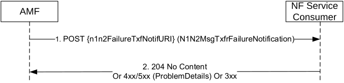

# 5.2.2.3.2 N1N2Transfer Failure Notification

The AMF uses this notification to inform the NF service consumer that initiated an earlier

Namf_Communication_N1N2MessageTransfer, that the AMF failed to deliver the N1 and/or N2 message. The HTTP POST method shall be used on the notification callback URI provided by the NF service consumer as specified in clause 5.2.2.3.1.2.

Figure 5.2.2.3.2-1 N1N2Transfer Failure Notification for UE related signalling

1\. If the NF service consumer had provided a notification URI (see clause 5.2.2.3.1.2), the AMF shall send a POST request to the NF Service Consumer on that Notification URI when the AMF determines that:

\- the paging or NAS Notification has failed;

\- the indicated non-3GPP PDU session is not allowed to move to 3GPP access;

\- the UE has rejected the page as defined in TS 23.501 \[2\] clause 5.38.4;

\- the delivery of the N1 message fails, e.g. in case the UE is in RRC Inactive and NG-RAN paging was not successful or in case an Xn or N2 handover is being triggered at the NG-RAN

The AMF shall include the N1N2MessageTransfer request resource URI returned earlier in the N1N2MessageTransfer response if any (see clause 5.2.2.3.1.2), otherwise a dummy URI (see clause 6.1.6.2.30), in the POST request body. The AMF shall also include a N1/N2 message transfer cause information in the POST request body and set the value as specified in clause 6.1.5.6.3.1.

The NF Service Consumer shall delete any stored representation of the N1N2MessageTransfer request resource URI upon receiving this notification.

The AMF may also include a "retryAfter" IE in the POST request body in order for the NF consumer to throttle sending further N1/N2 Message Transfer request for a short period, e.g. to reduce unnecessary paging to an unresponding UE for a period of time to save the RAN resources.

2\. The NF Service Consumer shall send a response with "204 No Content" status code.

On failure or redirection, one of the HTTP status codes together with the response body listed Table 6.1.5.6.3.1-2 shall be returned.
