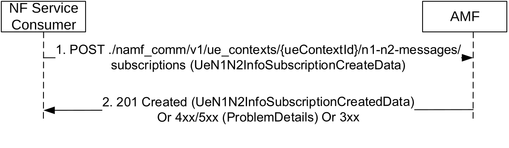

# 5.2.2.3.3 N1N2MessageSubscribe

## 5.2.2.3.3.1 General

The N1N2MessageSubscribe service operation is used by a NF Service Consumer (e.g. PCF) to subscribe to the AMF for notifying N1 messages of a specific type (e.g. UPDP) or N2 information of a specific type. For the N1 message class UPDP, a PCF shall subscribe for the N1 message notification with the AMF to receive the N1 messages from UE that are related to UE Policy.

NOTE: Step 0 of clause 4.2.4.3 of TS 23.502 \[3\] specifies that the PCF can split the UPDP transfer towards UE into multiple units. One UE specific callback URI is registered with the AMF by the PCF for the AMF to notify all UPDP message responses from the UE to the same callback URI. As a result, an explicit subscription per UE policy association is defined in stage 3 for this purpose.

An NF Service Consumer (e.g. PCF) may subscribe to notifications of specific N1 message type (e.g. LPP or UPDP) or N2 information type. In this case the NF Service Consumer shall subscribe by using the HTTP POST method with the URI of the "N1N2 Subscriptions Collection for Individual UE Contexts" resource (See clause 6.1.3.3). See also Figure 5.2.2.3.3.1-1.

Figure 5.2.2.3.3.1-1 N1N2 Message Subscribe

1\. The NF Service Consumer shall send a POST request to create a subscription resource in the AMF for a UE specific N1/N2 message notification. The content of the POST request shall contain:

\- N1 and/or N2 Message Type, identifying the type of N1 and/or N2 message to be notified

\- A callback URI for the notification

2\. If the request is accepted, the AMF shall include a HTTP Location header to provide the location of a newly created resource (subscription) together with the status code 201 indicating the requested resource is created in the response message.

On failure or redirection, one of the HTTP status codes together with the response body listed Table 6.1.3.3.3.1-3 shall be returned.
