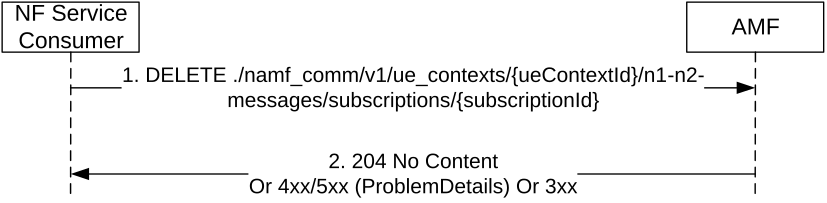

# 5.2.2.3.4 N1N2MessageUnSubscribe

## 5.2.2.3.4.1 General

The N1N2MessageUnSubscribe service operation is used by a NF Service Consumer (e.g. PCF) to unsubscribe to the AMF to stop notifying N1 messages of a specific type (e.g. LPP or UPDP).

The NF Service Consumer shall use the HTTP method DELETE with the URI of the "N1N2 Individual Subscription" resource (See clause 6.1.3.7.3.1), to request the deletion of the subscription for the N1 / N2 message towards the AMF. See also Figure 5.2.2.3.4.1-1.

Figure 5.2.2.3.4.1-1 N1N2 Message UnSubscribe

1\. The NF Service Consumer shall send a DELETE request to delete an existing subscription resource in the AMF.

2\. If the request is accepted, the AMF shall reply with the status code 204 indicating the resource identified by subscription ID is successfully deleted, in the response message.

On failure or redirection, one of the HTTP status codes together with the response body listed Table 6.1.3.4.3.1-3 shall be returned.
