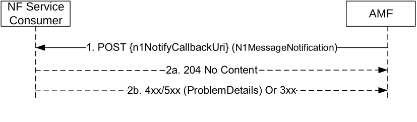

# 5.2.2.3.5 N1MessageNotify

## 5.2.2.3.5.1 General

The N1MessageNotify service operation is used by an AMF notifying the N1 message received from the UE to a destination CN NF, and it is used in the following procedures:

\- Registration with AMF re-allocation (see clause 4.2.2.2.3 of TS 23.502 \[3\])

\- UE assisted and UE based positioning procedure (see clause 6.11.1 of TS 23.273 \[42\])

\- LCS Event Report, Event Reporting in RRC INACTIVE state procedures, LCS Cancel Location and LCS Periodic-Triggered Invoke procedures (see clause 6.3, clause 6.7 and clause 6.20.3 of TS 23.273 \[42\])

\- UE configuration update procedure for transparent UE policy delivery (See clause 4.2.4.3 in TS 23.502 \[3\])

NOTE: Though in TS 23.502 \[3\] the procedure is called "UE configuration update procedure for transparent UE policy delivery", as per TS 24.501 \[11\] clause 5.4.5.2.1, the UE initiated NAS transport procedure is used.

\- UE triggered policy provisioning procedure to request UE policies. (See clause 6.2.4 in TS 23.287 \[47\] and clause 6.2.4 in TS 23.304 \[51\])

\- Procedures applicable to a PRU (see clause 6.17 of TS 23.273 \[42\])

\- Procedures of SL-MT-LR involving LMF (see TS 23.273 \[42\], clause 6.20.3)

\- Procedures of SL-MT-LR for periodic, triggered Location Events (see TS 23.273 \[42\], clause 6.20.4)

\- 5GC-MT-LR Procedure using SL positioning (see TS 23.273 \[42\], clause 6.20.5)

\- Procedures of user plane connection between UE and LMF for location service (see clause 6.18 of TS 23.273 \[42\] and TS 24.572 \[61\])

The AMF shall use HTTP POST method to the N1 Notification URI provided by the NF Service Consumer via N1N2MessageSubscribe service operation (See clause 5.2.2.3.3). See also figure 5.2.2.3.5.1-1.

Figure 5.2.2.3.5.1-1 N1 Message Notify

1\. The AMF shall send a HTTP POST request to the N1 Notification URI, and the content of the POST request shall contain an N1MessageNotification data structure with the subscribed N1 message.

2a. On success, "204 No Content" shall be returned and the content of the POST response shall be empty.

2b. On failure or redirection, one of the HTTP status code listed in Table 6.1.5.4.3.1-3 shall be returned. The message body shall contain a ProblemDetails object with "cause" set to one of the corresponding application errors listed in Table 6.1.5.4.3.1-3.

## 5.2.2.3.5.2 Using N1MessageNotify in the Registration with AMF Re-allocation Procedure

In the Registration with AMF re-allocation procedure, the N1MessageNotify service operation is invoked by a NF Service Producer, i.e. an Initial AMF, towards a NF Service Consumer, e.g. the target AMF, which is selected to serve the UE, by the initial AMF.

The requirements specified in clause 5.2.2.3.5.1 shall apply with the following modifications:

1\. The initial AMF discovers the NF Service Consumer (e.g. the target AMF) from the NRF, and fetch N1 Notification URI from the default notification subscription registered with "N1_MESSAGE" notification type and "5GMM" N1 message class (See Table 6.2.6.2.3-1 and Table 6.2.6.2.4-1 of TS 29.510 \[29\].

NOTE: The alternate AMF is expected to have registered a callback URI with the NRF.

2\. Same as step 1 of Figure 5.2.2.3.5.1-1, the request content shall include the following information in the HTTP POST Request message body:

\- RAN NGAP ID and initial AMF name (the information enabling (R)AN to identify the N2 terminating point);

\- RAN identity, e.g. RAN Node Id, RAN N2 IPv4/v6 address;

\- Information from RAN, e.g. User Location, RRC Establishment Cause and UE Context Request;

\- the N1 message, which shall be the complete Registration Request message in clear text if the UE has a valid NAS security context, or as the one contained in the NAS message container IE in the Security Mode Complete message as specified in clause 4.2.2.2.3 of TS 23.502 \[2\];

\- the UE's SUPI and MM Context;

\- the Allowed NSSAI and if available the partially Allowed NSSAI, together with the corresponding NSI IDs (if network slicing is used and the initial AMF has obtained).

## 5.2.2.3.5.3 Using N1MessageNotify in the UE Assisted and UE Based Positioning Procedure

In the UE assisted and UE based positioning procedure, the N1MessageNotify service operation is invoked by the AMF, towards the LMF, to notify the N1 UE positioning messages received from the UE.

The requirements specified in clause 5.2.2.3.5.1 shall apply with the following modifications:

1\. If the corresponding N1 notification URI is not available, the AMF shall retrieve the NF profile of the NF Service Consumer (e.g. the LMF) from the NRF using the NF Instance Identifier received during corresponding N1N2MessageTransfer service operation (see clause 5.2.2.3.1), and further identify the corresponding service instance if Service Instance Identifier was also received, and fetch N1 Notification URI from the default notification subscription registered with "N1_MESSAGE" notification type and "LPP" N1 message class (See Table 6.2.6.2.3-1 and Table 6.2.6.2.4-1 of TS 29.510 \[29\]).

2\. Same as step 1 of Figure 5.2.2.3.5.1-1, the request content shall include the following information:

\- the N1 Uplink Positioning Message;

\- LCS correlation identifier.

## 5.2.2.3.5.4 Using N1MessageNotify in the UE Configuration Update for transparent UE Policy delivery

In the UE Configuration Update for transparent UE Policy delivery procedure, the N1MessageNotify service operation is invoked by the AMF, towards the PCF which subscribed to be notified with UPDP messages received from the UE.

The requirements specified in clause 5.2.2.3.5.1 shall apply with the following modifications:

1\. Same as step 1 of Figure 5.2.2.3.5.1-1. The request content shall include the following information:

\- the UPDP message.

## 5.2.2.3.5.5 Using N1MessageNotify in the LCS Event Report, Event Reporting in RRC INACTIVE state procedures, LCS Cancel Location and LCS Periodic-Triggered Invoke Procedures

In the LCS Event Report, Event Reporting in RRC INACTIVE state procedures, LCS Cancel Location and LCS Periodic-Triggered Invoke procedure, the N1MessageNotify service operation is invoked by the AMF, towards the LMF, to notify the N1 UE LCS messages received from the UE.

The requirements specified in clause 5.2.2.3.5.1 shall apply with the following modifications:

1\. If the corresponding N1 notification URI is not available, the AMF shall retrieve the NF profile of the NF Service Consumer (e.g. the LMF) from the NRF using the NF Instance Identifier received during corresponding N1N2MessageTransfer service operation (see clause 5.2.2.3.1), and further identify the corresponding service instance if Service Instance Identifier was also received, and fetch N1 Notification URI from the default notification subscription registered with "N1_MESSAGE" notification type and "LCS" N1 message class (See Table 6.2.6.2.3-1 and Table 6.2.6.2.4-1 of TS 29.510 \[29\]).

2\. Same as step 1 of Figure 5.2.2.3.5.1-1, the request content shall include the following information:

\- the N1 Uplink LCS Message;

\- LCS correlation identifier;

\- indication of Control Plane CIoT 5GS Optimisation if Control Plane CIoT 5GS Optimisation is being used.

and may include serving cell ID if it is available;

NOTE: For the EventReport message and UE initiated CancelDeferredLocation message, the AMF includes the deferred routing identifier received from UE in N1 UL NAS TRANSPORT message as LCS correlation identifier. The LCS correlation identifier can assist a serving LMF in identifying the periodic or triggered location session if the same LMF had assigned the deferred routing identifier or can indicate to the LMF that it is acting as a default LMF.

## 5.2.2.3.5.6 Using N1MessageNotify in the UE triggered policy provisioning procedure to request UE policies

In the UE triggered policy provisioning procedure, the N1MessageNotify service operation is invoked by the AMF, towards the PCF which subscribed to be notified with UPDP messages received from the UE.

The requirements specified in clause 5.2.2.3.5.1 shall apply with the following modifications:

1\. Same as step 1 of Figure 5.2.2.3.5.1-1. The request content shall include the following information:

\- the UPDP message.

## 5.2.2.3.5.7 Using N1MessageNotify in the procedures applicable to a PRU

In the PRU Association Procedure, LMF Initiated PRU Disassociation Procedure or PRU Initiated PRU Disassociation Procedure, the N1MessageNotify service operation is invoked by the AMF, towards the LMF, to notify the N1 PRU messages received from the PRU.

The requirements specified in clause 5.2.2.3.5.1 shall apply with the following modifications:

1\. If the corresponding N1 notification URI is not available, the AMF shall select the LMF and retrieve the NF profile of the LMF from the NRF (see clause 6.17 of TS 23.273 \[42\]), and fetch N1 Notification URI from the default notification subscription registered with "N1_MESSAGE" notification type and "LCS" N1 message class (See Table 6.2.6.2.3-1 and Table 6.2.6.2.4-1 of TS 29.510 \[29\]).

2\. Same as step 1 of Figure 5.2.2.3.5.1-1, the request content shall include the following information if available:

\- the N1 PRU messages;

\- PRU subscription Indication;

\- the TAI and cell Id of the PRU;

\- Correlation identifier;

\- SUPI of the PRU.
