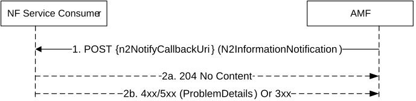
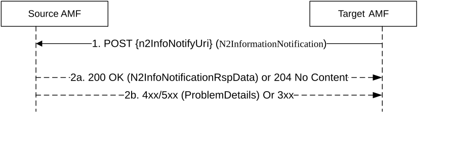

# 5.2.2.3.6 N2InfoNotify

## 5.2.2.3.6.1 General

The N2InfoNotify service operation is used during the following procedure:

\- Inter NG-RAN node N2 based handover procedure (see TS 23.502 \[3\], clauses 4.9.1.3.3, 4.9.1.3.3a and 4.23.7.3);

\- Network assisted positioning procedure (see clause 6.11.2 of TS 23.273 \[42\])

\- AMF planned removal procedure with UDSF deployed (see clause 5.21.2.2.1 of TS 23.501 \[2\]), to forward uplink N2 signalling to a different AMF.

The N2InfoNotify service operation is invoked by AMF, to notify a NF Service Consumer that subscribed N2 information has been received from access network.

The AMF shall use HTTP POST method to the N2Info Notification URI provided by the NF Service Consumer via N1N2MessageSubscribe service operation (See clause 5.2.2.3.3). See also figure 5.2.2.3.6.1-1.

Figure 5.2.2.3.6.1-1 N2 Information Notify

1\. The AMF shall send a HTTP POST request to the n2NotifyCallbackUri, and the content of the POST request shall contain a N2InformationNotification data structure, containing the N2 information that was subscribed by the NF Service Consumer.

2a. On success, "204 No Content" shall be returned and the content of the POST response shall be empty.

2b. On failure or redirection, one of the HTTP status code listed in Table 6.1.5.5.3.1-3 shall be returned. The message body shall contain a ProblemDetails object with "cause" set to one of the corresponding application errors listed in Table 6.1.5.5.3.1-3.

## 5.2.2.3.6.2 Using N2InfoNotify during Inter NG-RAN node N2 based handover procedure

The N2InfoNotify service operation is invoked by a NF Service Producer, e.g. the target AMF, towards the NF Service Consumer, i.e. the source AMF, to notify that the handover procedure has been successful in the target side, for a given UE.

Figure 5.2.2.3.6.2-1 N2 Information Notify during N2 Handover execution

The requirements specified in clause 5.2.2.3.6.1 shall apply with the following modifications:

0\. During an inter AMF handover procedure, the source AMF, acting as a NF Service Consumer, when invoking the CreateUEContext service operation (see clause 5.2.2.2.3), shall include a N2Info Notification URI to the target AMF in the HTTP request message.

1\. Same as step 1 of Figure 5.2.2.3.6.1-1, the request content shall contain the following information:

\- notification content (see clause 6.1.5.5) without the "n2InfoContainer" attribute;

\- the "notifyReason" attribute set to "HANDOVER_COMPLETED";

\- the "smfChangeInfoList" attribute including the UE's PDU Session ID(s) for which the I-SMF or V-SMF has been changed or removed, if any, with for each such PDU session, the related "smfChangeIndication" attribute set to "CHANGED" or "REMOVED", if the I-SMF or the V-SMF is changed or removed respectively.

\- the "notifySourceNgRan" attribute set to "true" during an Inter NG-RAN node N2 based DAPS handover procedure, if the target AMF receives this indication in the Handover Notify from the target NG-RAN node (see clause 4.9.1.3.3a of TS 23.502 \[3\]).

If any network slice(s) become no longer available and there are PDU Session(s) associated with them, the target AMF shall include these PDU session(s) in the toReleaseSessionList attribute in the content. If the continuity of the PDU Session(s) cannot be supported between networks (e.g. SNPN-SNPN mobility, inter-PLMN mobility where no HR agreement exists), the target AMF shall include these PDU session(s) with release cause in the toReleaseSessionInfo attribute in the content.

The n2NotifySubscriptionId included in the notification content shall be the UE context Id.

2\. Same as Step 2a of Figure 5.2.2.3.6.1-1, with the following additions/modifications:

\- the source AMF shall release the PDU Session(s) listed in the toReleaseSessionList attribute and the toReleaseSessionInfo attribute in the content;

\- if the smfChangeInfoList attribute was received in the request, the source AMF shall release the SM Context at the I-SMF or V-SMF only, for all the PDU sessions listed in the smfChangeInfoList attribute with the smfChangeIndication attribute set to "CHANGED" or "REMOVED";

\- the source AMF shall remove the individual ueContext resource. The source AMF may choose to start a timer to supervise the release of the UE context resource and may keep the individual ueContext resource until the timer expires;

\- if Secondary RAT usage data have been received from the source NG-RAN and buffered at the source AMF for one or more PDU sessions as specified in step 2a0 of clause 4.9.1.3.3 of TS 23.502 \[3\], the source AMF shall send a 200 OK response with the Secondary RAT usage data included in the response content for one or more PDU sessions.

\- if the "notifySourceNgRan" attribute was set to "true" in the request, the source AMF shall send a HANDOVER SUCCESS to the source NG-RAN (see clause 4.9.1.3.3a of TS 23.502 \[3\]).

NOTE: This notification is due to an implicit subscription and hence no explicit subscription Id is created. UE context Id is included as the notification subscription Id for the NF Service Consumer (e.g. Source AMF) to co-relate the notification to an earlier initiated UE context creation during a handover procedure.

## 5.2.2.3.6.3 Using N2InfoNotify during Location Services procedures

The N2InfoNotify service operation is invoked by a NF Service Producer, i.e. the AMF, towards the NF Service Consumer, e.g. the LMF, to notify the positioning parameters received from the 5G-AN in the NRPPa message.

The requirements specified in clause 5.2.2.3.6.1 shall apply with the following modifications:

1\. If the corresponding N2 notification URI is not available, the AMF shall retrieve the NF profile of the NF Service Consumer (e.g. the LMF) from the NRF using the NF Instance Identifier received during corresponding N1N2MessageTransfer service operation (see clause 5.2.2.3.1), and further identify the corresponding service instance if Service Instance Identifier was also received, and fetch N2 Notification URI from the default subscription registered with "N2_INFORMATION" notification type and "NRPPa" N2 information class (See Table 6.2.6.2.3-1 and Table 6.2.6.2.4-1 of TS 29.510 \[29\]).

2\. Same as step 1 of Figure 5.2.2.3.6.1-1, the request content shall contain N2 information of type NRPPa and LCS correlation identifier.

## 5.2.2.3.6.4 Using N2InfoNotify during AMF planned removal procedure with UDSF deployed procedure

In the AMF planned removal procedure with UDSF deployed (see clause 5.21.2.2.1 of TS 23.501 \[2\]), the N2InfoNotify service operation is invoked by a NF Service Producer, i.e. an initial AMF, towards the NF Service Consumer, i.e. the target AMF, to forward uplink N2 signalling to the target AMF.

The requirements specified in clause 5.2.2.3.6.1 shall apply with the following modifications:

1\. If the N2 notification URI is not available, the initial AMF shall discover the NF Service Consumer (i.e. the target AMF) from the NRF, and fetch the N2 Notification URI from the default notification subscription registered with "N2_INFORMATION" notification type and "RAN" N2 message class (See Table 6.2.6.2.3-1 and Table 6.2.6.2.4-1 of TS 29.510 \[29\].

NOTE: The target AMF is expected to have registered a callback URI with the NRF.

2\. Same as step 1 of Figure 5.2.2.3.6.1-1, the request content shall contain the following information in the HTTP POST Request message body:

\- N2 information of type "RAN";

\- N2 message;

\- initial AMF name;

\- RAN identity, e.g. RAN Node Id, RAN N2 IPv4/v6 address.
