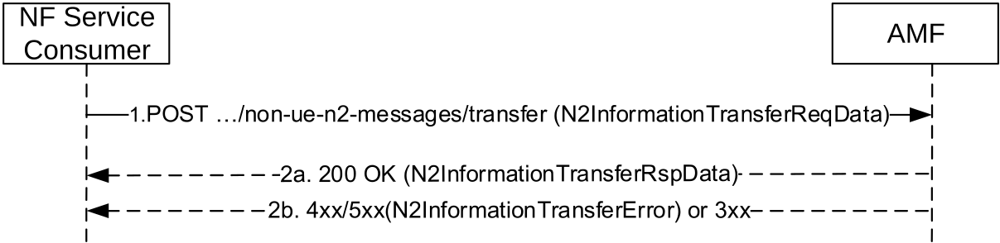
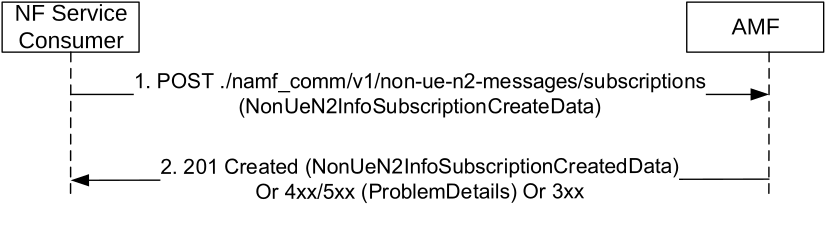
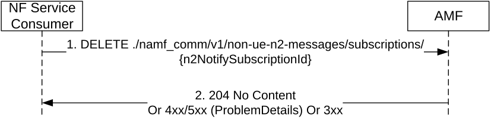
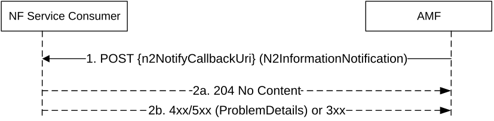

# 5.2.2.4 Non-UE N2 Message Operations

## 5.2.2.4.1 NonUeN2MessageTransfer

### 5.2.2.4.1.1 General

The NonUeN2MessageTransfer service operation is used by a NF Service Consumer to transfer N2 information to the 5G-AN through the AMF in the following procedures:

\- Obtaining non-UE associated network assistance data (See clause 4.13.5.6 in TS 23.502 \[3\]);

\- Warning Request Transfer procedures (See clause 9A in TS 23.041 \[20\]);

\- Configuration Transfer procedure (see clause 5.26 of TS 23.501 \[2\])

\- RIM Information Transfer procedures (see clause 8.16 of TS 38.413 \[12\]).

\- Broadcast of Assistance Data by an LMF (see clause 6.14.1 of TS 23.273 \[42\]).

\- Management of network timing synchronization status monitoring procedures (see clause 4.15.9.5 of TS 23.502 \[3\]).

The NF Service Consumer shall invoke the service operation by sending POST to the URI of the "transfer" customer operation on the "Non UE N2Messages Collection" resource (See clause 6.1.3.8.4.2) on the AMF. See also figure 5.2.2.4.1.1-1.

Figure 5.2.2.4.1.1-1 Non-UE N2 Message Transfer

1\. The NF Service Consumer shall invoke the custom operation for non UE associated N2 message transfer by sending a HTTP POST request, and the request body shall carry the N2 information to be transferred.

2a. On success, AMF shall respond a "200 OK" status code with N2InformationTransferRspData data structure.

2b. On failure or redirection, one of the HTTP status code listed in Table 6.1.3.8.4.2.2-2shall be returned with the message body containing a N2InformationTransferError structure, including a ProblemDetails attribute with the "cause" attribute set to one of the application errors listed in Table 6.1.3.8.4.2.2-2.

### 5.2.2.4.1.2 Obtaining Non UE Associated Network Assistance Data Procedure

The NonUeN2MessageTransfer service operation shall be invoked by a NF Service Consumer, e.g. LMF to transfer non UE associated N2 information of N2 information class NRPPa to NG-RAN for obtaining the network assistance data.

The requirements specified in clause 5.2.2.4.1.1 shall apply with the following modifications:

1\. Same as step 1 of Figure 5.2.2.4.1.1-1, the POST request body shall carry the N2 information to be transferred together with the NG RAN node identifier(s) to which the transfer needs to be initiated. The POST request body shall also include the NF Instance Identifier of the NF Service Consumer (e.g. LMF) in "nfId" attribute.

### 5.2.2.4.1.3 Warning Request Transfer Procedure

The NonUeN2MessageTransfer service operation shall be invoked by the NF Service Consumer, e.g. CBCF/PWS-IWF, to send non-UE specific messages of N2 information class PWS to the NG-RAN.

The requirements specified in clause 5.2.2.4.1.1 shall apply with the following modifications:

1\. Same as step 1 of Figure 5.2.2.4.1.1-1, the request body shall include the N2 Message Container and:

\- the globalRanNodeList IE, or;

\- the taiList IE and the ratSelector IE, or;

\- the ratSelector IE.

The AMF shall forward the N2 Message Container to ng-eNBs or to gNBs indicated in the globalRanNodeList IE if present. If the globalRanNodeList IE if not present, the AMF shall forward the N2 Message Container to ng-eNBs or to gNBs, subject to the value of the *ratSelector* IE, that serve Tracking Areas as listed in the *taiList* IE if present. If the *taiList* IE and the *globalRanNodeList* IE are not present, the AMF shall forward the N2 Message Container to all attached ng-eNBs or all attached gNBs, subject to the value of the *ratSelector* IE.

NOTE: The *globalRanNodeList* IE can be present when transferring WRITE-REPLACE WARNING REQUEST. When present, the *globalRanNodeList* IE only contains RAN nodes of the same type, i.e. only ng-eNBs or only gNBs.

The request body may additionally include the *omcId* IE and/or the *sendRanResponse* IE.

2a. Same as step 2a of Figure 5.2.2.4.1.1-1, and the POST response body shall contain the mandatory elements from the Write-Replace-Warning Confirm response (see clause 9.2.17 in TS 23.041 \[20\]) or the mandatory elements and optionally the *unknown TAI List* IE from the Stop-Warning Confirm response (see clause 9.2.19 in TS 23.041 \[20\]).

If the *sendRanResponse* IE with the value "true" was received in the request, but the corresponding N2 information subscription for PWS information from the NF service consumer is not available in the AMF, the AMF should include the *n2PwsSubMissInd* IE with the value "true" in the response.

> 2b. Same as step 2b of Figure 5.2.2.4.1.1-1, and the POST response body shall contain following additional information:

\- PWS specific information, if any, e.g. PWS Cause information.

### 5.2.2.4.1.4 Configuration Transfer Procedure

The NonUeN2MessageTransfer service operation shall be invoked by the NF Service Consumer (i.e. source AMF) towards the NF Service Producer (i.e. target AMF) to transfer the RAN configuration information received from the source NG-RAN towards the target NG-RAN.

The requirements specified in clause 5.2.2.4.1.1 shall apply with the following modifications:

1\. Same as step 1 of Figure 5.2.2.4.1.1-1. The POST request body shall contain the SON Configuration Transfer IE received from the source NG-RAN, the NG RAN node identifier of the destination of this configuration information, and the N2 information class "RAN".

The target AMF shall forward the SON Configuration Transfer IE in a NGAP Downlink RAN Configuration Transfer message to the target NG-RAN.

### 5.2.2.4.1.5 RIM Information Transfer Procedures

The NonUeN2MessageTransfer service operation shall be invoked by the NF Service Consumer (i.e. source AMF) towards the NF Service Producer (i.e. target AMF) to transfer the RIM information received from the source NG-RAN towards the target NG-RAN.

The requirements specified in clause 5.2.2.4.1.1 shall apply with the following modifications:

1\. Same as step 1 of Figure 5.2.2.4.1.1-1. The POST request body shall contain the RIM Information Transfer IE received from the source NG-RAN, the NG RAN node identifier of the destination of this configuration information, and the N2 information class "RAN".

The target AMF shall forward the RIM Information Transfer IE in a NGAP Downlink RIM Information Transfer message to the target NG-RAN.

### 5.2.2.4.1.6 Broadcast of Assistance Data by an LMF

The NonUeN2MessageTransfer service operation shall be invoked by a NF Service Consumer, e.g. LMF to transfer non UE associated N2 information of N2 information class NRPPa to NG-RAN for sending assistance information broadcasting.

The requirements specified in clause 5.2.2.4.1.1 shall apply with the following modifications:

1\. Same as step 1 of Figure 5.2.2.4.1.1-1, the POST request body shall contain NRPPa-PDU IE carrying Network Assistance Data generated by LMF to be transferred together with the target NG RAN node identifier(s) to which the transfer needs to be initiated. The POST request body shall also include the NF Instance Identifier of the NF Service Consumer (e.g. LMF) in "nfId" attribute.

### 5.2.2.4.1.7 Management of network timing synchronization status monitoring procedures

The NonUeN2MessageTransfer service operation shall be invoked by a NF Service Consumer, e.g. TSCTSF, to transfer clock quality reporting control information to NG-RAN.

The requirements specified in clause 5.2.2.4.1.1 shall apply with the following modifications:

1\. Same as step 1 of Figure 5.2.2.4.1.1-1, the POST request body shall contain a NGAP Timing Synchronization Status Request message, a list of TAIs or a list of NG-RAN IDs identifying target NG RAN node(s) towards which the NGAP message is requested to be transferred, the N2 information class set to "TSS", and the "nfId" attribute set to the NF Instance Identifier of the NF Service Consumer (e.g. TSCTSF).

2\. Same as step 2a of Figure 5.2.2.4.1.1-1. The N2InformationTransferRspData data structure may contain a list of TssRspPerNgran if the AMF receives Timing Synchronization Status Failure message(s), or Timing Synchronization Status Response message(s) with the Criticality Diagnostics IE being present, from one or more NG-RAN nodes, or if the AMF is unable to reach some NG-RAN node(s).

Upon receipt of subsequent responses from other NG-RANs after sending the 200 OK response, assuming that the TSCTSF has subscribed to the AMF for TSS information reporting (see clause 5.2.2.4.2), if additional information (e.g., Timing Synchronization Status Failure or Timing Synchronization Status Response message with the Criticality Diagnostics IE being present, as specified in TS 38.413 \[12\]) needs to be transferred to the TSCTSF, the AMF shall transfer such information in the TssRspPerNgran by sending one or more Namf_NonUeN2InfoNotify requests to the TSCTSF.

NOTE: The TSCTSF sends the Namf_NonUeN2InfoSubscribe request message to the AMF to subscribe for receiving TSS related information, i.e., Timing Synchronization Status Report/Failure/Response messages, before it sends the Namf_NonUeN2MessageTransfer message containing the Timing Synchronization Status Request to start the TSS reporting in the NG-RAN.

## 5.2.2.4.2 NonUeN2InfoSubscribe

### 5.2.2.4.2.1 General

The NonUeN2InfoSubscribe service operation is used by a NF Service Consumer (e.g. CBCF, PWS-IWF, TSCTSF) to subscribe to the AMF for notifying non UE specific N2 information of a specific type (e.g. PWS Indications, TSS).

An NF Service Consumer (e.g. CBCF, PWS-IWF, TSCTSF) may subscribe to notifications of specific N2 information type (e,g PWS Indications, TSS) that are not associated with any UE. In this case, the NF Service Consumer shall subscribe by using the HTTP POST method with the URI of the "Non UE N2Messages Subscriptions Collection" resource (See clause 6.1.3.9.3.1). See also Figure 5.2.2.4.2.1-1.

Figure 5.2.2.4.2.1-1 N2 Information Subscription for Non UE Information

1\. The NF Service Consumer shall send a POST request to create a subscription resource in the AMF for a non UE specific N2 information notification. The content of the POST request shall contain:

\- N2 Information Type, identifying the type of N2 information to be notified

\- A callback URI for the notification

2\. If the request is accepted, the AMF shall include a HTTP Location header to provide the location of a newly created resource (subscription) together with the status code 201 indicating the requested resource is created in the response message.

On failure or redirection, one of the HTTP status codes together with the response body listed Table 6.1.3.9.3.1-3 shall be returned.

## 5.2.2.4.3 NonUeN2InfoUnSubscribe

### 5.2.2.4.3.1 General

The NonUeN2InfoUnSubscribe service operation is used by a NF Service Consumer (e.g. CBCF, PWS-IWF, TSCTSF) to unsubscribe to the AMF to stop notifying N2 information of a specific type (e.g. PWS Indications, TSS).

The NF Service Consumer shall use the HTTP method DELETE with the URI of the "Non UE N2 Message Notification Individual Subscription" resource (See clause 6.1.3.10.3.1), to request the deletion of the subscription for non UE specific N2 information notification, towards the AMF. See also Figure 5.2.2.4.3.1-1.

Figure 5.2.2.4.3.1-1 NonUeN2InfoUnSubscribe for Non UE Specific Information

1\. The NF Service Consumer shall send a DELETE request to delete an existing subscription resource in the AMF.

2\. If the request is accepted, the AMF shall reply with the status code 204 indicating the resource identified by subscription ID is successfully deleted, in the response message.

On failure or redirection, one of the HTTP status codes together with the response body listed Table 6.1.3.10.3.1-3 shall be returned.

## 5.2.2.4.4 NonUeN2InfoNotify

### 5.2.2.4.4.1 General

The NonUeN2InfoNotify service operation is used during the following procedures:

\- Obtaining non-UE associated network assistance data (See clause 4.13.5.6 in TS 23.502 \[3\])

\- Receiving PWS related events from the NG-RAN

\- Broadcast of Assistance Data by an LMF (see clause 6.14.1 of TS 23.273 \[42\]).

\- Monitoring of Timing synchronization status information (see clause 4.15.9.5 of TS 23.502 \[3\]).

The NonUeN2InfoNotify service operation is invoked by the AMF to notify a NF Service Consumer that subscribed Non-UE N2 information has been received from the 5G-AN.

The AMF shall use HTTP POST method to the N2Info Notification URI provided by the NF Service Consumer via NonUeN2InfoSubscribe service operation (See clause 5.2.2.4.2). See also Figure 5.2.2.4.4.1-1.

Figure 5.2.2.4.4.1-1 Non-UE N2 Information Notify

1\. The AMF shall send a HTTP POST request to the N2Info Notification URI, and the content of the POST request shall contain a N2InformationNotification data structure, with the N2 information that was subscribed by the NF Service Consumer.

2a. On success, "204 No Content" shall be returned and the content of the POST response shall be empty.

2b. On failure or redirection, one of the HTTP status code listed in Table 6.1.5.3.3.1-3 shall be returned. The message body shall contain a ProblemDetails object with "cause" set to one of the corresponding application errors listed in Table 6.1.5.3.3.1-3.

### 5.2.2.4.4.2 Using NonUeN2InfoNotify during Location Services procedures

The NonUeN2InfoNotify service operation is invoked by a NF Service Producer, i.e. the AMF, towards the NF Service Consumer, e.g. the LMF, to notify the assistance data received from the 5G-AN.

The requirements specified in clause 5.2.2.4.4.1 shall apply with the following modifications:

1\. If the corresponding N2 notification URI is not available, the AMF shall retrieve the NF profile of the NF Service Consumer (e.g. the LMF) from the NRF using the NF Instance Identifier received during "Obtaining Non UE Associated Network Assistance Data Procedure" or "Broadcast of Assistance Data by an LMF Procedure" (see clause 5.2.2.4.1.2), and further identify the corresponding service instance if Service Instance Identifier was also received, and fetch N2 Notification URI from the default subscription registered with "N2_INFORMATION" notification type and "NRPPa" information class (See Table 6.2.6.2.3-1 and Table 6.2.6.2.4-1 of TS 29.510 \[29\]).

2\. Same as step 1 of Figure 5.2.2.4.4.1-1, the content shall contain network assistance data.

### 5.2.2.4.4.3 Use of NonUeN2InfoNotify for PWS related events

The NonUeN2InfoNotify service operation shall be used during the following PWS related events:

1\) The AMF has received a Write-Replace-Warning-Response or a PWS-Cancel-Response from the NG-RAN over N2.

Upon receiving the N2 Message Content the RAN Nodes return a response which may include the *Broadcast Completed Area List* IE or the *Broadcast Cancelled Area List* IE, depending on the *Message Type* IE. The AMF may aggregate the lists it receives from the RAN Nodes for the same request.

If the *Send-Write-Replace-Warning Indication* IE was present in the Write-Replace-Warning Request message, then the AMF may forward the *Broadcast Completed Area List* IE(s) to the NF Service Consumer. If the NG-RAN node(s) have responded without the *Broadcast Completed Area List* IE then the AMF shall include the NG-RAN node ID(s) in "bcEmptyAreaList" attribute in the request body.

If the *Send-Stop-Warning Indication* IE was present in the Stop-Warning-Request message, then the AMF may forward the *Broadcast Cancelled Area List* IE(s) to the NF Service Consumer. If the NG-RAN node(s) have responded without the *Broadcast Cancelled Area List* IE then the AMF shall include the NG-RAN node ID(s) in "bcEmptyAreaList" attribute in the request body.

If none of the NG-RAN nodes have responded with the Broadcast Completed Area List IE (in the Write-Replace Warning Response messages) or with the Broadcast Cancelled Area List IE (in the PWS Cancel Response messages), the AMF shall send one (or more) NonUEN2InfoNotify request(s) including a Write-Replace Warning Response or a PWS Cancel Response to the CBCF/PWS-IWF, and including all the NG-RAN node(s) in the "bcEmptyAreaList" attribute.

NOTE: TS 23.041 \[20\] specifies that the AMF sends a NonUEN2InfoNotify including a Write-Replace Warning Indication or a Stop Warning Indication to the CBCF/PWS-IWF. This is supported at stage 3 level by the AMF sending a NonUEN2InfoNotify including a Write-Replace Warning Response or a PWS Cancel Response to the CBCF/PWS-IWF.

2\) The AMF has received a Restart Indication or a Failure Indication from a NG-RAN Node. The AMF shall forward the Restart Indication or Failure Indication to the NF Service Consumer.

The requirements specified in clause 5.2.2.4.4.1 shall apply with the following modifications:

\- Same as step 1 of Figure 5.2.2.4.4.1-1, the request body shall include the PWS related N2 information.

### 5.2.2.4.4.4 Using NonUeN2InfoNotify during network timing synchronization status monitoring procedure

The NonUeN2InfoNotify service operation is invoked by the AMF towards the NF Service Consumer indicated by the Routing ID IE received within the NGAP Timing Synchronization Status Report/Failure/Response messages, e.g. the TSCTSF, to notify the RAN timing synchronization status information and/or the result of the Namf_NonUeN2MessageTransfer request message which contains Timing Synchronization Status Request to start or stop the reporting of RAN timing synchronization status in the NG-RAN, as specified in clause 5.2.2.4.1.7, from the 5G-AN.

The requirements specified in clause 5.2.2.4.4.1 shall apply with the following modifications:

\- Same as step 1 of Figure 5.2.2.4.4.1-1. The request body shall include:

\- the RAN Timing Synchronization Status Report message for TSS related N2 information, the Timing Synchronization Status Failure message(s), and/or the Timing Synchronization Status Response message(s) with the Criticality Diagnostics IE being present, from one or more NG-RAN nodes; and/or

\- one or more TssRspPerNgran(s) containing only the NG-RAN node ID and the ngranFailureInfo IE to report a failure related to an NG-RAN, e.g. when the AMF has detected that the NG-RAN has failed with or without restart, or the NG-RAN is not reachable, as specified in clause 8.3 of TS 23.527 \[33\].

NOTE: The AMF can aggregate up to 10 N2 Information containers encapsulating Timing Synchronization Status Report, Failure and/or Response messages received from NG-RANs in an NonUeN2InfoNotify request message where each N2 Information container encapsulates a Timing Synchronization Status Report, Failure or Response message.
