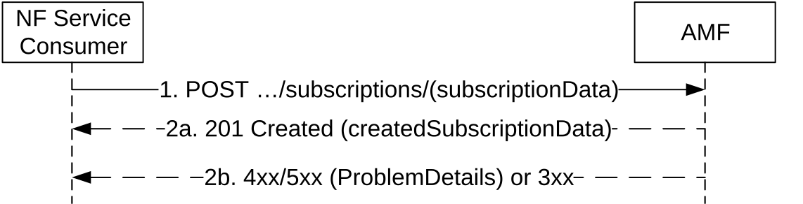
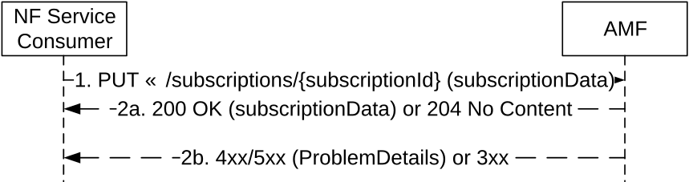
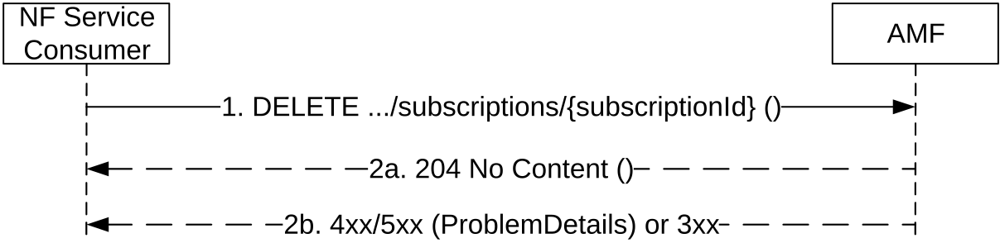
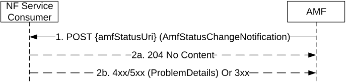

# 5.2.2.5 AMF Status Change Operations

## 5.2.2.5.1 AMFStatusChangeSubscribe

### 5.2.2.5.1.1 General

This service operation is used by a NF Service Consumer to subscribe the status change of the AMF.

The AMFStatusChangeSubscribe service operation is used during the following procedure:

\- AMF planned removal procedure (see TS 23.501 \[2\], clause 5.21.2.2)

### 5.2.2.5.1.2 Creation of a subscription

This service operation creates a subscription so a NF Service Consumer can request to be notified when the status of the AMF is changed.

It is executed by creating a new individual resource under the collection resource "subscriptions". The operation shall be invoked by issuing a POST request on the URI of the "subscriptions collection" resource (See clause 6.1.3.6.3.1).

Figure 5.2.2.5.1.1-1 NF Service Consumer Subscription to Notifications

1\. The NF Service Consumer shall send a POST request to the resource URI representing the "subscriptions" collection resource. The request body shall include the data indicating the GUAMI(s) supported by the AMF that the NF Service Consumer is interested in receiving the related status change notification. The request body also contains a callback URI, where the NF Service Consumer shall be prepared to receive the actual notification from the AMF (see AMFStatusChangeNotify operation in clause 5.2.2.5.3).

2a. On success, the AMF shall include a HTTP Location header to provide the location of a newly created resource (subscription) together with the status code 201 indicating the requested resource is created in the response message.

2b. On failure or redirection, one of the HTTP status code listed in Table 6.1.3.6.3.1-3 shall be returned. For a 4xx/5xx response, the message body containing a ProblemDetails structure with the "cause" attribute set to one of the application error listed in Table 6.1.3.6.3.1-3.

### 5.2.2.5.1.3 Modification of a subscription

This service operation updates the subscription data of an NF Service Consumer previously subscribed in the AMF by providing the updated subscription data to the AMF. The update operation shall apply to the whole subscription data (complete replacement of the existing subscription data by a new subscription data).

The NF Service Consumer shall issue an HTTP PUT request, towards the URI of the "individual subscription" resource (See clause 6.1.3.7.3.2), as shown in Figure 5.2.2.5.1.3-1:

Figure 5.2.2.5.1.3-1 Subscription Data Complete Replacement

1\. The NF Service Consumer shall send a PUT request to the resource URI representing the individual subscription. The request body shall include a representation of subscription data to replace the previous subscription data in the AMF.

2a. On success, "200 OK" shall be returned, the content of the PUT response shall contain the representation of the replaced resource. "204 No Content" may be returned, if the NF Service Producer accepts entirely the resource representation provided by the NF Service Consumer in the request.

2b. On failure or redirection, one of the HTTP status code listed in Table 6.1.3.7.3.2-3 shall be returned. For a 4xx/5xx response, the message body shall contain a ProblemDetails structure with the "cause" attribute set to one of the application error listed in Table 6.1.3.7.3.2-3.

## 5.2.2.5.2 AMFStatusChangeUnSubscribe

### 5.2.2.5.2.1 General

This service operation removes an existing subscription to notifications.

The AMFStatusChangeUnSubscribe service operation is used during the following procedure:

\- AMF planned removal procedure (see TS 23.501 \[2\], clause 5.21.2.2)

It is executed by deleting a given resource identified by a "subscriptionId". The operation is invoked by issuing a DELETE request on the URI of the specific " individual subscription" resource (See clause 6.1.3.7.3.1).

Figure 5.2.2.5.2.1-1: NF Service Consumer Unsubscription to Notifications

1\. The NF Service Consumer shall send a DELETE request to the resource URI representing the individual subscription. The request body shall be empty.

2a. On success, "204 No Content" shall be returned. The response body shall be empty.

2b. On failure or redirection, one of the HTTP status code listed in Table 6.1.3.7.3.1-3 shall be returned. For a 4xx/5xx response, the message body shall contain a ProblemDetails structure with the "cause" attribute set to one of the application error listed in Table 6.1.3.7.3.1-3.

## 5.2.2.5.3 AMFStatusChangeNotify

### 5.2.2.5.3.1 General

This service operation notifies each NF Service Consumer that was previously subscribed to receiving notifications of the status change of the AMF (e.g. AMF unavailable). The notification is sent to a callback URI that each NF Service Consumer provided during the subscription (see AMFStatusChangeSubscribe operation in 5.2.2.5.1).

The AMFStatusChangeNotify service operation is used during the following procedure:

\- AMF planned removal procedure (see TS 23.501 \[2\], clause 5.21.2.2)

The operation is invoked by issuing a POST request to each callback URI of the different NF Service Consumer.

Figure 5.2.2.5.3.1-1: AMF Notifications

1\. The AMF shall send a POST request to the callback URI. The request body shall include the GUAMI(s) and the related status change, GUAMI(s) is indicated by the NF Service Consumer during the subscription operation. For network deployment without UDSF case, the target AMF Name which is to serve the user of the indicated GUAMI(s) is also included.

2a. On success, "204 No content" shall be returned by the NF Service Consumer.

2b. On failure or redirection, one of the HTTP status code listed in Table 6.1.5.2.3.1-2 shall be returned. For a 4xx/5xx response, the message body shall contain a ProblemDetails structure with the "cause" attribute set to one of the application error listed in Table 6.1.5.2.3.1-2.
