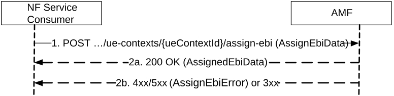

# 5.2.2.6 EBIAssignment

## 5.2.2.6.1 General

The EBIAssignment service operation is used during the following procedures (see TS 23.502 \[3\], clause 4.11.1.4):

\- UE requested PDU Session Establishment including Request Types "Initial Request", "Existing PDU Session", "Initial emergency request" and "Existing emergency PDU session" (Non-roaming and Roaming with Local Breakout (see TS 23.502 \[3\], clause 4.3.2.2.1).

\- UE requested PDU Session Establishment including Request Types "Initial Request" and "Existing PDU Session" (Home-routed Roaming (see TS 23.502 \[3\], clause 4.3.2.2.2).

\- UE or network requested PDU Session Modification (non-roaming and roaming with local breakout) (see TS 23.502 \[3\], clause 4.3.3.2).

\- UE or network requested PDU Session Modification (home-routed roaming) (see TS 23.502 \[3\], clause 4.3.3.3).

\- UE Triggered Service Request (see TS 23.502 \[3\], clause 4.2.3.2) to move PDU Session(s) from untrusted non-3GPP access to 3GPP access.

\- Network requested PDU Session Modification, when the SMF needs to release the assigned EBI from a QoS flow (see TS 23.502 \[3\], clause 4.11.1.4.3).

The EBIAssignment service operation is invoked by a NF Service Consumer, e.g. a SMF, towards the NF Service Producer, i.e. the AMF, to request the AMF to allocate EPS bearer ID(s) towards EPS bearer(s) mapped from QoS flow(s) for an existing PDU Session for a given UE.

EBI allocation shall apply only to:

\- QoS flows of Single Access PDU Session(s) via 3GPP access using SSC mode 1 and supporting EPS interworking with N26;

\- Qos flows of Multi-Access PDU Session(s) using SSC mode 1 and supporting EPS interworking with N26, that are not only allowed over non-3GPP access.

EBI allocation shall not apply to:

\- PDU Session(s) via 3GPP access supporting EPS interworking without N26;

\- PDU Session(s) via non-3GPP access supporting EPS interworking;

\- GBR QoS flow(s) that are only allowed over non-3GPP access in Multi-Access PDU Session(s) supporting EPS interworking; and

\- PDU sessions using SSC mode 2 or SSC mode 3.

The EBIAssignment service operation is also invoked by an NF Service Consumer, e.g. an SMF, towards the NF Service Producer supporting the EAEA feature, i.e. the AMF, to request the AMF to update the mapping of EBI and ARP, if the ARP for a QoS flow that has already been allocated an EBI is changed during the network requested PDU Session Modification.

The NF Service Consumer (e.g. the SMF) shall perform EBIAssignment service operation by invoking "assign-ebi" custom operation on the "individual ueContext" resource (See clause 6.1.3.2.4.3). See also Figure 5.2.2.6.1-1.

Figure 5.2.2.6.1-1 EBI Assignment

1\. The NF Service Consumer, e.g. the SMF, shall invoke "assign-ebi" custom method on individual ueContext resource, which is identified by the UE's SUPI or PEI in the AMF. The NF Service consumer shall provide PDU Session ID and ARP list as input for the service operation. If the NF Service Consumer invokes this service operation to update the mapping of EBI and ARP for a QoS flow to which an EBI is already allocated in the AMF, the NF Service Consumer shall provide the PDU Session ID and modifiedEbiList.

2a. On success, the AMF shall assign EBI for each ARP in received ARP list, if enough EBI(s) are available. If there is not enough EBI(s) available, the AMF may revoke already assigned EBI(s) based on the ARP(s) and the S-NSSAI of the PDU session for which the request was received, EBIs information in the UE context and local policies. The AMF may only assign a subset of the requested EPS Bearer ID(s), e.g. when other PDU Sessions with higher ARP have occupied other available EPS Bearer IDs. If AMF has successfully assigned all or part of the requested EBI(s), the AMF shall respond with the status code 200 OK, together with the assigned EBI to ARP mapping(s), the list of ARPs for which the AMF failed to allocate an EBI (if any) and the list of EBI(s) released for this PDU session due to revocation based on ARP(s) and the S-NSSAI (if any).

If the request contains "releasedEbiList", the AMF shall release the requested EBI(s). The AMF shall respond with the status code 200 OK and shall include the EBI(s) released in the "releasedEbiList" IE of the POST response body. The "releasedEbiList" in the request shall be handled before the EBI assignment in AMF.

If the same EBI(s) are both in the "releasedEbiList"and "assignedEbiList", the NF sevice consumer considers that EBI(s) have been released and reassigned.

If the request contains "modifiedEbiList", the AMF shall store the association of the assigned EBI and ARP pair to the corresponding PDU Session ID. The AMF shall respond with the status code 200 OK and shall include the EBI(s) with ARP updated in the "modifiedEbiList" IE of the POST response body.

2b. On failure or redirection, one of the HTTP status code listed in Table 6.1.3.2.4.3.2-2 shall be returned. For a 4xx/5xx response, the message body shall contain an AssignEbiError structure, including:

\- a ProblemDetails structure with the "cause" attribute set to one of the application error listed in Table 6.1.3.2.4.3.2-2;

\- a failureDetails which describes the details of the failure including the list of ARPs for which the EBI assignment failed.
