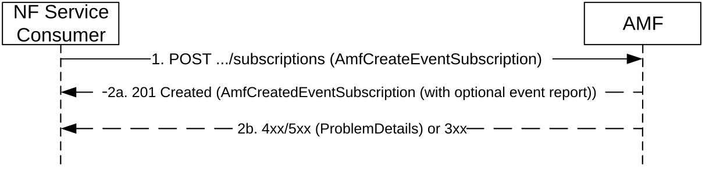
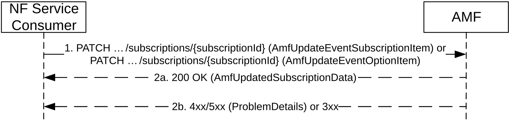
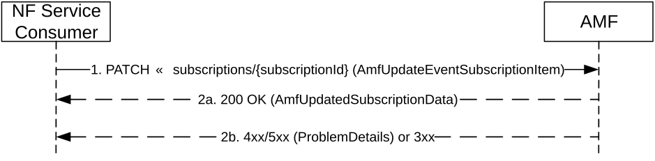
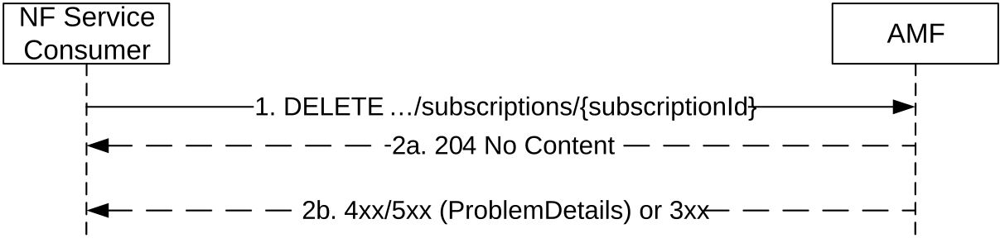
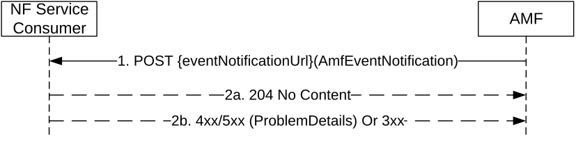

# 5.3.2 Service Operations

## 5.3.2.1 Introduction

For the Namf_EventExposure service the following service operations are defined:

\- Subscribe;

\- Unsubscribe;

\- Notify.

## 5.3.2.2 Subscribe

### 5.3.2.2.1 General

The Service Operation is used by a NF Service Consumer (e.g. NEF) to subscribe to an event(s) for one UE, group of UE(s) or any UE.

### 5.3.2.2.2 Creation of a subscription

The Subscribe service operation is invoked by a NF Service Consumer, e.g. NEF, towards the AMF, when it needs to create a subscription to monitor at least one event relevant to the AMF. The NF Service Consumer may subscribe to multiple events in a subscription. A subscription may be associated with one UE, a group of UEs or any UE.

The NF Service Consumer shall request to create a new subscription by using HTTP method POST with URI of the subscriptions collection, see clause 6.2.3.2.

The NF Service Consumer shall include the following information in the HTTP message body:

\- NF ID, indicates the identity of the network function instance initiating the subscription;

\- Subscription Target, indicates the target(s) to be monitored, as one of the following types:

\- A specific UE, identified with a SUPI, a PEI or a GPSI;

\- A group of UEs, identified with a group identity;

\- Any UE, identified by the "anyUE" flag.

\- Notification URI, indicates the address to deliver the event notifications generated by the subscription;

\- Notification Correlation ID, indicates the correlation identity to be carried in the event notifications generated by the subscription;

\- List of events to be subscribed;

\- Event Types per event, as specified in clause 5.3.1.

The NF Service Consumer may include the following information in the HTTP message body:

\- Immediate Report Flag per event, indicates an immediate report to be generated with current event status;

\- Event Trigger, indicates how the events shall be reported (One-time Reporting or Continuously Reporting).

\- Maximum Number of Reports, defines the maximum number of reports after which the event subscription ceases to exist;

\- Expiry, defines maximum duration after which the event subscription ceases to exist;

\- Sampling ratio, defines the random subset of UEs among target UEs, and AMF only report the event(s) related to the selected subset of UEs;

\- partitioning criteria, that defines Criteria for partitioning UEs before applying sampling ratio;

\- Periodic Report Flag per event, indicates the report to be generated periodically;

\- Repetition Period, defines the period for periodic reporting;

\- Variable reporting periodicity information, defines the list of conditions related to Reporting periodicity and the period per condition.

\- Event Filters per applicable event, defines further options on when/how the event shall be reported;

\- Reference Id per event, indicates the value of the Reference Id associated with the event to be monitored. If provided, the Reference Id shall be included in the reports triggered by the event;

\- a notification flag as "notifFlag" attribute if the EneNA feature is supported; and/or

\- Muting Exception Instructions, which specify instructions to apply to the subscription and the stored events when an exception occurs at the AMF while the event is muted (e.g., the buffer of stored event reports is full, or the number of stored event reports exceeds a certain number), if the ENAPH3 feature is supported (see clause 6.2.8).

Figure 5.3.2.2.2-1 Subscribe for Creation

1\. The NF Service Consumer shall send a POST request to create a subscription resource in the AMF. The content of the POST request shall contain a representation of the individual subscription resource to be created. The request may contain an expiry time, suggested by the NF Service Consumer as a hint, representing the time upto which the subscription is desired to be kept active and the time after which the subscribed event(s) shall stop generating report.

2a. On success, the request is accepted, the AMF shall include a HTTP Location header to provide the location of a newly created resource (subscription) together with the status code 201 indicating the requested resource is created in the response message. If the NF Service Consumer has included more than one events in the event subscription and some of the events are failed to be subscribed, the AMF shall accept the message and provide the successfully subscribed event(s) in AmfEventSubscription. If the NF Service Consumer has included the immediateFlag with value as "true" in the event subscription, the AMF shall include the current status of the events subscribed, if available (e.g. last known location information is included if the subscribed event is LOCATION_REPORT). If the events with immediateFlag set to "true" are subscribed by an NF service consumer on behalf of a third NF and the NF service consumer has not indicated supporting of IERSR feature (see 6.2.8), the notification will be sent to the third NF directly, i.e. subsChangeNotifyUri is included in the event subscription, the current status of the events subscribed shall not be included in response. The AMF shall subsequently send a notification to the third NF including the current status of the events subscribed.

If the NF Service Consumer has set the event reporting option as ONE_TIME and if the AMF has included the current status of the events subscribed in the response, then the AMF shall not do any subsequent event notification for the events given in the AmfCreateEventSubscription parameter. If the NF Service Consumer has set the event reporting option as ONE_TIME, the subscribed event as LOCATION_REPORT and the immediateFlag is set to false or absent, the AMF shall send an event notification to notify the current location of the UE after the subscription; if the UE is in RM-REGISTERED and CM-IDLE state over 3GPP access and the UE does not respond to the paging, or if the UE is in RM-REGISTERED over non-3GPP access, the event notification shall include the last known location and the ageOfLocationInformation IE set to a value other than "0", which indicates to the NF service consumer that the AMF returned the last known location.

If the NF Service Consumer has set the CONTINUOUS or PERIODIC event reporting option, the subscribed event as LOCATION_REPORT and the immediateFlag is set to false or absent, the AMF shall send a first event notification to notify the current location of the UE after the subscription is created and then subsequent event notifications when the user location changes or according to the requested period respectively; if at the time of the subscription creation the UE is in RM-REGISTERED and CM-IDLE state over 3GPP access and the UE does not respond to the paging, or if the UE is in RM-REGISTERED over non-3GPP access, the AMF shall send the first event notification including the last known location and the ageOfLocationInformation IE set to a value other than "0", which indicates to the NF service consumer that the AMF returned the last known location.

The response, based on operator policy and taking into account the expiry time included in the request, may contain the expiry time, as determined by the AMF, after which the subscription becomes invalid. Once the subscription expires, if the NF Service Consumer wants to keep receiving notifications, it shall create a new subscription in the AMF. The AMF shall not provide the same expiry time for many subscriptions in order to avoid all of them expiring and recreating the subscription at the same time. If the expiry time is not included in the response, the NF Service Consumer shall consider the subscription to be valid without an expiry time.

If the sampling ratio ("sampRatio") attribute is included in the subscription without a partitioningCriteria, the AMF shall select a random subset of UEs among target UEs according to the sampling ratio and only report the event(s) related to the selected subset of UEs. If the partitioningCriteria attribute is also included along with sampling ratio, the AMF shall apply the sampling ratio on the group of UEs determined according to the partitioning criteria.

If the AMF supports the EneNA feature and the "notifFlag" attribute is included and set to "DEACTIVATE" in the request (by e.g. the NWDAF or DCCF), the AMF shall mute the event notification and store the available events. Additionally, if the AMF also supports the ENAPH3 feature (see clause 6.2.8) and the NF service consumer also included event muting instructions in the request, the AMF should evaluate the received event muting instructions against to local actions (if configured) and, if the subscription creation request is accepted, the AMF may indicate the following information to the NF service consumer in the response:

\- the maximum number of notifications that the AMF expects to be able to store for the subscription;

\- an estimate of the duration for which notifications can be buffered.

If the NF service consumer is a UDM, the AMF and the UDM both support the "ESSYNC" feature and the subscription is targeting a specific UE with Reference Id(s) included in the subscription, the AMF shall locally store the information that the event subscription is subject to the Event Subscription Synchronization with UDM during EPS to 5GS mobility as specified in clause 5.3.2.4.2. During inter-AMF mobility procedures, the source AMF shall include the "eventSyncInd" IE (in AmfEventSubscriptionAddInfo data type) with the value "true" in the UE Context for the event subscriptions that are subject to Event Subscription Synchronization with UDM.

If the subscription creation request targets a group of UE or any UE, the AMF shall accept the request and create a subscription even if the AMF does not currently serve any UE of the group or any UE respectively, unless other reasons exist to reject the request.

2b. On failure or redirection, one of the HTTP status code listed in Table 6.2.3.2.3.1-3 shall be returned. For a 4xx/5xx response, the message body shall contain a ProblemDetails structure with the "cause" attribute set to one of the application error listed in Table 6.2.3.2.3.1-3.

If the subscription creation request targets a specific UE and this UE is not served by the AMF (i.e. it is not known to the AMF), the AMF shall reject the request with a 403 Forbidden response and the application error "UE_NOT_SERVED_BY_AMF", unless the request can be redirected to another AMF known to serve the UE (e.g. another AMF of the same AMF set).

If the AMF supports the EneNA and ENAPH3 features (see clause 6.2.8), the NF service consumer sets the "notifFlag" attribute to "DEACTIVATE" and event muting instructions in the request, but the AMF cannot accept the received instructions, the AMF may reject the request with a 403 Forbidden response and the application error "MUTING_EXC_INSTR_NOT_ACCEPTED".

### 5.3.2.2.3 Modification of a subscription

The Subscribe service operation is invoked by a NF Service Consumer, e.g. NEF, towards the AMF, when it needs to modify an existing subscription previously created by itself at the AMF.

The NF Service Consumer shall modify the subscription by using HTTP method PATCH with the URI of the individual subscription resource (see clause 6.2.3.3) to be modified.

See also Figure 5.3.2.2.3-1 below.

Figure 5.3.2.2.3-1 Modification of a Subscription

1\. The NF Service Consumer shall send a PATCH request to modify a subscription resource in the AMF. The modification may be for the events subscribed or for updating the event options.

2a. On success, the request is accepted, the AMF shall return the representation of the modified subscription resource or its sub-resource together with the status code 200 OK. When the PATCH request is for modifying the expiry attribute of the options IE of the subscription, then the AMF based on operator policies and taking into account the expiry time included in the request, shall include an expiry time, after which the subscription becomes invalid. Once the subscription expires, if the NF Service Consumer wants to keep receiving notifications, it shall create a new subscription in the AMF, as specified in clause 5.3.2.2.2. The AMF shall not provide the same expiry time for many subscriptions in order to avoid all of them expiring and recreating the subscription at the same time.

The PATCH request may be used to modify the "notifFlag" attribute of the options IE of the subscription, when both the AMF and NF Service Consumer support the EneNA feature as defined in clause 6.2.8:

\- if the "notifFlag" attribute is set to "DEACTIVATE" in the request and the event notification is currently not muted, the AMF shall mute the event notification and store the available events, or

\- if the "notifFlag" is set to "RETRIEVAL" in the request and the event notification is currently muted, the AMF shall send the stored events to the NF service consumer, mute the event notification again and store available events; or

\- if the "notifFlag" is set to "ACTIVATE" in the request and the event notification is currently muted, the AMF shall send the stored events to the NF service consumer and stop muting the event notification.

In addition, if both the AMF and the NF service consumer (e.g. NWDAF or DCCF) also support the ENAPH3 feature (see clause 6.2.8), the PATCH request modifies the "notifFlag" attribute to "DEACTIVATE" and contains muting exception instructions, the AMF should evaluate the received event muting instructions against to local actions (if configured) and, if the subscription modification request is accepted, the AMF may indicate the following information to the NF service consumer in the response:

\- the maximum number of notifications that the AMF expects to be able to store;

\- an estimate of the duration for which notifications can be buffered.

If the subscription requested to be modified targets a group of UE or any UE, the AMF shall accept the request and modify the subscription even if the AMF does not currently serve any UE of the group or any UE respectively, unless other reasons exist to reject the request.

2b. On failure or redirection, one of the HTTP status codes listed in Table 6.2.3.3.3.1-3 shall be returned. For a 4xx/5xx response, the message body shall contain a ProblemDetails structure with the "cause" attribute set to one of the application errors listed in Table 6.2.3.3.3.1-3.

If the AMF cannot accept the received muting exception instructions, the AMF may reject the request with a 403 Forbidden response and the application error "MUTING_EXC_INSTR_NOT_ACCEPTED".

### 5.3.2.2.4 Remove or add group member UE(s) for a group subscription

The Subscribe service operation is invoked by a NF Service Consumer, e.g. UDM, towards the AMF, to remove or add group member UE(s) for an existing group subscription.

The NF Service Consumer shall modify the subscription by using HTTP method PATCH with the URI of the individual subscription resource (see clause 6.2.3.3) to be modified.

See also Figure 5.3.2.2.4-1 below.

Figure 5.3.2.2.4-1 Remove or add group member UE(s) for a group subscription

1\. The NF Service Consumer shall send a PATCH request to modify a subscription resource targeting a group of UEs in the AMF. The modification shall indicate the group member UE(s) to be excluded or added for the group subscription.

2a. On success, the request is accepted, the AMF shall return the representation of the modified subscription resource with the status code 200 OK.

The AMF shall stop monitoring events for excluded member UE(s). If Maximum number of Reports is applied, the AMF shall set the number of reports of the indicated UE(s) to Maximum Number of Reports.

2b. On failure or redirection, one of the HTTP status code listed in Table 6.2.3.3.3.1-3 shall be returned. For a 4xx/5xx response, the message body shall contain a ProblemDetails structure with the "cause" attribute set to one of the application error listed in Table 6.2.3.3.3.1-3.

## 5.3.2.3 Unsubscribe

### 5.3.2.3.1 General

The Unsubscribe service operation is invoked by a NF Service Consumer, e.g. NEF, towards the AMF, to remove an existing subscription previously created by itself at the AMF.

The NF Service Consumer shall unsubscribe to the subscription by using HTTP method DELETE with the URI of the individual subscription resource (see clause 6.2.3.3) to be deleted.

Figure 5.3.2.3.1-1 Unsubscribe a subscription

1\. The NF Service Consumer shall send a DELETE request to delete an existing subscription resource in the AMF.

2a. On success, the request is accepted, the AMF shall reply with the status code 204 indicating the resource identified by subscription ID is successfully deleted in the response message.

2b. On failure or redirection, one of the HTTP status code listed in Table 6.2.3.3.3.2-3 shall be returned. For a 4xx/5xx response, the message body shall contain a ProblemDetails structure with the "cause" attribute set to one of the application error listed in Table 6.2.3.3.3.2-3.

## 5.3.2.4 Notify

### 5.3.2.4.1 General

The Notify service operation is invoked by the AMF, to send a notification, towards the notification URI, when certain event included in the subscription has taken place.

The AMF shall use the HTTP method POST, using the notification URI received in the subscription creation as specified in clause 5.3.2.2.2, including e.g. the subscription ID, Event ID(s) for which event has happened, notification correlation ID provided by the NF service consumer at the time of event subscription, to send a notification. See Figure 5.3.2.4.1-1.

Additionally, the Notify service operation shall also be invoked by the AMF, when:

\- there is a change of AMF during UE mobility procedures, if the subscription Id changes (i.e. Registration procedures and Handover procedures), or

\- the subscription is terminated by the AMF, if event subscription termination notification is requested by the NF consumer.

Figure 5.3.2.4.1-1 Notify

1\. The AMF shall send a POST request to send a notification.

2a. On success, "204 No content" shall be returned by the NF Service Consumer.

2b. On failure or redirection, the appropriate HTTP status code (e.g. "403 Forbidden") indicating the error shall be returned and appropriate additional error information should be returned.

When the AMF received the following response code (and application error), the AMF should consider the subscription is no longer valid and terminate the subscription:

\- "400 Bad Request" with application error "RESOURCE_CONTEXT_NOT_FOUND"

\- "404 Not Found"

> When AMF terminates the subscription in above scenarios, if the subscription is created by the NF consumer on behalf of another NF (e.g. the UDM subscribes to the AMF on behalf of the NEF) and notification of event subscription termination is requested by the NF consumer, the AMF supporting the 'STEN" feature shall send a notification to the NF consumer (e.g. the UDM) to report the termination of the subscription.

### 5.3.2.4.2 Event Subscription Synchronization for specific UE

When the AMF and the UDM both support the "ESSYNC" feature, the AMF may initiate synchronization for event subscriptions with the UDM for the specific UE during EPS to 5GS mobility registration procedure (see clause 4.11.5.2 of TS 23.502 \[3\]), if UE specific event subscriptions from the UDM are available in UE Context.

To initiate event subscription synchronization, when sending notification for subscription change to the UDM, the AMF shall include the event subscription information in the notification request. If subscription change notification is not needed, e.g. when UE registers to the same AMF after moving from EPS, the AMF may send a notification to the subscription change notification URI. The notification request in this case only includes the event subscription information but no event report list.

The AMF shall only include active event subscriptions that are subject to Event Subscription Synchronization with UDM (determined as defined in clause 5.3.2.2.2) in the event subscription information.

For each active subscription, the following information shall include:

\- URI of the subscription resource in the AMF; and

\- Notification Correlation Id of the subscription; and

\- list of Reference Ids, one per event in the subscription; and

\- optionally, the URI of old subscription resource on the source AMF, if the subscription Id is changed during the mobility procedure.

When the UDM receives event subscription information from AMF, the UDM shall compare the active event subscriptions in AMF with the active UDM Event Exposure subscriptions using Reference Id(s) and Notification Correlation Id, and perform the following:

\- if an event is to be detected by AMF but not existing in the AMF, the UDM shall subscribe the event in AMF by creating a new AMF event subscription or updating an existing AMF event subscription;

\- if an event exists in AMF but does not exist in UDM, the UDM shall unsubscribe the event from AMF by removing or update an AMF event subscription.

When the AMF identified that event synchronization with UDM is required, but either the UDM or the AMF or both do not support the "ESSYNC" feature, the AMF may require the UDM to re-subscribe the stored event exposure subscriptions to the AMF, see clause 5.3.2.2.2 and 5.3.2.2.3 of TS 29.503 \[35\].
