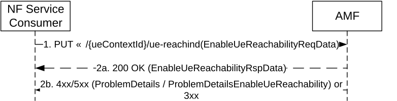
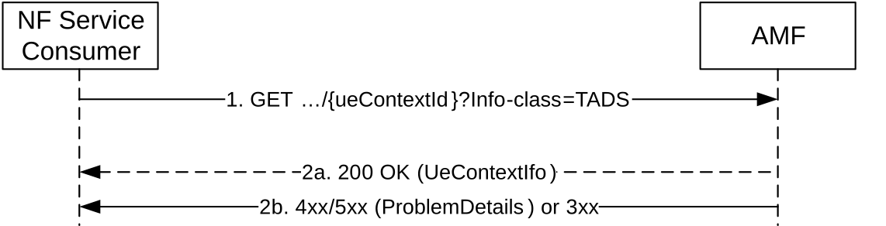
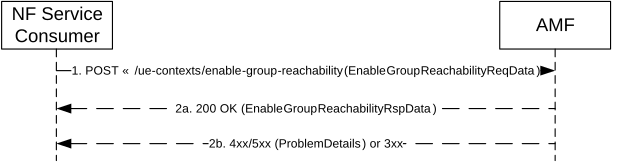
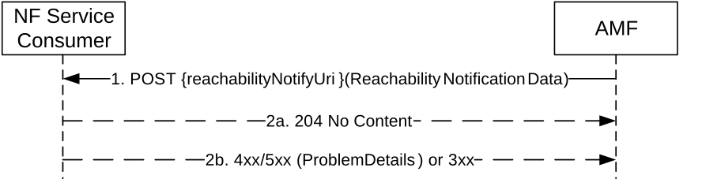

# 5.4 Namf_MT Service

## 5.4.1 Service Description

Namf_MT service allows a NF to request information related to capabilities to send MT signalling or data to a target UE. The following are the key functionalities of this NF service:

\- enabling UE reachability by:

\- paging the UE if the UE is in CM-IDLE state and responding to the requester NF after the UE enters CM-CONNECTED state, or

\- responding to the requester NF if UE is in CM-CONNECTED state.

\- providing the terminating domain selection information for IMS voice to the consumer NF.

\- enabling reachability of a list of UEs by:

\- paging UEs for an MBS session if the UEs are in CM-IDLE state, and

\- responding to the requester NF, including the list of UEs that are already in CM-CONNECTED state if any, and

\- sending notification with the UE reachability information and user location information to NF consumers.

## 5.4.2 Service Operations

### 5.4.2.1 Introduction

For the Namf_MT Service the following service operations are defined:

\- EnableUEReachability

\- ProvideDomainSelectionInfo

\- EnableGroupReachability

\- UEReachabilityInfoNotify

### 5.4.2.2 EnableUEReachability

#### 5.4.2.2.1 General

The EnableUEReachability service operation is used in the following procedure:

\- MT SMS over NAS in CM-IDLE state (see TS 23.502 \[3\], clause 4.13.3.6), or in CM-CONNECTED state (see TS 23.502 \[3\], clause 4.13.3.7).

\- UPF anchored Mobile Terminated Data Transport in Control Plane CIoT 5GS Optimisation (see clause 4.24.2 of TS 23.502 \[3\]).

\- Network Triggered Connection Resume in RRC Inactive with CN based MT communication handling (see clause 4.8.2.2b of TS 23.502 \[3\]).

The EnableUEReachability service operation shall be invoked by the NF Service Consumer (e.g. SMSF, SMF) to enable the reachability of the UE.

The NF Service Consumer shall invoke the service by using the HTTP method PUT, towards the URI of a "ueReachInd" resource as specified in clause 6.3.3.2. See also figure 5.4.2.2.1-1.

Figure 5.4.2.2.1-1: NF Service Consumer enables the reachability of the UE

1\. The NF Service Consumer sends a PUT request to the resource representing the ueReachInd resource of the AMF. The content of the PUT request shall contain an "EnableUeReachabilityReqData" object.

During the Network Triggered Connection Resume in RRC Inactive with CN based MT communication handling (see clause 4.8.2.2.b of TS 23.502 \[3\]), the SMF may include the ppi, the arp, the qfi, the 5qi and the DL data size of the received DL packets per QoS flow of the PDU session for which DL packets are received, together with the PDU session identifier, to enable NG-RAN to take this information into account when paging the UE.

The SMF shall send a new Namf_MT_EnableUEReachability request with a higher priority or a different Paging Policy Indicator to the AMF if, while the SMF is waiting for the response for UE connection resume from the AMF as specified in clause 4.8.2.2b of TS 23.502 \[3\] or the SMF has received a reject response with Estimated Maximum Wait time from the AMF:

\- the SMF receives any additional Data Notification from the UPF for data packets pertaining to another QoS Flow associated with a higher priority (i.e. ARP priority level) than the priority indicated to the AMF in the previous Namf_MT_EnableUEReachability request (for the case of DL data buffering in UPF);

\- the SMF receives any additional DL data packets pertaining to another QoS Flow associated with a higher priority (i.e. ARP priority level) than the priority indicated to the AMF in the previous Namf_MT_EnableUEReachability request (for the case of DL data buffering in SMF); or

\- the SMF derives a different Paging Policy Indicator according to the additional Data Notification or the additional DL data packets.

Based on local configuration, the SMF may send a new Namf_MT_EnableUEReachability message to AMF if:

\- the SMF receives any additional Data Notification messages for data packets pertaining to another QoS Flow associated with same or lower priority than the priority indicated to the AMF in the previous Namf_MT_EnableUEReachability (for the case of DL data buffering in UPF); or

\- the SMF receives any additional DL data packets pertaining to another QoS Flow associated with same or lower priority than the priority indicated to the AMF in the previous Namf_MT_EnableUEReachability(for the case of DL data buffering in SMF).

Before the UE becomes reachable, the AMF may receive several Namf_MT_EnableUEReachability requests which are triggered by DL data reports for different QoS flows, the AMF shall store or update the ppi, the arp, the qfi, the 5qi and the DL data size per QoS flow if included and may provide the received ppi(s), arp(s), qfi(s), 5qi(s) and DL data size(s) for each QoS flow to the NG-RAN when paging the UE based on the local configuration.

2a. On success:

\- if the UE is in CM-CONNECTED state, the AMF shall immediately respond using "200 OK" status code, with content containing an "EnableUeReachabilityRspData" object.

\- if the UE is in CM-IDLE state and the NAS message is to be sent over via 3GPP access and paging is not restricted as defined in TS 23.501 \[2\] clause 5.38.5, the AMF shall page the UE. When UE becomes CM-CONNECTED and the UE has not rejected the page as specified in TS 23.501 \[2\] clause 5.38.4, "200 OK" shall be returned with content containing an "EnableUeReachabilityRspData" object.

\- if the UE is in Extended DRX for RRC-INACTIVE state and with CN based MT communication handling, and the AMF determines that the UE is reachable, then the AMF shall send a N2 RAN paging request message to NG-RAN with the request for the UE's RRC connection to be resumed as specified in clause 4.8.2.2b of TS 23.502 \[3\]). When an N2 Notification is received by the AMF indicating that the UE is in RRC-CONNECTED state or indicating in a MT Communication Handling request that the UE is reachable for downlink data and/or signalling as specified in clause 4.8.2.2 of TS 23.502 \[3\], "200 OK" shall be returned with the content containing an "EnableUeReachabilityRspData" object.

2b. On failure or redirection, one of the HTTP status code listed in Table 6.3.3.2.3.1-3 shall be returned. For a 4xx/5xx response, the message body shall contain a ProblemDetails or ProblemDetailsEnableUeReachability structure with the "cause" attribute set to one of the application error listed in Table 6.3.3.2.3.1-3.

The AMF shall respond with the status code "403 Forbidden", if the UE is in a Non-Allowed Area and the service request is not for regulatory prioritized service. The AMF shall set the application error as "UE_IN_NON_ALLOWED_AREA" in POST response body.

The AMF shall respond with the status code "409 Conflict", if Paging Restriction Information restrict the EnableUEReachability request from causing paging as defined in TS 23.501 \[2\] clause 5.38.5 or if the UE rejects the paging as defined in TS 23.501 \[2\] clause 5.38.4. The AMF shall set the application error as "REJECTION_DUE_TO_PAGING_RESTRICTION" in POST response body.

The AMF shall respond with the status code "504 Gateway Timeout" and set the application error as "UE_NOT_REACHABLE" and include an Estimated Maximum Wait time in POST response body when the AMF determines the UE is unreachable (e.g. if the UE is in MICO mode or the UE has entered Extended DRX in CM-IDLE or Extended DRX for RRC-INACTIVE state) as specified in clauses 4.24.2 and 4.8.2.2b of TS 23.502 \[3\]), and:

\- if the UE is in Extended DRX for RRC-INACTIVE state and with CN based MT communication handling,when the AMF determines that the UE is reachable, the AMF shall send a N2 RAN paging request message to NG-RAN with the request for the UE's RRC connection to be resumed as specified in clause 4.8.2.2b of TS 23.502 \[3\]) using the information received in the EnableUeReachabilityReqData (i.e. the ppi, the arp, the qfi, the 5qi and the DL data size of the received DL packets per QoS flow of the PDU session for which DL packets are received, together with the PDU session identifier); or

\- if the UE is in Extended DRX in CM-IDLE state, and the AMF determines that the UE is reachable, the AMF shall page the UE (i.e. using CN paging).

### 5.4.2.3 ProvideDomainSelectionInfo

#### 5.4.2.3.1 General

The ProvideDomainSelectionInfo service operation shall be invoked by the NF Service Consumer (e.g. UDM) to get the UE information for terminating domain selection of IMS voice, including following information:

\- Indication of supporting IMS voice over PS Session;

\- Time stamp of the last radio contact with the UE;

\- Current Access type and RAT type

The NF Service Consumer shall invoke the service by using the HTTP GET towards the URI of the "UeContext" resource (See clause 6.3.3.3.3.1). See also figure 5.4.2.3.1-1.

Figure 5.4.2.3.1-1: Provide UE Information for Terminating Domain Selection

1\. The NF Service Consumer shall send a GET request to the URI of the "UeContext" resource on the AMF, with query parameter "info-class" set to value "TADS".

2a. On success, the AMF shall return "200 OK" status code with content containing an "UeContextInfo" data structure including UE information for terminating domain selection for IMS voice.

2b. On failure or redirection, one of the HTTP status code listed in Table 6.3.3.3.3.1-3 shall be returned. The message body shall contain a ProblemDetails object with "detail" set to one of the corresponding application errors listed in Table 6.3.3.3.3.1-3.

If the request cannot be completed due to a Registration procedure going-on for the target UE, the AMF shall reject the request with a 409 Conflict response and with the TEMPORARY_REJECT_REGISTRATION_ONGOING application error. The NF Service Consumer should repeat the request after a suitable delay.

If the request cannot be completed due to the target UE being in RM-DEREGISTERED state, the AMF shall reject the request with a 403 Forbidden response and with the UE_DEREGISTERED application error.

### 5.4.2.4 EnableGroupReachability

#### 5.4.2.4.1 General

The EnableGroupReachability service operation is used in the following procedure:

\- MBS session activation procedure (see TS 23.247 \[55\], clause 7.2.5.2).

The EnableGroupReachability service operation shall be invoked by the NF Service Consumer (e.g. SMF) to enable the reachability of the list of UEs involved in the MBS Session.

The NF Service Consumer shall invoke the service by using the HTTP method POST (enable-group-reachability custom operation) as shown in figure 5.4.2.4.1-1.

Figure 5.4.2.4.1-1: NF Service Consumer enabling the reachability of a list of UEs

1\. The NF Service Consumer shall send a POST request to the resource representing the UeContexts resource of the AMF. The content of the POST request shall contain an "EnableGroupReachabilityReqData" object.

2a. On success:

> If at least one UE in the list of UEs included in EnableGroupReachabilityReqData is in CM-CONNECTED state, the AMF shall respond using "200 OK" status code, with the content containing the list of UEs in CM-CONNECTED state in "EnableGroupReachabilityRspData" object; or
>
> If all the UEs in the list of UEs included in EnableGroupReachabilityReqData are in CM-IDLE state, the AMF shall respond with "200 OK" status code.
>
> The AMF shall page UEs in CM-IDLE state as specified in clause 7.2.5.2 of TS 23.247 \[55\].

2b. On failure or redirection, one of the HTTP status code listed in Table 6.3.3.4.4.2.2-2 shall be returned. For a 4xx/5xx response, the message body shall contain a ProblemDetails structure with the "cause" attribute set to one of the application error listed in Table 6.3.3.4.4.2.2-2.

### 5.4.2.5 UEReachabilityInfoNotify

#### 5.4.2.5.1 General

The UEReachabilityInfoNotify service operation is used in the following procedure:

\- MBS session activation procedure (see TS 23.247 \[55\], clause 7.2.5.2).

The UEReachabilityInfoNotify service operation shall be invoked by the AMF to send a notification towards the notification URI for the UE(s) which are reachable or do not respond to paging.

The AMF shall use the HTTP method POST, using the notification URI received in the EnableGroupReachability request as specified in clause 5.4.2.4.1, to send a notification. See Figure 5.4.2.5.1-1.

Figure 5.4.2.5.1-1: UE Reachability Info Notify

1\. The AMF shall send a POST request to send a notification.

2a. On success, "204 No content" shall be returned by the NF Service Consumer.

2b. On failure or redirection, the appropriate HTTP status code (e.g. "403 Forbidden") indicating the error shall be returned and appropriate additional error information should be returned.
