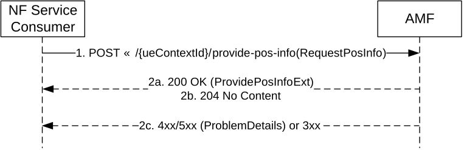
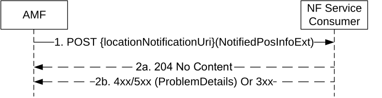
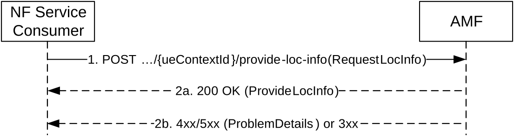
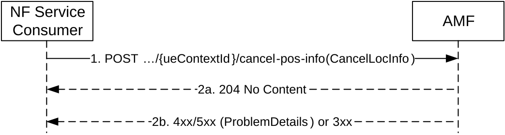

# 5.5 Namf_Location Service

## 5.5.1 Service Description

The Namf_Location service is used by NF service consumers to request the AMF for initiating positioning requests and provide the location information. It is also used to subsequently notify the location change events towards the NF service consumers. The following are the key functionalities of this NF service:

\- Allow NFs to request the current geodetic and optionally local and/or civic location of a target UE.

\- Allow NFs to be notified of event information related to emergency sessions.

\- Allow NFs to request Network Provided Location Information (NPLI) and/or local time zone corresponding to the location of a target UE.

\- Allow NFs to request the ranging and sidelink positioning location results for a group of n UEs (n≥2), the ranging and sidelink positioning location results may include absolute locations, relative locations or distance and directions related to the UEs.

> \- Allow NFs to enable the location reporting over user plane.

## 5.5.2 Service Operations

### 5.5.2.1 Introduction

For the Namf_Location Service the following service operations are defined:

\- ProvidePositioningInfo;

\- EventNotify; and

\- ProvideLocationInfo.

\- CancelLocation

### 5.5.2.2 ProvidePositioningInfo

#### 5.5.2.2.1 General

The ProvidePositioningInfo service operation is used in the following procedure:

\- 5GC-MT-LR Procedure without UDM Query (see TS 23.273 \[42\], clause 6.10.2)

\- 5GC-MT-LR Procedure (see TS 23.273 \[42\], clause 6.1)

\- Initiation and Reporting of Location Events (see TS 23.273 \[42\], clause 6.3.1)

\- Location Continuity for Handover of an Emergency session from NG-RAN (see TS 23.273 \[42\], clause 6.10.3)

\- 5GC-MT-LR multiple location procedure without UDM Query (see TS 23.273 \[42\], clause 6.10.4)

\- Procedures of SL-MT-LR involving LMF (see TS 23.273 \[42\], clause 6.20.3)

\- Procedures of SL-MT-LR for periodic, triggered Location Events (see TS 23.273 \[42\], clause 6.20.4)

\- 5GC-MT-LR Procedure using SL positioning (see TS 23.273 \[42\], clause 6.20.5)

The ProvidePositioningInfo service operation shall be invoked by the NF Service Consumer (e.g. GMLC) to request the current or deferred geodetic and optionally local and/or civic location of the UE. The service operation triggers the AMF to invoke the service towards the LMF.

The NF Service Consumer shall invoke the service operation by sending POST to the URI of the "provide-pos-info" custom operation on the "Individual UE Context" resource (See clause 6.4.3.2.4.2). See also figure 5.5.2.2.1-1.

Figure 5.5.2.2.1-1: NF Service Consumer requests the positioning information of the UE

1\. The NF Service Consumer shall send a POST request to the resource URI of "provide-pos-info" custom operation of the "Individual UE context" resource of the AMF. The content of the POST request may contain:

\- an indication of a positioning request from emergency services or commercial services client,

\- the required location QoS, and additionally the mapped location QoS applicable to EPS if multiple location QoS is required,

\- Supported GAD shapes,

\- scheduled location time,

\- reliable UE Location Request,

\- UE unaware indication,

\- the LMF ID that should be used for selecting the LMF,

\- the reporting indication,

\- the integrity requirements

\- the requested ranging_SL location results, including absolute locations, relative locations or distances and directions related to the UEs for ranging and sidelink positioning, and/or

\- the information of the related UEs, including application layer ID(s) and the related UE type for each related UE for ranging and sidelink positioning.

If the NF service consumer wants the location change information or deferred location information to be notified (e.g. during a handover procedure or for activation or completion of deferred location), it also provides a callback URI on which the EventNotify service operation is executed (see clause 5.5.2.3).

During 5GC-MT-LR multiple location procedure for regulatory location service, the request body may also include the indication of acceptance for intermediate response and the maximum response time, the GMLC callback address and the LIR reference number.

2a. On success, "200 OK" shall be returned. The content may contain the LCS correlation identifier, the location estimate, its age and accuracy, the information about the positioning method. If the request is invoked during a handover the response body shall also include the target AMF node identifier as specified in clause 6.10.3 of TS 23.273 \[42\].

If the location determination will be sent by LMF to GMLC directly, the content shall include the directReportInd and supportedFeatures attributes.

2b. On accept, "204 No Content" shall be returned to acknowledge that AMF supports a deferred location request and a deferred location is accepted as specified in step 6 of clause 6.3.1 of TS 23.273 \[42\];

2c. On failure or redirection, one of the HTTP status code listed in Table 6.4.3.2.4.2.2-2 shall be returned. For a 4xx/5xx response, the message body shall contain a ProblemDetails structure with the "cause" attribute set to one of the application error listed in Table 6.4.3.2.4.2.2-2.

If the AMF received the LMF ID from the NF service consumer and the AMF does not find an LMF with the LMF ID received from GMLC, the AMF should return a 403 Forbidden response with the cause attribute set to "REQUESTED_LMF_NOT_AVAILABLE" to the NF service consumer, if no other LMF is configured as backup selection. Otherwise, the ProblemDetails structure with the "cause" attribute set to one of the application errors listed in Table 6.4.3.2.4.2.2-2 shall be applied.

### 5.5.2.3 EventNotify

#### 5.5.2.3.1 General

The EventNotify service operation is used in the following procedure:

\- 5GC-NI-LR Procedure (see TS 23.273 \[42\], clause 6.10.1)

\- Location Continuity for Handover of an Emergency session from NG-RAN (see TS 23.273 \[42\], clause 6.10.3)

\- Completion of a deferred location for the UE available event or activation of deferred location for periodic location, area event triggered location or motion event triggered location (see TS 23.273 \[42\], clause 6.3.1)

The EventNotify service operation notifies the NF Service Consumer (i.e. GMLC) about the UE location related event information related to regulatory servicese.g. the initiation, handover or termination of an emergency session. The notification is delivered to:

\- the callback URI registered in the NRF, if the GMLC registered to the NRF with notification endpoints for location notifications (see clauses 6.1.6.2.4 and 6.1.6.3.4 of TS 29.510 \[29\]); or

\- GMLC URI locally provisioned in the AMF.

The EventNotify service operation notifies the NF Service Consumer (i.e. GMLC) about the UE location related event information related to deferred location request, i.e. the activation of deferred location request or the delivery of event reports. The notification is delivered to:

\- the callback URI received from the GMLC during an earlier ProvidePositioningInfo service operation;

NOTE: During a handover procedure, both the source AMF and the target AMF can invoke the EventNotify service operation, based on the local configuration.

The operation is invoked by issuing a POST request to the callback URI of the NF Service Consumer (See clause 6.4.5.2.2). See also figure 5.5.2.3.1-1.

Figure 5.5.2.3.1-1: UE Location Notification

1\. The AMF shall send a POST request to the callback URI provided by the NF service consumer determined as described above. The request body shall include the type of location related event and UE Identification (SUPI or PEI), and may include the GPSI, Geodetic Location, Local Location, Civic Location, MSC server identity, the Position methods used or a serving LMF identification for activation of periodic or triggered location.

2a. On success, "204 No content" shall be returned by the NF Service Consumer.

2b. On failure or redirection, the appropriate HTTP status code (e.g. "403 Forbidden") indicating the error shall be returned and appropriate additional error information should be returned.

### 5.5.2.4 ProvideLocationInfo

#### 5.5.2.4.1 General

The ProvideLocationInfo service operation allows an NF Service Consumer (e.g. UDM) to request the Network Provided Location Information (NPLI) of a target UE.

The NF Service Consumer shall invoke the service operation by sending POST request to the URI of the "provide-loc-info" custom operation on the "Individual UE Context" resource (see clause 6.4.3.2.4.3), as shown in figure 5.5.2.4.1-1.

Figure 5.5.2.4.1-1: NF Service Consumer requests the Location Information of the UE

1\. The NF Service Consumer shall send a POST request to the resource URI of "provide-loc-info" custom operation of the "Individual UE context" resource on the AMF. The content of the POST request shall contain a "requestLocInfo" data structure indicating the desired type of location information.

If the NF Service Consumer desires the current location information of the target UE, it shall set "reqCurrentLoc" attribute to "true".

2a. On success, "200 OK" response shall be returned. The content of the response shall contain a "ProvideLocInfo" data structure including the Network Provide Location Information (NPLI) of the target UE.

If "reqCurrentLoc" attribute is set to "true" and the UE is in RM-REGISTERED and CM-IDLE state over 3GPP access, the AMF shall initiate a paging procedure to the UE. If the paging procedure is successful, the AMF shall return the current location information and set "currentLoc" attribute to "true" in the response; if the UE does not respond to the paging, the AMF shall provide the last known location and set "currentLoc" attribute to "false" in the response.

If "reqCurrentLoc" attribute is set to "true" and the UE is in RM-REGISTERED and CM-CONNECTED state over 3GPP access, the AMF shall follow NG-RAN Location reporting procedure, as specified in clause 4.10 of TS 23.502 \[3\], to trigger a single standalone report by setting "direct" event type in Location Reporting Control message. If NG-RAN reports current location of the UE, the AMF shall set "currentLoc" attribute to "true" in the response; if NG-RAN reports last known location of the UE with timestamp, the AMF shall set "currentLoc" attribute to "false" in the response.

If the UE is in RM-REGISTERED over non-3GPP access, the AMF shall include the latest non-3GPP access location information.

2b. On failure or redirection, one of the HTTP status code listed in table 6.4.3.2.4.3.2-2 shall be returned. For a 4xx/5xx response, the message body shall contain a ProblemDetails structure with the "cause" attribute set to one of the application error listed in table 6.4.3.2.4.3.2-2.

### 5.5.2.5 CancelLocation

#### 5.5.2.5.1 General

This service operation is used in the following procedure:

\- Cancellation of Reporting of Location Events by an AF or External LCS Client (see TS 23.273 \[42\], clause 6.3.3)

The CancelLocation service operation shall be invoked by the NF Service Consumer (e.g. GMLC) to cancel reporting periodic or events triggered location.

The NF Service Consumer shall invoke the service operation by sending a POST request to the URI of the "cancel-pos-info" custom operation on the "Individual UE Context" resource (See clause 6.4.3.2.4.4). See also figure 5.5.2.5.1-1.

Figure 5.5.2.5.1-1: Cancellation of reporting periodic or events triggered location of the UE

1\. The NF Service Consumer shall send a POST request to the resource URI of "cancel-pos-info" custom operation of the "Individual UE context" resource of the AMF. The content of the POST request shall contain a "CancelLocInfo" data structure indicating the desired cancellation of reporting periodic or events triggered location of the UE.

2a. On success, AMF responds with "204 No Content".

2b. On failure or redirection, one of the HTTP status code listed in Table 6.4.3.2.4.4-2 shall be returned. For a 4xx/5xx response, the message body shall contain a ProblemDetails structure with the "cause" attribute set to one of the application errors.
