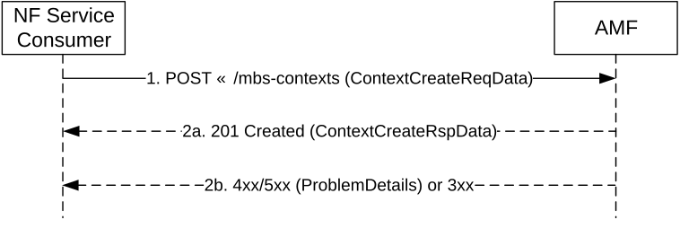
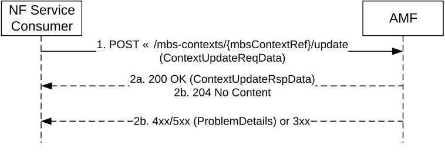
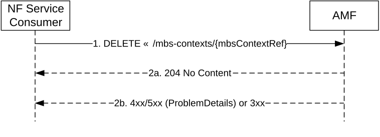
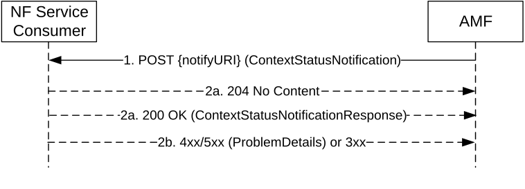

# 5.6 Namf_MBSBroadcast Service

## 5.6.1 Service Description

This service enables the NF Service Consumer (e.g. MB-SMF) to create, update or release a broadcast MBS session context in the AMF and to be notified about status change of the MBS broadcast context.

## 5.6.2 Service Operations

### 5.6.2.1 Introduction

The Namf_MBSBroadcast service supports following service operations:

\- ContextCreate

\- ContextUpdate

\- ContextRelease

\- ContextStatusNotify

### 5.6.2.2 ContextCreate

The ContextCreate service operation shall be used by the NF Service Consumer (e.g. MB-SMF) to request the AMF to create a broadcast MBS session context.

NOTE: For a location dependent MBS service, one single ContextCreate service operation is performed per MBS session (for a given AMF).

It is used in the following procedures:

\- MBS Session Start for Broadcast (see clause 7.3.1 of TS 23.247 \[55\]);

\- MBS Session Update for Broadcast (see clause 7.3.3 of TS 23.247 \[55\]);

\- Support for Local Broadcast Service (see clause 7.3.4 of TS 23.247 \[55\]).

There shall be only one broadcast MBS session context per MBS session, or per MBS session and Area Session ID for an MBS session with Location dependent Broadcast service.

The NF Service Consumer (e.g. MB-SMF) shall create a broadcast MBS session context by using the HTTP POST method as shown in Figure 5.6.2.2-1.

Figure 5.6.2.2-1: Broadcast MBS session context creation

1\. The NF Service Consumer shall send a POST request targeting the Broadcast MBS session contexts collection resource of the AMF. The content of the POST request shall contain the following information:

\- MBS Session ID (i.e. TMGI, or TMGI and NID for an MBS session in an SNPN);

\- list of Area Session ID and related MBS service area, for a Location dependent broadcast MBS service;

\- MBS service area, for a Local broadcast MBS session;

\- N2 MBS Session Management container (see MBS Session Setup or Modification Request Transfer IE in TS 38.413 \[12\]);

\- Notification URI where to be notified about the status change of the broadcast MBS session context; and

\- SNSSAI.

The NF Service Consumer may also include the maxResponseTime IE in the request to indicate the maximum response time to receive information about the completion of the Broadcast MBS session establishment.

The NF Service Consumer may also include the MB-SMF instance ID and MB-SMF service instance ID to enable the AMF subscribing to the MB-SMF status notifications.

The NF Service Consumer may also include the MBS associated session ID to enable NG-RAN to identify the multiple MBS sessions delivering the same content when AF creates multiple broadcast MBS Sessions via different Core Networks to deliver the same content.

2a. On success, "201 Created" shall be returned. The AMF should respond success when it receives the first successful response from the NG-RAN(s). The 201 Created response shall contain MBS session identifier and may contain one or more N2 MBS Session Management containers, if additional information (e.g. MBS Session Setup or Modification Response Transfer IE or MBS Session Setup or Modification Failure Transfer IE in TS 38.413 \[12\]) needs to be transferred to the MB-SMF. If the AMF received the NG-RAN responses from all involved NG-RAN(s), e.g. if the broadcast MBS session involves only one NG-RAN, the AMF shall include an indication of completion of the operation in all NG-RANs in the 201 Created response.

> Upon receipt of subsequent responses from other NG-RANs after sending the 201 Created response, if additional information (e.g. MBS Session Setup or Modification Response Transfer IE or MBS Session Setup or Modification Failure Transfer IE in TS 38.413 \[12\]) needs to be transferred to the MB-SMF, the AMF shall transfer such information by sending one or more Namf_MBSBroadcast_ContextStatusNotify requests to the MB-SMF. A Namf_MBSBroadcast_ContextStatusNotify request may include a list of N2 MBS Session Management containers received from different NG-RANs. When the AMF receives the response from all NG-RANs, the AMF shall include an indication of the completion of the operation in the Namf_MBSBroadcast_ContextStatusNotify request.
>
> If the AMF does not receive responses from all NG-RAN nodes before the maximum response time elapses since the reception of the Namf_MBSBroadcast_ContextCreate Request, then the AMF should send one Namf_MBSBroadcast_ContextStatusNotify request indicating the incompletion of the Broadcast MBS session establishment.
>
> For each N2 MBS Session Management container sent towards the MB-SMF, the AMF shall insert the identifier of the NG-RAN node that generated it in the corresponding entry of the n2MbsSmInfoList attribute.
>
> The AMF may send one or more Namf_MBSBroadcast_ContextStatusNotify request including an operationEvents attribute to report the MB-SMF about failure to reach one or more NG-RANs.

2b. On failure or redirection, one of the HTTP status code listed in Table 6.5.3.2.3.1-3 shall be returned. For a 4xx/5xx response, the message body may contain a ProblemDetails structure with the "cause" attribute set to one of the application errors listed in Table 6.5.3.2.3.1-3.

### 5.6.2.3 ContextUpdate

The ContextUpdate service operation shall be used by the NF Service Consumer (e.g. MB-SMF) to request the AMF to update a broadcast MBS session context.

It is used in the following procedures:

\- MBS Session Update for Broadcast (see clause 7.3.3 of TS 23.247 \[55\]).

\- Broadcast MBS session restoration by MB-SMF (see clause 8.3.2.3 of TS 23.527 \[33\].

\- Selecting an alternative AMF for a Broadcast MBS Session at AMF failure (see clause 8.3.2.4 of TS 23.527 \[33\]).

The NF Service Consumer (e.g. MB-SMF) shall update a broadcast MBS session context by using the HTTP POST method as shown in Figure 5.6.2.3-1.

Figure 5.6.2.3-1: Broadcast MBS session context update

1\. The NF Service Consumer shall send a POST request targeting the individual Broadcast MBS session context resource to be updated in the AMF. The content of the POST request may contain the following information:

\- N2 MBS Session Management container (see MBS Session Setup or Modification Request Transfer IE in TS 38.413 \[12\]);

\- Notification URI, if the NF Service Consumer wishes to modify the notification URI where to be notified about the status change of the broadcast MBS session context;

\- updated MBS service area, for a Local broadcast MBS session;

\- updated list of Area Session ID and related MBS service area, for a Location dependent broadcast MBS session.

\- the n2MbsInfoChangeInd IE set to "true" or "false" to indicate to the AMF whether the information within the N2 MBS Session Management container has changed or not for the MBS session

The NF Service Consumer may also include the maxResponseTime IE in the request to indicate the maximum response time to receive information about the completion of the Broadcast MBS session update.

During a broadcast MBS session restoration procedure for an NG-RAN failure with restart, the MB-SMF may include one or more ranIds attibutes to request the AMF to setup the Broadcast MBS session in a list of NG-RANs as identified by the NG-RAN ID(s), as specified in clause 8.3.2.3 of TS 23.527 \[33\].

During a restoration procedure upon an AMF failure without restart, for an AMF deployed in an AMF set, the MB-SMF may set the noNgapSignallingInd IE to "true" when the MB-SMF detects the original AMF has failed and then selects an alternative AMF to take over the MBS session but without a need to trigger any NGAP signalling towards NG-RANs, as specified in clause 8.3.2.4 of TS 23.527 \[33\].

2a. On success, "200 OK" shall be returned if additional information needs to be returned in the response. The 200 OK response may contain one or more N2 MBS Session Management containers, if such information (e.g. MBS Session Setup or Modification Response Transfer IE, MBS Session Setup or Modification Failure Transfer IE or MBS Session Release Response Transfer IE in TS 38.413 \[12\]) needs to be transferred to the MB-SMF. If the AMF received the NG-RAN responses from all involved NG-RAN(s), the AMF shall include an indication of completion of the operation in all NG-RANs.

2b. On success, "204 No Content" shall be returned if no additional information needs to be returned in the response.

> In both 2a and 2b cases, upon receipt of subsequent responses from other NG-RANs after sending the 200 OK response or the 204 No Content response, if additional information (e.g. MBS Session Setup or Modification Response Transfer IE MBS Session Setup or Modification Failure Transfer IE or MBS Session Release Response Transfer IE in TS 38.413 \[12\]) needs to be transferred to the MB-SMF, the AMF shall transfer such information by sending one or more Namf_MBSBroadcast_ContextStatusNotify requests to the MB-SMF. A Namf_MBSBroadcast_ContextStatusNotify request may include a list of N2 MBS Session Management containers received from different NG-RANs. When the AMF receives the response from all NG-RANs, the AMF shall include an indication of the completion of the operation in the Namf_MBSBroadcast_ContextStatusNotify request.
>
> If the AMF does not receive responses from all NG-RAN nodes before the maximum response time elapses since the reception of the Namf_MBSBroadcast_ContextUpdate Request, then the AMF should send one Namf_MBSBroadcast_ContextStatusNotify request indicating the incompletion of the Broadcast MBS session update.
>
> If the n2MbsInfoChangeInd IE is present in the request and set to "false", the AMF does not need to contact NG-RAN nodes unaffected by the MBS service area change.
>
> For each N2 MBS Session Management container sent towards the MB-SMF, the AMF shall insert the identifier of the NG-RAN node that generated it in the corresponding entry of the n2MbsSmInfoList attribute.
>
> The AMF may send one or more Namf_MBSBroadcast_ContextStatusNotify request including an operationEvents attribute to report the MB-SMF about failure to reach one or more NG-RANs.

2c. On failure or redirection, one of the HTTP status code listed in Table 6.5.3.2.4.2.2-2 shall be returned. For a 4xx/5xx response, the message body may contain a ProblemDetails structure with the "cause" attribute set to one of the application errors listed in Table 6.5.3.2.4.2.2-2.

### 5.6.2.4 ContextRelease

The ContextRelease service operation shall be used by the NF Service Consumer (e.g. MB-SMF) to request the AMF to release a broadcast MBS session context.

It is used in the following procedures:

\- MBS Session Release for Broadcast (see clause 7.3.2 of TS 23.247 \[55\]).

The NF Service Consumer (e.g. MB-SMF) shall release a broadcast MBS session context by using the HTTP DELETE method as shown in Figure 5.6.2.4-1.

Figure 5.6.2.4-1: Broadcast MBS session context release

1\. The NF Service Consumer shall send a DELETE request targeting the individual Broadcast MBS session context resource to be released in the AMF.

2a. On success, "204 No Content" shall be returned.

2b. On failure or redirection, one of the HTTP status code listed in Table 6.5.3.3.3.1-3 shall be returned. For a 4xx/5xx response, the message body may contain a ProblemDetails structure with the "cause" attribute set to one of the application errors listed in Table 6.5.3.3.3.1-3.

The AMF may send one or more Namf_MBSBroadcast_ContextStatusNotify request including an operationEvents attribute to report the MB-SMF about failure to reach one or more NG-RANs.

### 5.6.2.5 ContextStatusNotify

The ContextStatusNotify service operation shall be used by the AMF to notify status change of a broadcast MBS session context to the NF Service Consumer (e.g. MB-SMF).

It is used in the following procedures:

\- MBS Session Start for Broadcast (see clause 7.3.1 of TS 23.247 \[55\]);

\- MBS Session Update for Broadcast (see clause 7.3.3 of TS 23.247 \[55\]);

\- Broadcast MBS Session Release Require (see clause 7.3.6 of TS 23.247 \[55\]).

\- Broadcast MBS session restoration by MB-SMF (see clause 8.3.2.3 of TS 23.527 \[33\]).

\- Selecting an alternative AMF for a Broadcast MBS Session at AMF failure (see clause 8.3.2.4 of TS 23.527 \[33\]).

\- Transport change for resource sharing across broadcast MBS Sessions in network sharing (see clause 7.3.7 of TS 23.247 \[55\]).

The AMF shall notify status change of a broadcast MBS session context to the NF Service Consumer (e.g. MB-SMF) by using the HTTP POST method as shown in Figure 5.6.2.5-1.

Figure 5.6.2.5-1: Broadcast MBS session context status change notification

1\. The AMF shall send a POST request targeting the notification URI received from the NF Service Consumer. The content of the POST request shall contain the following information:

\- MBS Session ID (i.e. TMGI, or TMGI and NID for an MBS session in an SNPN);

\- Area Session ID, if this is a Location dependent broadcast MBS service;

\- one or more N2 MBS Session Management containers, if N2 MBS Session Management information (e.g. MBS Session Setup or Modification Response Transfer IE, MBS Session Setup or Modification Failure Transfer IE or MBS Session Release Response Transfer IE or Broadcast Session Transport Request Transfer IE in TS 38.413 \[12\]) has been received from one or more NG-RANs that needs to be transferred to the NF Service Consumer; for each N2 MBS Session Management container sent towards the MB-SMF, the AMF shall insert the identifier of the NG-RAN node that generated it in the corresponding entry of the n2MbsSmInfoList attribute.

\- the operationStatus IE indicating the completion of the Broadcast MBS session establishment or update, if the NF Service Consumer has requested to establish or update the Broadcast MBS session context and a response has been received from all NG-RANs; and

\- the operationStatus IE indicating the incompletion of the Broadcast MBS session establishment or update, if the NF Service Consumer has requested to establish or update the Broadcast MBS session context including a maximum response time and the AMF has not received responses from all NG-RANs before the maximum response time elapses.

During a Broadcast MBS Session Release Require procedure (see clause 7.3.6 of TS 23.247 \[55\]), one or more NG-RANs may request the AMF to release the Broadcast MBS session. In this case, based on operator's policy, the AMF may:

\- report the Broadcast MBS Session release to the MB-SMF by including the operationEvent attribute in the MBS Context Status Notification request with the opEventType set to "NG_RAN_EVENT" together with a list of "ngranFailureEvent" for each NG-RAN that requested to release the Broadcast MBS Session. Upon receiving such a notification, per local policies, the MB-SMF may attempt to re-establish the MBS session after some operator configurable time in these NG-RANs by performing the Broadcast MBS session restoration by MB-SMF procedure specified in clause 8.3.2.3 of TS 23.527 \[33\]; or

\- attempt to re-establish the MBS session after some operator configurable time in these NG-RANs by performing the Broadcast MBS session restoration by AMF procedure specified in clause 8.3.2.2 of TS 23.527 \[33\].

If all the NG-RANs serving the Broadcast MBS session requested the AMF to release the Broadcast MBS session, the AMF shall release the Broadcast MBS session context and send a notification with the releaseInd attribute set to true to report to the MB-SMF that the Broadcast MBS session (context) is released at the AMF and NG-RANs.

The AMF may include an operationEvents attribute in the MBS Context Status Notification request to report the MB-SMF:

\- a NG-RAN failure event, e.g. the NG-RAN failure with or without restart, as specified in clause 8.3.2.3 of TS 23.527 \[33\]);

\- that a new AMF has taken over the control of the broadcast MBS session upon an AMF failure as specified in clause 8.3.2.4 of TS 23.527 \[33\]).

2a. On success, if the ContextStatusNotification does not contain a N2 MBS Session Management container with a Broadcast Session Transport Request Transfer IE, the NF Service Consumer shall return a "204 No Content" response.

If the ContextStatusNotification contains one or more N2 MBS Session Management containers encapsulating a Broadcast Session Transport Request Transfer IE, the MB-SMF shall return a "200 OK" with the ContextStatusNotificationResponse containing one or more N2 MBS Session Management containers encapsulating a Broadcast Session Transport Response Transfer IE or a Broadcast Session Transport Failure Transfer IE. For each N2 MBS Session Management container sent towards the AMF, the MB-SMF shall insert the identifier of the NG-RAN node to which the information in the container relates in the corresponding entry of the n2MbsSmInfoList attribute.

2b. On failure or redirection, one of the HTTP status code listed in Table 6.5.5.2.3.1-3 shall be returned. For a 4xx/5xx response, the message body may contain a ProblemDetails attribute with the "cause" attribute set to one of the application errors listed in Table 6.5.5.2.3.1-3.
