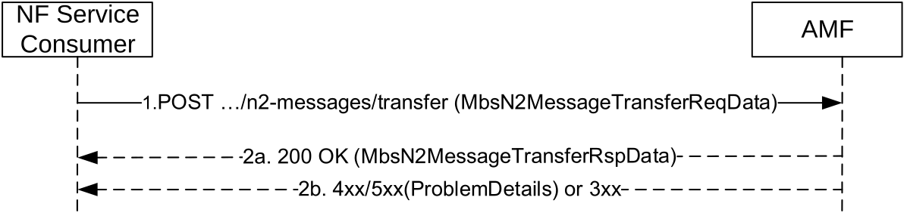
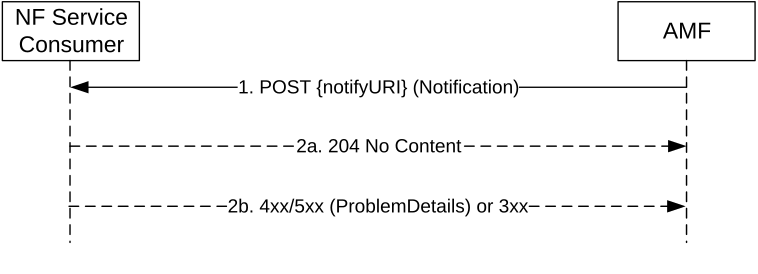

# 5.7 Namf_MBSCommunication Service

## 5.7.1 Service Description

This service enables an NF Service Consumer (e.g. MB-SMF) to request the AMF to transfer MBS multicast related N2 message towards NG-RAN(s) serving a multicast MBS session, during a multicast MBS session activation, deactivation or update.

## 5.7.2 Service Operations

### 5.7.2.1 Introduction

The Namf_MBSCommunication service supports the following service operations:

\- N2MessageTransfer

\- Notify

### 5.7.2.2 N2MessageTransfer

The N2MessageTransfer service operation shall be used by the NF Service Consumer (e.g. MB-SMF) to request the AMF to transfer an MBS related N2 message to the NG-RAN nodes serving the multicast MBS session. It is used during the following procedures:

\- MBS session activation procedure (see clause 7.2.5.2 of TS 23.247 \[55\]);

\- MBS session deactivation procedure (see clause 7.2.5.3 of TS 23.247 \[55\]); and

\- Multicast session update procedure (see clause 7.2.6 of TS 23.247 \[55\]).

The NF Service Consumer shall invoke the service operation by sending a POST request to the URI of the "transfer" custom operation (see clause 6.6.3.1) of the AMF. See Figure 5.7.2.2-1.

Figure 5.7.2.2-1 N2 Message Transfer for a multicast MBS session

1\. The NF Service Consumer shall invoke the custom operation for N2 message transfer by sending a HTTP POST request and the request body shall carry the MbsN2MessageTransferReqData data structure which contains the N2 MBS Session Management information to be transferred. The MbsN2MessageTransferReqData shall contain:

> \- MBS Session ID (i.e. TMGI, or TMGI and NID for an MBS session in an SNPN);

and may also contain:

\- the Area Session ID, if this is a location dependent multicast MBS session; and/or

\- if the NF service consumer and the AMF support the RAN-ID-LIST feature (see clause 6.6.8):

\- the list of NG RAN node IDs towards which the MBS related N2 message is requested to be distributed;

\- a notification URI where to be notified about any failure of the MBS related N2 procedure for an NG RAN node in this list; and

\- an optional notification correlation ID to be sent within notifications.

If the AMF supports the RAN-ID-LIST feature, the AMF shall distribute the MBS related N2 message to the list of NG-RAN nodes indicated by the MB-SMF, if any, otherwise to the list of NG-RAN nodes having established shared delivery that the AMF stores locally, if any.

NOTE: An AMF which does not support the the RAN-ID-LIST feature distributes the MBS related N2 message to the list of NG-RAN nodes having established shared delivery that the AMF stores locally.

2a. On success, the AMF shall respond with a "200 OK" status code with MbsN2MessageTransferRspData data structure. The AMF should respond success when it receives the first successful response from the NG-RAN(s).

If the AMF supports the RAN-ID-LIST feature (see clause 6.6.8), and if the request included a list of NG RAN node IDs and a notification URI where to be notified about failures, the AMF shall report failure(s) of the N2 MBS related N2 procedure with an NG RAN node in this list by including the failureList IE in the "200 OK" response or in a subsequent Notify request towards the notification URI received in the request. See clause 8.4.1.2 of TS 23.527 \[33\].

2b. On failure or redirection, one of the HTTP status code listed in Table 6.6.3.1.4.2.2-2 shall be returned. For a 4xx/5xx response, the message body may contain a ProblemDetails attribute with the "cause" attribute set to one of the application errors listed in Table 6.6.4.2.2-2 if any.

### 5.7.2.3 Notify

The Notify service operation shall be used by the AMF to notify the NF Service Consumer about a failure of an MBS related N2 procedure with an NG RAN node (see clause 5.7.2.2).

It is used in the following procedure:

\- N2 MBS session request distribution with list of NG RAN Node IDs provided by MB-SMF to AMF (see clause 8.4.1.2 of TS 23.527 \[33\]).

The AMF shall notify a failure of an MBS related N2 procedure with an NG RAN node to the NF Service Consumer (e.g. MB-SMF) by using the HTTP POST method as shown in Figure 5.7.2.3-1.

Figure 5.7.2.3-1: Notification

1\. The AMF shall send a POST request targeting the notification URI received from the NF Service Consumer. The content of the POST request shall contain the following information:

\- MBS Session ID (i.e. TMGI, or TMGI and NID for an MBS session in an SNPN);

\- the Area Session ID, if this is a location dependent multicast MBS session; and

\- one or more failures including, for each failure, the related NG-RAN Node ID and failure cause.

\- a notification correlation ID if it is received in the N2MessageTransfer request.

2a. On success, the NF Service Consumer shall return a "204 No Content" response.

2b. On failure or redirection, one of the HTTP status code listed in Table 6.6.5.2.3.1-3 shall be returned. For a 4xx/5xx response, the message body may contain a ProblemDetails attribute with the "cause" attribute set to one of the application errors listed in Table 6.6.5.2.3.1-3.
