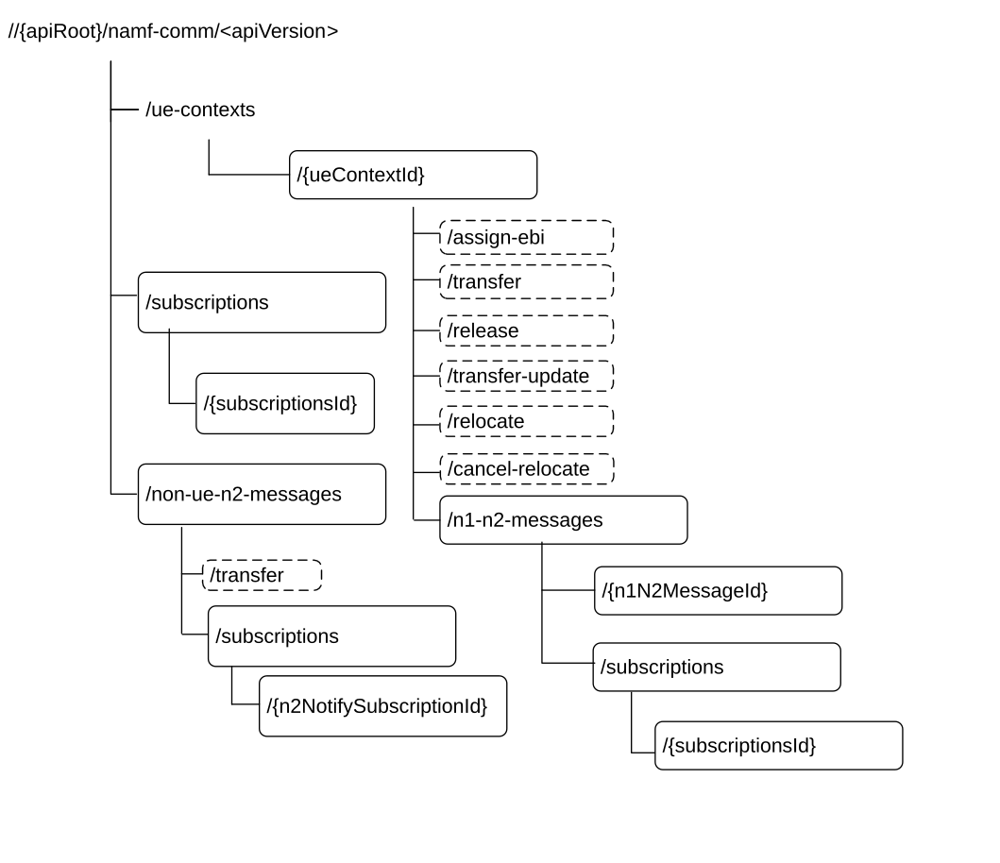

# 6.1.3.1 Overview

Figure 6.1.3.1-1: Resource URI structure of the Namf_Communication API

Table 6.1.3.1-1 provides an overview of the resources and applicable HTTP methods.

Table 6.1.3.1-1: Resources and methods overview

<table>
<colgroup>
<col style="width: 13%" />
<col style="width: 50%" />
<col style="width: 9%" />
<col style="width: 27%" />
</colgroup>
<thead>
<tr class="header">
<th>Resource name</th>
<th>Resource URI</th>
<th>HTTP method or custom operation</th>
<th>
Description

(Mapped Service Operations)
</th>
</tr>
</thead>
<tbody>
<tr class="odd">
<td rowspan="8">Individual ueContext</td>
<td rowspan="2">/ue-contexts/{ueContextId}</td>
<td></td>
<td></td>
</tr>
<tr class="even">
<td>PUT</td>
<td>CreateUEContext</td>
</tr>
<tr class="odd">
<td>/ue-contexts/{ueContextId}/release</td>
<td>release 
(POST)</td>
<td>ReleaseUEContext</td>
</tr>
<tr class="even">
<td>/ue-contexts/{ueContextId}/assign-ebi</td>
<td>assign-ebi 
(POST)</td>
<td>EBIAssignment</td>
</tr>
<tr class="odd">
<td>/ue-contexts/{ueContextId}/transfer</td>
<td>transfer 
(POST)</td>
<td>UEContextTransfer</td>
</tr>
<tr class="even">
<td>/ue-contexts/{ueContextId}/transfer-update</td>
<td>transfer-update 
(POST)</td>
<td>RegistrationStatusUpdate</td>
</tr>
<tr class="odd">
<td>/ue-contexts/{ueContextId}/relocate</td>
<td>relocate 
(POST)</td>
<td>RelocateUEContext</td>
</tr>
<tr class="even">
<td>/ue-contexts/{ueContextId}/cancel-relocate</td>
<td>cancel-relocate 
(POST)</td>
<td>CancelRelocateUEContext</td>
</tr>
<tr class="odd">
<td>n1N2Message collection</td>
<td>/ue-contexts/{ueContextId}/n1-n2-messages</td>
<td>POST</td>
<td>N1N2MessageTransfer</td>
</tr>
<tr class="even">
<td>N1N2 Subscriptions Collection for Individual UE Contexts</td>
<td>/ue-contexts/{ueContextId}/n1-n2-messages/subscriptions</td>
<td>POST</td>
<td>N1N2MessageSubscribe</td>
</tr>
<tr class="odd">
<td>N1N2 Individual Subscription</td>
<td>/ue-contexts/{ueContextId}/n1-n2-messages/subscriptions/{subscriptionId}</td>
<td>DELETE</td>
<td>N1N2MessageUnSubscribe</td>
</tr>
<tr class="even">
<td>
subscriptions

collection
</td>
<td>/subscriptions</td>
<td>POST</td>
<td>AMFStatusChangeSubscribe</td>
</tr>
<tr class="odd">
<td rowspan="2">
individual

subscription
</td>
<td rowspan="2">/subscriptions/{subscriptionId}</td>
<td>PUT</td>
<td>AMFStatusChangeSubscribe</td>
</tr>
<tr class="even">
<td>DELETE</td>
<td>AMFStatusChangeUnSubscribe</td>
</tr>
<tr class="odd">
<td>Non UE N2Messages collection</td>
<td>/non-ue-n2-messages/transfer</td>
<td>transfer 
(POST)</td>
<td>NonUEN2MessageTransfer</td>
</tr>
<tr class="even">
<td>Non UE N2Messages Subscriptions collection</td>
<td>/non-ue-n2-messages/subscriptions</td>
<td>POST</td>
<td>NonUEN2InfoSubscribe</td>
</tr>
<tr class="odd">
<td>Non UE N2 Message Notification Individual Subscription</td>
<td>/non-ue-n2-messages/subscriptions/{n2NotifySubscriptionId}</td>
<td>DELETE</td>
<td>NonUEN2InfoUnsubscribe</td>
</tr>
</tbody>
</table>
