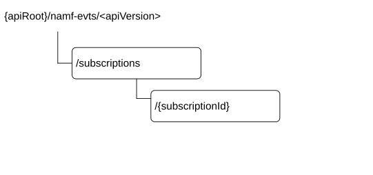

# 6.2.3 Resources

## 6.2.3.1 Overview

Figure 6.2.3.1-1: Resource URI structure of the Namf_EventExposure API

Table 6.2.3.1-1 provides an overview of the resources and applicable HTTP methods.

Table 6.2.3.1-1: Resources and methods overview

| Resource name            | Resource URI      | HTTP method or custom operation | Description                                                              |
|--------------------------|-------------------|---------------------------------|--------------------------------------------------------------------------|
| Subscriptions collection | /subscriptions    | POST                            | Mapped to the service operation Subscribe, when to create a subscription |
| Individual subscription  | /{subscriptionId} | PATCH                           | Mapped to the service operation Subscribe, when to modify                |
|                          |                   | DELETE                          | Mapped to the service operation Unsubscribe                              |

## 6.2.3.2 Resource: Subscriptions collection

### 6.2.3.2.1 Description

This resource represents a collection of subscriptions created by NF service consumers of Namf_EventExposure service.

This resource is modelled as the Collection resource archetype (see clause C.2 of TS 29.501 \[5\]).

### 6.2.3.2.2 Resource Definition

Resource URI: **{apiRoot}/namf-evts/\<apiVersion\>/subscriptions**

This resource shall support the resource URI variables defined in table 6.2.3.2.2-1.

Table 6.2.3.2.2-1: Resource URI variables for this resource

| Name       | Data type | Definition        |
|------------|-----------|-------------------|
| apiRoot    | string    | See clause 6.2.1  |
| apiVersion | string    | See clause 6.2.1. |

### 6.2.3.2.3 Resource Standard Methods

#### 6.2.3.2.3.1 POST

This method shall support the URI query parameters specified in table 6.2.3.2.3.1-1.

Table 6.2.3.2.3.1-1: URI query parameters supported by the POST method on this resource

| Name | Data type | P   | Cardinality | Description |
|------|-----------|-----|-------------|-------------|
| n/a  |           |     |             |             |

This method shall support the request data structures specified in table 6.2.3.2.3.1-2 and the response data structures and response codes specified in table 6.2.3.2.3.1-3.

Table 6.2.3.2.3.1-2: Data structures supported by the POST Request Body on this resource

| Data type                  | P   | Cardinality | Description                                          |
|----------------------------|-----|-------------|------------------------------------------------------|
| AmfCreateEventSubscription | M   | 1           | Describes of an AMF Event Subscription to be created |

Table 6.2.3.2.3.1-3: Data structures supported by the POST Response Body on this resource

<table>
<colgroup>
<col style="width: 29%" />
<col style="width: 2%" />
<col style="width: 11%" />
<col style="width: 14%" />
<col style="width: 42%" />
</colgroup>
<thead>
<tr class="header">
<th>Data type</th>
<th>P</th>
<th>Cardinality</th>
<th>
Response

codes
</th>
<th>Description</th>
</tr>
</thead>
<tbody>
<tr class="odd">
<td>AmfCreatedEventSubscription</td>
<td>M</td>
<td>1</td>
<td>201 Created</td>
<td>Represents successful creation of an AMF Event Subscription</td>
</tr>
<tr class="even">
<td>RedirectResponse</td>
<td>O</td>
<td>0..1</td>
<td>307 Temporary Redirect</td>
<td>
Temporary redirection.

(NOTE 2)
</td>
</tr>
<tr class="odd">
<td>RedirectResponse</td>
<td>O</td>
<td>0..1</td>
<td>308 Permanent Redirect</td>
<td>
Permanent redirection.

(NOTE 2)
</td>
</tr>
<tr class="even">
<td>ProblemDetails</td>
<td>O</td>
<td>0..1</td>
<td>403 Forbidden</td>
<td>
Indicates the creation of subscription has failed due to application error.

The "cause" attribute may be used to indicate one of the following application errors:

<blockquote>

- UE_NOT_SERVED_BY_AMF (for a subscription targeting a specific UE)

- MUTING_EXC_INSTR_NOT_ACCEPTED

</blockquote></td>
</tr>
<tr class="odd">
<td>ProblemDetails</td>
<td>O</td>
<td>0..1</td>
<td>501 Not Implemented</td>
<td>
Indicates the creation of subscription has failed due to application error.

The "cause" attribute may be used to indicate one of the following application errors:

- UNSUPPORTED_EVENT_TYPE
</td>
</tr>
<tr class="even">
<td colspan="5">
NOTE 1: The mandatory HTTP error status code for the POST method listed in Table 5.2.7.1-1 of TS 29.500 [4] also apply, with response body containing an object of ProblemDetails data type (see clause 5.2.7 of TS 29.500 [4]).

NOTE 2: RedirectResponse may be inserted by an SCP or SEPP, see clause 6.10.9.1 of TS 29.500 [4].
</td>
</tr>
</tbody>
</table>

Table 6.2.3.2.3.1-4: Headers supported by the 201 Response Code on this resource

|          |           |     |             |                                                                                                                                               |
|----------|-----------|-----|-------------|-----------------------------------------------------------------------------------------------------------------------------------------------|
| Name     | Data type | P   | Cardinality | Description                                                                                                                                   |
| Location | string    | M   | 1           | Contains the URI of the newly created resource, according to the structure: {apiRoot}/namf-evts/\<apiVersion\>/subscriptions/{subscriptionId} |

Table 6.2.3.2.3.1-5: Headers supported by the 307 Response Code on this resource

<table>
<colgroup>
<col style="width: 16%" />
<col style="width: 14%" />
<col style="width: 4%" />
<col style="width: 11%" />
<col style="width: 52%" />
</colgroup>
<tbody>
<tr class="odd">
<td>Name</td>
<td>Data type</td>
<td>P</td>
<td>Cardinality</td>
<td>Description</td>
</tr>
<tr class="even">
<td>Location</td>
<td>string</td>
<td>M</td>
<td>1</td>
<td>
An alternative URI of the resource located on an alternative service instance within the same AMF or AMF (service) set.

For the case when a request is redirected to the same target resource via a different SCP or SEPP, see clause 6.10.9.1 in TS 29.500 [4].
</td>
</tr>
<tr class="odd">
<td>3gpp-Sbi-Target-Nf-Id</td>
<td>string</td>
<td>O</td>
<td>0..1</td>
<td>Identifier of the target NF (service) instance ID towards which the request is redirected</td>
</tr>
</tbody>
</table>

Table 6.2.3.2.3.1-6: Headers supported by the 308 Response Code on this resource

<table>
<colgroup>
<col style="width: 16%" />
<col style="width: 14%" />
<col style="width: 4%" />
<col style="width: 11%" />
<col style="width: 52%" />
</colgroup>
<tbody>
<tr class="odd">
<td>Name</td>
<td>Data type</td>
<td>P</td>
<td>Cardinality</td>
<td>Description</td>
</tr>
<tr class="even">
<td>Location</td>
<td>string</td>
<td>M</td>
<td>1</td>
<td>
An alternative URI of the resource located on an alternative service instance within the same AMF or AMF (service) set.

For the case when a request is redirected to the same target resource via a different SCP or SEPP, see clause 6.10.9.1 in TS 29.500 [4].
</td>
</tr>
<tr class="odd">
<td>3gpp-Sbi-Target-Nf-Id</td>
<td>string</td>
<td>O</td>
<td>0..1</td>
<td>Identifier of the target NF (service) instance ID towards which the request is redirected</td>
</tr>
</tbody>
</table>

### 6.2.3.2.4 Resource Custom Operations

None.

## 6.2.3.3 Resource: Individual subscription

### 6.2.3.3.1 Description

This resource represents an individual of subscription created by NF service consumers of Namf_EventExposure service.

This resource is modelled as the Document resource archetype (see clause C.1 of TS 29.501 \[5\]).

### 6.2.3.3.2 Resource Definition

Resource URI: **{apiRoot}/namf-evts/\<apiVersion\>/subscriptions/{subscriptionId}**

This resource shall support the resource URI variables defined in table 6.2.3.3.2-1.

Table 6.2.3.3.2-1: Resource URI variables for this resource

| Name           | Data type | Definition                                                                     |
|----------------|-----------|--------------------------------------------------------------------------------|
| apiRoot        | string    | See clause 6.2.1                                                               |
| apiVersion     | string    | See clause 6.2.1.                                                              |
| subscriptionId | string    | String identifies an individual subscription to the AMF event exposure service |

### 6.2.3.3.3 Resource Standard Methods

#### 6.2.3.3.3.1 PATCH

This method shall support the URI query parameters specified in table 6.2.3.3.3.1-1.

Table 6.2.3.3.3.1-1: URI query parameters supported by the PATCH method on this resource

| Name | Data type | P   | Cardinality | Description |
|------|-----------|-----|-------------|-------------|
| n/a  |           |     |             |             |

This method shall support the request data structures specified in table 6.2.3.3.3.1-2 and the response data structures and response codes specified in table 6.2.3.3.3.1-3.

Table 6.2.3.3.3.1-2: Data structures supported by the PATCH Request Body on this resource

| Data type                             | P   | Cardinality | Description                                                                                            |
|---------------------------------------|-----|-------------|--------------------------------------------------------------------------------------------------------|
| array(AmfUpdateEventSubscriptionItem) | M   | 1..N        | Document describes the modification(s) to a AMF Event Subscription                                     |
| array(AmfUpdateEventOptionItem)       | M   | 1..1        | Document describing the modification to the event subscription options (e.g subscription expiry time). |

Table 6.2.3.3.3.1-3: Data structures supported by the PATCH Response Body on this resource

<table>
<colgroup>
<col style="width: 21%" />
<col style="width: 5%" />
<col style="width: 12%" />
<col style="width: 12%" />
<col style="width: 47%" />
</colgroup>
<thead>
<tr class="header">
<th>Data type</th>
<th>P</th>
<th>Cardinality</th>
<th>
Response

codes
</th>
<th>Description</th>
</tr>
</thead>
<tbody>
<tr class="odd">
<td>AmfUpdatedEventSubscription</td>
<td>M</td>
<td>1</td>
<td>200 OK</td>
<td>Represents a successful update on AMF Event Subscription</td>
</tr>
<tr class="even">
<td>RedirectResponse</td>
<td>O</td>
<td>0..1</td>
<td>307 Temporary Redirect</td>
<td>
Temporary redirection.

(NOTE 2)
</td>
</tr>
<tr class="odd">
<td>RedirectResponse</td>
<td>O</td>
<td>0..1</td>
<td>308 Permanent Redirect</td>
<td>
Permanent redirection.

(NOTE 2)
</td>
</tr>
<tr class="even">
<td>ProblemDetails</td>
<td>O</td>
<td>0..1</td>
<td>403 Forbidden</td>
<td>
Indicates the modification of subscription has failed due to application error.

The "cause" attribute may be used to indicate one of the following application errors:

<blockquote>

- MUTING_EXC_INSTR_NOT_ACCEPTED

</blockquote></td>
</tr>
<tr class="odd">
<td>ProblemDetails</td>
<td>O</td>
<td>0..1</td>
<td>404 Not Found</td>
<td>
Indicates the modification of subscription has failed due to application error.

The "cause" attribute may be used to indicate one of the following application errors:

<blockquote>

- SUBSCRIPTION_NOT_FOUND

</blockquote></td>
</tr>
<tr class="even">
<td>ProblemDetails</td>
<td>O</td>
<td>0..1</td>
<td>501 Not Implemented</td>
<td>
Indicates the modification of subscription has failed due to application error.

The "cause" attribute may be used to indicate one of the following application errors:

- UNSUPPORTED_EVENT_TYPE
</td>
</tr>
<tr class="odd">
<td colspan="5">
NOTE 1: The mandatory HTTP error status code for the PATCH method listed in Table 5.2.7.1-1 of TS 29.500 [4] also apply, with response body containing an object of ProblemDetails data type (see clause 5.2.7 of TS 29.500 [4]).

NOTE 2: RedirectResponse may be inserted by an SCP or SEPP, see clause 6.10.9.1 of TS 29.500 [4].
</td>
</tr>
</tbody>
</table>

Table 6.2.3.3.3.1-4: Headers supported by the 307 Response Code on this resource

<table>
<colgroup>
<col style="width: 16%" />
<col style="width: 14%" />
<col style="width: 4%" />
<col style="width: 11%" />
<col style="width: 52%" />
</colgroup>
<tbody>
<tr class="odd">
<td>Name</td>
<td>Data type</td>
<td>P</td>
<td>Cardinality</td>
<td>Description</td>
</tr>
<tr class="even">
<td>Location</td>
<td>string</td>
<td>M</td>
<td>1</td>
<td>
An alternative URI of the resource located on an alternative service instance within the same AMF or AMF (service) set.

For the case when a request is redirected to the same target resource via a different SCP or SEPP, see clause 6.10.9.1 in TS 29.500 [4].
</td>
</tr>
<tr class="odd">
<td>3gpp-Sbi-Target-Nf-Id</td>
<td>string</td>
<td>O</td>
<td>0..1</td>
<td>Identifier of the target NF (service) instance ID towards which the request is redirected</td>
</tr>
</tbody>
</table>

Table 6.2.3.3.3.1-5: Headers supported by the 308 Response Code on this resource

<table>
<colgroup>
<col style="width: 16%" />
<col style="width: 14%" />
<col style="width: 4%" />
<col style="width: 11%" />
<col style="width: 52%" />
</colgroup>
<tbody>
<tr class="odd">
<td>Name</td>
<td>Data type</td>
<td>P</td>
<td>Cardinality</td>
<td>Description</td>
</tr>
<tr class="even">
<td>Location</td>
<td>string</td>
<td>M</td>
<td>1</td>
<td>
An alternative URI of the resource located on an alternative service instance within the same AMF or AMF (service) set.

For the case when a request is redirected to the same target resource via a different SCP or SEPP, see clause 6.10.9.1 in TS 29.500 [4].
</td>
</tr>
<tr class="odd">
<td>3gpp-Sbi-Target-Nf-Id</td>
<td>string</td>
<td>O</td>
<td>0..1</td>
<td>Identifier of the target NF (service) instance ID towards which the request is redirected</td>
</tr>
</tbody>
</table>

#### 6.2.3.3.3.2 DELETE

This method shall support the URI query parameters specified in table 6.2.3.3.3.2-1.

Table 6.2.3.3.3.2-1: URI query parameters supported by the DELETE method on this resource

| Name | Data type | P   | Cardinality | Description |
|------|-----------|-----|-------------|-------------|
| n/a  |           |     |             |             |

This method shall support the request data structures specified in table 6.2.3.3.3.2-2 and the response data structures and response codes specified in table 6.2.3.3.3.2-3.

Table 6.2.3.3.3.2-2: Data structures supported by the DELETE Request Body on this resource

| Data type | P   | Cardinality | Description |
|-----------|-----|-------------|-------------|
| n/a       |     |             |             |

Table 6.2.3.3.3.2-3: Data structures supported by the DELETE Response Body on this resource

<table>
<colgroup>
<col style="width: 21%" />
<col style="width: 5%" />
<col style="width: 12%" />
<col style="width: 11%" />
<col style="width: 48%" />
</colgroup>
<thead>
<tr class="header">
<th>Data type</th>
<th>P</th>
<th>Cardinality</th>
<th>
Response

codes
</th>
<th>Description</th>
</tr>
</thead>
<tbody>
<tr class="odd">
<td>n/a</td>
<td></td>
<td></td>
<td>204 No Content</td>
<td></td>
</tr>
<tr class="even">
<td>RedirectResponse</td>
<td>O</td>
<td>0..1</td>
<td>307 Temporary Redirect</td>
<td>
Temporary redirection.

(NOTE 2)
</td>
</tr>
<tr class="odd">
<td>RedirectResponse</td>
<td>O</td>
<td>0..1</td>
<td>308 Permanent Redirect</td>
<td>
Permanent redirection.

(NOTE 2)
</td>
</tr>
<tr class="even">
<td>ProblemDetails</td>
<td>O</td>
<td>0..1</td>
<td>404 Not Found</td>
<td>
Indicates the modification of subscription has failed due to application error.

The "cause" attribute may be used to indicate one of the following application errors:

<blockquote>

- SUBSCRIPTION_NOT_FOUND.

</blockquote></td>
</tr>
<tr class="odd">
<td colspan="5">
NOTE 1: The mandatory HTTP error status code for the DELETE method listed in Table 5.2.7.1-1 of TS 29.500 [4] also apply, with response body containing an object of ProblemDetails data type (see clause 5.2.7 of TS 29.500 [4]).

NOTE 2: RedirectResponse may be inserted by an SCP or SEPP, see clause 6.10.9.1 of TS 29.500 [4].
</td>
</tr>
</tbody>
</table>

Table 6.2.3.3.3.2-4: Headers supported by the 307 Response Code on this resource

<table>
<colgroup>
<col style="width: 16%" />
<col style="width: 14%" />
<col style="width: 4%" />
<col style="width: 11%" />
<col style="width: 52%" />
</colgroup>
<tbody>
<tr class="odd">
<td>Name</td>
<td>Data type</td>
<td>P</td>
<td>Cardinality</td>
<td>Description</td>
</tr>
<tr class="even">
<td>Location</td>
<td>string</td>
<td>M</td>
<td>1</td>
<td>
An alternative URI of the resource located on an alternative service instance within the same AMF or AMF (service) set.

For the case when a request is redirected to the same target resource via a different SCP or SEPP, see clause 6.10.9.1 in TS 29.500 [4].
</td>
</tr>
<tr class="odd">
<td>3gpp-Sbi-Target-Nf-Id</td>
<td>string</td>
<td>O</td>
<td>0..1</td>
<td>Identifier of the target NF (service) instance ID towards which the request is redirected</td>
</tr>
</tbody>
</table>

Table 6.2.3.3.3.2-5: Headers supported by the 308 Response Code on this resource

<table>
<colgroup>
<col style="width: 16%" />
<col style="width: 14%" />
<col style="width: 4%" />
<col style="width: 11%" />
<col style="width: 52%" />
</colgroup>
<tbody>
<tr class="odd">
<td>Name</td>
<td>Data type</td>
<td>P</td>
<td>Cardinality</td>
<td>Description</td>
</tr>
<tr class="even">
<td>Location</td>
<td>string</td>
<td>M</td>
<td>1</td>
<td>
An alternative URI of the resource located on an alternative service instance within the same AMF or AMF (service) set.

For the case when a request is redirected to the same target resource via a different SCP or SEPP, see clause 6.10.9.1 in TS 29.500 [4].
</td>
</tr>
<tr class="odd">
<td>3gpp-Sbi-Target-Nf-Id</td>
<td>string</td>
<td>O</td>
<td>0..1</td>
<td>Identifier of the target NF (service) instance ID towards which the request is redirected</td>
</tr>
</tbody>
</table>

### 6.2.3.3.4 Resource Custom Operations

None.
