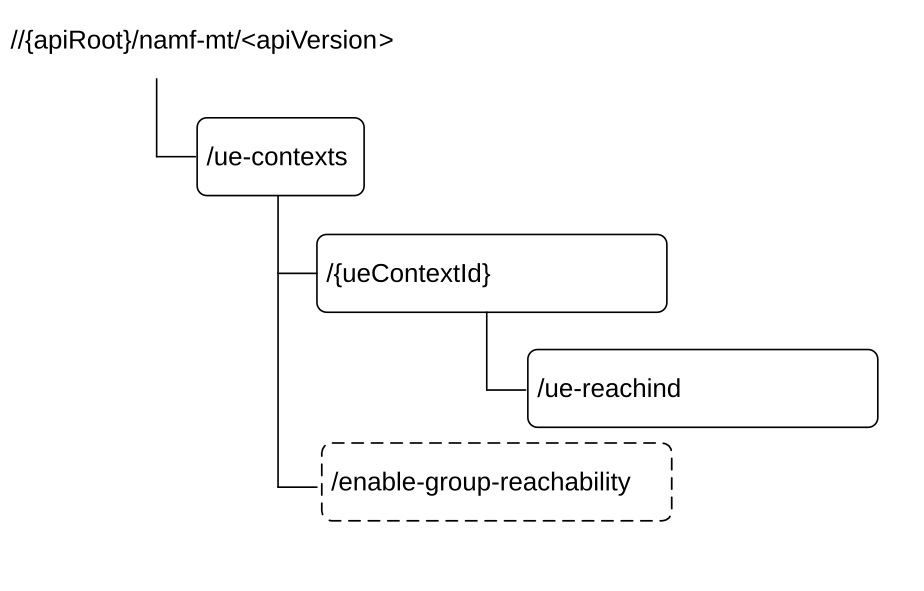

# 6.3.3 Resources

## 6.3.3.1 Overview

Figure 6.3.3.1-1: Resource URI structure of the Namf_MT Service API

Table 6.3.3.1-1 provides an overview of the resources and applicable HTTP methods.

Table 6.3.3.1-1: Resources and methods overview

<table style="width:100%;">
<colgroup>
<col style="width: 11%" />
<col style="width: 51%" />
<col style="width: 11%" />
<col style="width: 25%" />
</colgroup>
<thead>
<tr class="header">
<th>Resource name</th>
<th>Resource URI</th>
<th>HTTP method or custom operation</th>
<th>Description</th>
</tr>
</thead>
<tbody>
<tr class="odd">
<td>ueReachInd</td>
<td>/ue-contexts/{ueContextId}/ue-reachind</td>
<td>PUT</td>
<td>Update the ueReachInd to UE Reachable</td>
</tr>
<tr class="even">
<td>ueContext</td>
<td>/ue-contexts/{ueContextId}</td>
<td>GET</td>
<td>
Map to following service operation:

- ProvideDomainSelectionInfo
</td>
</tr>
<tr class="odd">
<td>ueContexts collection</td>
<td>/ue-contexts/enable-group-reachability</td>
<td>enable-group-reachability (POST)</td>
<td>Update the state of the list of UEs to CM-CONNECTED state</td>
</tr>
</tbody>
</table>

## 6.3.3.2 Resource: ueReachInd

### 6.3.3.2.1 Description

This resource represents the ueReachInd for a SUPI.

This resource is modelled as the Document resource archetype (see clause C.1 of TS 29.501 \[5\]).

### 6.3.3.2.2 Resource Definition

Resource URI: {apiRoot}/namf-mt/\<apiVersion\>/ue-contexts/{ueContextId}/ue-reachind

This resource shall support the resource URI variables defined in table 6.3.3.2.2-1.

Table 6.3.3.2.2-1: Resource URI variables for this resource

<table>
<colgroup>
<col style="width: 11%" />
<col style="width: 16%" />
<col style="width: 72%" />
</colgroup>
<thead>
<tr class="header">
<th>Name</th>
<th>Data type</th>
<th>Definition</th>
</tr>
</thead>
<tbody>
<tr class="odd">
<td>apiRoot</td>
<td>string</td>
<td>See clause 6.3.1</td>
</tr>
<tr class="even">
<td>apiVersion</td>
<td>string</td>
<td>See clause 6.3.1.</td>
</tr>
<tr class="odd">
<td>ueContextId</td>
<td>Supi</td>
<td>Represents the Subscription Permanent Identifier (see TS 23.501 [2] clause 5.9.2) 
pattern: see pattern of type Supi in TS 29.571 [6]</td>
</tr>
</tbody>
</table>

### 6.3.3.2.3 Resource Standard Methods

#### 6.3.3.2.3.1 PUT

This method shall support the URI query parameters specified in table 6.3.3.2.3.1-1.

Table 6.3.3.2.3.1-1: URI query parameters supported by the PUT method on this resource

| Name | Data type | P   | Cardinality | Description |
|------|-----------|-----|-------------|-------------|
| n/a  |           |     |             |             |

This method shall support the request data structures specified in table 6.3.3.2.3.1-2 and the response data structures and response codes specified in table 6.3.3.2.3.1-3.

Table 6.3.3.2.3.1-2: Data structures supported by the PUT Request Body on this resource

| Data type                   | P   | Cardinality | Description                                                          |
|-----------------------------|-----|-------------|----------------------------------------------------------------------|
| EnableUeReachabilityReqData | M   | 1           | Contain the State of the UE, the value shall be set to UE Reachable. |

Table 6.3.3.2.3.1-3: Data structures supported by the PUT Response Body on this resource

<table>
<colgroup>
<col style="width: 29%" />
<col style="width: 2%" />
<col style="width: 10%" />
<col style="width: 10%" />
<col style="width: 46%" />
</colgroup>
<thead>
<tr class="header">
<th>Data type</th>
<th>P</th>
<th>Cardinality</th>
<th>
Response

codes
</th>
<th>Description</th>
</tr>
</thead>
<tbody>
<tr class="odd">
<td>EnableUeReachabilityRspData</td>
<td>M</td>
<td>1</td>
<td>200 OK</td>
<td>Indicate the ueReachInd is updated to UE Reachable.</td>
</tr>
<tr class="even">
<td>RedirectResponse</td>
<td>O</td>
<td>0..1</td>
<td>307 Temporary Redirect</td>
<td>
Temporary redirection.

When the related UE context is not fully available at the target NF Service Producer (e.g. AMF) during a planned maintenance case (e.g. AMF planned maintenance without UDSF case) the "cause" attribute may be used to include the following application error:

<blockquote>

- NF_CONSUMER_REDIRECT_ONE_TXN

</blockquote>

See table 6.3.7.3-1 for the description of these errors

(NOTE 2)
</td>
</tr>
<tr class="odd">
<td>RedirectResponse</td>
<td>O</td>
<td>0..1</td>
<td>308 Permanent Redirect</td>
<td>
Permanent redirection.

(NOTE 2)
</td>
</tr>
<tr class="even">
<td>ProblemDetailsEnableUeReachability</td>
<td>O</td>
<td>0..1</td>
<td>403 Forbidden</td>
<td>
The "cause" attribute may be used to indicate one of the following application errors:

<blockquote>

- UNABLE_TO_PAGE_UE

- UNSPECIFIED

- UE_IN_NON_ALLOWED_AREA

</blockquote>

See table 6.3.7.3-1 for the description of this error.
</td>
</tr>
<tr class="odd">
<td>ProblemDetails</td>
<td>O</td>
<td>0..1</td>
<td>404 Not Found</td>
<td>
When the related UE is not found in the NF Service Producer (e.g. AMF) the "cause" attribute shall be set to:

<blockquote>

- CONTEXT_NOT_FOUND

</blockquote>

See table 6.3.7.3-1 for the description of these errors
</td>
</tr>
<tr class="even">
<td>ProblemDetails</td>
<td>O</td>
<td>0..1</td>
<td>409 Conflict</td>
<td>
The "cause" attribute may be used to indicate the following application error:

- REJECTION_DUE_TO_PAGING_RESTRICTION

See table 6.3.7.3-1 for the description of this error.
</td>
</tr>
<tr class="odd">
<td>ProblemDetails</td>
<td>O</td>
<td>0..1</td>
<td>503 Service Unavailable</td>
<td>
The "cause" attribute may be used to indicate one of the errors defined in Table 5.2.7.2-1 of TS 29.500 [4].

The HTTP header field "Retry-After" shall not be included in this scenario.
</td>
</tr>
<tr class="even">
<td>ProblemDetailsEnableUeReachability</td>
<td>O</td>
<td>0..1</td>
<td>504 Gateway Timeout</td>
<td>
The "cause" attribute may be used to indicate one of the following application errors:

<blockquote>

- UE_NOT_RESPONDING

- UE_NOT_REACHABLE

</blockquote>

See table 6.3.7.3-1 for the description of this error.
</td>
</tr>
<tr class="odd">
<td colspan="5">
NOTE 1: The mandatory HTTP error status code for the PUT method listed in Table 5.2.7.1-1 of TS 29.500 [4] also apply, with response body containing an object of ProblemDetails data type (see clause 5.2.7 of TS 29.500 [4]).

NOTE 2: RedirectResponse may be inserted by an SCP, see clause 6.10.9.1 of TS 29.500 [4].
</td>
</tr>
</tbody>
</table>

Table 6.3.3.2.3.1-4: Headers supported by the 307 Response Code on this resource

<table>
<colgroup>
<col style="width: 16%" />
<col style="width: 14%" />
<col style="width: 4%" />
<col style="width: 11%" />
<col style="width: 52%" />
</colgroup>
<tbody>
<tr class="odd">
<td>Name</td>
<td>Data type</td>
<td>P</td>
<td>Cardinality</td>
<td>Description</td>
</tr>
<tr class="even">
<td>Location</td>
<td>string</td>
<td>M</td>
<td>1</td>
<td>
The URI of the resource located on an alternative service instance within the same AMF or AMF (service) set to which the request is redirected.

For the case when a request is redirected to the same target resource via a different SCP or SEPP, see clause 6.10.9.1 in TS 29.500 [4].
</td>
</tr>
<tr class="odd">
<td>3gpp-Sbi-Target-Nf-Id</td>
<td>string</td>
<td>O</td>
<td>0..1</td>
<td>Identifier of the target NF (service) instance ID towards which the request is redirected</td>
</tr>
</tbody>
</table>

Table 6.3.3.2.3.1-5: Headers supported by the 308 Response Code on this resource

<table>
<colgroup>
<col style="width: 16%" />
<col style="width: 14%" />
<col style="width: 4%" />
<col style="width: 11%" />
<col style="width: 52%" />
</colgroup>
<tbody>
<tr class="odd">
<td>Name</td>
<td>Data type</td>
<td>P</td>
<td>Cardinality</td>
<td>Description</td>
</tr>
<tr class="even">
<td>Location</td>
<td>string</td>
<td>M</td>
<td>1</td>
<td>
An alternative URI of the resource located on an alternative service instance within the same AMF or AMF (service) set.

For the case when a request is redirected to the same target resource via a different SCP or SEPP, see clause 6.10.9.1 in TS 29.500 [4].
</td>
</tr>
<tr class="odd">
<td>3gpp-Sbi-Target-Nf-Id</td>
<td>string</td>
<td>O</td>
<td>0..1</td>
<td>Identifier of the target NF (service) instance ID towards which the request is redirected</td>
</tr>
</tbody>
</table>

### 6.3.3.2.4 Resource Custom Operations

There is no custom operation supported on this resource.

## 6.3.3.3 Resource: ueContext

### 6.3.3.3.1 Description

This resource represents the UeContext for a UE.

This resource is modelled as the Document resource archetype (see clause C.1 of TS 29.501 \[5\]).

### 6.3.3.3.2 Resource Definition

Resource URI: {apiRoot}/namf-mt/\<apiVersion\>/ue-contexts/{ueContextId}

This resource shall support the resource URI variables defined in table 6.3.3.3.2-1.

Table 6.3.3.3.2-1: Resource URI variables for this resource

<table>
<colgroup>
<col style="width: 11%" />
<col style="width: 11%" />
<col style="width: 76%" />
</colgroup>
<thead>
<tr class="header">
<th>Name</th>
<th>Data type</th>
<th>Definition</th>
</tr>
</thead>
<tbody>
<tr class="odd">
<td>apiRoot</td>
<td>string</td>
<td>See clause 6.3.1</td>
</tr>
<tr class="even">
<td>apiVersion</td>
<td>string</td>
<td>See clause 6.3.1.</td>
</tr>
<tr class="odd">
<td>ueContextId</td>
<td>Supi</td>
<td>Represents the Subscription Permanent Identifier (see TS 23.501 [2] clause 5.9.2) 
pattern: see pattern of type Supi in TS 29.571 [6]</td>
</tr>
</tbody>
</table>

### 6.3.3.3.3 Resource Standard Methods

#### 6.3.3.3.3.1 GET

This method shall support the URI query parameters specified in table 6.3.3.3.3.1-1.

Table 6.3.3.3.3.1-1: URI query parameters supported by the GET method on this resource

| Name               | Data type          | P   | Cardinality | Description                                                                                                                                                                                                                           |
|--------------------|--------------------|-----|-------------|---------------------------------------------------------------------------------------------------------------------------------------------------------------------------------------------------------------------------------------|
| info-class         | UeContextInfoClass | M   | 1           | Indicates the class of the UE Context information elements to be fetched.                                                                                                                                                             |
| supported-features | SupportedFeatures  | C   | 0..1        | This IE shall be present if at least one feature defined in clause 6.3.8 is supported.                                                                                                                                                |
| old-guami          | Guami              | C   | 0..1        | This IE shall be present during an AMF planned removal procedure when the NF Service Consumer initiates a request towards the target AMF, for a UE associated to an AMF that is unavailable (see clause 5.21.2.2 of TS 23.501 \[2\]). |

This method shall support the request data structures specified in table 6.3.3.3.3.1-2 and the response data structures and response codes specified in table 6.3.3.3.3.1-3.

Table 6.3.3.3.3.1-2: Data structures supported by the GET Request Body on this resource

| Data type | P   | Cardinality | Description |
|-----------|-----|-------------|-------------|
| n/a       |     |             |             |

Table 6.3.3.3.3.1-3: Data structures supported by the GET Response Body on this resource

<table>
<colgroup>
<col style="width: 22%" />
<col style="width: 2%" />
<col style="width: 11%" />
<col style="width: 10%" />
<col style="width: 52%" />
</colgroup>
<thead>
<tr class="header">
<th>Data type</th>
<th>P</th>
<th>Cardinality</th>
<th>
Response

codes
</th>
<th>Description</th>
</tr>
</thead>
<tbody>
<tr class="odd">
<td>UeContextInfo</td>
<td>M</td>
<td>1</td>
<td>200 OK</td>
<td>This represents the operation is successful and request UE Context information is returned.</td>
</tr>
<tr class="even">
<td>RedirectResponse</td>
<td>O</td>
<td>0..1</td>
<td>307 Temporary Redirect</td>
<td>
Temporary redirection.

When the related UE context is not fully available at the target NF Service Consumer (e.g. AMF) during a planned maintenance case (e.g. AMF planned maintenance without UDSF case) the "cause" attribute shall be set to:

<blockquote>

- NF_CONSUMER_REDIRECT_ONE_TXN

</blockquote>

See table 6.3.7.3-1 for the description of these errors

(NOTE 2)
</td>
</tr>
<tr class="odd">
<td>RedirectResponse</td>
<td>O</td>
<td>0..1</td>
<td>308 Permanent Redirect</td>
<td>
Permanent redirection.

(NOTE 2)
</td>
</tr>
<tr class="even">
<td>ProblemDetails</td>
<td>O</td>
<td>0..1</td>
<td>403 Forbidden</td>
<td>
Indicates the operation has failed due to application error.

The "cause" attribute may be used to indicate one of the following application errors:

<blockquote>

- UNABLE_TO_PAGE_UE

- UE_DEREGISTERED

- UNSPECIFIED

</blockquote>

See table 6.3.7.3-1 for the description of these errors.
</td>
</tr>
<tr class="odd">
<td>ProblemDetails</td>
<td>O</td>
<td>0..1</td>
<td>404 Not Found</td>
<td>
Indicates the operation has failed due to application error.

The "cause" attribute may be used to indicate one of the following application errors:

<blockquote>

- CONTEXT_NOT_FOUND

</blockquote>

See table 6.3.7.3-1 for the description of these errors
</td>
</tr>
<tr class="even">
<td>ProblemDetails</td>
<td>O</td>
<td>0..1</td>
<td>409 Conflict</td>
<td>
This indicates that the request could not be completed due to a temporary conflict with the current state of the target resource.

The cause attribute of the ProblemDetails structure shall be set to:

- TEMPORARY_REJECT_REGISTRATION_ONGOING, if there is an on-going registration procedure.
</td>
</tr>
<tr class="odd">
<td colspan="5">
NOTE 1: The mandatory HTTP error status code for the GET method listed in Table 5.2.7.1-1 of TS 29.500 [4] also apply, with response body containing an object of ProblemDetails data type (see clause 5.2.7 of TS 29.500 [4]).

NOTE 2: RedirectResponse may be inserted by an SCP or SEPP, see clause 6.10.9.1 of TS 29.500 [4].
</td>
</tr>
</tbody>
</table>

Table 6.3.3.3.3.1-4: Headers supported by the 307 Response Code on this resource

<table>
<colgroup>
<col style="width: 16%" />
<col style="width: 14%" />
<col style="width: 4%" />
<col style="width: 11%" />
<col style="width: 52%" />
</colgroup>
<tbody>
<tr class="odd">
<td>Name</td>
<td>Data type</td>
<td>P</td>
<td>Cardinality</td>
<td>Description</td>
</tr>
<tr class="even">
<td>Location</td>
<td>string</td>
<td>M</td>
<td>1</td>
<td>
The URI of the resource located on the target NF Service Consumer (e.g. AMF) to which the request is redirected.

For the case when a request is redirected to the same target resource via a different SCP or SEPP, see clause 6.10.9.1 in TS 29.500 [4].
</td>
</tr>
<tr class="odd">
<td>3gpp-Sbi-Target-Nf-Id</td>
<td>string</td>
<td>O</td>
<td>0..1</td>
<td>Identifier of the target NF (service) instance ID towards which the request is redirected</td>
</tr>
</tbody>
</table>

Table 6.3.3.3.3.1-5: Headers supported by the 308 Response Code on this resource

<table>
<colgroup>
<col style="width: 16%" />
<col style="width: 14%" />
<col style="width: 4%" />
<col style="width: 11%" />
<col style="width: 52%" />
</colgroup>
<tbody>
<tr class="odd">
<td>Name</td>
<td>Data type</td>
<td>P</td>
<td>Cardinality</td>
<td>Description</td>
</tr>
<tr class="even">
<td>Location</td>
<td>string</td>
<td>M</td>
<td>1</td>
<td>
An alternative URI of the resource located on an alternative service instance within the same AMF or AMF (service) set.

For the case when a request is redirected to the same target resource via a different SCP or SEPP, see clause 6.10.9.1 in TS 29.500 [4].
</td>
</tr>
<tr class="odd">
<td>3gpp-Sbi-Target-Nf-Id</td>
<td>string</td>
<td>O</td>
<td>0..1</td>
<td>Identifier of the target NF (service) instance ID towards which the request is redirected</td>
</tr>
</tbody>
</table>

### 6.3.3.3.4 Resource Custom Operations

There is no custom operation supported on this resource.

## 6.3.3.4 Resource: ueContexts collection

### 6.3.3.4.1 Description

This resource represents the collection of the individual UeContexts created in the AMF.

This resource is modelled as the Collection resource archetype (see clause C.2 of TS 29.501 \[5\]).

### 6.3.3.4.2 Resource Definition

Resource URI: **{apiRoot}/namf-mt/\<apiVersion\>/ue-contexts**

This resource shall support the resource URI variables defined in table 6.3.3.4.2-1.

Table 6.3.3.4.2-1: Resource URI variables for this resource

| Name       | Data type | Definition        |
|------------|-----------|-------------------|
| apiRoot    | string    | See clause 6.3.1  |
| apiVersion | string    | See clause 6.3.1. |

### 6.3.3.4.3 Resource Standard Methods

There is no standard operation supported on this resource.

### 6.3.3.4.4 Resource Custom Operations

#### 6.3.3.4.4.1 Overview

Table 6.3.3.4.4.1-1: Custom operations

| Operation Name            | Custom operation URI                   | Mapped HTTP method | Description                                 |
|---------------------------|----------------------------------------|--------------------|---------------------------------------------|
| enable-group-reachability | /ue-contexts/enable-group-reachability | POST               | Enable Group Reachability service operation |

#### 6.3.3.4.4.2 Operation: enable-group-reachability

#### 6.3.3.4.4.2.1 Description

#### 6.3.3.4.4.2.2 Operation Definition

This custom operation updates the state of the list of UEs to CM-CONNECTED state.

This operation shall support the request data structures specified in table 6.3.3.4.4.2.2-1 and the response data structure and response codes specified in table 6.3.3.4.4.2.2-2.

Table 6.3.3.4.4.2.2-1: Data structures supported by the POST Request Body on this resource

| Data type                      | P   | Cardinality | Description                                                                         |
|--------------------------------|-----|-------------|-------------------------------------------------------------------------------------|
| EnableGroupReachabilityReqData | M   | 1           | Contain the list of UEs involved in the MBS Session identified by the related TMGI. |

Table 6.3.3.4.4.2.2-2: Data structures supported by the POST Response Body on this resource

<table>
<colgroup>
<col style="width: 32%" />
<col style="width: 2%" />
<col style="width: 11%" />
<col style="width: 11%" />
<col style="width: 42%" />
</colgroup>
<thead>
<tr class="header">
<th>Data type</th>
<th>P</th>
<th>Cardinality</th>
<th>
Response

codes
</th>
<th>Description</th>
</tr>
</thead>
<tbody>
<tr class="odd">
<td>EnableGroupReachabilityRspData</td>
<td>M</td>
<td>1</td>
<td>200 OK</td>
<td>Successful response indicating the list of UEs in CM-CONNECTED state if any, and indicating the supported features.</td>
</tr>
<tr class="even">
<td>RedirectResponse</td>
<td>O</td>
<td>0..1</td>
<td>307 Temporary Redirect</td>
<td>
Temporary redirection.

(NOTE 2)
</td>
</tr>
<tr class="odd">
<td>RedirectResponse</td>
<td>O</td>
<td>0..1</td>
<td>308 Permanent Redirect</td>
<td>
Permanent redirection.

(NOTE 2)
</td>
</tr>
<tr class="even">
<td>ProblemDetails</td>
<td>O</td>
<td>0..1</td>
<td>404 Not Found</td>
<td>
When none of the UEs in the list of UEs are found in the AMF, the "cause" attribute shall be set to:

<blockquote>

- CONTEXT_NOT_FOUND

</blockquote>

See table 6.3.7.3-1 for the description of these errors
</td>
</tr>
<tr class="odd">
<td>ProblemDetails</td>
<td>O</td>
<td>0..1</td>
<td>503 Service Unavailable</td>
<td>The "cause" attribute may be used to indicate one of the errors defined in Table 5.2.7.2-1 of TS 29.500 [4].</td>
</tr>
<tr class="even">
<td colspan="5">
NOTE 1: The mandatory HTTP error status code for the POST method listed in Table 5.2.7.1-1 of TS 29.500 [4] also apply, with response body containing an object of ProblemDetails data type (see clause 5.2.7 of TS 29.500 [4]).

NOTE 2: RedirectResponse may be inserted by an SCP, see clause 6.10.9.1 of TS 29.500 [4].
</td>
</tr>
</tbody>
</table>

Table 6.3.3.4.4.2.2-3: Headers supported by the 307 Response Code on this resource

<table>
<colgroup>
<col style="width: 16%" />
<col style="width: 14%" />
<col style="width: 4%" />
<col style="width: 11%" />
<col style="width: 52%" />
</colgroup>
<tbody>
<tr class="odd">
<td>Name</td>
<td>Data type</td>
<td>P</td>
<td>Cardinality</td>
<td>Description</td>
</tr>
<tr class="even">
<td>Location</td>
<td>string</td>
<td>M</td>
<td>1</td>
<td>
The URI of the resource located on an alternative service instance within the same AMF or AMF (service) set to which the request is redirected.

For the case when a request is redirected to the same target resource via a different SCP, see clause 6.10.9.1 in TS 29.500 [4].
</td>
</tr>
<tr class="odd">
<td>3gpp-Sbi-Target-Nf-Id</td>
<td>string</td>
<td>O</td>
<td>0..1</td>
<td>Identifier of the target NF (service) instance ID towards which the request is redirected</td>
</tr>
</tbody>
</table>

Table 6.3.3.4.4.2.2-4: Headers supported by the 308 Response Code on this resource

<table>
<colgroup>
<col style="width: 16%" />
<col style="width: 14%" />
<col style="width: 4%" />
<col style="width: 11%" />
<col style="width: 52%" />
</colgroup>
<tbody>
<tr class="odd">
<td>Name</td>
<td>Data type</td>
<td>P</td>
<td>Cardinality</td>
<td>Description</td>
</tr>
<tr class="even">
<td>Location</td>
<td>string</td>
<td>M</td>
<td>1</td>
<td>
An alternative URI of the resource located on an alternative service instance within the same AMF or AMF (service) set.

For the case when a request is redirected to the same target resource via a different SCP, see clause 6.10.9.1 in TS 29.500 [4].
</td>
</tr>
<tr class="odd">
<td>3gpp-Sbi-Target-Nf-Id</td>
<td>string</td>
<td>O</td>
<td>0..1</td>
<td>Identifier of the target NF (service) instance ID towards which the request is redirected</td>
</tr>
</tbody>
</table>
