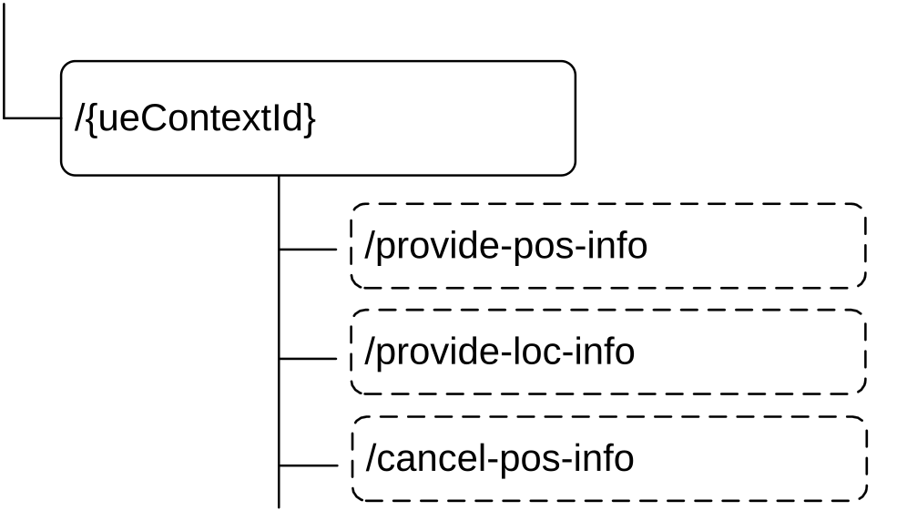

# 6.4.3 Resources

## 6.4.3.1 Overview

Figure 6.4.3.1-1: Resource URI structure of the Namf_Location Service API

Table 6.4.3.1-1 provides an overview of the resources and applicable HTTP methods.

Table 6.4.3.1-1: Resources and methods overview

<table>
<colgroup>
<col style="width: 19%" />
<col style="width: 39%" />
<col style="width: 15%" />
<col style="width: 25%" />
</colgroup>
<thead>
<tr class="header">
<th>Resource name</th>
<th>Resource URI</th>
<th>HTTP method or custom operation</th>
<th>Description</th>
</tr>
</thead>
<tbody>
<tr class="odd">
<td rowspan="3">Individual UE context</td>
<td>/provide-pos-info</td>
<td>provide-pos-info 
(POST)</td>
<td>ProvidePositioningInfo</td>
</tr>
<tr class="even">
<td>/provide-loc-info</td>
<td>provide-loc-info 
(POST)</td>
<td>ProvideLocationInfo</td>
</tr>
<tr class="odd">
<td>/cancel-pos-info</td>
<td>cancel-pos-info 
(POST)</td>
<td>CancelLocation</td>
</tr>
</tbody>
</table>

## 6.4.3.2 Resource: Individual UE Context

### 6.4.3.2.1 Description

This resource represents an individual ueContextId.

This resource is modelled with the Document resource archetype (see clause C.1 of TS 29.501 \[5\]).

### 6.4.3.2.2 Resource Definition

Resource URI:{apiRoot}/namf-loc/\<apiVersion\>/{ueContextId}

This resource shall support the resource URI variables defined in table 6.4.3.2.2-1.

Table 6.4.3.2.2-1: Resource URI variables for this resource

<table>
<colgroup>
<col style="width: 11%" />
<col style="width: 11%" />
<col style="width: 76%" />
</colgroup>
<thead>
<tr class="header">
<th>Name</th>
<th>Data type</th>
<th>Definition</th>
</tr>
</thead>
<tbody>
<tr class="odd">
<td>apiRoot</td>
<td>string</td>
<td>See clause 6.4.1</td>
</tr>
<tr class="even">
<td>apiVersion</td>
<td>string</td>
<td>See clause 6.4.1.</td>
</tr>
<tr class="odd">
<td>ueContextId</td>
<td>string</td>
<td>
Represents the Subscription Permanent Identifier (see TS 23.501 [2] clause 5.9.2) 
pattern: see pattern of type Supi in TS 29.571 [6]

Or represents the Permanent Equipment Identifier (see TS 23.501 [2] clause 5.9.3)

pattern: "(imei-[0-9]{15}|imeisv-[0-9]{16}|.+)"

Or represents the Generic Public Subscription Identifier (see TS 23.501 [2] clause 5.9.8)

pattern: see pattern of type Gpsi in TS 29.571 [6]
</td>
</tr>
</tbody>
</table>

### 6.4.3.2.3 Resource Standard Methods

There are no standard methods supported on this resource.

### 6.4.3.2.4 Resource Custom Operations

#### 6.4.3.2.4.1 Overview

Table 6.4.3.2.4.1-1: Custom operations

<table>
<colgroup>
<col style="width: 24%" />
<col style="width: 34%" />
<col style="width: 11%" />
<col style="width: 29%" />
</colgroup>
<thead>
<tr class="header">
<th>Operation Name</th>
<th>Custom operaration URI</th>
<th>Mapped HTTP method</th>
<th>Description</th>
</tr>
</thead>
<tbody>
<tr class="odd">
<td>provide-pos-info</td>
<td>/{ueContextId}/provide-pos-info</td>
<td>POST</td>
<td>
Request the positioning information of the UE.

It is used for the ProvidePositioningInfo service operation.
</td>
</tr>
<tr class="even">
<td>provide-loc-info</td>
<td>/{ueContextId}/provide-loc-info</td>
<td>POST</td>
<td>Request the Network Provided Location Information of the UE.</td>
</tr>
<tr class="odd">
<td>cancel-pos-info</td>
<td>/{ueContextId}/cancel-pos-info</td>
<td>POST</td>
<td>Cancels periodic or triggered location for the UE.</td>
</tr>
</tbody>
</table>

#### 6.4.3.2.4.2 Operation: provide-pos-info (POST)

#### 6.4.3.2.4.2.1 Description

This ueContextId identifies the individual ueContext resource is composed by UE's SUPI or PEI. If the AMF supporting the "POSGPSI" feature, the ueContextId identifies the individual ueContext resource may also be composed by UE's GPSI.

#### 6.4.3.2.4.2.2 Operation Definition

This operation shall support the request data structures specified in table 6.4.3.2.4.2.2-1 and the response data structure and response codes specified in table 6.4.3.2.4.2.2-2.

Table 6.4.3.2.4.2.2-1: Data structures supported by (POST) the provide-pos-info operation Request Body

| Data type      | P   | Cardinality | Description                                                       |
|----------------|-----|-------------|-------------------------------------------------------------------|
| RequestPosInfo | M   | 1           | The information to request the positioning information of the UE. |

Table 6.4.3.2.4.2.2-2: Data structures supported by the (POST) provide-pos-info operation Response Body

<table>
<colgroup>
<col style="width: 29%" />
<col style="width: 2%" />
<col style="width: 11%" />
<col style="width: 10%" />
<col style="width: 45%" />
</colgroup>
<thead>
<tr class="header">
<th>Data type</th>
<th>P</th>
<th>Cardinality</th>
<th>
Response

codes
</th>
<th>Description</th>
</tr>
</thead>
<tbody>
<tr class="odd">
<td>ProvidePosInfoExt</td>
<td>M</td>
<td>1</td>
<td>200 OK</td>
<td>This case represents a successful query of the UE positioning information, the AMF returns the related information in the response.</td>
</tr>
<tr class="even">
<td>n/a</td>
<td></td>
<td></td>
<td>204 No Content</td>
<td>Shall return 204 if no information is to be returned</td>
</tr>
<tr class="odd">
<td>RedirectResponse</td>
<td>O</td>
<td>0..1</td>
<td>307 Temporary Redirect</td>
<td>
Temporary redirection.

(NOTE 2)
</td>
</tr>
<tr class="even">
<td>RedirectResponse</td>
<td>O</td>
<td>0..1</td>
<td>308 Permanent Redirect</td>
<td>
Permanent redirection.

(NOTE 2)
</td>
</tr>
<tr class="odd">
<td>ProblemDetails</td>
<td>O</td>
<td>0..1</td>
<td>403 Forbidden</td>
<td>
The "cause" attribute may be used to indicate one of the following application errors:

<blockquote>

- USER_UNKNOWN

- DETACHED_USER

- POSITIONING_DENIED

- UNSPECIFIED

- REQUESTED_LMF_NOT_AVAILABLE

</blockquote>

See table 6.4.7.3-1 for the description of these errors.
</td>
</tr>
<tr class="even">
<td>ProblemDetailsProvidePosInfo</td>
<td>O</td>
<td>0..1</td>
<td>409 Conflict</td>
<td>
The request could not be completed due to a conflict with the current state of the resource.

The "cause" attribute may be used to indicate

<blockquote>

- HO_TO_EPS

</blockquote>

See table 6.4.7.3-1 for the description of these errors.

The response should contain the target MME name and realm, if available, and it may contain the location information available from the LMF.
</td>
</tr>
<tr class="odd">
<td>ProblemDetails</td>
<td>O</td>
<td>0..1</td>
<td>500 Internal Server Error</td>
<td>
The "cause" attribute may be used to indicate one of the following application errors:

<blockquote>

- POSITIONING_FAILED

</blockquote>

See table 6.4.7.3-1 for the description of these errors.
</td>
</tr>
<tr class="even">
<td>ProblemDetails</td>
<td>O</td>
<td>0..1</td>
<td>504 Gateway Timeout</td>
<td>
The "cause" attribute may be used to indicate one of the following application errors:

<blockquote>

- UNREACHABLE_USER

- PEER_NOT_RESPONDING

</blockquote>

See table 6.4.7.3-1 for the description of this error.
</td>
</tr>
<tr class="odd">
<td colspan="5">
NOTE 1: The mandatory HTTP error status code for the POST method listed in Table 5.2.7.1-1 of TS 29.500 [4] also apply, with response body containing an object of ProblemDetails data type (see clause 5.2.7 of TS 29.500 [4]).

NOTE 2: RedirectResponse may be inserted by an SCP, see clause 6.10.9.1 of TS 29.500 [4].
</td>
</tr>
</tbody>
</table>

Table 6.4.3.2.4.2.2-3: Headers supported by the 307 Response Code on this resource

<table>
<colgroup>
<col style="width: 16%" />
<col style="width: 14%" />
<col style="width: 4%" />
<col style="width: 11%" />
<col style="width: 52%" />
</colgroup>
<tbody>
<tr class="odd">
<td>Name</td>
<td>Data type</td>
<td>P</td>
<td>Cardinality</td>
<td>Description</td>
</tr>
<tr class="even">
<td>Location</td>
<td>string</td>
<td>M</td>
<td>1</td>
<td>
An alternative URI of the resource located on an alternative service instance within the same AMF or AMF (service) set.

For the case when a request is redirected to the same target resource via a different SCP, see clause 6.10.9.1 in TS 29.500 [4].
</td>
</tr>
<tr class="odd">
<td>3gpp-Sbi-Target-Nf-Id</td>
<td>string</td>
<td>O</td>
<td>0..1</td>
<td>Identifier of the target NF (service) instance ID towards which the request is redirected</td>
</tr>
</tbody>
</table>

Table 6.4.3.2.4.2.2-4: Headers supported by the 308 Response Code on this resource

<table>
<colgroup>
<col style="width: 16%" />
<col style="width: 14%" />
<col style="width: 4%" />
<col style="width: 11%" />
<col style="width: 52%" />
</colgroup>
<tbody>
<tr class="odd">
<td>Name</td>
<td>Data type</td>
<td>P</td>
<td>Cardinality</td>
<td>Description</td>
</tr>
<tr class="even">
<td>Location</td>
<td>string</td>
<td>M</td>
<td>1</td>
<td>
An alternative URI of the resource located on an alternative service instance within the same AMF or AMF (service) set.

For the case when a request is redirected to the same target resource via a different SCP, see clause 6.10.9.1 in TS 29.500 [4].
</td>
</tr>
<tr class="odd">
<td>3gpp-Sbi-Target-Nf-Id</td>
<td>string</td>
<td>O</td>
<td>0..1</td>
<td>Identifier of the target NF (service) instance ID towards which the request is redirected</td>
</tr>
</tbody>
</table>

#### 6.4.3.2.4.3 Operation: provide-loc-info (POST)

#### 6.4.3.2.4.3.1 Description

This ueContextId identifies the individual ueContext resource is composed by UE's SUPI or PEI.

#### 6.4.3.2.4.3.2 Operation Definition

This operation shall support the request data structures specified in table 6.4.3.2.4.3.2-1 and the response data structure and response codes specified in table 6.4.3.2.4.3.2-2.

Table 6.4.3.2.4.3.2-1: Data structures supported by the (POST) povideLocInfo operation Request Body

| Data type      | P   | Cardinality | Description                                    |
|----------------|-----|-------------|------------------------------------------------|
| RequestLocInfo | M   | 1           | The information to request the NPLI of the UE. |

Table 6.4.3.2.4.3.2-2: Data structures supported by the (POST) provide-loc-info operation Response Body

<table>
<colgroup>
<col style="width: 29%" />
<col style="width: 2%" />
<col style="width: 11%" />
<col style="width: 10%" />
<col style="width: 45%" />
</colgroup>
<thead>
<tr class="header">
<th>Data type</th>
<th>P</th>
<th>Cardinality</th>
<th>
Response

codes
</th>
<th>Description</th>
</tr>
</thead>
<tbody>
<tr class="odd">
<td>ProvideLocInfo</td>
<td>M</td>
<td>1</td>
<td>200 OK</td>
<td>This case represents a successful query of the NPLI of the target UE, the AMF returns the related information in the response.</td>
</tr>
<tr class="even">
<td>RedirectResponse</td>
<td>O</td>
<td>0..1</td>
<td>307 Temporary Redirect</td>
<td>
Temporary redirection.

(NOTE 2)
</td>
</tr>
<tr class="odd">
<td>RedirectResponse</td>
<td>O</td>
<td>0..1</td>
<td>308 Permanent Redirect</td>
<td>
Permanent redirection.

(NOTE 2)
</td>
</tr>
<tr class="even">
<td>ProblemDetails</td>
<td>O</td>
<td>0..1</td>
<td>403 Forbidden</td>
<td>
The "cause" attribute may be used to indicate one of the following application errors:

- UNSPECIFIED

See table 6.4.7.3-1 for the description of these errors.
</td>
</tr>
<tr class="odd">
<td>ProblemDetails</td>
<td>O</td>
<td>0..1</td>
<td>404 Not Found</td>
<td>
The "cause" attribute may be used to indicate one of the following application errors:

- CONTEXT NOT_FOUND

See table 6.4.7.3-1 for the description of these errors.
</td>
</tr>
<tr class="even">
<td colspan="5">
NOTE 1: The mandatory HTTP error status code for the POST method listed in Table 5.2.7.1-1 of TS 29.500 [4] also apply, with response body containing an object of ProblemDetails data type (see clause 5.2.7 of TS 29.500 [4]).

NOTE 2: RedirectResponse may be inserted by an SCP or SEPP, see clause 6.10.9.1 of TS 29.500 [4].
</td>
</tr>
</tbody>
</table>

Table 6.4.3.2.4.3.2-3: Headers supported by the 307 Response Code on this resource

<table>
<colgroup>
<col style="width: 16%" />
<col style="width: 14%" />
<col style="width: 4%" />
<col style="width: 11%" />
<col style="width: 52%" />
</colgroup>
<tbody>
<tr class="odd">
<td>Name</td>
<td>Data type</td>
<td>P</td>
<td>Cardinality</td>
<td>Description</td>
</tr>
<tr class="even">
<td>Location</td>
<td>string</td>
<td>M</td>
<td>1</td>
<td>
An alternative URI of the resource located on an alternative service instance within the same AMF or AMF (service) set.

For the case when a request is redirected to the same target resource via a different SCP or SEPP, see clause 6.10.9.1 in TS 29.500 [4].
</td>
</tr>
<tr class="odd">
<td>3gpp-Sbi-Target-Nf-Id</td>
<td>string</td>
<td>O</td>
<td>0..1</td>
<td>Identifier of the target NF (service) instance ID towards which the request is redirected</td>
</tr>
</tbody>
</table>

Table 6.4.3.2.4.3.2-4: Headers supported by the 308 Response Code on this resource

<table>
<colgroup>
<col style="width: 16%" />
<col style="width: 14%" />
<col style="width: 4%" />
<col style="width: 11%" />
<col style="width: 52%" />
</colgroup>
<tbody>
<tr class="odd">
<td>Name</td>
<td>Data type</td>
<td>P</td>
<td>Cardinality</td>
<td>Description</td>
</tr>
<tr class="even">
<td>Location</td>
<td>string</td>
<td>M</td>
<td>1</td>
<td>
An alternative URI of the resource located on an alternative service instance within the same AMF or AMF (service) set.

For the case when a request is redirected to the same target resource via a different SCP or SEPP, see clause 6.10.9.1 in TS 29.500 [4].
</td>
</tr>
<tr class="odd">
<td>3gpp-Sbi-Target-Nf-Id</td>
<td>string</td>
<td>O</td>
<td>0..1</td>
<td>Identifier of the target NF (service) instance ID towards which the request is redirected</td>
</tr>
</tbody>
</table>

#### 6.4.3.2.4.4 Operation: cancel-pos-info (POST)

#### 6.4.3.2.4.4.1 Description

This ueContextId identifies the individual ueContext resource and is composed by UE's SUPI or PEI.

#### 6.4.3.2.4.4.2 Operation Definition

This operation shall support the request data structures specified in table 6.4.3.2.4.4.2-1 and the response data structure and response codes specified in table 6.4.3.2.4.4.2-2.

Table 6.4.3.2.4.4.2-1: Data structures supported by the (POST) cancel-pos-info operation Request Body

| Data type     | P   | Cardinality | Description                                                       |
|---------------|-----|-------------|-------------------------------------------------------------------|
| CancelPosInfo | M   | 1           | The information to identify the location session to be cancelled. |

Table 6.4.3.2.4.4.2-2: Data structures supported by the (POST) cancel-pos-info operation Response Body

<table>
<colgroup>
<col style="width: 29%" />
<col style="width: 2%" />
<col style="width: 11%" />
<col style="width: 10%" />
<col style="width: 45%" />
</colgroup>
<thead>
<tr class="header">
<th>Data type</th>
<th>P</th>
<th>Cardinality</th>
<th>
Response

codes
</th>
<th>Description</th>
</tr>
</thead>
<tbody>
<tr class="odd">
<td>n/a</td>
<td></td>
<td></td>
<td>204 No Content</td>
<td>This case represents successful cancellation of location.</td>
</tr>
<tr class="even">
<td>RedirectResponse</td>
<td>O</td>
<td>0..1</td>
<td>307 Temporary Redirect</td>
<td>
Temporary redirection.

(NOTE 2)
</td>
</tr>
<tr class="odd">
<td>RedirectResponse</td>
<td>O</td>
<td>0..1</td>
<td>308 Permanent Redirect</td>
<td>
Permanent redirection.

(NOTE 2)
</td>
</tr>
<tr class="even">
<td>ProblemDetails</td>
<td>O</td>
<td>0..1</td>
<td>403 Forbidden</td>
<td>
The "cause" attribute may be used to indicate one of the following application errors:

<blockquote>

- USER_UNKNOWN

- LOCATION_SESSION_UNKNOWN

- UNSPECIFIED

</blockquote>

See table 6.4.7.3-1 for the description of these errors.
</td>
</tr>
<tr class="odd">
<td>ProblemDetails</td>
<td>O</td>
<td>0..1</td>
<td>504 Gateway Timeout</td>
<td>
The "cause" attribute may be used to indicate one of the following application errors:

<blockquote>

- UNREACHABLE_USER

- PEER_NOT_RESPONDING

</blockquote>

See table 6.4.7.3-1 for the description of this error.
</td>
</tr>
<tr class="even">
<td colspan="5">
NOTE 1: The mandatory HTTP error status code for the POST method listed in Table 5.2.7.1-1 of TS 29.500 [4] also apply, with response body containing an object of ProblemDetails data type (see clause 5.2.7 of TS 29.500 [4]).

NOTE 2: RedirectResponse may be inserted by an SCP, see clause 6.10.9.1 of TS 29.500 [4].
</td>
</tr>
</tbody>
</table>

Table 6.4.3.2.4.4.2-3: Headers supported by the 307 Response Code on this resource

<table>
<colgroup>
<col style="width: 16%" />
<col style="width: 14%" />
<col style="width: 4%" />
<col style="width: 11%" />
<col style="width: 52%" />
</colgroup>
<tbody>
<tr class="odd">
<td>Name</td>
<td>Data type</td>
<td>P</td>
<td>Cardinality</td>
<td>Description</td>
</tr>
<tr class="even">
<td>Location</td>
<td>string</td>
<td>M</td>
<td>1</td>
<td>
An alternative URI of the resource located on an alternative service instance within the same AMF or AMF (service) set.

For the case when a request is redirected to the same target resource via a different SCP, see clause 6.10.9.1 in TS 29.500 [4].
</td>
</tr>
<tr class="odd">
<td>3gpp-Sbi-Target-Nf-Id</td>
<td>string</td>
<td>O</td>
<td>0..1</td>
<td>Identifier of the target NF (service) instance ID towards which the request is redirected</td>
</tr>
</tbody>
</table>

Table 6.4.3.2.4.4.2-4: Headers supported by the 308 Response Code on this resource

<table>
<colgroup>
<col style="width: 16%" />
<col style="width: 14%" />
<col style="width: 4%" />
<col style="width: 11%" />
<col style="width: 52%" />
</colgroup>
<tbody>
<tr class="odd">
<td>Name</td>
<td>Data type</td>
<td>P</td>
<td>Cardinality</td>
<td>Description</td>
</tr>
<tr class="even">
<td>Location</td>
<td>string</td>
<td>M</td>
<td>1</td>
<td>
An alternative URI of the resource located on an alternative service instance within the same AMF or AMF (service) set.

For the case when a request is redirected to the same target resource via a different SCP, see clause 6.10.9.1 in TS 29.500 [4].
</td>
</tr>
<tr class="odd">
<td>3gpp-Sbi-Target-Nf-Id</td>
<td>string</td>
<td>O</td>
<td>0..1</td>
<td>Identifier of the target NF (service) instance ID towards which the request is redirected</td>
</tr>
</tbody>
</table>
