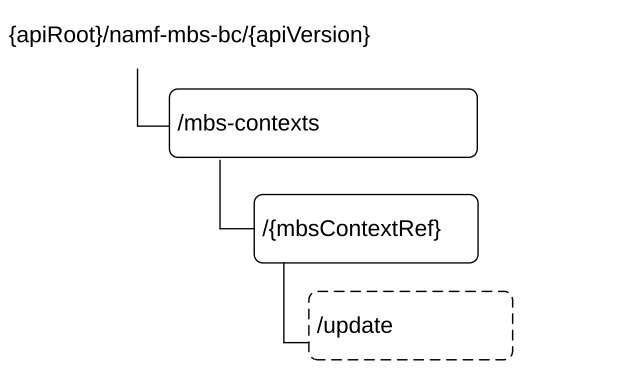

# 6.5.3 Resources

## 6.5.3.1 Overview

Figure 6.5.3.1-1: Resource URI structure of the Namf_MBSBroadcast Service API

Table 6.5.3.1-1 provides an overview of the resources and applicable HTTP methods.

Table 6.5.3.1-1: Resources and methods overview

<table>
<colgroup>
<col style="width: 18%" />
<col style="width: 48%" />
<col style="width: 10%" />
<col style="width: 23%" />
</colgroup>
<thead>
<tr class="header">
<th>Resource name</th>
<th>Resource URI</th>
<th>HTTP method or custom operation</th>
<th>
Description

(service operation)
</th>
</tr>
</thead>
<tbody>
<tr class="odd">
<td>Broadcast MBS session contexts collection</td>
<td>/mbs-contexts</td>
<td>POST</td>
<td>ContextCreate</td>
</tr>
<tr class="even">
<td rowspan="2">Individual broadcast MBS session context</td>
<td>/mbs-contexts/{mbsContextRef}/update</td>
<td>
update

(POST)
</td>
<td>ContextUpdate</td>
</tr>
<tr class="odd">
<td>/mbs-contexts/{mbsContextRef}</td>
<td>DELETE</td>
<td>ContextRelease</td>
</tr>
</tbody>
</table>

## 6.5.3.2 Resource: Broadcast MBS session contexts collection

### 6.5.3.2.1 Description

This resource represents a collection of Broadcast MBS session contexts created by NF service consumers of the Namf_MBSBroadcast service.

This resource is modelled as the Collection resource archetype (see clause C.2 of TS 29.501 \[5\]).

### 6.5.3.2.2 Resource Definition

Resource URI: **{apiRoot}/namf-mbs-bc/\<apiVersion\>/mbs-contexts**

This resource shall support the resource URI variables defined in table 6.5.3.2.2-1.

Table 6.5.3.2.2-1: Resource URI variables for this resource

| Name       | Data type | Definition        |
|------------|-----------|-------------------|
| apiRoot    | string    | See clause 6.5.1  |
| apiVersion | string    | See clause 6.5.1. |

### 6.5.3.2.3 Resource Standard Methods

#### 6.5.3.2.3.1 POST

This method shall support the URI query parameters specified in table 6.5.3.2.3.1-1.

Table 6.5.3.2.3.1-1: URI query parameters supported by the POST method on this resource

| Name | Data type | P   | Cardinality | Description |
|------|-----------|-----|-------------|-------------|
| n/a  |           |     |             |             |

This method shall support the request data structures specified in table 6.5.3.2.3.1-2 and the response data structures and response codes specified in table 6.5.3.2.3.1-3.

Table 6.5.3.2.3.1-2: Data structures supported by the POST Request Body on this resource

| Data type            | P   | Cardinality | Description                       |
|----------------------|-----|-------------|-----------------------------------|
| ContextCreateReqData | M   | 1           | Data within ContextCreate Request |

Table 6.5.3.2.3.1-3: Data structures supported by the POST Response Body on this resource

<table>
<colgroup>
<col style="width: 29%" />
<col style="width: 2%" />
<col style="width: 11%" />
<col style="width: 10%" />
<col style="width: 45%" />
</colgroup>
<thead>
<tr class="header">
<th>Data type</th>
<th>P</th>
<th>Cardinality</th>
<th>
Response

codes
</th>
<th>Description</th>
</tr>
</thead>
<tbody>
<tr class="odd">
<td>ContextCreateRspData</td>
<td>M</td>
<td>1</td>
<td>201 Created</td>
<td>Successful creation of a broadcast MBS context</td>
</tr>
<tr class="even">
<td>RedirectResponse</td>
<td>O</td>
<td>0..1</td>
<td>307 Temporary Redirect</td>
<td>
Temporary redirection.

(NOTE 2)
</td>
</tr>
<tr class="odd">
<td>RedirectResponse</td>
<td>O</td>
<td>0..1</td>
<td>308 Permanent Redirect</td>
<td>
Permanent redirection.

(NOTE 2)
</td>
</tr>
<tr class="even">
<td colspan="5">
NOTE 1: The mandatory HTTP error status code for the POST method listed in Table 5.2.7.1-1 of TS 29.500 [4] also apply, with response body containing an object of ProblemDetails data type (see clause 5.2.7 of TS 29.500 [4]).

NOTE 2: RedirectResponse may be inserted by an SCP, see clause 6.10.9.1 of TS 29.500 [4].
</td>
</tr>
</tbody>
</table>

Table 6.5.3.2.3.1-4: Headers supported by the 201 Response Code on this resource

|          |           |     |             |                                                                                                                                               |
|----------|-----------|-----|-------------|-----------------------------------------------------------------------------------------------------------------------------------------------|
| Name     | Data type | P   | Cardinality | Description                                                                                                                                   |
| Location | string    | M   | 1           | Contains the URI of the newly created resource, according to the structure: {apiRoot}/namf-mbs-bc/\<apiVersion\>/mbs-contexts/{mbsContextRef} |

Table 6.5.3.2.3.1-5: Headers supported by the 307 Response Code on this resource

<table>
<colgroup>
<col style="width: 16%" />
<col style="width: 14%" />
<col style="width: 4%" />
<col style="width: 11%" />
<col style="width: 52%" />
</colgroup>
<tbody>
<tr class="odd">
<td>Name</td>
<td>Data type</td>
<td>P</td>
<td>Cardinality</td>
<td>Description</td>
</tr>
<tr class="even">
<td>Location</td>
<td>string</td>
<td>M</td>
<td>1</td>
<td>
An alternative URI of the resource located on an alternative service instance within the same AMF or AMF (service) set.

For the case when a request is redirected to the same target resource via a different SCP, see clause 6.10.9.1 in TS 29.500 [4].
</td>
</tr>
<tr class="odd">
<td>3gpp-Sbi-Target-Nf-Id</td>
<td>string</td>
<td>O</td>
<td>0..1</td>
<td>Identifier of the target NF (service) instance ID towards which the request is redirected</td>
</tr>
</tbody>
</table>

Table 6.5.3.2.3.1-6: Headers supported by the 308 Response Code on this resource

<table>
<colgroup>
<col style="width: 16%" />
<col style="width: 14%" />
<col style="width: 4%" />
<col style="width: 11%" />
<col style="width: 52%" />
</colgroup>
<tbody>
<tr class="odd">
<td>Name</td>
<td>Data type</td>
<td>P</td>
<td>Cardinality</td>
<td>Description</td>
</tr>
<tr class="even">
<td>Location</td>
<td>string</td>
<td>M</td>
<td>1</td>
<td>
An alternative URI of the resource located on an alternative service instance within the same AMF or AMF (service) set.

For the case when a request is redirected to the same target resource via a different SCP, see clause 6.10.9.1 in TS 29.500 [4].
</td>
</tr>
<tr class="odd">
<td>3gpp-Sbi-Target-Nf-Id</td>
<td>string</td>
<td>O</td>
<td>0..1</td>
<td>Identifier of the target NF (service) instance ID towards which the request is redirected</td>
</tr>
</tbody>
</table>

### 6.5.3.2.4 Resource Custom Operations

None.

## 6.5.3.3 Resource: Individual broadcast MBS session context

### 6.5.3.3.1 Description

This resource represents an Individual broadcast MBS session context created by an NF service consumer of the Namf_MBSBroadcast service.

This resource is modelled as the Document resource archetype (see clause C.2 of TS 29.501 \[5\]).

### 6.5.3.3.2 Resource Definition

Resource URI: **{apiRoot}/namf-mbs-bc/\<apiVersion\>/mbs-contexts/{mbsContextRef}**

This resource shall support the resource URI variables defined in table 6.5.3.3.2-1.

Table 6.5.3.3.2-1: Resource URI variables for this resource

| Name          | Data type | Definition                                                     |
|---------------|-----------|----------------------------------------------------------------|
| apiRoot       | string    | See clause 6.5.1                                               |
| apiVersion    | string    | See clause 6.5.1                                               |
| mbsContextRef | string    | String identifying an individual broadcast MBS session context |

### 6.5.3.3.3 Resource Standard Methods

#### 6.5.3.3.3.1 DELETE

This method shall support the URI query parameters specified in table 6.5.3.3.3.1-1.

Table 6.5.3.3.3.1-1: URI query parameters supported by the DELETE method on this resource

| Name | Data type | P   | Cardinality | Description |
|------|-----------|-----|-------------|-------------|
| n/a  |           |     |             |             |

This method shall support the request data structures specified in table 6.5.3.3.3.1-2 and the response data structures and response codes specified in table 6.5.3.3.3.1-3.

Table 6.5.3.3.3.1-2: Data structures supported by the DELETE Request Body on this resource

| Data type | P   | Cardinality | Description |
|-----------|-----|-------------|-------------|
| n/a       |     |             |             |

Table 6.5.3.3.3.1-3: Data structures supported by the DELETE Response Body on this resource

<table>
<colgroup>
<col style="width: 29%" />
<col style="width: 2%" />
<col style="width: 11%" />
<col style="width: 10%" />
<col style="width: 45%" />
</colgroup>
<thead>
<tr class="header">
<th>Data type</th>
<th>P</th>
<th>Cardinality</th>
<th>
Response

codes
</th>
<th>Description</th>
</tr>
</thead>
<tbody>
<tr class="odd">
<td>n/a</td>
<td></td>
<td></td>
<td>204 No Content</td>
<td>Successful deletion of a broadcast MBS context</td>
</tr>
<tr class="even">
<td>RedirectResponse</td>
<td>O</td>
<td>0..1</td>
<td>307 Temporary Redirect</td>
<td>
Temporary redirection.

(NOTE 2)
</td>
</tr>
<tr class="odd">
<td>RedirectResponse</td>
<td>O</td>
<td>0..1</td>
<td>308 Permanent Redirect</td>
<td>
Permanent redirection.

(NOTE 2)
</td>
</tr>
<tr class="even">
<td colspan="5">
NOTE 1: The mandatory HTTP error status code for the POST method listed in Table 5.2.7.1-1 of TS 29.500 [4] also apply, with response body containing an object of ProblemDetails data type (see clause 5.2.7 of TS 29.500 [4]).

NOTE 2: RedirectResponse may be inserted by an SCP, see clause 6.10.9.1 of TS 29.500 [4].
</td>
</tr>
</tbody>
</table>

Table 6.5.3.3.3.1-4: Headers supported by the 307 Response Code on this resource

<table>
<colgroup>
<col style="width: 16%" />
<col style="width: 14%" />
<col style="width: 4%" />
<col style="width: 11%" />
<col style="width: 52%" />
</colgroup>
<tbody>
<tr class="odd">
<td>Name</td>
<td>Data type</td>
<td>P</td>
<td>Cardinality</td>
<td>Description</td>
</tr>
<tr class="even">
<td>Location</td>
<td>string</td>
<td>M</td>
<td>1</td>
<td>
An alternative URI of the resource located on an alternative service instance within the same AMF or AMF (service) set.

For the case when a request is redirected to the same target resource via a different SCP, see clause 6.10.9.1 in TS 29.500 [4].
</td>
</tr>
<tr class="odd">
<td>3gpp-Sbi-Target-Nf-Id</td>
<td>string</td>
<td>O</td>
<td>0..1</td>
<td>Identifier of the target NF (service) instance ID towards which the request is redirected</td>
</tr>
</tbody>
</table>

Table 6.5.3.3.3.1-5: Headers supported by the 308 Response Code on this resource

<table>
<colgroup>
<col style="width: 16%" />
<col style="width: 14%" />
<col style="width: 4%" />
<col style="width: 11%" />
<col style="width: 52%" />
</colgroup>
<tbody>
<tr class="odd">
<td>Name</td>
<td>Data type</td>
<td>P</td>
<td>Cardinality</td>
<td>Description</td>
</tr>
<tr class="even">
<td>Location</td>
<td>string</td>
<td>M</td>
<td>1</td>
<td>
An alternative URI of the resource located on an alternative service instance within the same AMF or AMF (service) set.

For the case when a request is redirected to the same target resource via a different SCP, see clause 6.10.9.1 in TS 29.500 [4].
</td>
</tr>
<tr class="odd">
<td>3gpp-Sbi-Target-Nf-Id</td>
<td>string</td>
<td>O</td>
<td>0..1</td>
<td>Identifier of the target NF (service) instance ID towards which the request is redirected</td>
</tr>
</tbody>
</table>

### 6.5.3.3.4 Resource Custom Operations

#### 6.5.3.2.4.1 Overview

Table 6.5.3.2.4.1-1: Custom operations

| Operation Name | Custom operaration URI              | Mapped HTTP method | Description                     |
|----------------|-------------------------------------|--------------------|---------------------------------|
| update         | /mbscontexts/{mbsContextRef}/update | POST               | ContextUpdate service operation |

#### 6.5.3.2.4.2 Operation: update (POST)

#### 6.5.3.2.4.2.1 Description

This {mbsContextRef} identifies the individual broadcast MBS session context to be updated.

#### 6.5.3.2.4.2.2 Operation Definition

This operation shall support the request data structures specified in table 6.5.3.2.4.2.2-1 and the response data structure and response codes specified in table 6.5.3.2.4.2.2-2.

Table 6.5.3.2.4.2.2-1: Data structures supported by (POST) the update operation Request Body

| Data type            | P   | Cardinality | Description                           |
|----------------------|-----|-------------|---------------------------------------|
| ContextUpdateReqData | M   | 1           | Data within the ContextUpdate Request |

Table 6.5.3.2.4.2.2-2: Data structures supported by the (POST) update operation Response Body

<table>
<colgroup>
<col style="width: 29%" />
<col style="width: 2%" />
<col style="width: 11%" />
<col style="width: 10%" />
<col style="width: 45%" />
</colgroup>
<thead>
<tr class="header">
<th>Data type</th>
<th>P</th>
<th>Cardinality</th>
<th>
Response

codes
</th>
<th>Description</th>
</tr>
</thead>
<tbody>
<tr class="odd">
<td>ContextUpdateRspData</td>
<td>M</td>
<td>1</td>
<td>200 OK</td>
<td>Successful update of the broadcast MBS session context, with content in the response</td>
</tr>
<tr class="even">
<td>n/a</td>
<td></td>
<td></td>
<td>204 No Content</td>
<td>Successful update of the broadcast MBS session context, without content in the response</td>
</tr>
<tr class="odd">
<td>RedirectResponse</td>
<td>O</td>
<td>0..1</td>
<td>307 Temporary Redirect</td>
<td>
Temporary redirection.

(NOTE 2)
</td>
</tr>
<tr class="even">
<td>RedirectResponse</td>
<td>O</td>
<td>0..1</td>
<td>308 Permanent Redirect</td>
<td>
Permanent redirection.

(NOTE 2)
</td>
</tr>
<tr class="odd">
<td colspan="5">
NOTE 1: The mandatory HTTP error status code for the POST method listed in Table 5.2.7.1-1 of TS 29.500 [4] also apply, with response body containing an object of ProblemDetails data type (see clause 5.2.7 of TS 29.500 [4]).

NOTE 2: RedirectResponse may be inserted by an SCP, see clause 6.10.9.1 of TS 29.500 [4].
</td>
</tr>
</tbody>
</table>

Table 6.5.3.2.4.2.2-3: Headers supported by the 307 Response Code on this resource

<table>
<colgroup>
<col style="width: 16%" />
<col style="width: 14%" />
<col style="width: 4%" />
<col style="width: 11%" />
<col style="width: 52%" />
</colgroup>
<tbody>
<tr class="odd">
<td>Name</td>
<td>Data type</td>
<td>P</td>
<td>Cardinality</td>
<td>Description</td>
</tr>
<tr class="even">
<td>Location</td>
<td>string</td>
<td>M</td>
<td>1</td>
<td>
An alternative URI of the resource located on an alternative service instance within the same AMF or AMF (service) set.

For the case when a request is redirected to the same target resource via a different SCP, see clause 6.10.9.1 in TS 29.500 [4].
</td>
</tr>
<tr class="odd">
<td>3gpp-Sbi-Target-Nf-Id</td>
<td>string</td>
<td>O</td>
<td>0..1</td>
<td>Identifier of the target NF (service) instance ID towards which the request is redirected</td>
</tr>
</tbody>
</table>

Table 6.5.3.2.4.2.2-4: Headers supported by the 308 Response Code on this resource

<table>
<colgroup>
<col style="width: 16%" />
<col style="width: 14%" />
<col style="width: 4%" />
<col style="width: 11%" />
<col style="width: 52%" />
</colgroup>
<tbody>
<tr class="odd">
<td>Name</td>
<td>Data type</td>
<td>P</td>
<td>Cardinality</td>
<td>Description</td>
</tr>
<tr class="even">
<td>Location</td>
<td>string</td>
<td>M</td>
<td>1</td>
<td>
An alternative URI of the resource located on an alternative service instance within the same AMF or AMF (service) set.

For the case when a request is redirected to the same target resource via a different SCP, see clause 6.10.9.1 in TS 29.500 [4].
</td>
</tr>
<tr class="odd">
<td>3gpp-Sbi-Target-Nf-Id</td>
<td>string</td>
<td>O</td>
<td>0..1</td>
<td>Identifier of the target NF (service) instance ID towards which the request is redirected</td>
</tr>
</tbody>
</table>
