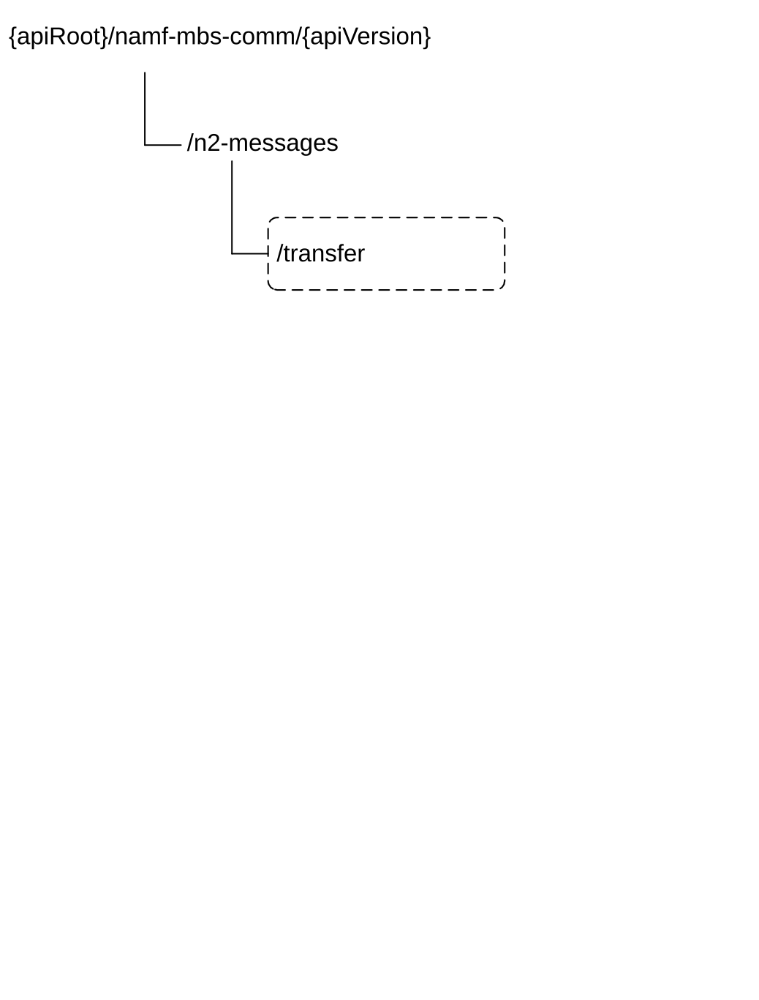

# 6.6 Namf_MBSCommunication Service API

## 6.6.1 API URI

The Namf_MBSCommunication service shall use the Namf_MBSCommunication API.

The API URI of the Namf\_ MBSCommunication API shall be:

**{apiRoot}/\<apiName\>/\<apiVersion\>**

The request URI used in HTTP requests from the NF service consumer towards the NF service producer shall have the Resource URI structure defined in clause 4.4.1 of TS 29.501 \[5\], i.e.:

**{apiRoot}/\<apiName\>/\<apiVersion\>/\<apiSpecificResourceUriPart\>**

with the following components:

\- The {apiRoot} shall be set as described in TS 29.501 \[5\].

\- The \<apiName\> shall be "namf-mbs-comm".

\- The \<apiVersion\> shall be "v1".

\- The \<apiSpecificResourceUriPart\> shall be set as described in clause 6.6.3.

## 6.6.2 Usage of HTTP

### 6.6.2.1 General

HTTP/2, as defined in IETF RFC 9113 \[19\], shall be used as specified in clause 5 of TS 29.500 \[4\].

HTTP/2 shall be transported as specified in clause 5.3 of TS 29.500 \[4\].

HTTP messages and bodies for the Namf_MBSCommunication service shall comply with the OpenAPI \[23\] specification contained in Annex A.

### 6.6.2.2 HTTP standard headers

#### 6.6.2.2.1 General

The usage of HTTP standard headers shall be supported as specified in clause 5.2.2 of TS 29.500 \[4\].

#### 6.6.2.2.2 Content type

The following content types shall be supported:

\- JSON, as defined in IETF RFC 8259 \[8\], shall be used as content type of the HTTP bodies specified in the present specification as indicated in clause 5.4 of TS 29.500 \[4\].

\- The Problem Details JSON Object (IETF RFC 9457 \[36\]). The use of the Problem Details JSON object in a HTTP response body shall be signalled by the content type "application/problem+json".

Multipart messages shall also be supported (see clause 6.6.2.4) using the content type "multipart/related", comprising:

\- one JSON body part with the "application/json" content type; and

\- one binary body part with 3gpp vendor specific content subtypes.

The 3gpp vendor specific content subtypes defined in Table 6.6.2.2.2-1 shall be supported.

Table 6.6.2.2.2-1: 3GPP vendor specific content subtypes

| content subtype                                                                                                                                                              | Description                                                                                                                         |
|------------------------------------------------------------------------------------------------------------------------------------------------------------------------------|-------------------------------------------------------------------------------------------------------------------------------------|
| vnd.3gpp.ngap                                                                                                                                                                | Binary encoded content, encoding NG Application Protocol (NGAP) IEs, as specified in clause 9.3 of TS 38.413 \[9\] (ASN.1 encoded). |
| NOTE: Using 3GPP vendor content subtypes allows to describe the nature of the opaque content (i.e. NGAP information) without having to rely on metadata in the JSON content. |                                                                                                                                     |

See clause 6.6.2.4 for the binary contents supported in the binary body part of multipart messages.

### 6.6.2.3 HTTP custom headers

#### 6.6.2.3.1 General

In this release of this specification, no custom headers specific to the Namf_MBSCommunication service are defined. For 3GPP specific HTTP custom headers used across all service-based interfaces, see clause 5.2.3 of TS 29.500 \[4\].

### 6.6.2.4 HTTP multipart messages

HTTP multipart messages shall be supported, to transfer opaque N2 Information MBS, in the following service operations (and HTTP messages):

\- N2MessageTransfer Request and Response (POST).

HTTP multipart messages shall include one JSON body part and one binary body part comprising:

\- N2 payload (see clause 6.1.6.4).

The JSON body part shall be the "root" body part of the multipart message. It shall be encoded as the first body part of the multipart message. The "Start" parameter does not need to be included.

The multipart message shall include a "type" parameter (see IETF RFC 2387 \[9\]) specifying the media type of the root body part, i.e. "application/json".

NOTE: The "root" body part (or "root" object) is the first body part the application processes when receiving a multipart/related message, see IETF RFC 2387 \[9\]. The default root is the first body within the multipart/related message. The "Start" parameter indicates the root body part, e.g. when this is not the first body part in the message.

For each binary body part in a HTTP multipart message, the binary body part shall include a Content-ID header (see IETF RFC 2045 \[10\]), and the JSON body part shall include an attribute, defined with the RefToBinaryData type, that contains the value of the Content-ID header field of the referenced binary body part.

## 6.6.3 Resources

### 6.6.3.1 Overview

Figure 6.6.3.1-1 describes the resource URI structure of the Namf_MBSCommunication API.

Figure 6.6.3.1-1: Resource URI structure of the Namf_MBSCommunication API

Table 6.6.3.1-1 provides an overview of the resources and applicable HTTP methods.

Table 6.6.3.1-1: Resources and methods overview

<table>
<colgroup>
<col style="width: 16%" />
<col style="width: 49%" />
<col style="width: 10%" />
<col style="width: 23%" />
</colgroup>
<thead>
<tr class="header">
<th>Resource name</th>
<th>Resource URI</th>
<th>HTTP method or custom operation</th>
<th>
Description

(service operation)
</th>
</tr>
</thead>
<tbody>
<tr class="odd">
<td>N2 Message Handler (Custom Operation)</td>
<td>/n2-messages/transfer</td>
<td>transfer 
(POST)</td>
<td>N2MessageTransfer</td>
</tr>
</tbody>
</table>

### 6.6.3.1 Resource: N2 Message Handler (Custom Operation)

#### 6.6.3.1.1 Description

This resource represents the N2 Message Handler used to transfer a N2 message related to support a Multicast MBS session towards NG-RANs.

#### 6.6.3.1.2 Resource Definition

Resource URI: **{apiRoot}/namf-comm/\<apiVersion\>/n2-messages**

This resource shall support the resource URI variables defined in table 6.6.3.1.2-1.

Table 6.6.3.1.2-1: Resource URI variables for this resource

| Name       | Data Type | Definition        |
|------------|-----------|-------------------|
| apiRoot    | string    | See clause 6.6.1  |
| apiVersion | string    | See clause 6.6.1. |

#### 6.6.3.1.3 Resource Standard Methods

There are no resource standard methods for the N2 Message Handler resource in this release of this specification

#### 6.6.3.1.4 Resource Custom Operations

##### 6.6.3.1.4.1 Overview

Table 6.6.3.1.4.1-1: Custom operations

<table>
<colgroup>
<col style="width: 27%" />
<col style="width: 27%" />
<col style="width: 14%" />
<col style="width: 31%" />
</colgroup>
<thead>
<tr class="header">
<th>Operation Name</th>
<th>Custom operaration URI</th>
<th>Mapped HTTP method</th>
<th>
Description

(service operation)
</th>
</tr>
</thead>
<tbody>
<tr class="odd">
<td>transfer</td>
<td>/n2-messages/transfer</td>
<td>POST</td>
<td>N2MessageTransfer</td>
</tr>
</tbody>
</table>

##### 6.6.3.1.4.2 Operation: transfer

##### 6.6.3.1.4.2.1 Description

The /n2-messages/transfer custom operation is used to initiate the transfer of N2 MBS Session Management information to the NG-RAN nodes serving a multicast MBS session. This custom operation uses the HTTP POST method.

##### 6.6.3.1.4.2.2 Operation Definition

This operation shall support the request data structures specified in table 6.6.3.1.4.2-1 and the response data structure and response codes specified in table 6.6.3.1.4.2-2.

Table 6.6.3.1.4.2.2-1: Data structures supported by the POST Request Body on this resource

|                             |     |             |                                                                                                            |
|-----------------------------|-----|-------------|------------------------------------------------------------------------------------------------------------|
| Data type                   | P   | Cardinality | Description                                                                                                |
| MbsN2MessageTransferReqData | M   | 1           | Representation of the data related to a multicast MBS session to be sent to the NG-RAN node(s) by the AMF. |

Table 6.6.3.1.4.2.2-2: Data structures supported by the POST Response Body on this resource

<table>
<colgroup>
<col style="width: 16%" />
<col style="width: 4%" />
<col style="width: 12%" />
<col style="width: 11%" />
<col style="width: 54%" />
</colgroup>
<tbody>
<tr class="odd">
<td>Data type</td>
<td>P</td>
<td>Cardinality</td>
<td>
Response

codes
</td>
<td>Description</td>
</tr>
<tr class="even">
<td>MbsN2MessageTransferRspData</td>
<td>M</td>
<td>1</td>
<td>200 OK</td>
<td>Indicates that the AMF has successfully initiated the transfer of N2 Information to the AN.</td>
</tr>
<tr class="odd">
<td>RedirectResponse</td>
<td>O</td>
<td>0..1</td>
<td>307 Temporary Redirect</td>
<td>
Temporary redirection.

(NOTE 2)
</td>
</tr>
<tr class="even">
<td>RedirectResponse</td>
<td>O</td>
<td>0..1</td>
<td>308 Permanent Redirect</td>
<td>
Permanent redirection.

(NOTE 2)
</td>
</tr>
<tr class="odd">
<td>ProblemDetails</td>
<td>O</td>
<td>0..1</td>
<td>404 Not Found</td>
<td>
When the MBS Session ID is not found in the NF Service Producer (i.e. AMF) the "cause" attribute shall be set to:

<blockquote>

- MBS_SESSION_NOT_FOUND

</blockquote>

See table 6.6.7.3-1 for the description of these errors
</td>
</tr>
<tr class="even">
<td colspan="5">
NOTE 1: The mandatory HTTP error status code for the POST method listed in Table 5.2.7.1-1 of TS 29.500 [4] also apply, with response body containing an object of ProblemDetails data type (see clause 5.2.7 of TS 29.500 [4]).

NOTE 2: RedirectResponse may be inserted by an SCP, see clause 6.10.9.1 of TS 29.500 [4].
</td>
</tr>
</tbody>
</table>

Table 6.6.3.1.4.2.2-3: Headers supported by the 307 Response Code on this resource

<table>
<colgroup>
<col style="width: 16%" />
<col style="width: 14%" />
<col style="width: 4%" />
<col style="width: 11%" />
<col style="width: 52%" />
</colgroup>
<tbody>
<tr class="odd">
<td>Name</td>
<td>Data type</td>
<td>P</td>
<td>Cardinality</td>
<td>Description</td>
</tr>
<tr class="even">
<td>Location</td>
<td>string</td>
<td>M</td>
<td>1</td>
<td>
An alternative URI of the resource located on an alternative service instance within the same AMF or AMF (service) set.

For the case when a request is redirected to the same target resource via a different SCP, see clause 6.10.9.1 in TS 29.500 [4].
</td>
</tr>
<tr class="odd">
<td>3gpp-Sbi-Target-Nf-Id</td>
<td>string</td>
<td>O</td>
<td>0..1</td>
<td>Identifier of the target NF (service) instance ID towards which the request is redirected</td>
</tr>
</tbody>
</table>

Table 6.6.3.1.4.2.2-4: Headers supported by the 308 Response Code on this resource

<table>
<colgroup>
<col style="width: 16%" />
<col style="width: 14%" />
<col style="width: 4%" />
<col style="width: 11%" />
<col style="width: 52%" />
</colgroup>
<tbody>
<tr class="odd">
<td>Name</td>
<td>Data type</td>
<td>P</td>
<td>Cardinality</td>
<td>Description</td>
</tr>
<tr class="even">
<td>Location</td>
<td>string</td>
<td>M</td>
<td>1</td>
<td>
An alternative URI of the resource located on an alternative service instance within the same AMF or AMF (service) set.

For the case when a request is redirected to the same target resource via a different SCP, see clause 6.10.9.1 in TS 29.500 [4].
</td>
</tr>
<tr class="odd">
<td>3gpp-Sbi-Target-Nf-Id</td>
<td>string</td>
<td>O</td>
<td>0..1</td>
<td>Identifier of the target NF (service) instance ID towards which the request is redirected</td>
</tr>
</tbody>
</table>

## 6.6.4 Custom Operations without associated resources

## 6.6.5 Notifications

### 6.6.5.1 General

The notifications provided by the Namf_MBSCommunication service are specified in this clause.

Table 6.6.5.1-1: Callback overview

<table>
<colgroup>
<col style="width: 32%" />
<col style="width: 38%" />
<col style="width: 10%" />
<col style="width: 18%" />
</colgroup>
<thead>
<tr class="header">
<th>Notification</th>
<th>Resource URI</th>
<th>HTTP method or custom operation</th>
<th>
Description

(service operation)
</th>
</tr>
</thead>
<tbody>
<tr class="odd">
<td>Notification</td>
<td>{notifyUri}</td>
<td>POST</td>
<td>Notify</td>
</tr>
</tbody>
</table>

### 6.6.5.2 Notification

#### 6.6.5.2.1 Description

The notification is used by the AMF to report the failure of an MBS related N2 procedure with an NG-RAN node to a NF service consumer.

#### 6.6.5.2.2 Notification Definitionn

The Callback URI **"{notifyUri}"** shall be used with the callback URI variables defined in table 6.6.5.2.2-1.

Table 6.6.5.2.2-1: Callback URI variables

| Name      | Definition                                    |
|-----------|-----------------------------------------------|
| notifyUri | String formatted as URI with the Callback URI |

#### 6.6.5.2.3 Notification Standard Methods

##### 6.6.5.2.3.1 POST

This method shall support the request data structures specified in table 6.6.5.2.3.1-1 and the response data structures and response codes specified in table 6.6.5.2.3.1-2.

Table 6.6.5.2.3.1-2: Data structures supported by the POST Request Body

| Data type    | P   | Cardinality | Description                                 |
|--------------|-----|-------------|---------------------------------------------|
| Notification | M   | 1           | Represents the notification to be delivered |

Table 6.6.5.2.3.1-3: Data structures supported by the POST Response Body

<table>
<colgroup>
<col style="width: 21%" />
<col style="width: 5%" />
<col style="width: 12%" />
<col style="width: 11%" />
<col style="width: 48%" />
</colgroup>
<thead>
<tr class="header">
<th>Data type</th>
<th>P</th>
<th>Cardinality</th>
<th>
Response

codes
</th>
<th>Description</th>
</tr>
</thead>
<tbody>
<tr class="odd">
<td>n/a</td>
<td></td>
<td></td>
<td>204 No Content</td>
<td></td>
</tr>
<tr class="even">
<td>RedirectResponse</td>
<td>O</td>
<td>0..1</td>
<td>307 Temporary Redirect</td>
<td>
Temporary redirection.

(NOTE 2)
</td>
</tr>
<tr class="odd">
<td>RedirectResponse</td>
<td>O</td>
<td>0..1</td>
<td>308 Permanent Redirect</td>
<td>
Permanent redirection.

(NOTE 2)
</td>
</tr>
<tr class="even">
<td colspan="5">
NOTE 1: The mandatory HTTP error status code for the POST method listed in Table 5.2.7.1-1 of TS 29.500 [4] also apply, with response body containing an object of ProblemDetails data type (see clause 5.2.7 of TS 29.500 [4]).

NOTE 2: RedirectResponse may be inserted by an SCP, see clause 6.10.9.1 of TS 29.500 [4].
</td>
</tr>
</tbody>
</table>

Table 6.6.5.2.3.1-4: Headers supported by the 307 Response Code on this resource

<table>
<colgroup>
<col style="width: 16%" />
<col style="width: 14%" />
<col style="width: 4%" />
<col style="width: 11%" />
<col style="width: 52%" />
</colgroup>
<tbody>
<tr class="odd">
<td>Name</td>
<td>Data type</td>
<td>P</td>
<td>Cardinality</td>
<td>Description</td>
</tr>
<tr class="even">
<td>Location</td>
<td>string</td>
<td>M</td>
<td>1</td>
<td>
A URI pointing to the endpoint of the NF service consumer to which the notification should be sent.

For the case when a request is redirected to the same target resource via a different SCP, see clause 6.10.9.1 in TS 29.500 [4].
</td>
</tr>
<tr class="odd">
<td>3gpp-Sbi-Target-Nf-Id</td>
<td>string</td>
<td>O</td>
<td>0..1</td>
<td>Identifier of the target NF (service) instance ID towards which the request is redirected</td>
</tr>
</tbody>
</table>

Table 6.6.5.2.3.1-5: Headers supported by the 308 Response Code on this resource

<table>
<colgroup>
<col style="width: 20%" />
<col style="width: 13%" />
<col style="width: 4%" />
<col style="width: 11%" />
<col style="width: 50%" />
</colgroup>
<tbody>
<tr class="odd">
<td>Name</td>
<td>Data type</td>
<td>P</td>
<td>Cardinality</td>
<td>Description</td>
</tr>
<tr class="even">
<td>Location</td>
<td>string</td>
<td>M</td>
<td>1</td>
<td>
A URI pointing to the endpoint of the NF service consumer to which the notification should be sent.

For the case when a request is redirected to the same target resource via a different SCP, see clause 6.10.9.1 in TS 29.500 [4].
</td>
</tr>
<tr class="odd">
<td>3gpp-Sbi-Target-Nf-Id</td>
<td>string</td>
<td>O</td>
<td>0..1</td>
<td>Identifier of the target NF (service) instance ID towards which the request is redirected</td>
</tr>
</tbody>
</table>

## 6.6.6 Data Model

### 6.6.6.1 General

This clause specifies the application data model supported by the API.

Table 6.6.6.1-1 specifies the data types defined for the Namf_MBSCommunication service based interface protocol.

Table 6.6.6.1-1: Namf_MBSCommunication specific Data Types

| Data type                   | Clause defined | Description                                  |
|-----------------------------|----------------|----------------------------------------------|
| MbsN2MessageTransferReqData | 6.6.6.2.2      | Data within MBS N2 Message Transfer Request  |
| MbsN2MessageTransferRspData | 6.6.6.2.3      | Data within MBS N2 Message Transfer Response |
| N2MbsSmInfo                 | 6.6.6.2.4      | N2 MBS Session Management Information        |
| Notification                | 6.6.6.2.5      | Data within Notify Request                   |
| RanFailure                  | 6.6.6.2.6      | Description of an NG RAN failure             |
| MbsNgapIeType               | 6.6.6.3.3      | NGAP Information Element Type for MBS        |
| RanFailureIndication        | 6.6.6.3.4      | NG RAN failure indication                    |

Table 6.6.6.3-2 specifies data types re-used by the Namf_MBSCommunication service based interface protocol from other specifications, including a reference to their respective specifications and when needed, a short description of their use within the Namf_MBSCommunication service based interface.

Table 6.6.6.1-2: Namf_MBSCommunication re-used Data Types

| Data type                   | Reference       | Comments                                       |
|-----------------------------|-----------------|------------------------------------------------|
| ProblemDetails              | TS 29.571 \[6\] | Common data type used in response bodies       |
| supportedFeatures           | TS 29.571 \[6\] | Supported Features                             |
| RedirectResponse            | TS 29.571 \[6\] | Response body of the redirect response message |
| MbsSessionId                | TS 29.571 \[6\] | MBS Session Identifier                         |
| NgApCause                   | TS 29.571 \[6\] | NGAP Cause                                     |
| N2InformationTransferResult | 6.1.6.3.8       | Enumeration N2 Message Transfer Result         |

### 6.6.6.2 Structured data types

#### 6.6.6.2.1 Introduction

Structured data types used in Namf_MBSCommunication service are specified in this clause.

#### 6.6.6.2.2 Type: MbsN2MessageTransferReqData

Table 6.6.6.2.2-1: Definition of type MbsN2MessageTransferReqData

<table>
<colgroup>
<col style="width: 17%" />
<col style="width: 21%" />
<col style="width: 3%" />
<col style="width: 11%" />
<col style="width: 32%" />
<col style="width: 14%" />
</colgroup>
<thead>
<tr class="header">
<th>Attribute name</th>
<th>Data type</th>
<th>P</th>
<th>Cardinality</th>
<th>Description</th>
<th>Applicability</th>
</tr>
</thead>
<tbody>
<tr class="odd">
<td>mbsSessionId</td>
<td>MbsSessionId</td>
<td>M</td>
<td>1</td>
<td>This IE shall be included to identify the MBS session to which the N2 information to be transferred is related.</td>
<td></td>
</tr>
<tr class="even">
<td>areaSessionId</td>
<td>AreaSessionId</td>
<td>O</td>
<td>0..1</td>
<td>
Area Session ID

This IE may be present, if this is a Location dependent multicast MBS session.
</td>
<td></td>
</tr>
<tr class="odd">
<td>n2MbsSmInfo</td>
<td>N2MbsSmInfo</td>
<td>M</td>
<td>1</td>
<td>This IE shall contain the N2 MBS Session Information to be transferred to the NG-RAN nodes serving the MBS session and additional information required for the processing of the message by the AMF.</td>
<td></td>
</tr>
<tr class="even">
<td>supportedFeatures</td>
<td>SupportedFeatures</td>
<td>C</td>
<td>0..1</td>
<td>This IE shall be present if at least one optional feature defined in clause 6.1.8 is supported.</td>
<td></td>
</tr>
<tr class="odd">
<td>ranNodeIdList</td>
<td>array(GlobalRanNodeId)</td>
<td>O</td>
<td>1..N</td>
<td>When present, this IE shall contain the list of NG RAN Node IDs towards which the MBS related N2 message is requested to be distributed.</td>
<td>RAN-ID-LIST</td>
</tr>
<tr class="even">
<td>notifyUri</td>
<td>Uri</td>
<td>O</td>
<td>0..1</td>
<td>When present, this IE shall contain the notification URI to be used for receiving notifications about possible failures of the MBS related N2 procedure with an NG RAN node in the ranNodeIdList.</td>
<td>RAN-ID-LIST</td>
</tr>
<tr class="odd">
<td>notifyCorrelationId</td>
<td>string</td>
<td>O</td>
<td>0..1</td>
<td>When present, this IE shall contain the notification correlation ID to be sent within notifications.</td>
<td>RAN-ID-LIST</td>
</tr>
</tbody>
</table>

#### 6.6.6.2.3 Type: MbsN2MessageTransferRspData

Table 6.6.6.2.3-1: Definition of type MbsN2MessageTransferRspData

| Attribute name    | Data type                   | P   | Cardinality | Description                                                                                     |
|-------------------|-----------------------------|-----|-------------|-------------------------------------------------------------------------------------------------|
| result            | N2InformationTransferResult | M   | 1           | This IE shall provide the result of the MBS N2 information transfer processing at the AMF.      |
| supportedFeatures | SupportedFeatures           | C   | 0..1        | This IE shall be present if at least one optional feature defined in clause 6.1.8 is supported. |
| failureList       | array(RanFailure)           | O   | 1..N        | List of MBS related N2 procedure failures                                                       |

#### 6.6.6.2.4 Type: N2MbsSmInfo

Table 6.6.6.2.4-1: Definition of type N2MbsSmInfo

| Attribute name | Data type       | P   | Cardinality | Description                                                                                 |
|----------------|-----------------|-----|-------------|---------------------------------------------------------------------------------------------|
| ngapIeType     | MbsNgapIeType   | M   | 1           | This IE shall indicate the NGAP IE type of the ngapData as specified in clause 6.6.6.4.2.2. |
| ngapData       | RefToBinaryData | M   | 1           | This IE shall contain the reference the binary data part carrying the NGAP data.            |

#### 6.6.6.2.5 Type: Notification

Table 6.6.6.2.5-1: Definition of type Notification

<table>
<colgroup>
<col style="width: 22%" />
<col style="width: 15%" />
<col style="width: 4%" />
<col style="width: 11%" />
<col style="width: 45%" />
</colgroup>
<thead>
<tr class="header">
<th>Attribute name</th>
<th>Data type</th>
<th>P</th>
<th>Cardinality</th>
<th>Description</th>
</tr>
</thead>
<tbody>
<tr class="odd">
<td>mbsSessionId</td>
<td>MbsSessionId</td>
<td>M</td>
<td>1</td>
<td>MBS Session ID</td>
</tr>
<tr class="even">
<td>areaSessionId</td>
<td>AreaSessionId</td>
<td>C</td>
<td>0..1</td>
<td>
Area Session ID

This IE shall be present, if present in the N2Message Transfer request.
</td>
</tr>
<tr class="odd">
<td>failureList</td>
<td>array(RanFailure)</td>
<td>M</td>
<td>1..N</td>
<td>List of MBS related N2 procedure failures</td>
</tr>
<tr class="even">
<td>notifyCorrelationId</td>
<td>string</td>
<td>C</td>
<td>0..1</td>
<td>This IE shall be present if the same IE is present in the N2Message Transfer request. When present, it shall contain the same value as received in the request.</td>
</tr>
</tbody>
</table>

#### 6.6.6.2.6 Type: RanFailure

Table 6.6.6.2.6-1: Definition of type RanFailure

| Attribute name                                                                       | Data type            | P   | Cardinality | Description                                                                                              |
|--------------------------------------------------------------------------------------|----------------------|-----|-------------|----------------------------------------------------------------------------------------------------------|
| ranId                                                                                | GlobalRanNodeId      | M   | 1           | Indicates the identity of the NG RAN node.                                                               |
| ranFailureCause                                                                      | NgApCause            | C   | 0..1        | When present, this IE shall contain the NGAP failure cause received from the NG-RAN. (NOTE)              |
| ranFailureIndication                                                                 | RanFailureIndication | C   | 0..1        | This IE shall be present if the AMF cannot deliver the MBS related N2 message to the NG-RAN node. (NOTE) |
| NOTE: Either the ranFailureCause IE or the ranFailureIndication IE shall be present. |                      |     |             |                                                                                                          |

### 6.6.6.3 Simple data types and enumerations

#### 6.6.6.3.1 Introduction

This clause defines simple data types and enumerations that can be referenced from data structures defined in the previous clauses.

#### 6.6.6.3.2 Simple data types

The simple data types defined in Table 6.6.6.3.2-1 shall be supported.

#### 6.6.6.3.3 Enumeration: MbsNgapIeType

Table 6.6.6.3.3-1: Enumeration MbsNgapIeType

| Enumeration value   | Description                                     |
|---------------------|-------------------------------------------------|
| "MBS_SES_ACT_REQ"   | Multicast Session Activation Request Transfer   |
| "MBS_SES_DEACT_REQ" | Multicast Session Deactivation Request Transfer |
| "MBS_SES_UPD_REQ"   | Multicast Session Update Request Transfer       |

#### 6.6.6.3.4 Enumeration: RanFailureIndication

The enumeration RanFailureIndication indicates a NG-RAN failure event.

Table 6.5.6.3.4-1: Enumeration RanFailureIndication

| Enumeration value                | Description                                                                   |
|----------------------------------|-------------------------------------------------------------------------------|
| "NG_RAN_FAILURE_WITHOUT_RESTART" | The NG-RAN node failed without restart.                                       |
| "NG_RAN_NOT_REACHABLE"           | The AMF cannot reach the NG RAN node when sending the MBS related N2 message. |

### 6.6.6.4 Binary data

#### 6.6.6.4.1 Introduction

This clause defines the binary data that shall be supported in a binary body part in an HTTP multipart message (see clauses 6.6.2.2.2 and 6.6.2.4).

Table 6.6.6.4.1-1: Binary Data Types

| Name                                  | Clause defined | Content type  |
|---------------------------------------|----------------|---------------|
| N2 MBS Session Management Information | 6.6.6.4.2      | vnd.3gpp.ngap |

#### 6.6.6.4.2 N2 Information

##### 6.6.6.4.2.1 Introduction

N2 Information shall encode NG Application Protocol (NGAP) IEs, as specified in clause 9.3.A of TS 38.413 \[12\] (ASN.1 encoded), using the vnd.3gpp.ngap content-type.

##### 6.6.6.4.2.2 NGAP IEs

N2 Information may encode following NGAP MB-SMF related IE specified in in clause 9.3.5 of TS 38.413 \[12\], as summarized in Table 6.6.6.4.2.2-1.

Table 6.6.6.4.2.2-1: N2 Information content for class MBS-SM

<table>
<colgroup>
<col style="width: 27%" />
<col style="width: 22%" />
<col style="width: 50%" />
</colgroup>
<thead>
<tr class="header">
<th>NGAP IE</th>
<th>
Reference

(TS 38.413 [12])
</th>
<th>Related NGAP message</th>
</tr>
</thead>
<tbody>
<tr class="odd">
<td>Multicast Session Activation Request Transfer</td>
<td>9.3.5.11</td>
<td>MULTICAST SESSION ACTIVATION REQUEST</td>
</tr>
<tr class="even">
<td>Multicast Session Deactivation Request Transfer</td>
<td>9.3.5.12</td>
<td>MULTICAST SESSION DEACTIVATION REQUEST</td>
</tr>
<tr class="odd">
<td>Multicast Session Update Request Transfer</td>
<td>9.3.5.13</td>
<td>MULTICAST SESSION UPDATE REQUEST</td>
</tr>
</tbody>
</table>

## 6.6.7 Error Handling

### 6.6.7.1 General

HTTP error handling shall be supported as specified in clause 5.2.4 of TS 29.500 \[4\].

### 6.6.7.2 Protocol Errors

Protocol Error Handling shall be supported as specified in clause 5.2.7 of TS 29.500 \[4\].

### 6.6.7.3 Application Errors

The common application errors defined in the Table 5.2.7.2-1 in TS 29.500 \[4\] may also be used for the Namf_MBSCommunication service, and the following application errors listed in Table 6.6.7.3-1 are specific for the Namf_MBSCommunication service.

Table 6.6.7.3-1: Application errors

| Application Error     | HTTP status code | Description                                                                                                  |
|-----------------------|------------------|--------------------------------------------------------------------------------------------------------------|
| MBS_SESSION_NOT_FOUND | 404 Not Found    | Indicates the MBS related N2 Message transfer has failed due to the MBS Session ID being unknown to the AMF. |

## 6.6.8 Feature Negotiation

The optional features in table 6.6.8-1 are defined for the Namf_MBSCommunication API. They shall be negotiated using the extensibility mechanism defined in clause 6.6 of TS 29.500 \[4\].

The NF Service Consumer shall indicate the optional features it supports for the Namf_MBSCommunication service, if any, by including the supportedFeatures attribute in content of the HTTP Request Message for following service operations:

\- N2MessageTransfer, as specified in clause 5.7.2.2.

The AMF shall determine the supported features for the service operations as specified in clause 6.6 of TS 29.500 \[4\] and shall indicate the supported features by including the supportedFeatures attribute in content of the HTTP response for the service operation.

The syntax of the supportedFeatures attribute is defined in clause 5.2.2 of TS 29.571 \[6\].

The following features are defined for the Namf_MBSCommunication service.

Table 6.6.8-1: Features of supportedFeatures attribute used by Namf_MBSCommunication service

<table>
<colgroup>
<col style="width: 10%" />
<col style="width: 11%" />
<col style="width: 6%" />
<col style="width: 70%" />
</colgroup>
<thead>
<tr class="header">
<th>Feature Number</th>
<th>Feature</th>
<th>M/O</th>
<th>Description</th>
</tr>
</thead>
<tbody>
<tr class="odd">
<td>1</td>
<td>RAN-ID-LIST</td>
<td>O</td>
<td>
N2 MBS session request distribution with list of NG RAN Node IDs provided by NF Service Consumer to AMF

An NF Service Consumer (e.g. MB-SMF) and an AMF that support this feature shall support:

<blockquote>

- Namf_MBSCommunication_N2MessageTransfer Request including the list of NG RAN node IDs towards which the MBS related N2 message is requested to be distributed; and

- the AMF notifying an MBS related N2 procedure failure with an NG RAN node in this list, detected by the AMF or reported by the NG-RAN node.

</blockquote>

See clause 8.4.1.2 of TS 23.527 [33] and clauses 5.7.2.2 and 5.7.2.3.
</td>
</tr>
<tr class="even">
<td colspan="4">
Feature number: The order number of the feature within the supportedFeatures attribute (starting with 1).

Feature: A short name that can be used to refer to the bit and to the feature.

M/O: Defines if the implementation of the feature is mandatory ("M") or optional ("O").

Description: A clear textual description of the feature.
</td>
</tr>
</tbody>
</table>

## 6.6.9 Security

As indicated in TS 33.501 \[27\], the access to the Namf_MBSCommunication API may be authorized by means of the OAuth2 protocol (see IETF RFC 6749 \[28\]), using the "Client Credentials" authorization grant, where the NRF (see TS 29.510 \[29\]) plays the role of the authorization server.

If Oauth2 authorization is used, an NF Service Consumer, prior to consuming services offered by the Namf\_ MBSCommunication API, shall obtain a "token" from the authorization server, by invoking the Access Token Request service, as described in TS 29.510 \[29\], clause 5.4.2.2.

NOTE: When multiple NRFs are deployed in a network, the NRF used as authorization server is the same NRF that the NF Service Consumer used for discovering the Namf_MBSCommunication service.

The Namf\_ MBSCommunication API defines scopes for OAuth2 authorization as specified in TS 33.501 \[27\]; it defines a single scope consisting on the name of the service (i.e., "namf-mbs-comm"), and it does not define any additional scopes at resource or operation level.

## 6.6.10 HTTP redirection

An HTTP request may be redirected to a different AMF service instance, within the same AMF or a different AMF of an AMF set, e.g. when an AMF service instance is part of an AMF (service) set or when using indirect communications (see TS 29.500 \[4\]).

An SCP that reselects a different AMF producer instance will return the NF Instance ID of the new AMF producer instance in the 3gpp-Sbi-Producer-Id header, as specified in clause 6.10.3.4 of TS 29.500 \[4\].

If an AMF within an AMF set redirects a service request to a different AMF of the set using an 307 Temporary Redirect or 308 Permanent Redirect status code, the identity of the new AMF towards which the service request is redirected shall be indicated in the 3gpp-Sbi-Target-Nf-Id header of the 307 Temporary Redirect or 308 Permanent Redirect response as specified in clause 6.10.9.1 of TS 29.500 \[4\].
