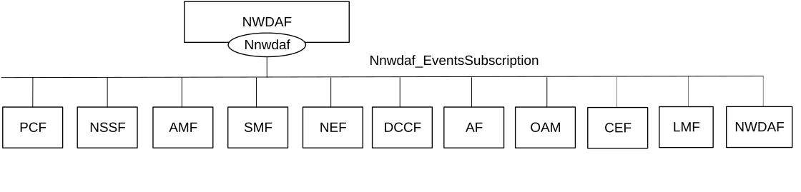
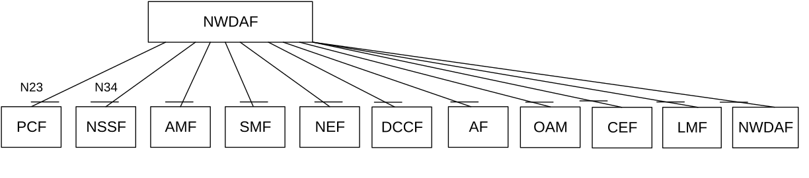

# 4.2.1 Service Description

## 4.2.1.1 Overview

The Nnwdaf_EventsSubscription service corresponding to Nnwdaf_AnalyticsSubscription service as defined in 3GPP TS 23.501 \[2\], 3GPP TS 23.288 \[17\] and 3GPP TS 23.503 \[4\], is provided by the Network Data Analytics Function (NWDAF).

This service:

\- allows NF service consumers to subscribe to and unsubscribe from different analytics events;

\- notifies NF service consumers with a corresponding subscription about observed events. and

\- allows NF service consumers to request the transfer of subscriptions for analytics events.

The types of observed events include:

\- Slice load level information;

\- Network slice instance load level information;

\- Service experience;

\- NF load;

\- Network performance;

\- Abnormal behaviour;

\- UE mobility;

\- UE communication;

\- User data congestion;

\- QoS sustainability;

\- Dispersion;

\- Redundant transmission experience;

\- SM congestion control experience;

\- WLAN performance;

\- DN performance;

\- PFD determination;

\- PDU Session traffic.

\- Movement Behaviour;

\- Location Accuracy;

\- Relative Proximity.

\- End-to-end data volume transfer time.

## 4.2.1.2 Service Architecture

The 5G System Architecture is defined in 3GPP TS 23.501 \[2\]. The Network Data Analytics Exposure architecture is defined in 3GPP TS 23.288 \[17\]. The Network Data Analytics signalling flows are defined in 3GPP TS 29.552 \[25\], the Policy and Charging related 5G architecture is also described in 3GPP TS 23.503 \[4\] and 3GPP TS 29.513 \[5\].

The Nnwdaf_EventsSubscription service is part of the Nnwdaf service-based interface exhibited by the Network Data Analytics Function (NWDAF).

Known consumers of the Nnwdaf_EventsSubscription service are:

\- Policy Control Function (PCF)

\- Network Slice Selection Function (NSSF)

\- Access and Mobility Management Function (AMF)

\- Session Management Function (SMF)

\- Network Exposure Function (NEF)

\- Application Function (AF)

\- Location Management Function (LMF)

\- Operation, Administration, and Maintenance (OAM)

\- Charging Enablement Function (CEF)

\- Network Data Analytics Function (NWDAF)

\- Data Collection Coordination Function (DCCF)

The PCF accesses the Nnwdaf_EventsSubscription service at the NWDAF via the N23 Reference point. The NSSF accesses the Nnwdaf_EventsSubscription service at the NWDAF via the N34 Reference point.

Figure 4.2.1.2-1: Reference Architecture for the Nnwdaf_EventsSubscription Service; SBI representation

Figure 4.2.1.2-2: Reference Architecture for the Nnwdaf_EventsSubscription Service: reference point representation

NOTE: When the NEF subscribes the PFD Determination Analytics to the NWDAF, the NEF needs to support PFDF function as NEF (PFDF).

## 4.2.1.3 Network Functions

### 4.2.1.3.1 Network Data Analytics Function (NWDAF)

The Network Data Analytics Function (NWDAF) provides analytics information for different analytics events to NF service consumers.

The Network Data Analytics Function (NWDAF) allows NF service consumers to subscribe to and unsubscribe from one-time, periodic notification or notification when an event is detected.

The Network Data Analytics Function (NWDAF) allows NF service consumers to request the transfer of subscriptions for analytics events.

### 4.2.1.3.2 NF Service Consumers

The Policy Control Function (PCF):

\- supports (un)subscription to the notification of analytics information for slice load level information from the NWDAF;

\- supports (un)subscription to the notification of analytics information for service experience related network data from the NWDAF;

\- supports (un)subscription to the notification of analytics information for network performance from the NWDAF;

\- supports (un)subscription to the notification of analytics information for abnormal UE behaviour from the NWDAF;

\- supports (un)subscription to the notification of analytics information for UE mobility from the NWDAF;

\- supports (un)subscription to the notification of analytics information for UE communication from the NWDAF;

\- supports (un)subscription to the notification of analytics information for user data congestion from the NWDAF;

\- supports (un)subscription to the notification of analytics information for dispersion from the NWDAF;

\- supports (un)subscription to the notification of analytics information for session management congestion control experience from the NWDAF;

\- supports (un)subscription to the notification of analytics information for redundant transmission experience from the NWDAF;

\- supports (un)subscription to the notification of analytics information for DN performance from the NWDAF;

\- supports (un)subscription to the notification of analytics information for WLAN performance from the NWDAF;

\- supports (un)subscription to the notification of analytics information for PDU Session traffic from the NWDAF; and

\- supports taking one or more above input from the NWDAF into consideration for policies on assignment of network resources and/or for traffic steering policies.

NOTE: How this information is used by the PCF is not standardized in this specification.

The Network Slice Selection Function (NSSF):

\- supports (un)subscription to the notification of analytics information for slice load level information or network slice instance load level information from the NWDAF to determine slice selection;

\- supports (un)subscription to the notification of analytics information for service experience related network data from the NWDAF; and

\- supports (un)subscription to the notification of analytics information for dispersion at the slice from the NWDAF.

The Access and Mobility Management Function (AMF):

\- supports (un)subscription to the notification of analytics information for slice load level information from the NWDAF;

\- supports (un)subscription to the notification of analytics information for service experience related network data from the NWDAF;

\- supports (un)subscription to the notification of analytics information for SMF load information from the NWDAF to determine SMF selection;- supports (un)subscription to the notification of analytics information for expected UE behavioural information (UE mobility and/or UE communication) from the NWDAF to monitor UE behaviour;

\- supports (un)subscription to the notification of analytics information for abnormal UE behaviour information from the NWDAF to determine adjustment of UE mobility related network parameters to solve the abnormal risk; and

\- supports (un)subscription to the notification of analytics information for dispersion at the slice from the NWDAF.

The Session Management Function (SMF):

\- supports (un)subscription to the notification of analytics information for UPF load information from the NWDAF to determine UPF selection;

\- supports (un)subscription to the notification of analytics information for UE mobility information from the NWDAF to determine UPF selection;

\- supports (un)subscription to the notification of analytics information for Session Management Congestion Control Experience from the NWDAF;

\- supports (un)subscription to the notification of analytics information for expected UE behavioural information (UE mobility and/or UE communication) from the NWDAF to monitor UE behaviour;

\- supports (un)subscription to the notification of analytics information for abnormal UE behaviour information from the NWDAF to determine adjustment of UE communication related network parameters to solve the abnormal risk;

\- supports (un)subscription to the notification of analytics information for slice load level information or network slice instance load level information from the NWDAF to determine slice selection.

\- supports (un)subscription to the notification of analytics information for service experience related network data from the NWDAF;

\- supports (un)subscription to the notification of analytics information for redundant transmission experience from the NWDAF to consider whether redundant transmission shall be performed, or (if it had been activated) shall be stopped; and

\- supports (un)subscription to the notification of analytics information for DN performance from the NWDAF.

The Network Exposure Function (NEF):

\- supports (un)subscription to the notification of analytics information for UE mobility from the NWDAF;

\- supports (un)subscription to the notification of analytics information for UE communication from the NWDAF;

\- supports (un)subscription to the notification of analytics information for expected UE behavioural (UE mobility and/or UE communication) from the NWDAF;

\- supports (un)subscription to the notification of analytics information for abnormal behaviour from the NWDAF;

\- supports (un)subscription to the notification of analytics information for user data congestion from the NWDAF;

\- supports (un)subscription to the notification of analytics information for network performance from the NWDAF;

\- supports (un)subscription to the notification of analytics information for QoS Sustainability from the NWDAF;

\- supports (un)subscription to the notification of analytics information for Dispersion from the NWDAF;

\- supports (un)subscription to the notification of analytics information for DN performance from the NWDAF;

\- supports (un)subscription to the notification of analytics information for WLAN performance from the NWDAF;

\- supports (un)subscription to the notification of analytics information for Observed Service Experience from NWDAF;

\- with PFDF function supports (un)subscription to the notification of analytics information for NWDAF assisted PFD Determination from the NWDAF;

\- supports (un)subscription to the notification of analytics information for E2E data volume transfer time from NWDAF;

\- supports (un)subscription to the notification of analytics information for Relative Proximity from NWDAF; and

\- supports (un)subscription to the notification of analytics information for movement behaviour from NWDAF.

The Application Function (AF):

\- supports receiving UE mobility information from NWDAF or via the NEF;

\- supports receiving UE communication information from NWDAF or via the NEF;

\- supports receiving expected UE behavioural information (UE mobility and/or UE communication) from NWDAF or via the NEF;

\- supports receiving abnormal behaviour information from the NWDAF or via the NEF;

\- supports receiving user data congestion information from the NWDAF or via the NEF;

\- supports receiving network performance information from the NWDAF or via the NEF;

\- supports receiving QoS Sustainability information from the NWDAF or via the NEF;

\- supports receiving Dispersion information from the NWDAF or via the NEF;

\- supports receiving DN performance information from the NWDAF or via the NEF;

\- supports receiving WLAN performance information from the NWDAF or via the NEF;

\- supports receiving Observed Service Experience information from NWDAF or via the NEF;

\- supports receiving E2E data volume transfer time from NWDAF or via the NEF;

\- supports receiving Movement Behaviour information from NWDAF or via the NEF; and

\- supports receiving Relative Proximity information from NWDAF or via the NEF.

The Operation, Administration, and Maintenance (OAM):

\- supports receiving slice load level information from the NWDAF;

\- supports receiving observed service experience from the NWDAF;

\- supports receiving NF load information from the NWDAF;

\- supports receiving network performance information from the NWDAF;

\- supports receiving UE mobility information from the NWDAF;

\- supports receiving UE communication information from the NWDAF;

\- supports receiving expected UE behaviour information (UE mobility and/or UE communication) from the NWDAF; and

\- supports receiving abnormal UE behaviour information from the NWDAF.

The Charging Enablement Function (CEF):

\- supports (un)subscription to the notification of analytics information for slice load level information from the NWDAF; and

\- supports (un)subscription to the notification of analytics information for service experience statistics information from the NWDAF.

The Location Management Function (LMF):

> \- supports (un)subscription to the notification of analytics information for location accuracy analytics from the NWDAF.

The Network Data Analytics Function (NWDAF):

\- supports (un)subscription to the notification of analytics information for all types of network analytics from the NWDAF; and

\- supports requesting the transfer of subscriptions to another NWDAF.

The Data Collection Coordination Function (DCCF):

\- supports (un)subscription to the notification of analytics information for all types of network analytics from the NWDAF.
