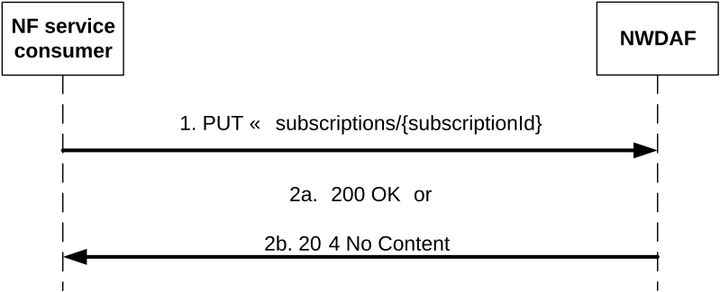

# 4.2.2.2.3 Update subscription for event notifications

Figure 4.2.2.2.3-1 shows a scenario where the NF service consumer sends a request to the NWDAF to update the subscription for event notifications (see also 3GPP TS 23.288 \[17\]).

Figure 4.2.2.2.3-1: NF service consumer updates subscription to notifications

The NF service consumer shall invoke the Nnwdaf_EventsSubscription_Subscribe service operation to update subscription to event notifications. The NF service consumer shall send an HTTP PUT request with "{apiRoot}/nnwdaf-eventssubscription/\<apiVersion\>/subscriptions/{subscriptionId}" as Resource URI representing the "Individual NWDAF Event Subscription", as shown in figure 4.2.2.2.3-1, step 1, to update the subscription for an "Individual NWDAF Event Subscription" resource identified by the {subscriptionId}. The NnwdafEventsSubscription data structure provided in the request body shall include the same contents as described in clause 4.2.2.2.2. In addition, each element of the "eventSubscriptions" may contain the following:

\- Analytics feedback information within the "feedback" attribute, if the "AnalyticsAccuracy" feature is supported and the susbcription is for a prediction.

Upon the reception of an HTTP PUT request with: "{apiRoot}/nnwdaf-eventssubscription/\<apiVersion\>/subscriptions/{subscriptionId}" as Resource URI and NnwdafEventsSubscription data structure as request body, the NWDAF shall:

\- update the subscription of corresponding subscriptionId; and

\- store the subscription.

> NOTE 1: The "notificationURI" attribute within the NnwdafEventsSubscription data structure can be modified to request that subsequent notifications are sent to a new NF service consumer.

If the NWDAF successfully processed and accepted the received HTTP PUT request, the NWDAF shall update an "Individual NWDAF Event Subscription" resource, and shall respond with:

a\) HTTP "200 OK" status code with the message body containing a representation of the updated subscription, as shown in figure 4.2.2.2.3-1, step 2a. If not all the requested analytics events in the subscription are modified successfully, then the NWDAF may include the "failEventReports" attribute indicating the event(s) for which the modification failed and the associated reason(s); or

b\) HTTP "204 No Content" status code, as shown in figure 4.2.2.2.3-1, step 2b.

If errors occur when processing the HTTP PUT request, the NWDAF shall send an HTTP error response as specified in clause 5.1.7.

If the analytics target period provided in the body of the HTTP PUT request includes the start time in the past and the end time in the future, the NWDAF shall reject the request with an HTTP "400 Bad Request" response including the "cause" attribute set to "BOTH_STAT_PRED_NOT_ALLOWED".

When the "PredictionError" feature is supported, if the analytics target period provided in the body of the HTTP PUT request includes the prediction time period in the future and the event is "SM_CONGESTION", "PFD_DETERMINATION" and/or "PDU_SESSION_TRAFFIC", the NWDAF shall reject the request with an HTTP "400 Bad Request" response including the "cause" attribute set to "PREDICTION_NOT_ALLOWED".

If the statistics in the past are requested but the necessary data to perform the service is unavailable, the NWDAF shall reject the request with an HTTP "500 Internal Server Error" response including the "cause" attribute set to "UNAVAILABLE_DATA".

If the user consent has not been checked by the NF service consumer and is required for the requested analytics collection depending on local policy and regulations, then the NWDAF shall check user consent for the targeted UE(s) based on the user consent subscription data that is retrieved via the Nudm_SDM service API of the UDM as described in clause 5.2.2.24 and clause 6.1.3.32 of 3GPP TS 29.503 \[23\]. If the user consent subscription data retrieved from the UDM indicate that the user consent is not granted for the impacted user(s), then the NWDAF shall send an HTTP "403 Forbidden" error response including the "cause" attribute set to "USER_CONSENT_NOT_GRANTED".

NOTE 2: When the target of reporting is a SUPI or a GPSI then the subscription can be rejected, e.g. because user consent is not granted, and the error is sent to the consumer. When the target of reporting is an Internal Group Id, or a list of SUPIs/GPSI(s) or any UE, and the user consent is not granted for a subset of the impacted users, then no error is sent, but a subset of the SUPIs/GPSIs is skipped if user consent is not granted.

Otherwise, if the user consent subscription data retrieved from the UDM indicate that the user consent is granted for the impacted user(s), the NWDAF shall subscribe to notification of changes of the user consent (unless it is already subscribed) by invoking the Nudm_SDM_Subscribe service operation by sending an HTTP POST request targeting the resource "SdmSubscriptions" to the UDM as described in clause 5.2.2.3 of 3GPP TS 29.503 \[23\].

If the RoamingAnalytics feature is supported and the NWDAF determines based on operator configuration and the requested analytics that analytics or input data from the VPLMN are required, and the NWDAF does not support roaming exchange and it cannot forward the request to another NWDAF, then the NWDAF shall reject the request with an HTTP "403 Forbidden" response including the "cause" attribute set to "NO_ROAMING_SUPPORT".

If the feature "ES3XX" is supported, and the NWDAF determines the received HTTP PUT request needs to be redirected, the NWDAF shall send an HTTP redirect response as specified in clause 6.10.9 of 3GPP TS 29.500 \[6\].

When the "notifFlag" attribute is included in the request with the value "DEACTIVATE", the NWDAF shall mute the event notification and store the available events until the NF service consumer requests to retrieve them by setting the "notifFlag" attribute to "RETRIEVAL" or until a muting exception occurs (e.g. full buffer); if the "notifFlag" attribute is set to the value "RETRIEVAL", the NWDAF shall send the stored events to the NF service consumer, mute the event notification again and store available events; if the "notifFlag" attribute is set to the value "ACTIVATE" and the event notifications are muted (due to a previously received "DECATIVATE" value), the NWDAF shall unmute the event notification, i.e. start sending again notifications for available events.
