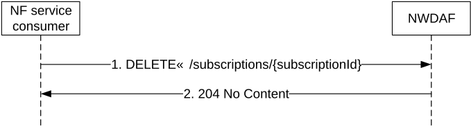

# 4.2.2.3 Nnwdaf_EventsSubscription_Unsubscribe service operation

## 4.2.2.3.1 General

The Nnwdaf_EventsSubscription_Unsubscribe service operation is used by an NF service consumer to unsubscribe from event notifications.

## 4.2.2.3.2 Unsubscribe from event notifications

Figure 4.2.2.3.2-1 shows a scenario where the NF service consumer sends a request to the NWDAF to unsubscribe from event notifications (see also 3GPP TS 23.288 \[17\]).

Figure 4.2.2.3.2-1: NF service consumer unsubscribes from notifications

The NF service consumer shall invoke the Nnwdaf_EventsSubscription_Unsubscribe service operation to unsubscribe to event notifications. The NF service consumer shall send an HTTP DELETE request with: "{apiRoot}/nnwdaf-eventssubscription/\<apiVersion\>/subscriptions/{subscriptionId}" as Resource URI, where "{subscriptionId}" is the event subscriptionId of the existing subscription that is to be deleted.

Upon the reception of an HTTP DELETE request with: "{apiRoot}/nnwdaf-eventssubscription/\<apiVersion\>/subscriptions/{subscriptionId}" as Resource URI, if the NWDAF successfully processed and accepted the received HTTP DELETE request, the NWDAF shall:

\- remove the corresponding subscription; and

\- respond with HTTP "204 No Content" status code.

If errors occur when processing the HTTP DELETE request, the NWDAF shall send an HTTP error response as specified in clause 5.1.7.

If the feature "ES3XX" is supported, and the NWDAF determines the received HTTP DELETE request needs to be redirected, the NWDAF shall send an HTTP redirect response as specified in clause 6.10.9 of 3GPP TS 29.500 \[6\].
