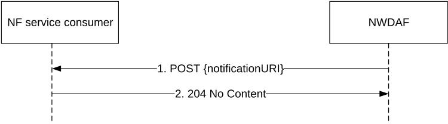

# 4.2.2.4 Nnwdaf_EventsSubscription_Notify service operation

## 4.2.2.4.1 General

The Nnwdaf_EventsSubscription_Notify service operation is used by an NWDAF to notify NF consumers about subscribed events or by the target NWDAF to notify the consumer of the successful analytics subscription transfer.

## 4.2.2.4.2 Notification about subscribed event

Figure 4.2.2.4.2-1 shows a scenario where the NWDAF sends a request to the NF service consumer to notify for event notifications or notify for the successful analytics subscription transfer (see also 3GPP TS 23.288 \[17\]).

Figure 4.2.2.4.2-1: NWDAF notifies the subscribed event

The NWDAF shall invoke the Nnwdaf_EventsSubscription_Notify service operation to notify the subscribed event or the successful analytics subscription transfer. The NWDAF shall send an HTTP POST request with "{notificationURI}" received in the Nnwdaf_EventsSubscription_Subscribe service operation as Resource URI, as shown in figure 4.2.2.4.2-1, step 1.

If both the repetition period ("repPeriod" or "repetitionPeriod") attribute and the "offsetPeriod" attribute are present in the subscription request for periodical notification, the NWDAF shall produce a notification in every repetition period seconds, including the statistics in the past offset period if the "offsetPeriod" attribute value is negative, or including the prediction for the future offset period if the "offsetPeriod" attribute value is positive.

The NnwdafEventsSubscriptionNotification data structure provided in the request body shall include:

\- If the notification is for notifying about the analytics information of subscribed events, a description of the notified event as "eventNotifications" attribute that for each event shall include:

a\) an event identifier as "event" attribute;

b\) network slice load level information in the "sliceLoadLevelInfo" attribute when subscribed event is "SLICE_LOAD_LEVEL";

c\) service experience information as "svcExps" attribute when subscribed event is "SERVICE_EXPERIENCE";

d\) UE mobility information in the "ueMobs" attribute when subscribed event is "UE_MOBILITY";

e\) UE communication information in the "ueComms" attribute when subscribed event is "UE_COMMUNICATION";

f\) abnormal behaviour information in the "abnorBehavrs" attribute when subscribed event is "ABNORMAL_BEHAVIOUR";

g\) user data congestion information in the "userDataCongInfos" attribute when subscribed event is "USER_DATA_CONGESTION";

h\) QoS sustainability information in the "qosSustainInfos" attribute when subscribed event is "QOS_SUSTAINABILITY";

i\) NF load information in "nfLoadLevelInfos" attribute when subscribed event is "NF_LOAD";

j\) network performance information in the "nwPerfs" attribute when subscribed event is "NETWORK_PERFORMANCE";

k\) Load level information for the network slice(s) and the optionally associated network slice instance(s) in "nsiLoadLevelInfos" attribute when subscribed event is "NSI_LOAD_LEVEL";

l\) Dispersion information in the "disperInfos" attribute when subscribed event is "DISPERSION";

m\) Redundant transmission experience information in the "redTransInfos" attribute when subscribed event is "RED_TRANS_EXP";

n\) WLAN performance information in the "wlanInfos" attribute when subscribed event is "WLAN_PERFORMANCE";

o\) DN performance information in the "dnPerfInfos" attribute when subscribed event is "DN_PERFORMANCE";

p\) SMCCE performance information in the "smccExps" attribute when subscribed event is "SM_CONGESTION";

q\) PFD Determination information for known application identifier(s) in the "pfdDetermInfos" attribute when subscribed event is "PFD_DETERMINATION";

r\) PDU Session traffic information in the "pduSesTrafInfos" attribute when subscribed event is "PDU_SESSION_TRAFFIC";

s\) E2E data volume transfer time in the "dataVlTrnsTmInfos" attribute when subscribed event is "E2E_DATA_VOL_TRANS_TIME";

t\) Movement Behaviour information in the "movBehavInfos" attribute when subscribed event is "MOVEMENT_BEHAVIOUR";

u\) Location Accuracy information in the "locAccInfos" attribute when the subscribed event is "LOC_ACCURACY"; and

v\) Relative Proximity information in the " relProxInfos" attribute when subscribed event is "RELATIVE_PROXIMITY";

and may include:

a\) information about analytics metadata required for aggregation of the analytics in the "anaMetaInfo" attribute if the feature "Aggregation" is supported;

b\) the start time of which the analytics information will become valid in the "start" attribute, if the "EneNA" feature is supported;

c\) the expiration time after which the analytics information will become invalid in the "expiry" attribute.

\- If the feature "AnalyticsAccuracy" is supported and the notification is for notifying about the accuracy information of subscribed events (which requires that the "accuReq" attribute was set to "true" in the subscription request), a description of the notified event as "eventNotifications" attribute that for each event shall include:

a\) an event identifier as "event" attribute; and

b\) the analytics accuracy information in "accuInfo" attribute, if the "cancelAccuInd" attribute is set to "false" or omitted;

and may include:

c\) an indication that the NWDAF cancelled subscription of analytics accuracy information in "cancelAccuInd" attribute;

d\) the pause analytics consumption indication in "pauseInd" attribute;

e\) the resume analytics consumption indication in "resumeInd" attribute.

NOTE 1: In this version of the specification, the NWDAF containing AnLF can provide the accuracy information to an NF consumer that subscribes to the analytics.

NOTE 2: When receiving a subscription from an NF service consumer that includes the request for accuracy information, the analytics and/or the accuracy information can be provided by NWDAF containing AnLF in one notification or via different notifications.

NOTE 3: In this version of the specification, only subscribing or requesting accuracy information without requesting analytics is not supported.

\- If the "EneNA" feature is supported and the target NWDAF notifies a successful analytics subscription transfer, the old subscription ID which had been allocated by the source NWDAF within the "oldSubscriptionId" attribute and the resource URI of the Individual NWDAF Event Subscription resource created by the target NWDAF within "resourceUri" attribute, and if the "PartialAnalyticsSubTransfer" feature is supported and not all the analytics events in the subscription transfer are accepted, the successful transferred subscription event(s) within the "transEvents" attribute; and

\- an event subscription Id as "subscriptionId" attribute;

and may include:

a\) the notification correlation identifier in the "notifCorrId" attribute, if the "EneNA" feature is supported.

b\) a cause for termination in the "termCause" attribute, if the "TermRequest" feature is supported and the NWDAF wants to request the termination of this subscription, i.e. to indicate that it will send no further notifications for it.

If the feature "EneNA" is supported and the time when analytics information is needed has been provided (via the "timeAnaNeeded" attribute within the "extraReportReq" attribute) during the subscription for an event (via the "event" attribute within the EventSubscription data type), if the time when analytics information is needed is reached but the subscribed analytics information is not ready, the consumer does not need to wait for the analytics information any longer. In this case, the NWDAF may send an HTTP POST request as shown in step 1 of figure 4.2.2.4.2-1, which shall only provide (within the EventNotification data type in the NnwdafEventsSubscriptionNotification data type) an indication of the failure event via the "event" attribute and the corresponding failure reason via a "failNotifyCode" attribute, and may also provide a minimum time interval recommended by the NWDAF for the event via a "rvWaitTime" attribute which will be used by the NF service consumer to determine the time when analytics information is needed in similar future analytics subscriptions.

Upon the reception of an HTTP POST request with: "{notificationURI}" as Resource URI and NnwdafEventsSubscriptionNotification data structure as request body, if the NF service consumer successfully processed and accepted the received HTTP POST request, the NF service consumer shall:

\- store the notification; and

\- respond with HTTP "204 No Content" status code.

If errors occur when processing the HTTP POST request, the NF service consumer shall send an HTTP error response as specified in clause 5.1.7.

If the feature "ES3XX" is supported, and the NF service consumer determines the received HTTP POST request needs to be redirected, the NF service consumer shall send an HTTP redirect response as specified in clause 6.10.9 of 3GPP TS 29.500 \[6\].
