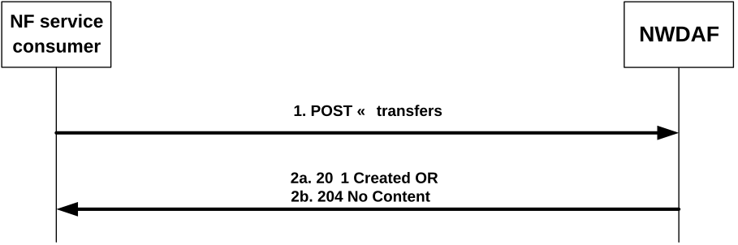
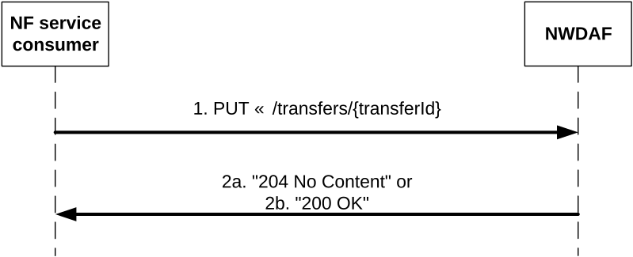
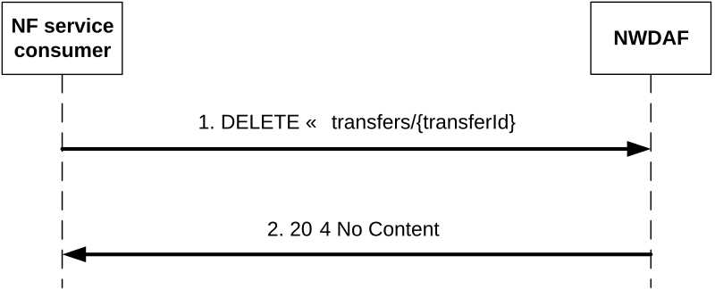

# 4.2.2.5 Nnwdaf_EventsSubscription_Transfer service operation

## 4.2.2.5.1 General

The Nnwdaf_EventsSubscription_Transfer service operation is used by an NWDAF instance to request the transfer of analytics subscription(s) to another NWDAF instance. If the source NWDAF discovers that the analytics consumer may change concurrently to this procedure, the source NWDAF should not perform the procedure. In such a case, the source NWDAF may send a message to indicate to the analytics consumer that it will not serve this subscription anymore.

NOTE 1: To discover the possible change of analytics consumer, if the Analytics ID is UE related, the source NWDAF takes actions responding to external trigger (such as UE mobility), for example, checking if the Target of Analytics Reporting is still within the serving area of the analytics consumer, if the serving area information of the consumer is available.

NOTE 2: Handling of overload situation or preparation for a graceful shutdown are preferably executed inside an NWDAF Set, when available, therefore, not requiring an analytics subscription transfer as described in this clause.

## 4.2.2.5.2 Creation of request for analytics subscription transfer

Figure 4.2.2.5.2-1 shows a scenario where the NF Service Consumer (e.g. NWDAF) sends a request to the NWDAF to request the transfer of analytics subscription(s) from the NF Service Consumer to the NF Service Producer (see also 3GPP TS 23.288 \[17\]).

Figure 4.2.2.5.2-1: NF service consumer requests an analytics subscription transfer

The NF service consumer shall invoke the Nnwdaf_EventsSubscription_Transfer service operation to request the transfer of analytics subscription(s). The NF service consumer shall send an HTTP POST request with "{apiRoot}/nnwdaf-eventssubscription/\<apiVersion\>/transfers" as Resource URI representing the "NWDAF Event Subscription Transfers", as shown in figure 4.2.2.5.2-1, step 1, to create a request for an "Individual NWDAF Event Subscription Transfer" according to the information in the message body. The AnalyticsSubscriptionsTransfer data structure provided in the request body shall include:

\- information about the subscription(s) transfer request as "subsTransInfos" attribute, which, for each subscription that is requested to be transferred, shall include:

a\) the type of the transfer request (i.e. if it is a request for transfer preparation or transfer execution) in the "transReqType" attribute;

b\) information about the analytics subscription in the "nwdafEvSub" attribute, its contents being as defined for the NnwdafEventsSubscription data structure in clause 4.2.2.2.2; and

c\) the NF instance identifer of the consumer of the analytics subscription in the "consumerId" attribute;

and may include:

a\) analytics context identifier information about the context that is available at the NF service consumer in the "contextId" attribute;

b\) NF instance identifer(s) of active data source(s) the NF service consumer is currently using for the analytics of this analytics subscription in the "sourceNfIds" attribute;

c\) NF set identifer(s) of active data source(s) the NF service consumer is currently using for the analytics of this analytics subscription in the "sourceSetIds" attribute;

d\) information identifying the ML model(s) that the NF service consumer is currently using for the analytics in the "modelInfo" attribute.

Upon the reception of an HTTP POST request with: "{apiRoot}/nnwdaf-eventssubscription/\<apiVersion\>/transfers" as Resource URI and AnalyticsSubscriptionsTransfer data structure as request body, in the successful case the NWDAF shall:

\- if the "transReqType" attribute has the value PREPARE, perform the steps required for the preparation of an analytics subscription transfer as described in clause 5.4.3 of TS 29.552 \[25\], create a new Individual NWDAF Event Subscription Transfer resource and send an HTTP "201 Created" response with the URI for the created resource in the "Location" header field, as shown in figure 4.2.2.5.2-1, step 2a; If the "PartialAnalyticsSubTransfer" feature is supported and not all the analytics events in the subscription transfer are accepted, then the NWDAF includes the "failTransEventReports" attribute indicating the failure event(s).

\- if the "transReqType" attribute has the value TRANSFER, perform the steps required for the execution of an analytics subscription transfer as described in clause 5.4.2 of TS 29.552 \[25\],

a\) if the "PartialAnalyticsSubTransfer" feature is not supported, or if the "PartialAnalyticsSubTransfer" feature is supported and all the analytics events in the subscription transfer are accepted, send an HTTP "204 No Content" response, as shown in figure 4.2.2.5.2-1, step 2b;

b\) if the "PartialAnalyticsSubTransfer" feature is supported and not all the analytics events in the subscription transfer are accepted, the NWDAF creates a new Individual NWDAF Event Subscription Transfer resource and sends an HTTP "201 Created" response with the URI for the created resource in the "Location" header field and with the message body containing a representation of the created subscription transfer including the "failTransEventReports" attribute indicating the failure event(s), as shown in figure 4.2.2.5.2-1, step 2a. The NWDAF then removes the Individual NWDAF Event Subscription Transfer resource.

If errors occur when processing the HTTP POST request, the NF service consumer shall send an HTTP error response as specified in clause 5.1.7.

## 4.2.2.5.3 Update a request for analytics subscription transfer

Figure 4.2.2.5.3-1 shows a scenario where the NF Service Consumer (e.g. NWDAF) sends a request to the NWDAF to update a request for the transfer of analytics subscription(s) from the NF Service Consumer to the NF Service Producer (see also 3GPP TS 23.288 \[17\]).

Figure 4.2.2.5.3-1: NF service consumer updates a request for an analytics subscription transfer

The NF service consumer shall invoke the Nnwdaf_EventsSubscription_Transfer service operation to update a request for the transfer of analytics subscription(s). The NF service consumer shall send an HTTP PUT request with "{apiRoot}/nnwdaf-eventssubscription/\<apiVersion\>/transfers/{transferId}" as Resource URI representing the "Individual NWDAF Event Subscription Transfer", as shown in figure 4.2.2.5.3-1, step 1, to update the "Individual NWDAF Event Subscription Transfer" resource identified by the {transferId}. The AnalyticsSubscriptionsTransfer data structure provided in the request body shall include the same contents as described in clause 4.2.2.5.2.

Upon the reception of an HTTP PUT request with: "{apiRoot}/nnwdaf-eventssubscription/\<apiVersion\>/transfers/{transferId}" as Resource URI and AnalyticsSubscriptionsTransfer data structure as request body, the NWDAF shall:

\- if the "transReqType" attribute has the value PREPARE, perform the steps required for the preparation of an analytics subscription transfer as described in clause 5.4.3 of TS 29.552 \[25\], update the Individual NWDAF Event Subscription Transfer resource identified by "transferId",

a\) if the "PartialAnalyticsSubTransfer" feature is not supported, or if the "PartialAnalyticsSubTransfer" feature is supported and all the analytics events in the subscription transfer are accepted, send an HTTP "204 No Content" response, as shown in figure 4.2.2.5.3-1, step 2a;

b\) if the "PartialAnalyticsSubTransfer" feature is supported and and not all the analytics events in the subscription transfer are accepted, send an HTTP "200 OK" response with the message body containing a representation of the updated subscription transfer, as shown in figure 4.2.2.5.3-1, step 2b, and the NWDAF includes the "failTransEventReports" attribute indicating the failure event(s).

\- if the "transReqType" attribute has the value TRANSFER, perform the steps required for the execution of an analytics subscription transfer as described in clause 5.4.2 of TS 29.552 \[25\], where:

a\) if the "PartialAnalyticsSubTransfer" feature is not supported, or if the "PartialAnalyticsSubTransfer" feature is supported and all the analytics events in the subscription transfer are accepted, remove the Individual NWDAF Event Subscription Transfer resource identified by "transferId", and send an HTTP "204 No Content" response, as shown in figure 4.2.2.5.3-1, step 2a;

b\) if the "PartialAnalyticsSubTransfer" feature is supported and and not all the analytics events in the subscription transfer are accepted, update the Individual NWDAF Event Subscription Transfer resource identified by "transferId", and send an HTTP "200 OK" response with the message body containing a representation of the updated subscription transfer including the "failTransEventReports" attribute indicating the failure event(s), as shown in figure 4.2.2.5.3-1, step 2b. The NWDAF then removes the Individual NWDAF Event Subscription Transfer resource.

If errors occur when processing the HTTP PUT request, the NWDAF shall send an HTTP error response as specified in clause 5.1.7.

If the NWDAF determines the received HTTP PUT request needs to be redirected, the NWDAF shall send an HTTP redirect response as specified in clause 6.10.9 of 3GPP TS 29.500 \[6\].

## 4.2.2.5.4 Cancel a request for analytics subscription transfer

Figure 4.2.2.5.4-1 shows a scenario where the NF service consumer (e.g. NWDAF) sends a request to the NWDAF to cancel a request for the transfer of analytics subscription(s) from the NF service consumer to the NF Service Producer (see also 3GPP TS 23.288 \[17\]).

Figure 4.2.2.5.4-1: NF service consumer cancels a request for an analytics subscription transfer

The NF service consumer shall invoke the Nnwdaf_EventsSubscription_Transfer service operation to cancel a request for the transfer of analytics subscription(s). The NF service consumer shall send an HTTP DELETE request with "{apiRoot}/nnwdaf-eventssubscription/\<apiVersion\>/transfers/{transferId}" as Resource URI representing the "Individual NWDAF Event Subscription Transfer", as shown in figure 4.2.2.5.4-1, step 1, to cancel the "Individual NWDAF Event Subscription Transfer" resource identified by the {transferId}.

Upon the reception of an HTTP DELETE request with: "{apiRoot}/nnwdaf-eventssubscription/\<apiVersion\>/transfers/{transferId}" as Resource URI, if the NWDAF successfully processed and accepted the received HTTP DELETE request, the NWDAF shall:

\- if applicable, delete any analytics data that is no longer needed and unsubscribe to entities for data collection or ML model acquisition, if the subscriptions are not needed for other active analytics subscriptions;

\- remove the corresponding Individual NWDAF Event Subscription Transfer resource; and

\- respond with HTTP "204 No Content" status code, as shown in figure 4.2.2.5.4-1, step 2.

If errors occur when processing the HTTP DELETE request, the NWDAF shall send an HTTP error response as specified in clause 5.1.7.

If the NWDAF determines the received HTTP DELETE request needs to be redirected, the NWDAF shall send an HTTP redirect response as specified in clause 6.10.9 of 3GPP TS 29.500 \[6\].
