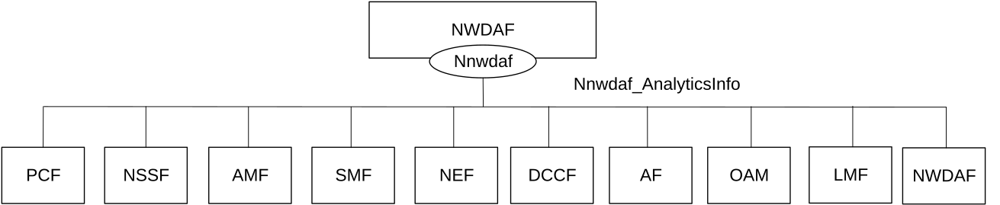
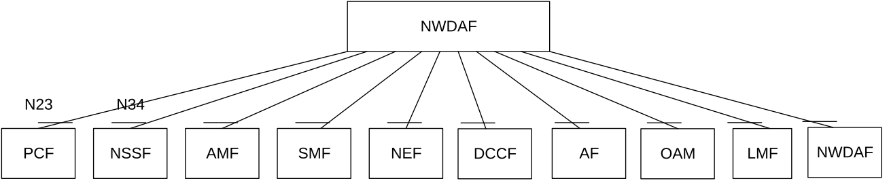

# 4.3.1 Service Description

## 4.3.1.1 Overview

The Nnwdaf_AnalyticsInfo service as defined in 3GPP TS 23.501 \[2\], 3GPP TS 23.288 \[17\] and 3GPP TS 23.503 \[4\], is provided by the Network Data Analytics Function (NWDAF).

This service:

\- allows NF service consumers to request and get different type of analytic event information; and

\- allows NF service consumers to request and get context information related to analytics subscriptions.

The types of observed events include:

\- Slice load level information;

\- Network slice instance load level information;

\- Service experience;

\- NF load;

\- Network performance;

\- Abnormal behaviour;

\- UE mobility;

\- UE communication;

\- User data congestion;

\- QoS sustainability;

\- SM congestion control experience;

\- Dispersion;

\- Redundant transmission experience;

\- WLAN performance;

\- DN performance;

\- PDU Session traffic;

\- Movement Behaviour;

\- Location Accuracy; and

\- Relative Proximity.

## 4.3.1.2 Service Architecture

The 5G System Architecture is defined in 3GPP TS 23.501 \[2\]. The Network Data Analytics Exposure architecture is defined in 3GPP TS 23.288 \[17\]. The Network Data Analytics signalling flows are defined in 3GPP TS 29.552 \[25\], the Policy and Charging related 5G architecture is also described in 3GPP TS 23.503 \[4\] and 3GPP TS 29.513 \[5\].

The Nnwdaf_AnalyticsInfo service is part of the Nnwdaf service-based interface exhibited by the Network Data Analytics Function (NWDAF).

Known consumers of the Nnwdaf_AnalyticsInfo service are:

\- Policy Control Function (PCF)

\- Network Slice Selection Function (NSSF)

\- Access and Mobility Management Function (AMF)

\- Session Management Function (SMF)

\- Network Exposure Function (NEF)

\- Application Function (AF)

\- Location Management Function (LMF)

\- Operation, Administration, and Maintenance (OAM)

\- Network Data Analytics Function (NWDAF)

\- Data Collection Coordination Function (DCCF)

The PCF accesses the Nnwdaf_AnalyticsInfo service at the NWDAF via the N23 Reference point. The NSSF accesses the Nnwdaf_AnalyticsInfo service at the NWDAF via the N34 Reference point.

Figure 4.3.1.2-1: Reference Architecture for the Nnwdaf_AnalyticsInfo Service; SBI representation

Figure 4.3.1.2-2: Reference Architecture for the Nnwdaf_AnalyticsInfo Service: reference point representation

## 4.3.1.3 Network Functions

### 4.3.1.3.1 Network Data Analytics Function (NWDAF)

The Network Data Analytics Function (NWDAF) provides specific analytics information for different analytic events and, if the "AnaCtxTransfer" feature is supported, context information related to analytics subscriptions to NF service consumers.

### 4.3.1.3.2 NF Service Consumers

The Policy Control Function (PCF):

\- supports taking analytics information for slice load level information from the NWDAF;

\- supports taking analytics information for service experience related network data from the NWDAF;

\- supports taking analytics information for network performance from the NWDAF;

\- supports taking analytics information for abnormal UE behaviour from the NWDAF;

\- supports taking analytics information for UE mobility from the NWDAF;

\- supports taking analytics information for UE communication from the NWDAF;

\- supports taking analytics information for user data congestion from the NWDAF.

\- supports taking analytics information for dispersion from the NWDAF;

\- supports taking analytics information for session management congestion control experience from the NWDAF;

\- supports taking analytics information for redundant transmission experience from the NWDAF;

\- supports taking analytics information for DN performance from the NWDAF;

\- supports taking analytics information for WLAN performance from the NWDAF;

\- supports taking one or more above input from NWDAF into consideration for policies on assignment of network resources and/or for traffic steering policies; and

\- supports taking analytics information for PDU Session traffic from the NWDAF.

NOTE: How this information is used by the PCF is not standardized in this specification.

The Network Slice Selection Function (NSSF):

\- supports taking slice load level information or network slice instance load level information from the NWDAF into consideration for slice selection;

\- supports taking analytics information for service experience related network data from the NWDAF; and

\- supports taking analytics information for dispersion at the slice from the NWDAF.

The Access and Mobility Management Function (AMF):

\- supports taking SMF load information from the NWDAF into consideration for SMF selection;

\- supports taking expected UE behaviour information (UE mobility and/or UE communication) from the NWDAF into consideration for monitoring UE behaviour;

\- supports taking abnormal UE behaviour information from the NWDAF into consideration for adjustment of UE mobility related network parameters to solve the abnormal risk;

\- supports taking slice load level information or network slice instance load level information from NWDAF into consideration for slice selection;

\- supports taking analytics information for service experience related network data from the NWDAF; and

\- supports taking analytics information for dispersion at the slice from the NWDAF.

The Session Management Function (SMF):

\- supports taking UPF load information from the NWDAF into consideration for UPF selection;

\- supports taking expected UE behaviour information (UE mobility and/or UE communication) from the NWDAF into consideration for monitoring UE behaviour;

\- supports taking UE mobility information from the NWDAF into consideration for UPF selection;

\- supports taking abnormal UE behaviour information from the NWDAF into consideration for adjustment of UE mobility related network parameters to solve the abnormal risk;

\- supports taking analytics information for SM congestion control experience from the NWDAF into consideration for determining back-off timer provided to UE;

\- supports taking analytics information for slice load level or network slice instance load level from the NWDAF into consideration to determine slice selection;

\- supports taking analytics information for service experience from the NWDAF into consideration to (re)select UP paths;

\- supports taking analytics information for redundant transmission experience from the NWDAF to consider whether redundant transmission shall be performed, or (if it had been activated) shall be stopped; and

\- supports taking analytics information for DN performance from the NWDAF into consideration for user plane performance.

The Network Exposure Function (NEF):

\- supports taking analytics information for UE mobility from the NWDAF;

\- supports taking analytics information for UE communication from the NWDAF;

\- supports taking analytics information for expected UE behavioural (UE mobility and/or UE communication) from the NWDAF;

\- supports taking analytics information for abnormal behaviour from the NWDAF;

\- supports taking analytics information for user data congestion from the NWDAF;

\- supports taking analytics information for network performance from the NWDAF;

\- supports taking analytics information for QoS Sustainability from the NWDAF;

\- supports taking analytics information for Dispersion from the NWDAF;

\- supports taking analytics information for DN performance from the NWDAF;

\- supports taking analytics information for WLAN performance from the NWDAF;

\- supports taking analytics information for Observed Service Experience from NWDAF;

\- supports taking analytics information for E2E data volume transfer time from NWDAF;

\- supports taking analytics information for Relative Proximity from NWDAF; and

\- supports taking analytics information for movement behaviour from NWDAF.

The Application Function (AF):

\- supports receiving UE mobility information from the NWDAF or via the NEF;

\- supports receiving UE communication information from the NWDAF or via the NEF;

\- supports receiving expected UE behavioural information (UE mobility and/or UE communication) from the NWDAF or via the NEF;

\- supports receiving abnormal behaviour information from the NWDAF or via the NEF;

\- supports receiving user data congestion information from the NWDAF or via the NEF;

\- supports receiving network performance information from the NWDAF or via the NEF;

\- supports receiving QoS Sustainability information from the NWDAF or via the NEF;

\- supports receiving Dispersion information from the NWDAF or via the NEF;

\- supports receiving DN performance information from NWDAF or via the NEF;

\- supports receiving WLAN performance information from NWDAF or via the NEF;

\- supports receiving Observed Service Experience information from NWDAF or via the NEF;

\- supports receiving E2E data volume transfer time from NWDAF or via the NEF.

\- supports receiving Movement Behaviour information from NWDAF or via the NEF. and

\- supports receiving Relative Proximity information from NWDAF or via the NEF.

The Location Management Function (LMF):

\- supports taking Location Accuracy analytics from the NWDAF into consideration as assistance for location services.

The Operation, Administration, and Maintenance (OAM):

\- supports receiving slice load level information from the NWDAF;

\- supports receiving observed service experience from the NWDAF;

\- supports receiving NF load information from the NWDAF;

\- supports receiving network performance information from the NWDAF;

\- supports receiving UE mobility information from the NWDAF;

\- supports receiving UE communication information from the NWDAF;

\- supports receiving expected UE behaviour information (UE mobility and/or UE communication) from the NWDAF; and

\- supports receiving abnormal UE behaviour information from the NWDAF.

The Network Data Analytics Function (NWDAF):

\- supports receiving information for all types of network data analytics from the NWDAF; and

\- supports receiving context information related to analytics subscriptions from the NWDAF.

The Data Collection Coordination Function (DCCF):

\- supports receiving information for all types of network data analytics from the NWDAF.
