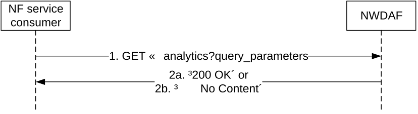

# 4.3.2.2.2 Request and get from NWDAF Analytics information

Figure 4.3.2.2.2-1 shows a scenario where the NF service consumer (e.g. PCF) sends a request to the NWDAF to request and get from the NWDAF analytics information (as shown in 3GPP TS 23.288 \[17\]).

Figure 4.3.2.2.2-1: Requesting a NWDAF Analytics information

The NF service consumer (e.g. PCF) shall invoke the Nnwdaf_AnalyticsInfo_Request service operation when requesting the NWDAF analytics information. The NF service consumer shall send an HTTP GET request on the resource URI "{apiRoot}/nnwdaf-analyticsinfo/\<apiVersion\>/analytics" representing the "NWDAF Analytics" (as shown in figure 4.3.2.2.2-1, step 1), to request analytics data according to the query parameter value of the "event-id" attribute. In addition, the following information may be provided:

\- common reporting requirement in the "ana-req" attribute as follows:

1\) identification of time window for the requested analytics data applies via identification of date-time(s) in the "startTs" and "endTs" attributes;

2\) preferred level of accuracy of the analytics in "accuracy" attribute;

3\) percentage of sampling among impacted UEs in the "sampRatio" attribute;

4\) maximum number of objects in the "maxObjectNbr" attribute;

5\) maximum number of SUPIs expected for an analytics report in the "maxSupiNbr" attribute;

6\) identification of time when analytics information is needed in the "timeAnaNeeded" attribute if the feature "EneNA" is supported;

7\) indication of which analytics metadata is requested to be delivered with the response in the "anaMeta" attribute if the feature "Aggregation" is supported;

8\) requested values for the analytics metadata information to be used for the generation of the analytics in the "anaMetaInd" attribute if the feature "Aggregation" is supported;

9\) preferred accuracy level per analytics subset in the "accPerSubset" attribute if the "listOfAnaSubsets" attribute is present and the EneNA feature is supported; and/or

> 10\) the time period of historical analytics in the "histAnaTimePeriod" attribute if the "EneNA" feature is supported;

NOTE 1: The NWDAF can use the use case context to select the most relevant ML model, when several ML models are available for the requested Analytics ID(s). The NWDAF containing AnLF can additionally provide the use case context when requesting an ML model from an NWDAF containing MTLF. The values of this parameter are not standardized.

For all the event types, the "event-filter" attribute may include:

\- the analytics accuracy requirement information in "accuReq" attribute as indication to the NWDAF to activate checking the analytics accuracy information of the requested event, if the "AnalyticsAccuracy" feature is supported and the NF service consumer discovered or local configured the NWDAF containing an AnLF supporting the accuracy checking capability.

\- use case context as "useCaseCxt" attribute, if the "ENAExt" feature is supported.

\- information related to roaming within the "roamingInfo" attribute if the "RoamingAnalytics" feature is supported;

NOTE 2: The request for analytics accuracy information independently from request of the analytics event output is not supported in this release.

For different event types:

\- if the event is "LOAD_LEVEL_INFORMATION", it shall provide the event specific filter information within "event-filter" attribute including identification(s) of the network slice via:

1\) identification of network slice(s) in the "snssais" attribute; or

2\) any slices indication in the "anySlice" attribute;

\- if the feature "NsiLoad" is supported and the event is "NSI_LOAD_LEVEL", it shall provide the event specific filter information within "event-filter" attribute including identification(s) of the network slice via:

1\) identification of network slice(s) and the optionally associated instance(s) if available, in the "nsiIdInfos" attribute; or

NOTE 3: The network slice instance of a PDU session is not available in the PCF.

2\) any slices indication in the "anySlice" attribute;

and may include:

1\) a list of analytics subsets carried by "listOfAnaSubsets" attribute with value(s) only applicable to "NSI_LOAD_LEVEL" event, if the "EneNA" feature is supported;

2\) event specific filter information in the "event-filter" attribute:

a\) list of NF instance types in the "nfTypes" attribute, if the "NsiLoadExt" feature is supported; and/or

b\) identification of network area to which the request applies via identification of network area by "networkArea" attribute, if the "NsiLoadExt" feature is supported.

\- if the feature "NfLoad" is supported and the event is "NF_LOAD", it shall provide:

1\) identification of target UE(s) to which the request applies by "supis" or "anyUe" attribute set to "true" in the "tgt-ue" attribute; and

NOTE 4: Only NF instances of type AMF and SMF which are serving the UE can be determined using a SUPI in "supis" attribute.

NOTE 5: If a list of the NF Instance IDs (or respectively of NF Set IDs) is provided, the NWDAF needs to provide the analytics for each designated NF instance (or respectively for each NF instance belonging to each designated NF Set). In such case the target UE(s) of the Analytics Reporting need be ignored.

\- the "event-filter" attribute may provide:

a\) either list of NF instance IDs in the "nfInstanceIds" attribute or list of NF set IDs in the "nfSetIds" attribute if the identification of target UE(s) applies to all UEs;

b\) list of NF instance types in the "nfTypes" attribute;

c\) identification of network slice(s) in the "snssais" attribute;

d\) optional area of interest by "networkArea" attribute; and/or

e\) an optional list of analytics subsets by "listOfAnaSubsets" attribute with value(s) only applicable to NF_LOAD event, if the "EneNA" feature is supported;

\- if the feature "UeMobility" is supported and the event is "UE_MOBILITY", it shall provide:

1\) identification of target UE(s) to which the request applies by "supis" or "intGroupIds" attribute in the "tgt-ue" attribute;

and may include:

a\) identification of network area to which the request applies via identification of network area by "networkArea" attribute;

b\) if the feature "UeMobilityExt" is supported,

i\) identification of LADN DNN in the "ladnDnns" attribute;

> ii\) visited Area(s) of Interest as the "visitedAreas" attirbute;

c\) other UE mobility requirements in "ueMobilityReqs" attribute, if the "UeMobilityExt2_eNA" feature is supported;

d\) preferred granularity of location information as the "locGranularity" attribute if the feature "UeMobilityExt2_eNA" is also supported;

e\) identification of the preferred orientation of location information by " locOrientation" attribute if the feature "UeMobilityExt2_eNA" is supported

f\) a list of analytics subsets carried by "listOfAnaSubsets" attribute with value(s) only applicable to "UE_MOBILITY" event, if the "UeMobilityExt2_eNA" and "EneNA" features are supported;

g\) the spatial granularity size of TA in the "spatialGranSizeTa" attribute if the "UeMobilityExt2_eNA" feature is supported;

h\) the spatial granularity size of cell in the "spatialGranSizeCell" attribute if the "UeMobilityExt2_eNA" feature is supported;

i\) the temporal granularity size in the "temporalGranSize" attribute if the "UeMobilityExt2_eNA" feature is supported; and/or

j\) the fine granularity areas as the "fineGranAreas" attribute if the feature "UeMobilityExt2_eNA" is supported.

NOTE 6: For LADN service, the consumer (e.g. SMF) provides the LADN DNN to refer the LADN service area as the AOI.

\- if the feature "UeCommunication" is supported and the event is "UE_COMMUNICATION", it shall provide:

1\) identification of target UE(s) to which the request applies by "supis" or "intGroupIds" attribute in the "tgt-ue" attribute;

and may include:

1\) event specific filter information in the "event-filter" attribute:

a\) identification of the application as "appIds" attribute;

b\) identification of network area to which the request applies via identification of network area by "networkArea" attribute;

c\) identification of DNN in the "dnns" attribute;

d\) identification of network slice(s) in the "snssais" attribute;

e\) a list of analytics subsets carried by "listOfAnaSubsets" attribute with value(s) only applicable to "UE_COMMUNICATION" event, if the "EneNA" feature is supported;

f\) other UE communication requirements in "ueCommReqs" attribute, if the "UeCommunicationExt_eNA" feature is supported; and/or

g\) the spatial granularity size of TA in the "spatialGranSizeTa" attribute if the "UeCommunicationExt_eNA" feature is supported.

h\) the spatial granularity size of cell in the "spatialGranSizeCell" attribute if the "UeCommunicationExt_eNA" feature is supported.

\- if the feature "NetworkPerformance" is supported and the event is "NETWORK_PERFORMANCE", it shall provide:

1\) identification of target UE(s) to which the request applies by "supis", "intGroupIds" or "anyUe" attribute set to "true"in the "tgt-ue" attribute;

2\) event specific filter information in the "event-filter" attribute which shall provide:

a\) the network performance types via "nwPerfTypes" attribute;

b\) the network performance requirements via "nwPerfReqs" attribute, if the feature "NetworkPerformanceExt_eNA" is supported;

the "event-filter" attribute may provide:

a\) identification of network area to which the request applies via identification of network area(s) by "networkArea" attribute (mandatory if "anyUe" attribute is set to true);

b\) for each network performance type identified by "nwPerfTypes" attribute, the additional requirement by "addNwPerfReqs" attribute if the "NetworkPerformanceExt_AIML" feature is supported; and/or

c\) the spatial granularity size of TA in the "spatialGranSizeTa" attribute if the "DnPerfExt_eNA" feature is supported;

d\) the spatial granularity size of TA in the "spatialGranSizeCell" attribute if the "DnPerfExt_eNA" feature is supported; and/or

e\) the temporal granularity size of cell in the "temporalGranSize" attribute if the "DnPerfExt_eNA" feature is supported.- if the feature "ServiceExperience" is supported and the event is "SERVICE_EXPERIENCE", it shall provide:

1\) identification of target UE(s) to which the request applies by "supis", "intGroupIds" or "anyUe" attribute set to "true" in the "tgt-ue" attribute;

2\) event specific filter information in the "event-filter" attribute which shall provide:

a\) any slices indication in the "anySlice" attribute or identification of network slice(s) together with the optionally associated network slice instance(s) if available, via the "nsiIdInfos" attribute; and

NOTE 7: The network slice instance of a PDU session is not available in the PCF.

the "event-filter" attribute may provide:

a\) identification of application(s) to which the request applies via "appIds" attribute;

b\) identification of DNN via identification of Dnn(s) by "dnns" attribute;

c\) identification of user plane accesses to one or more DN(s) where applications are deployed via "dnais" attribute;

d\) identification of network area to which the request applies via identification of network area(s) by "networkArea" attribute (mandatory if "anyUe" attribute is set to true);

e\) if "appIds" attribute is provided, the bandwidth requirement of each application by "bwRequs" attribute;

f\) identication of all the RAT types and/or all the frequencies that the NWDAF received for the application or specific RAT type(s) and/or frequency(ies) by "ratFreqs" attribute if the feature "ServiceExperienceExt" is also supported;

g\) a list of analytics subsets carried by "listOfAnaSubsets" attribute with value(s) only applicable to "SERVICE_EXPERIENCE" event, if the "EneNA" feature is supported;

h\) the identification of the UPF as the "upfInfo" attribute if the feature "ServiceExperienceExt" is also supported;

i\) IP address(s)/FQDN(s) of the Application Server(s) as the "appServerAddrs" attribute if the feature "ServiceExperienceExt" is also supported;

j\) combination of PDU Session parameters as the "pduSesInfos" attribute if the feature "ServiceExperienceExt2_eNA" is also supported;

k\) preferred granularity of location information as the "locGranularity" attribute if the feature "ServiceExperienceExt2_eNA" is supported; and/or

l\) the fine granularity areas as the "fineGranAreas" attribute if the feature "ServiceExperienceExt2_eNA" is supported.

\- if the feature "QoSSustainability" is supported and the event is "QOS_SUSTAINABILITY", it shall provide:

1\) event specific filter information in the "event-filter" attribute which shall provide:

a\) identification of network area to which the request applies via identification of network area by "networkArea" attribute; and

b\) QoS requirements via "qosRequ" attribute;

2\) identification of target UE(s) to which the request applies by "anyUe" attribute set to "true" in the "tgt-ue" attribute;

the "event-filter" attribute may provide:

a\) identification of network slice(s) by "snssais" attribute;

b\) the spatial granularity size of TA in the "spatialGranSizeTa" attribute if the "QoSSustainExt_eNA" feature is supported;

c\) the spatial granularity size of cell in the "spatialGranSizeCell" attribute if the "QoSSustainExt_eNA" feature is supported;

d\) the temporal granularity size in the "temporalGranSize" attribute if the "QoSSustainExt_eNA" feature is supported;

e\) the fine granularity areas as the "fineGranAreas" attribute if the feature "QoSSustainExt_eNA" is supported.

\- if the feature "AbnormalBehaviour" is supported and the event is "ABNORMAL_BEHAVIOUR", it shall provide:

1\) identification of target UE(s) to which the request applies by "supis", "intGroupIds" or "anyUe" attribute set to "true" in the "tgt-ue" attribute; and

2\) event specific filter information in the "event-filter" attribute which shall provide

a\) either the expected analytics type via "exptAnaType" attribute or a list of exception Ids via "excepIds" attribute. If the expected analytics type via "exptAnaType" attribute is provided, the NWDAF shall derive the corresponding Exception Ids from the received expected analytics type as follows:

\- if "exptAnaType" attribute sets to "MOBILITY", the corresponding list of Exception Ids are "UNEXPECTED_UE_LOCATION", "PING_PONG_ACROSS_CELLS", "UNEXPECTED_WAKEUP" and "UNEXPECTED_RADIO_LINK_FAILURES";

\- if "exptAnaType" attribute sets to "COMMUN", the corresponding list of Exception Ids are "UNEXPECTED_LONG_LIVE_FLOW", "UNEXPECTED_LARGE_RATE_FLOW", "SUSPICION_OF_DDOS_ATTACK", "WRONG_DESTINATION_ADDRESS" and "TOO_FREQUENT_SERVICE_ACCESS";

\- if "exptAnaType" attribute sets to "MOBILITY_AND_COMMUN", the corresponding list of Exception Ids includes all above derived exception Ids.

The derived list of Exception Ids are used by the NWDAF to notify the NF service consumer when UE's behaviour is exceptional based on one or more Exception Ids within the list.

If the "anyUe" attribute in the "tgt-ue" attribute sets to "true":

a\) the expected analytics type via the"exptAnaType" attribute or the list of Exception Ids via "excepIds" attribute shall not be requested for both mobility and communication related analytics at the same time;

b\) if the expected analytics type via the"exptAnaType" attribute or the list of Exception Ids via "excepIds" attribute is mobility related, at least one of identification of network area by "networkArea" attribute and identification of network slice(s) by "snssais" attribute should be provided; and

c\) if the expected analytics type via the"exptAnaType" attribute or the list of Exception Ids via "excepIds" attribute is communication related, at least one of identification of network area by "networkArea" attribute, identification of application(s) by "appIds" attribute, identification of DNN(s) in the "dnns" attribute and identification of network slice(s) by "snssais" attribute should be provided;

the "event-filter" attribute may provide:

a\) expected UE behaviour via "exptUeBehav" attribute;

\- if the feature "UserDataCongestion" is supported and the event is "USER_DATA_CONGESTION", it shall provide one of the following attributes:

1\) identification of target UE(s) via "supis" "gpsis" (if feature "UserDataCongestionExt" is supported) or "anyUe" attribute set to "true" within "tgt-ue" attribute;

2\) event specific filter information in the "event-filter" attribute which shall provide:

a\) the user data congestion requirements via "userDataConReqs" attribute, if the feature "UserDataCongestionExt2_eNA" is supported;

and may provide:

1\) event specific filter information in the "event-filter" attribute which may provide:

a\) identification of network slice(s) by "snssais" attribute;

b\) identification of network area to which the request applies via identification of network area by "networkArea" attribute (mandatory if "anyUe" attribute is set to true);

c\) if the feature "UserDataCongestionExt" is also supported, request a list of top applications with maximum number that contribute the most to the traffic in uplink and/or downlink directions bythe "maxTopAppUlNbr" attribute and/or the "maxTopAppDlNbr" attribute; and/or

d\) a list of analytics subsets carried by "listOfAnaSubsets" attribute with value(s) only applicable to "USER_DATA_CONGESTION" event, if the "EneNA" feature is supported;

e\) the temporal granularity size in the "temporalGranSize" attribute if the "UserDataCongestionExt2_eNA" feature is supported.

\- if the feature "SMCCE" is supported and the event is "SM_CONGESTION", it shall provide:

1\) event specific filter information in the "event-filter" attribute which shall provide:

a\) identification of DNN in the "dnns" attribute; and/or

b\) identification of network slice(s) in the "snssais" attribute; and

2\) identification of target UE(s) via "supis" attribute in the "tgt-ue" attribute where the target UE(s) are one have the PDU Session for the DNN and/or S-NSSAI indicated by the event specific filter information;

and may include:

1\) a list of analytics subsets carried by "listOfAnaSubsets" attribute with value(s) only applicable to "SM_CONGESTION" event, if the "EneNA" feature is supported;

NOTE 8: The predictions are not applicable for Session Management Congestion Control Experience analytics.

\- if the feature "Dispersion" is supported and the event is "DISPERSION", shall provide:

1\) identification of target UE(s) applies by "supis", "intGroupIds" or "anyUe" attribute set to "true" within "tgt-ue" attribute, "anyUe" attribute set to "true" is only supported in combination with "snssais" attribute, "networkArea" attribute and/or "disperClass" attribute;

and may include:

1\) identification of network area applies via identification of network area by "networkArea" attribute;

2\) identification of network slice(s) by "snssais" attribute;

3\) application identifier(s) in "appIds" attribute;

4\) dispersion analytics requirements in "disperReqs" attribute, which for the requested dispersion type may include dispersion class, ranking, ordering and/or accuracy requirments;

5\) an optional list of analytics subsets by "listOfAnaSubsets" attribute with value(s) only applicable to "DISPERSION" event;

6\) preferred granularity of location information as the "locGranularity" attribute if the feature "DispersionExt_eNA" is supported;

7\) the spatial granularity size of TA in the "spatialGranSizeTa" attribute if the "DispersionExt_eNA" feature is supported;

7\) the spatial granularity size of cell in the "spatialGranSizeCell" attribute if the "DispersionExt_eNA" feature is supported; and/or

8\) the temporal granularity size in the "temporalGranSize" attribute if the "DispersionExt_eNA" feature is supported.

\- if the feature "RedundantTransmissionExp" is supported and the event is "RED_TRANS_EXP", shall provide:

1\) identification of target UE(s) applies by "supis", "intGroupIds" or "anyUe" attribute set to "true" within "tgt-ue" attribute;

and may include:

1\) identification of network area applies via identification of network area by "networkArea" attribute, if the "supis" attribute or "intGroupIds" attribute is included in the "tgt-ue" attribute;

2\) identification of network slice(s) by "snssais" attribute;

3\) identification of DNN in the "dnns" attribute;

4\) other redundant transmission experience analysis requirements in "redTransReqs" attribute, which may include preferred order of results for the list of Redundant Transmission Experience;

5\) an optional list of analytics subsets by "listOfAnaSubsets" attribute with value(s) only applicable to RED_TRANS_EXP event, if the "EneNA" feature is supported; and/or

6\) the temporal granularity size in the "temporalGranSize" attribute if the "RedundantTransExpExt_eNA" feature is supported.

\- if the feature "WlanPerformance" is supported and the event is "WLAN_PERFORMANCE", shall provide:

1\) identification of target UE(s) by "supis", "intGroupIds" or "anyUe" attribute set to "true" in the "tgt-ue" attribute. If "anyUe" attribute set to "true" is included in the "tgt-ue" attribute, then any of "networkArea" attribute, "ssIds" or "bssIds" attribute shall be present in the "wlanReqs" attribute;

and may include:

1\) identification of network area to which the request applies via identification of network area by "networkArea" attribute;

2\) other WLAN performance analytics requirements in "wlanReqs" attribute, which may include SSID(s), BSSID(s), preferred order of results for the list of WLAN performance information and/or accuracy per analytics subset;

3\) an optional list of analytics subsets by "listOfAnaSubsets" attribute with value(s) only applicable to WLAN_PERFORMANCE event, if the "EneNA" feature is supported; and/or

4\) the temporal granularity size in the "temporalGranSize" attribute if the "WlanPerfExt_eNA" feature is supported.

\- if the feature "DnPerformance" is supported and the event is "DN_PERFORMANCE", shall provide:

1\) identification of target UE(s) to which the request applies by "supis", "intGroupIds" or "anyUe" attribute set to "true" in the "tgt-ue" attribute;

and may include:

1\) identification of network area to which the request applies via identification of network area by "networkArea" attribute;

2\) identification of network slice(s) in the "snssais" attribute;

3\) identification of network slice and the optionally associated network slice instance(s) if available, via the "nsiIdInfos" attribute or any slices indication in the "anySlice" attribute;

4\) application identifier(s) in "appIds" attribute;

5\) an identification of DNN in the "dnns" attribute;

6\) identification of a user plane access to one or more DN(s) where applications are deployed by "dnais" attribute;

7\) the identification of the UPF as the "upfInfo" attribute;

8\) IP address(s)/FQDN(s) of the Application Server(s) as the "appServerAddrs" attribute;

9\) DN performance analytics requirements in "dnPerfReqs" attribute, which may include the preferred order of results for the list of DN performance information and/or the reporting threshold of each applicable analytics subset; and/or

10\) an optional list of analytics subsets by "listOfAnaSubsets" attribute with value(s) only applicable to "DN_PERFORMANCE" event, if the "EneNA" feature is supported and may include the attribute with value(s) only applicable to "DN_PERFORMANCE" event and "DnPerformanceExt_AIML" feature if supported.

11\) the spatial granularity size of TA in the "spatialGranSizeTa" attribute if the "DnPerfExt_eNA" feature is supported.

11\) the spatial granularity size of cell in the "spatialGranSizeCell" attribute if the "DnPerfExt_eNA" feature is supported.

12\) the temporal granularity size in the "temporalGranSize" attribute if the "DnPerfExt_eNA" feature is supported.

\- if the feature "E2eDataVolTransTime" is supported and the event is "E2E_DATA_VOL_TRANS_TIME", shall provide:

1\) identification of target UE(s) to which the subscription applies by "supis" or "gpsis" attribute in the "tgt-ue" attribute.

and may include:

1\) an identification of DNN in the "dnns" attribute;

2\) identification of network slice in the "snssais" attribute;

3\) application identifier(s) in "appIds" attribute;

4\) area of interest of the UEs by "networkArea" attribute; restricts the scope of the E2E data volume transfer time analytics to the provided area;

5\) an optional list of analytics subsets by "listOfAnaSubsets" attribute with value(s) only applicable to "E2E_DATA_VOL_TRANS_TIME" event, if the "EneNA" feature is supported;

6\) the QoS requirements via "qosRequ" attribute; and

7\) E2E data volume transfer time requirements in the "dataVlTrnsTmRqs" attribute;

\- if the feature "PduSesTraffic" is supported and the event is "PDU_SESSION_TRAFFIC", shall provide:

1\) identification of target UE(s) to which the subscription applies by "supis", "intGroupIds" or "anyUe" attribute set to "true" in the "tgt-ue" attribute;

2\) PDU Session traffic analytics requirements in "pduSesTrafReqs" attribute, which includes the known Application Identifier, IP Descriptions or Domain Descriptors.

3\) DNN and/or S-NSSAI for the PDU Session(s) in the "dnns" and/or "snssais" attributes.

and may include:

1\) identification of network area to which the request applies via identification of network area by "networkArea" attribute; and/or

2\) an optional list of analytics subsets by "listOfAnaSubsets" attribute with value(s) only applicable to "PDU_SESSION_TRAFFIC" event, if the "EneNA" feature is supported.

NOTE 10: The predictions are not applicable for PDU Session traffic analytics.

\- if the feature "MovementBehaviour" is supported and the event is "MOVEMENT_BEHAVIOUR", shall provide:

1\) identification of network area to which the request applies to restrict the scope of the movement behaviour analytics to the provided area by the "networkArea" attribute and/or the "fineGranAreas" attribute;

\- and may include:

1\) identification of the preferred orientation of location information by the "locOrientation" attribute;

2\) Movement Behaviour analytics requirements in the "movBehavReqs" attribute, which includes preferred granularity of location information or preferred orientation of location information; and/or

3\) an optional list of analytics subsets by the "listOfAnaSubsets" attribute with value(s) only applicable to the "MOVEMENT_BEHAVIOUR" event, if the "EneNA" features is supported.

\- if the feature "LocAccuracy" is supported and the event is "LOC_ACCURACY", the "event-filter" attribute shall include:

1\) either a network area to which the request applies within the "networkArea" attribute or an exact location to which the request applies within the "location" attribute;

\- and the "event-filter" attribute may include:

1\) Location accuracy analytics requirements within the "locAccReqs" attribute; and/or

2\) an optional list of analytics subsets within the "listOfAnaSubsets" attribute with value(s) only applicable to the "LOC_ACCURACY" event, if the "EneNA" features is supported.

NOTE 11: Location accuracy analytics do not have a target UE, they are always for any UE.

\- if the feature "RelativeProximity" is supported and the event is " RELATIVE_PROXIMITY", shall provide:

1\) identification of target UE(s) to which the request applies by "supis"or "intGroupIds" attribute in the "tgt-ue" attribute;

\- and may include in the "event-filter" attribute:

1\) identification of DNN in the "dnns" attribute;

2\) identification of network slice in the "snssais" attribute;

3\) identification of network area to which the request applies via identification of network area by "networkArea" attribute;

4\) Relative Proximity analytics requirements in "relProxReqs" attribute; and/or

5\) an optional list of analytics subsets by "listOfAnaSubsets" attribute with value(s) only applicable to "RELATIVE_PROXIMITY" event prediction, if the "EneNA" features is supported.

Upon the reception of the HTTP GET request, the NWDAF shall:

\- analyse the requested analytic data according to the requested event.

If the HTTP request message from the NF service consumer is accepted, the NWDAF shall respond with "200 OK" status code with the message body containing the analytics with parameters as relevant for the requesting NF service consumer. The AnalyticsData data structure in the response body shall include:

\- analytics with the corresponding information as described in clause 4.2.2.4.2.

\- the analytics accuracy information in the "accuInfo" attribute, if the feature "AnalyticsAccuracy" is supported and the analytics accuracy requirement was requested in the "accuReq" attribute.

NOTE 12: In this version of the specification, NWDAF containing AnLF can provide accuracy information to an NF consumer that requests both the analytics and the accuracy information.

NOTE 13: When receiving a request from an NF consumer that includes a request for accuracy information, the analytics and the accuracy information can be provided by NWDAF containing AnLF within the single response.

If the requested NWDAF Analytics data does not exist, the NWDAF shall respond with "204 No Content" status code.

If the "timeAnaNeeded" attribute within EventReportingRequirement is provided during the request, if the time is reached but the requested analytics information is not ready, the consumer does not need to wait for the analytics information any longer, the NWDAF may send a "500 Internal Server Error" status code to the NF service consumer. In addition, if the EneNA feature is supported, the NWDAF may provide, within the ProblemDetailsAnalyticsInfoRequestdata in the response, the corresponding failure reason via a "problemDetails" attribute with the "cause" attribute set to "UNSATISFIED_REQUESTED_ANALYTICS_TIME" and a minimum time interval recommended by the NWDAF via a "rvWaitTime" attribute which is used by the NF service consumer to determine the time when analytics information is needed in similar future analytics requests.

If the analytics target period provided in the body of the HTTP GET request includes the start time in the past and the end time in the future, the NWDAF shall reject the request with an HTTP "400 Bad Request" response including the "cause" attribute set to "BOTH_STAT_PRED_NOT_ALLOWED".

When the "PredictionError" feature is supported, if the analytics target period provided in the body of the HTTP GET request includes the prediction time period in the future and the event is "SM_CONGESTION" and/or "PDU_SESSION_TRAFFIC", the NWDAF shall reject the request with an HTTP "400 Bad Request" response including the "cause" attribute set to "PREDICTION_NOT_ALLOWED".

If the statistics in the past are requested but the necessary data to perform the service is unavailable, the NWDAF shall reject the request with an HTTP "500 Internal Server Error" response including the "cause" attribute set to "UNAVAILABLE_DATA".

If the user consent has not been checked by the NF service consumer and is required for the requested analytics collection depending on local policy and regulations, then the NWDAF shall check user consent for the targeted UE(s) by retrieving the user consent subscription data via the Nudm_SDM service API of the UDM as described in clause 5.2.2 of 3GPP TS 29.503 \[23\]. If the NWDAF receive the response from the UDM that it is not granted for the impacted user(s), then the NWDAF shall send an HTTP "403 Forbidden" error response including the "cause" attribute set to "USER_CONSENT_NOT_GRANTED".

NOTE 13: When the target of reporting is a SUPI or a GPSI then the subscription can be rejected, e.g. because user consent is not granted, and the error is sent to the consumer. When the target of reporting is an Internal Group Id, or a list of SUPIs/GPSI(s) or any UE, and the user consent is not granted for a subset of the impacted users, then no error is sent, but a subset of the SUPIs/GPSIs is skipped if user consent is not granted.

If the RoamingAnalytics feature is supported and the NWDAF determines based on operator configuration and the requested analytics that analytics or input data from the VPLMN are required, and the NWDAF does not support roaming exchange and it cannot forward the request to another NWDAF, then the NWDAF shall reject the request with an HTTP "403 Forbidden" response including the "cause" attribute set to "NO_ROAMING_SUPPORT".

If an error occurs when processing the HTTP GET request, the NWDAF shall send an HTTP error response as specified in clause 5.2.7.
