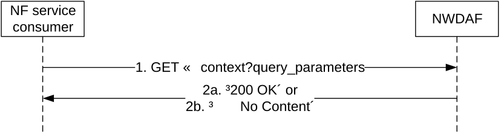

# 4.3.2.3 Nnwdaf_AnalyticsInfo_ContextTransfer service operation

## 4.3.2.3.1 General

The Nnwdaf_AnalyticsInfo_ContextTransfer service operation is used by an NF service consumer to request and get context information related to analytics subscriptions from the NWDAF.

## 4.3.2.3.2 Request and get from NWDAF context of a subscription

Figure 4.3.2.3.2-1 shows a scenario where the NF service consumer (e.g. NWDAF) sends a request to the NWDAF to request and get from NWDAF context information related to analytics subscriptions (see also 3GPP TS 23.288 \[17\]).

Figure 4.3.2.3.2-1: Requesting NWDAF context information related to analytics subscriptions

The NF service consumer (e.g. NWDAF) shall invoke the Nnwdaf_AnalyticsInfo_ContextTransfer service operation when requesting context information related to analytics subscriptions. The NF service consumer shall send an HTTP GET request on the resource URI "{apiRoot}/nnwdaf-analyticsinfo/\<apiVersion\>/context" representing the "NWDAF Context" (as shown in figure 4.3.2.3.2-1, step 1), to request context information related to analytics subscriptions according to the query parameter values of the attributes "context-ids" and "req-context".

Upon the reception of the HTTP GET request, the NWDAF shall retrieve the context information for the requested context identifiers.

If the HTTP request message from the NF service consumer is accepted, the NWDAF shall respond with "200 OK" status code with the message body containing the retrieved context information. The ContextData data structure in the response body shall include for each of the context elements contained in the "contextElems" attribute:

\- the context identifier that this context element refers to in the "contextId" attribute, which indicates among others the analytics subscription that this context element is associated with.

\- the pending output analytics for the indicated analytics subscription in the "pendAnalytics" attribute if such analytics are available and the NF service consumer has indicated the "PENDING_ANALYTICS" context type in the "req-context" attribute of the request.

\- the historical output analytics for the indicated analytics subscription in the "histAnalytics" attribute if such analytics are available and the NF service consumer has indicated the "HISTORICAL_ANALYTICS" context type in the "req-context" attribute of the request.

\- a timestamp of the last provided output analytics in the "lastOutputTime" if the NF service consumer has indicated the "PENDING_ANALYTICS" and/or "HISTORICAL_ANALYTICS" context type in the "req-context" attribute of the request and output analytics had been provided to the analytics consumer.

\- information about aggregation related analytics subscriptions that the NWDAF has with other NWDAFs in the "aggrSubs" attribute if such subscriptions exist and the NF service consumer has indicated the "AGGR_SUBS" context type in the "req-context" attribute of the request.

\- historical data related to the indicated analytics subscription in the "histData" attribute if such data exists and the NF service consumer has indicated the "DATA" context type in the "req-context" attribute of the request.

\- identifier of ADRF instance in the "adrfId" attribute if the NWDAF stores data in the ADRF.

\- the types of data stored in the ADRF in the "adrfDataTypes" attribute if the "adrfId" attribute is provided.

\- identifiers of NWDAF instances used when aggregating multiple analytics subscriptions in the "aggrNwdafIds" if such information is available and the NF service consumer has indicated the "AGGR_INFO" context type in the "req-context" attribute of the request.

\- information about used ML models in the "modelInfo" attribute if such information is available and the NF service consumer has indicated the "ML_MODELS" context type in the "req-context" attribute of the request.

\- if the "EnAnaCtxTransfer" feature is supported, the Analytics Accuracy related information in the "anaAccuInfos" attribute if such information is available and the NF service consumer has indicated the "ANALYTICS_ACCU_INFO" context type in the "req-context" attribute of the request.

\- if the "EnAnaCtxTransfer" feature is supported, the ML Model accuracy related information in the "modelAccuInfos" attribute if such information is available and the NF service consumer has indicated the "ML_MODEL_ACCU_INFO" context type in the "req-context" attribute of the request.

If the requested context information does not exist, the NWDAF shall respond with "204 No Content" status code.
