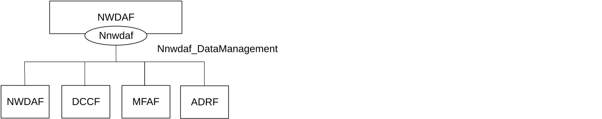
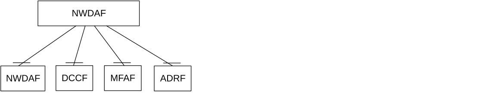
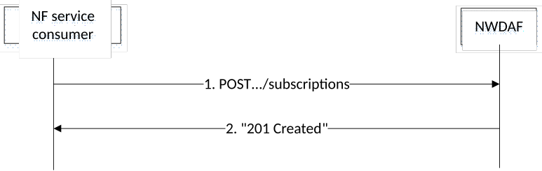
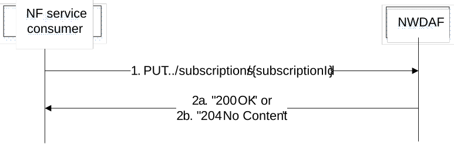
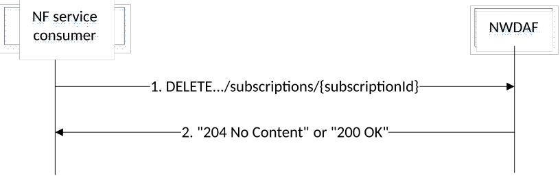
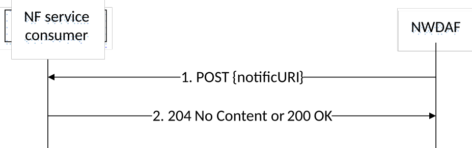
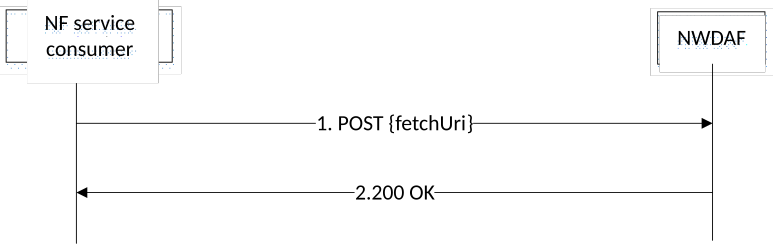

# 4.4 Nnwdaf_DataManagement Service

## 4.4.1 Service Description

### 4.4.1.1 Overview

The Nnwdaf_DataManagement Service as defined in 3GPP TS 23.288 \[17\] is provided by the Network Data Analytics Function (NWDAF).

This service:

\- allows the NF service consumers to subscribe to and unsubscribe from data management related events;

\- notifies the NF service consumers with the subscribed events which are detected by the NWDAF; and

\- allows the NF service consumers to retrieve the subscribed data from the NWDAF.

### 4.4.1.2 Service Architecture

The 5G System Architecture is defined in 3GPP TS 23.501 \[2\]. The Network Data Analytics Exposure architecture is defined in 3GPP TS 23.288 \[17\]. The Network Data Analytics signalling flows are defined in 3GPP TS 29.552 \[25\].

The Nnwdaf_DataManagement service is part of the Nnwdaf service-based interface exhibited by the Network Data Analytics Function (NWDAF).

Known consumers of the Nnwdaf_DataManagement service are:

\- Network Data Analytics Function (NWDAF)

\- Data Collection Coordination Function (DCCF)

\- Messaging Framework Adaptor Function (MFAF)

\- Analytics Data Repository Function (ADRF)

Figure 4.4.1.2-1: Reference Architecture for the Nnwdaf_DataManagement Service; SBI representation

Figure 4.4.1.2-2: Reference Architecture for the Nnwdaf_DataManagement Service: reference point representation

### 4.4.1.3 Network Functions

#### 4.4.1.3.1 Network Data Analytics Function (NWDAF)

The Network Data Analytics Function (NWDAF) provides requested data to NF consumers.

The Network Data Analytics Function (NWDAF) allows NF consumers to subcribe to and unsubscribe from the notification of detected event(s).

The Network Data Analytics Function (NWDAF) allows NF consumers to retrieve data that was collected based on their subscriptions.

#### 4.4.1.3.2 NF Service Consumers

The Network Data Analytics Function (NWDAF):

\- supports (un)subscription to the notification of data exposed by the NWDAF;

\- supports retrieving data from the NWDAF.

The Data Collection Coordination Function (DCCF):

\- supports (un)subscription to the notification of data exposed by the NWDAF;

\- supports retrieving data from the NWDAF.

The Messaging Framework Adaptor Function (MFAF):

\- supports receiving notifications of data provided by the NWDAF;

\- supports retrieving data from the NWDAF.

The Analytics Data Repository Function (ADRF):

\- supports receiving notifications of data provided by the NWDAF.

\- supports retrieving data from the NWDAF.

## 4.4.2 Service Operations

### 4.4.2.1 Introduction

Table 4.4.2.1-1: Operations of the Nnwdaf_DataManagement Service

| Service operation name            | Description                                                                                                                              | Initiated by                                  |
|-----------------------------------|------------------------------------------------------------------------------------------------------------------------------------------|-----------------------------------------------|
| Nnwdaf_DataManagement_Subscribe   | This service operation is used by an NF service consumer to subscribe to data management related event(s) from NWDAF.                    | NF service consumer (NWDAF, DCCF, MFAF, ADRF) |
| Nnwdaf_DataManagement_Unsubscribe | This service operation is used by an NF service consumer to unsubscribe to data management related event(s).                             | NF service consumer (NWDAF, DCCF, MFAF, ADRF) |
| Nnwdaf_DataManagement_Notify      | This service operation is used by the NWDAF to notify the detected event(s) to the NF service consumer instance which has subscribed to. | NWDAF                                         |
| Nnwdaf_DataManagement_Fetch       | This service operation is used by an NF service consumer to retrieve the subscribed data.                                                | NF service consumer (NWDAF, DCCF, MFAF)       |

### 4.4.2.2 Nnwdaf_DataManagement_Subscribe service operation

#### 4.4.2.2.1 General

The Nnwdaf_DataManagement_Subscribe service operation is used by an NF service consumer to create or update a subscription for data notifications from the NWDAF.

NOTE: If the data is to be collected for a user, i.e. SUPI or GPSI, the consumer needs to check the user consent by retrieving the user consent information from the UDM as described in clause 5.5 of 3GPP TS 29.552 \[25\] before invoking this service operation.

#### 4.4.2.2.2 Subscription for data notifications

Figure 4.4.2.2.2-1 shows a scenario where the NF service consumer sends a request to the NWDAF to subscribe for data notification(s).

Figure 4.4.2.2.2-1: NF service consumer subscribes to data notifications

The NF service consumer shall invoke the Nnwdaf_DataManagement_Subscribe service operation to subscribe to data notification(s). The NF service consumer shall send an HTTP POST request with "{apiRoot}/nnwdaf-datamanagement/\<apiVersion\>/subscriptions" as Resource URI representing the "NWDAF Data Management Subscriptions", as shown in figure 4.4.2.2.2-1, step 1, to create a subscription for an "Individual NWDAF Data Management Subscription" according to the information in message body.

The NnwdafDataManagementSubsc data structure provided in the request body shall include:

\- an URI where to receive the requested notifications as "notificURI" attribute;

\- notification correlation identfier within the "notifCorrId" attribute; and

\- one of the following:

\- analytics subscription information to be used to determine which data shall be collected and reported within the "anaSub" attribute;

\- data subscription information within the "dataSub" attribute;

The NnwdafDataManagementSubsc data structure provided in the request body may include:

\- the notification endpoints within the "notifEndpoints" attribute if the "DataAnaCollect" feature is supported;

\- formatting instructions within the "formatInstruct" attribute;

\- processing instructions within the "procInstruct" attribute or the "multiProcInstructs" attribute if the "MultiProcessingInstruction" feature is supported;

\- one of the following identifiers related to the ADRF:

\- ADRF instance identifier within the "adrfId" attribute;

\- ADRF set identifier within the "adrfSetId" attribute;

\- one of the following target identifiers:

\- NF instance identifier within the "targetNfId" attribute;

\- NF set identifier within the "targetNfSetId" attribute;

\- time window of the occurrence of the requested data collection within the "timePeriod" attribute;

\- the purpose of data collection within the "dataCollectPurposes" attribute.

\- the indication that the NF service consumer has already checked the user consent within the "checkedConsentInd" attribute, if the "UserConsent" feature is supported.

\- storage handling information within the "storeHandl" attribute, if the "EnhDataMgmt" feature is supported.

Upon the reception of an HTTP POST request with: "{apiRoot}/nnwdaf-datamanagement/\<apiVersion\>/subscriptions" as Resource URI and NnwdafDataManagementSubsc data structure as request body, the NWDAF shall use the contents of the request to determine whether the subscription can already be served or interactions with the ADRF and/or data sources are required. If the NWDAF cannot use the contents of the request to determine this, the NWDAF shall send an HTTP "400 Bad Request" error response including the "cause" attribute set to "SUBSCRIPTION_CANNOT_BE_SERVED".

NOTE 1: The "SUBSCRIPTION_CANNOT_BE_SERVED" error can occur, for example, in the case where the "dataSub" or "anaSub" attributes are provided, when the request is syntactically valid and there is no NWDAF internal error, but the NWDAF can neither find an existing subscription to a data source nor construct one based on the received subscription contents.

If the user consent has not been checked by the NF service consumer and is required for the requested data collection depending on local policy and regulations, then the NWDAF shall check user consent for the targeted UE(s) based on the user consent subscription data that is retrieved via the Nudm_SDM service API of the UDM as described in clause 5.2.2.24 and clause 6.1.3.32 of 3GPP TS 29.503 \[23\]. If the user consent subscription data retrieved from the UDM indicate that the user consent is not granted for the impacted user(s), then the NWDAF shall send an HTTP "403 Forbidden" error response including the "cause" attribute set to "USER_CONSENT_NOT_GRANTED".

NOTE 2: When the target of reporting is a SUPI or a GPSI then the subscription can be rejected, e.g. because user consent is not granted, and the error is sent to the consumer. When the target of reporting is an Internal Group Id, or a list of SUPIs/GPSI(s) or any UE, and the user consent is not granted for a subset of the impacted users, then no error is sent, but a subset of the SUPIs/GPSIs is skipped if user consent is not granted.

Otherwise, if the user consent subscription data retrieved from the UDM indicate that the user consent is granted for the impacted user(s), the NWDAF shall subscribe to notification of changes of the user consent (unless it is already subscribed) by invoking the Nudm_SDM_Subscribe service operation by sending an HTTP POST request targeting the resource "SdmSubscriptions" to the UDM as described in clause 5.2.2.3 of 3GPP TS 29.503 \[23\].

If the NWDAF determines that the subscription can already be served (without requiring further interactions with ADRF and/or data sources) or a successful response from the ADRF and/or data sources is received for the creation or modification of subscription(s) to serve this subscription, the NWDAF shall:

\- create a new subscription;

\- assign a subscriptionId;

\- store the subscription.

If the NWDAF created an "Individual NWDAF Data Management Subscription" resource, the NWDAF shall respond with "201 Created" with the message body containing a representation of the created subscription, as shown in figure 4.4.2.2.2-1, step 2. The NWDAF shall include a Location HTTP header field. The Location header field shall contain the URI of the created subscription i.e. "{apiRoot}/nnwdaf-datamanagement/\<apiVersion\>/subscriptions/{subscriptionId}". If an immediate reporting indication is provided in the subscription, the NWDAF shall include the reports of the events subscribed, if available, in the HTTP POST response within the "dataSub" attribute, or, if the DataAnaCollect feature is supported, potentially within the "immReport" attribute.

If the NWDAF receives storage handling information in the request but determines (e.g. based on local policy) that a different storage approach shall be followed, it indicates the determined storage approach to the consumer by setting accordingly the "storeHandl" attribute (e.g. providing a different lifetime, or setting the indication about deletion alerts to "false") in the message body of the response. When more than one consumer has requested storage lifetime for the same analytics, the storage approach should be based on the longest requested storage lifetime.

NOTE 3: The default operator policy for how long analytics is to be stored can be longer or shorter than the lifetime requested by the consumer. A default operator policy can for example accept only consumer requested lifetimes that are shorter or longer than the default policy.

When the notification flag of the "dataSub" attribute (e.g. the "notifFlag" attribute within the "eventsRepInfo" attribute in the case of AF events) is included and set to "DEACTIVATE" in the request, the NWDAF shall mute the event notification and store the available events until the NF service consumer requests to retrieve them by setting the notification flag to "RETRIEVAL" or until a muting exception occurs (e.g. full buffer). When a muting exception occurs, if the EnhDataMgmt feature is supported, the NWDAF may consider the contents of the muting instructions of the "dataSub" attribute (if provided; e.g. the "notifFlagInstruct" attribute within the "eventsRepInfo" attribute in the case of AF events) and/or local configuration to determine its actions.

If the EnhDataMgmt feature is supported and the NWDAF accepts the provided notification flag and muting instructions, it may indicate the applied muting notification settings in the response (e.g. within the "mutingSetting" attribute in the case of AF events). If the NWDAF does not accept the provided notification flag and muting instructions, it shall send an HTTP "403 Forbidden" error response including the "cause" attribute set to "MUTING_INSTR_NOT_ACCEPTED".

If an error occurs when processing the HTTP POST request, the NWDAF shall send an HTTP error response as specified in clause 5.3.7.

#### 4.4.2.2.3 Update subscription for data notifications

Figure 4.4.2.2.3-1 shows a scenario where the NF service consumer sends a request to the NWDAF to update the subscription for data notifications.

Figure 4.4.2.2.3-1: NF service consumer updates subscription to data notifications

The NF service consumer shall invoke the Nnwdaf_DataManagement_Subscribe service operation to update subscription to data notifications. The NF service consumer shall send an HTTP PUT request with "{apiRoot}/nnwdaf-datamanagement/\<apiVersion\>/subscriptions/{subscriptionId}" as Resource URI representing the "Individual NWDAF Data Management Subscription", as shown in figure 4.4.2.2.3-1, step 1, to update the subscription for an "Individual NWDAF Data Management Subscription" resource identified by the {subscriptionId}. The NnwdafDataManagementSubsc data structure provided in the request body shall include the same contents as described in clause 4.4.2.2.2.

Upon the reception of an HTTP PUT request with: "{apiRoot}/nnwdaf-datamanagement/\<apiVersion\>/subscriptions/{subscriptionId}" as Resource URI and NnwdafDataManagementSubsc data structure as request body, the NWDAF shall use the contents of the request to determine whether the updated subscription can already be served or interactions with the ADRF and/or data sources are required. If the NWDAF cannot use the contents of the request to determine this, the NWDAF shall send an HTTP "400 Bad Request" error response including the "cause" attribute set to "SUBSCRIPTION_CANNOT_BE_SERVED".

NOTE 1: The "SUBSCRIPTION_CANNOT_BE_SERVED" error can occur, for example, in the case when the "dataSub" or "anaSub" attributes are provided, when the request is syntactically valid and there is no NWDAF internal error, but the NWDAF can neither find an existing subscription to a data source nor construct one based on the received subscription contents.

If the user consent has not been checked by the NF service consumer and is required for the requested data collection depending on local policy and regulations, then the NWDAF shall check user consent for the targeted UE(s) based on the user consent subscription data that is retrieved via the Nudm_SDM service API of the UDM as described in clause 5.2.2.24 and clause 6.1.3.32 of 3GPP TS 29.503 \[23\]. If the user consent subscription data retrieved from the UDM indicate that the user consent is not granted for the impacted user(s), then the NWDAF shall send an HTTP "403 Forbidden" error response including the "cause" attribute set to "USER_CONSENT_NOT_GRANTED".

> NOTE 2: When the target of reporting is a SUPI or a GPSI then the subscription can be rejected, e.g. because user consent is not granted, and the error is sent to the consumer. When the target of reporting is an Internal Group Id, or a list of SUPIs/GPSI(s) or any UE, and the user consent is not granted for a subset of the impacted users, then no error is sent, but a subset of the SUPIs/GPSIs is skipped if user consent is not granted.

Otherwise, if the user consent subscription data retrieved from the UDM indicate that the user consent is granted for the impacted user(s), the NWDAF shall subscribe to notification of changes of the user consent (unless it is already subscribed) by invoking the Nudm_SDM_Subscribe service operation by sending an HTTP POST request targeting the resource "SdmSubscriptions" to the UDM as described in clause 5.2.2.3 of 3GPP TS 29.503 \[23\].

If the NWDAF determines that the updated subscription can already be served (without requiring further interactions with the ADRF and/or data sources) or a successful response from the ADRF and/or data sources is received for the creation or modification of subscription(s) to serve this subscription, the NWDAF shall:

\- update the subscription of corresponding subscriptionId; and

\- store the subscription.

If the NWDAF successfully processed and accepted the received HTTP PUT request, the NWDAF shall update an "Individual NWDAF Data Management Subscription" resource, and shall respond with:

a\) HTTP "200 OK" status code with the message body containing a representation of the updated subscription, as shown in figure 4.4.2.2.3-1, step 2a; If an immediate reporting indication is provided in the request, the NWDAF shall include the reports of the events subscribed, if available, in the HTTP PUT response within the "dataSub" attribute, or, if the DataAnaCollect feature is supported, potentially within the "immReport" attribute; or

b\) HTTP "204 No Content" status code, as shown in figure 4.4.2.2.3-1, step 2b.

If the NWDAF receives storage handling information in the request but determines (e.g. based on local policy) that a different storage approach shall be followed, it indicates the determined storage approach to the consumer by setting accordingly the "storeHandl" attribute (e.g. providing a different lifetime, or setting the indication about deletion alerts to "false") in the message body of the response. When more than one consumer has requested storage lifetime for the same analytics, the storage approach should be based on the longest requested storage lifetime.

> NOTE 3: The default operator policy for how long analytics is to be stored can be longer or shorter than the lifetime requested by the consumer. A default operator policy can for example accept only consumer requested lifetimes that are shorter or longer than the default policy.

When the notification flag of the "dataSub" attribute (e.g. the "notifFlag" attribute within the "eventsRepInfo" attribute in the case of AF events) is included in the request with the value "DEACTIVATE", the NWDAF shall mute the event notification and store the available events until the NF service consumer requests to retrieve them by setting the notification flag attribute to "RETRIEVAL" or until a muting exception occurs (e.g. full buffer). When a muting exception occurs, if the EnhDataMgmt feature is supported, the NWDAF may consider the contents of the muting instructions of the "dataSub" attribute (if provided; e.g. the "notifFlagInstruct" attribute within the "eventsRepInfo" attribute in the case of AF events) and/or local configuration to determine its actions; if the notification flag is set to the value "RETRIEVAL", the NWDAF shall send the stored events to the NF service consumer, mute the event notification again and store available events; if the notification flag is set to the value "ACTIVATE" and the event notifications are muted (due to a previously received "DECATIVATE" value), the NWDAF shall unmute the event notification, i.e. start sending again notifications for available events.

If the EnhDataMgmt feature is supported and the NWDAF accepts the provided notification flag and muting instructions, it may indicate the applied muting notification settings in the response (e.g. within the "mutingSetting" attribute in the case of AF events). If the NWDAF does not accept the provided notification flag and muting instructions, it shall send an HTTP "403 Forbidden" error response including the "cause" attribute set to "MUTING_INSTR_NOT_ACCEPTED".If errors occur when processing the HTTP PUT request, the NWDAF shall send an HTTP error response as specified in clause 5.3.7.

If the NWDAF determines the received HTTP PUT request needs to be redirected, the NWDAF shall send an HTTP redirect response as specified in clause 6.10.9 of 3GPP TS 29.500 \[6\].

### 4.4.2.3 Nnwdaf_DataManagement_Unsubscribe service operation

#### 4.4.2.3.1 General

The Nnwdaf_DataManagement_Unsubscribe service operation is used by an NF service consumer to remove a subscription for data notifications from the NWDAF.

#### 4.4.2.3.2 Unsubscribe from data notifications

Figure 4.4.2.3.2-1 shows a scenario where the NF service consumer sends a request to the NWDAF to unsubscribe from data notifications.

Figure 4.4.2.3.2-1: NF service consumer unsubscribes from data notifications

The NF service consumer shall invoke the Nnwdaf_DataManagement_Unsubscribe service operation to unsubscribe from data notifications. The NF service consumer shall send an HTTP DELETE request with: "{apiRoot}/nnwdaf-datamanagement/\<apiVersion\>/subscriptions/{subscriptionId}" as Resource URI, where "{subscriptionId}" is the identifier of the existing subscription that is to be deleted.

Upon the reception of an HTTP DELETE request, if the NWDAF successfully processed and accepted the received HTTP DELETE request, the NWDAF shall:

\- remove the corresponding subscription;

\- respond to the NF service consumer:

\- respond with HTTP "204 No Content" status code if the "EnhDataMgmt" feature is not supported or no stored unsent events to be included in the response; or

\- respond with HTTP "200 OK" status code if the "EnhDataMgmt" feature is supported and including the stored unsent events in the NnwdafDataManagementNotif data type in the response.

If errors occur when processing the HTTP DELETE request, the NWDAF shall send an HTTP error response as specified in clause 5.3.7.

If the NWDAF determines the received HTTP DELETE request needs to be redirected, the NWDAF shall send an HTTP redirect response as specified in clause 6.10.9 of 3GPP TS 29.500 \[6\].

### 4.4.2.4 Nnwdaf_DataManagement_Notify service operation

#### 4.4.2.4.1 General

The Nnwdaf_DataManagement_Notify service operation is used by the NWDAF to notify NF service consumers about subscribed events related to data.

#### 4.4.2.4.2 Notification about subscribed data

Figure 4.2.2.4.2-1 shows a scenario where the NWDAF sends a request to the NF service consumer to notify for event notifications (see also 3GPP TS 23.288 \[17\]).

Figure 4.4.2.4.2-1: NWDAF notifies the subscribed event

The NWDAF shall invoke the Nnwdaf_DataManagement_Notify service operation to notify the subscribed event. The NWDAF shall send an HTTP POST request with "{notificURI}" received in the Nnwdaf_DataManagement_Subscribe service operation as Resource URI, as shown in figure 4.4.2.4.2-1, step 1.

The NnwdafDataManagementNotif data structure provided in the request body that shall include:

\- the notification correlation identifier within the "notifCorrId" attribute;

\- the timestamp of the notification within the "notifTimestamp" attribute;

\- one of the following:

\- data collected from data sources (e.g. SMF, NEF) in the "dataNotification" attribute;

\- summarized data derived from events that occurred based on processing and formatting instructions in the "dataReports" attribute;

\- information for fetching the contents of the notification in the "fetchInstruct" attribute.

\- a deletion alert in the "delAlert" attribute, if the "EnhDataMgmt" feature is supported.

The NnwdafDataManagementNotif data structure provided in the request body may include:

\- an indication that the NWDAF has requested a termination of the subscription within the "terminationReq" attribute; and/or

\- a pending notification cause for the stored unsent data in the "pendNotifCause" attribute if the "EnhDataMgmt" feature is supported.

Upon the reception of an HTTP POST request, if the NF service consumer successfully processed and accepted the received HTTP POST request, the NF Service Consumer shall store the notification and respond with HTTP "204 No Content" status code, or with HTTP "200 OK" status code and the NotifResponse data structure in the response body if the "EnhDataMgmt" feature is supported.

After the successful processing of the HTTP POST request:

\- if the NWDAF requests the NF service consumer with the "fetchInstruct" attribute to retrieve the data, the NF service consumer may invoke the Nnwdaf_DataManagement_Fetch service operation to retrieve the notified data as defined in clause 4.4.2.5.

\- if the NWDAF provided a deletion alert to the NF service consumer, the NF service consumer may invoke the Nadrf_DataManagement_RetrievalRequest service operation as defined in 3GPP TS 29.575 \[27\] clause 4.2.2.5, using the storage transaction identifier received within the "alertStorTransId" attribute of the "delAlert" attribute, in order to retrieve the data that are about to be deleted.

NOTE: The "alertStorTransId" attribute, which is used for retrieving data prior to deletion, does not have to be the same with or related to the storage transaction identifier that is assigned and returned during the storage of the data in the ADRF.

If errors occur when processing the HTTP POST request, the NF service consumer shall send an HTTP error response as specified in clause 5.3.7.

If the NF service consumer determines the received HTTP POST request needs to be redirected, the NF service consumer shall send an HTTP redirect response as specified in clause 6.10.9 of 3GPP TS 29.500 \[6\].

### 4.4.2.5 Nnwdaf_DataManagement_Fetch service operation

#### 4.4.2.5.1 General

The Nnwdaf_DataManagement_Fetch service operation is used by an NF service consumer to retrieve data notifications indicated by fetch instructions from the NWDAF.

#### 4.4.2.5.2 Retrieve data from the NWDAF

Figure 4.4.2.5.2-1 shows a scenario where the NF service consumer sends a request to the NWDAF to retrieve notified data.

Figure 4.4.2.5.2-1: Requesting to retrieve notified data

The NF service consumer shall invoke the Nnwdaf_DataManagement_Fetch service operation to retrieve notified data. The NF service consumer shall send an HTTP POST request with "{fetchUri}" URI previously provided by the NWDAF in "fetchInstruct" attribute within NnwdafDataManagementNotif data type, as shown in figure 4.4.2.5.2-1, step 1, to fetch NWDAF data. The request body shall include fetch correlation identifiers, which was previously provided by the NWDAF in the "fetchCorrIds" attribute within FetchInstruction data structure in the NWDAF notification.

Upon the reception of the HTTP POST request, the NWDAF shall:

\- find the data according to the requested parameters.

If the requested data is found, the NWDAF shall respond with "200 OK" status code with the message body containing the NnwdafDataManagementNotif data structure. The NnwdafDataManagementNotif data structure in the response body shall include the data collected from data sources (e.g. SMF, NEF) in the "dataNotification" attribute.

If an error occurs when processing the HTTP POST request, the NWDAF shall send an HTTP error response as specified in clause 5.3.7.

If the NWDAF determines that the received HTTP POST request needs to be redirected, the NWDAF shall send an HTTP redirect response as specified in clause 6.10.9 of 3GPP TS 29.500 \[6\].
