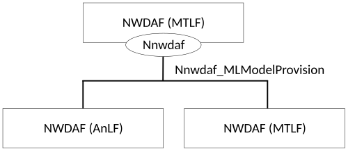
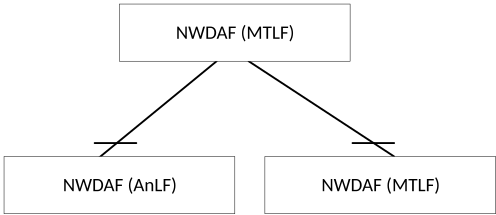

# 4.5 Nnwdaf_MLModelProvision Service

## 4.5.1 Service Description

### 4.5.1.1 Overview

The Nnwdaf_MLModelProvision service as defined in 3GPP TS 23.501 \[2\] and 3GPP TS 23.288 \[17\], is provided by the Network Data Analytics Function (NWDAF) containing Model Training Logical Function (MTLF).

This service:

\- allows the NF service consumers to subscribe to and unsubscribe from different ML model analytics events;

\- allows MTLF-based ML Model Accuracy monitoring procedure between the AnLF and MTLF. and

\- notifies the NF service consumers with a corresponding subscription about ML model information.

The types of analytics events supported by this serivce are the same as defined in clause 4.2.1.1.

NOTE: ML model provisioning is limited to a single vendor environment in this release of current specification.

### 4.5.1.2 Service Architecture

The 5G System Architecture is defined in 3GPP TS 23.501 \[2\]. The Network Data Analytics Exposure architecture is defined in 3GPP TS 23.288 \[17\]. The ML Model provisioning signalling flows are defined in 3GPP TS 29.552 \[25\].

The Nnwdaf_MLModelProvision service is part of the Nnwdaf service-based interface exhibited by the Network Data Analytics Function (NWDAF) containing Model Training Logical Function (MTLF).

Known consumers of the Nnwdaf_MLModelProvision service are:

\- Network Data Analytics Function (NWDAF) containing Analytics Logical Function (AnLF); and

\- Network Data Analytics Function (NWDAF) containing Model Training Logical Function (MTLF).

Figure 4.5.1.2-1: Reference Architecture for the Nnwdaf_MLModelProvision Service; SBI representation

Figure 4.5.1.2-2: Reference Architecture for the Nnwdaf_MLModelProvision Service: reference point representation

### 4.5.1.3 Network Functions

#### 4.5.1.3.1 Network Data Analytics Function (NWDAF)

The Network Data Analytics Function (NWDAF), containing Model Training Logical Function (MTLF), provides ML model information for different analytic events to NF service consumers.

The Network Data Analytics Function (NWDAF) allows NF service consumers to subscribe to and unsubscribe from one-time, periodic notification or notification when an event is detected.

#### 4.5.1.3.2 NF Service Consumers

The Network Data Analytics Function (NWDAF) supports (un)subscription to the notification of different ML model information from the NWDAF which contains Model Training Logical Function (MTLF).

## 4.5.2 Service Operations

### 4.5.2.1 Introduction

Table 4.5.2.1-1: Operations of the Nnwdaf_MLModelProvision Service

| Service operation name              | Description                                                                                                                                 | Initiated by                |
|-------------------------------------|---------------------------------------------------------------------------------------------------------------------------------------------|-----------------------------|
| Nnwdaf_MLModelProvision_Subscribe   | This service operation is used by an NF service consumer to subscribe to ML model provision from NWDAF.                                     | NF service consumer (NWDAF) |
| Nnwdaf_MLModelProvision_Unsubscribe | This service operation is used by an NF service consumer to unsubscribe to ML model provision.                                              | NF service consumer (NWDAF) |
| Nnwdaf_MLModelProvision_Notify      | This service operation is used by the NWDAF to notify the ML model information to the NF service consumer instance which has subscribed to. | NWDAF                       |

### 4.5.2.2 Nnwdaf_MLModelProvision_Subscribe service operation

#### 4.5.2.2.1 General

The Nnwdaf_MLModelProvision_Subscribe service operation is used by an NF service consumer to subscribe or update subscription for event notifications from the NWDAF which contains Model Training Logical Function (MTLF).

#### 4.5.2.2.2 Subscription for event notifications

Figure 4.5.2.2.2-1 shows a scenario where the NF service consumer sends a request to the NWDAF to subscribe for event notification(s) (as shown in 3GPP TS 23.288 \[17\]).

Figure 4.5.2.2.2-1: NF service consumer subscribes to notifications

The NF service consumer shall invoke the Nnwdaf_MLModelProvision_Subscribe service operation to subscribe to event notification(s). The NF service consumer shall send an HTTP POST request with "{apiRoot}/nnwdaf-mlmodelprovision/\<apiVersion\>/subscriptions" as Resource URI representing the "NWDAF ML Model Provision Subscriptions", as shown in figure 4.5.2.2.2-1, step 1, to create a subscription for an "Individual NWDAF ML Model Provision Subscription" according to the information in message body.

The NwdafMLModelProvSubsc data structure provided in the request body shall include:

\- an URI where to receive the requested notifications as the "notifUri" attribute; and

\- a description of the subscribed events as the "mLEventSubscs" attribute that, for each event, the MLEventSubscription data type shall include:

1\) an event identifier as the "mLEvent" attribute; and

2\) event filter information as the "mLEventFilter" attribute;

and may include:

1\) an identification of target UE information as the "tgtUe" attribute;

2\) a time interval for which the ML model for the analytics is requested as the "mLTargetPeriod" attribute;

3\) the time when the subscription expired as the "expiryTime" attribute;

4\) the ML model metric as the "modelMetric" attribute if the "FederatedLearning" feature or the "ModelProvisionExt" feature is supported;

5\) a pre-determined status for the ML model or training as the "preDetStatus" attribute if the "FederatedLearning" feature is supported; and

6\) the ML event reporting condition as the "mlEvRepCon" if the "FederatedLearning" feature or the "ModelProvisionExt" feature is supported.

7\) the ML Model Interoperability Information as the "modelInterInfo" attribute if the "ModelSharing" feature is supported; and

8\) NF consumer information as the "nfConsumerInfo" attributed if the "ModelSharing" feature is supported.

9\) use case context as "useCaseCxt" attribute, if the "ENAExt" feature is supported.

NOTE 1: The NWDAF containing MTLF can use the "useCaseCxt" attribute to select the most relevant ML model, when several ML models are available for the requested Analytics ID(s). The values of this parameter are not standardized.

10\) extended parameters for ML model provisioning as the "modelProvExt" attribute, if the feature "ModelProvisionExt" is supported;

11\) UTC time indicating the time when the ML model is needed as the "timeModelNeeded" attribute.

12\) the inference data stored in ADRF which can be used by MTLF as the "inferDataForModel" attribute, if the feature "ModelProvisionExt" is supported.

13\) the ML model Identifier as the "modelId" attribute, if the feature "EnAnaCtxTransfer" is supported.

The NwdafMLModelProvSubsc data structure provided in the request body may include:

\- a notification correlation identifier assigned by the NF service consumer for the requested notifications as "notifCorreId" attribute; and

\- the reporting requirement information of the subscription as the "eventReq" attribute.

For different event types, the filter information in "mLEventFilter" attribute within the MLEventSubscription data type is the same as described in clause 4.3.2.2.2 for the filter information contained in "event-filter" attribute.

NOTE 2: The features described in clause 4.3.2.2.2 has no impact on this service, i.e. the features defined for the EventFilter data type will possibly not have corresponding features in this service. The result is that when the releases of which the NF service consumer and the NWDAF containing MTLF are different, the NF service consumer will possibly not know whether the NWDAF containing MTLF has considered all the filter information provided in the request message.

Upon the reception of an HTTP POST request with: "{apiRoot}/nnwdaf-mlmodelprovision/\<apiVersion\>/subscriptions" as Resource URI and NwdafMLModelProvSubsc data structure as request body, the NWDAF shall create a new subscription and store the subscription.

If the NWDAF created an "Individual NWDAF ML Model Provision Subscription" resource, the NWDAF shall respond with "201 Created" with the message body containing a representation of the created subscription, as shown in figure 4.5.2.2.2-1, step 2. The NWDAF shall include a Location HTTP header field. The Location header field shall contain the URI of the created subscription i.e. "{apiRoot}/nnwdaf-mlmodelprovision/\<apiVersion\>/subscriptions/{subscriptionId}".

If the immediate reporting indication in the "immRep" attribute within the "eventReq" attribute sets to true during the event subscription, the NWDAF shall include the reports of the subscribed events, if available, as the "mLEventNotifs" attribute in the HTTP POST response.

If not all the requested events in the subscription are accepted, then the NWDAF may include the "failEventReports" attribute indicating the event(s) for which the subscription failed and the associated reason(s).

If there is no associated ML model available for all the listed "mLEvent" attribute, the NWDAF which contains MTLF shall send a "500 Internal Server Error" status code to the NF service consumer. Also, the corresponding failure reason via a "problemDetails" attribute with the "cause" attribute set to "UNAVAILABLE_ML_MODEL_FOR_ALLEVENTS".

If other errors occur when processing the HTTP POST request, the NWDAF shall send an HTTP error response as specified in clause 5.4.7.

#### 4.5.2.2.3 Update subscription for event notifications

Figure 4.5.2.2.3-1 shows a scenario that the NF service consumer sends an HTTP PUT request to the NWDAF to modify an existing subscription (as shown in 3GPP TS 23.288 \[17\]).

Figure 4.5.2.2.3-1: Modification of events subscription information using HTTP PUT

The NF service consumer shall invoke the Nnwdaf_MLModelProvision_Subscribe service operation to modify an existing ML Model subscription. The NF service consumer shall send an HTTP PUT request with: "{apiRoot}/nnwdaf-mlmodelprovision/\<apiVersion\>/subscriptions/{subscriptionId}" as Resource URI, where "{subscriptionId}" is the event subscriptionId of the existing subscription to be modified, to update an "Individual NWDAF ML Model Provision Subscription" according to the information in the message body. The NwdafMLModelProvSubsc data structure provided in the request body shall include the same contents as described in clause 4.5.2.2.2.

Upon receipt of an HTTP PUT request with: "{apiRoot}/nnwdaf-mlmodelprovision/\<apiVersion\>/subscriptions/{subscriptionId}" as Resource URI and NwdafMLModelProvSubsc data type as request body, if the request is successfully processed and accepted, the NWDAF shall:

> \- modify the concerned subscription; and
>
> \- store the subscription.
>
> NOTE: The "notifUri" attribute within the NwdafMLModelProvSubsc data structure can be modified to request that subsequent notifications are sent to a new NF service consumer.

If the NWDAF successfully processed and accepted the received HTTP PUT request, the NWDAF shall update an "Individual NWDAF ML Model Provision Subscription" resource, and shall respond with:

> \- HTTP "204 No Content" response (as shown in figure 4.5.2.2.3-1, step 2a); or
>
> \- HTTP "200 OK" response (as shown in figure 4.5.2.2.3-1, step 2b) with a response body containing a representation of the updated subscription in the NwdafMLModelProvSubsc data type.

If not all the requested events in the subscription are modified successfully, then the NWDAF may include the "failEventReports" attribute indicating the event(s) for which the subscription failed and the associated reason(s).

If other errors occur when processing the HTTP PUT request, the NWDAF shall send an HTTP error response as specified in clause 5.4.7.

If the NWDAF determines that the received HTTP PUT request needs to be redirected, the NWDAF shall send an HTTP redirect response as specified in clause 6.10.9 of 3GPP TS 29.500 \[6\].

### 4.5.2.3 Nnwdaf_MLModelProvision_Unsubscribe service operation

#### 4.5.2.3.1 General

The Nnwdaf_MLModelProvision_Unsubscribe service operation is used by an NF service consumer to unsubscribe from event notifications.

#### 4.5.2.3.2 Unsubscribe from event notifications

Figure 4.5.2.3.2-1 shows a scenario where the NF service consumer sends a request to the NWDAF to unsubscribe from event notifications (see also 3GPP TS 23.288 \[17\]).

Figure 4.5.2.3.2-1: NF service consumer unsubscribes from notifications

The NF service consumer shall invoke the Nnwdaf_MLModelProvision_Unsubscribe service operation to unsubscribe to event notifications. The NF service consumer shall send an HTTP DELETE request with: "{apiRoot}/nnwdaf-mlmodelprovision/\<apiVersion\>/subscriptions/{subscriptionId}" as Resource URI, where "{subscriptionId}" is the event subscriptionId of the existing subscription that is to be deleted.

Upon the reception of an HTTP DELETE request, if the NWDAF successfully processed and accepted the received HTTP DELETE request, the NWDAF shall:

\- remove the corresponding subscription; and

\- respond with HTTP "204 No Content" status code.

If the NWDAF determines the received HTTP DELETE request needs to be redirected, the NWDAF shall send an HTTP redirect response as specified in clause 6.10.9 of 3GPP TS 29.500 \[6\].

If errors occur when processing the HTTP DELETE request, the NWDAF shall send an HTTP error response as specified in clause 5.4.7.

### 4.5.2.4 Nnwdaf_MLModelProvision_Notify service operation

#### 4.5.2.4.1 General

The Nnwdaf_MLModelProvision_Notify service operation is used by an NWDAF to notify NF consumers about subscribed events.

#### 4.5.2.4.2 Notification about subscribed event

Figure 4.5.2.4.2-1 shows a scenario where the NWDAF sends a request to the NF Service Consumer to notify for event notifications (see also 3GPP TS 23.288 \[17\]).

Figure 4.5.2.4.2-1: NWDAF notifies the subscribed event

The NWDAF shall invoke the Nnwdaf_MLModelProvision_Notify service operation to notify the subscribed event. The NWDAF shall send an HTTP POST request with "{notifUri}" received in the Nnwdaf_MLModelProvision_Subscribe service operation as Resource URI, as shown in figure 4.2.2.4.2-1, step 1. The NwdafMLModelProvNotif data structure provided in the request body that shall include:

\- an event subscriptionId as "subscriptionId" attribute; and

\- description of the notified event as "eventNotifs" attribute, that for each event, the MLEventNotif data type shall include:

\- an event identifier as the "event" attribute;

\- an address (e.g. a URL or an FQDN) of the ML model file as the "mLFileAddr" attribute or if the "ModelProvisionExt"feature is supported, the ADRF (Set) information of the ML Model as the "mLModelAdrf" addtribute and an unique identifier for the ML model as "modelUniqueId" attribute; and

the MLEventNotif data type may include:

\- a notification correlation identifier as "notifCorreId" attribute; and

\- a time period when the provided ML model applies as the "validityPeriod" attribute; and

\- an area where the provided ML model applies as the "spatialValidity" attribute; and

\- if the feature "ModelProvisionExt" is supported, the additional ML model information as "addModelInfo" attribute; and

\- if the feature "ModelProvisionExt" is supported, the filtering information of the ML Model as the "mLEventFilter" attribute; and

\- if the feature "ModelProvisionExt" is supported, the target UEs of the ML Model as the "tgtUe" attribute.

Upon the reception of an HTTP POST request, if the NF service consumer successfully processed and accepted the received HTTP POST request, the NF Service Consumer shall store the notification and respond with HTTP "204 No Content" status code.

If the NF service consumer receives the ADRF ID as the "adrfId" attribute or the ADRF Set ID as the "adrfSetId" attribute in the NwdafMLModelProvNotif data structure of the HTTP POST request, it may invoke Nadrf_MLModelManagement_RetrievalRequest service operation to retrieve ML Model from the ADRF (Set) as specified in 3GPP TS 29.575 \[27\].

If the NF service consumer determines the received HTTP POST request needs to be redirected, the NF service consumer shall send an HTTP redirect response as specified in clause 6.10.9 of 3GPP TS 29.500 \[6\].

If errors occur when processing the HTTP POST request, the NWDAF shall send an HTTP error response as specified in clause 5.4.7.
