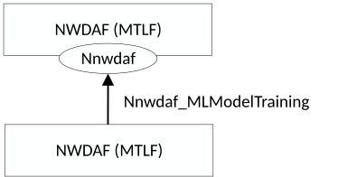
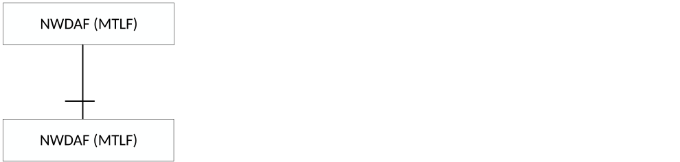
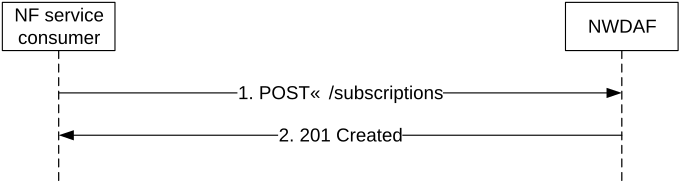
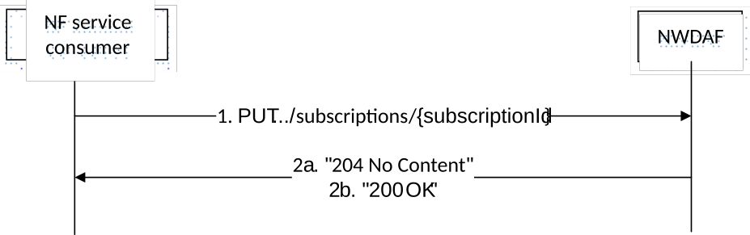
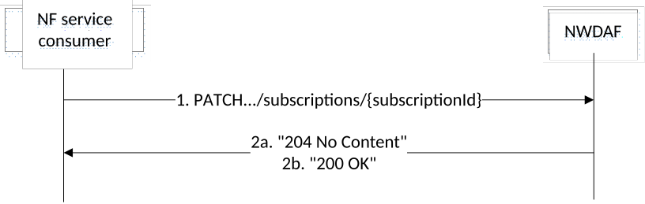
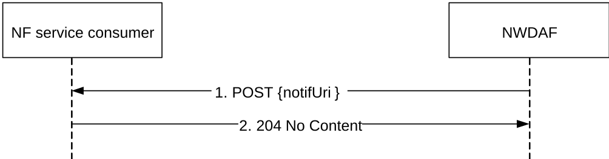

# 4.6 Nnwdaf_MLModelTraining Service

## 4.6.1 Service Description

### 4.6.1.1 Overview

The Nnwdaf_MLModelTraining service as defined in 3GPP TS 23.288 \[17\], is provided by the Network Data Analytics Function (NWDAF) containing Model Training Logical Function (MTLF).

This service:

\- allows the NF service consumers to subscribe to and unsubscribe from different ML model training events;

\- allows the NF service consumers to modify different ML model training events; and

\- notifies the NF service consumers with a corresponding subscription about ML model information.

### 4.6.1.2 Service Architecture

The 5G System Architecture is defined in 3GPP TS 23.501 \[2\]. The Network Data Analytics Exposure architecture is defined in 3GPP TS 23.288 \[17\]. The ML Model training signalling flows are defined in 3GPP TS 29.552 \[25\].

The Nnwdaf_MLModelTraining service is part of the Nnwdaf service-based interface exhibited by the Network Data Analytics Function (NWDAF) containing Model Training Logical Function (MTLF).

Known consumers of the Nnwdaf_MLModelTraining service are:

\- Network Data Analytics Function (NWDAF) containing Model Training Logical Function (MTLF)

Figure 4.6.1.2-1: Reference Architecture for the Nnwdaf_MLModelTraining Service; SBI representation

Figure 4.6.1.2-2: Reference Architecture for the Nnwdaf_MLModelTraining Service: reference point representation

### 4.6.1.3 Network Functions

#### 4.6.1.3.1 Network Data Analytics Function (NWDAF)

The Network Data Analytics Function (NWDAF), containing Model Training Logical Function (MTLF), provides ML model information for different analytic events to NF service consumers.

The Network Data Analytics Function (NWDAF) allows NF service consumers to subscribe to and unsubscribe from one-time, periodic notification or notification when an event is detected.

#### 4.6.1.3.2 NF Service Consumers

The Network Data Analytics Function (NWDAF) supports (un)subscription to the notification of different ML model information from the NWDAF which contains Model Training Logical Function (MTLF).

## 4.6.2 Service Operations

### 4.6.2.1 Introduction

Table 4.6.2.1-1: Operations of the Nnwdaf_MLModelTraining Service

| Service operation name             | Description                                                                                                                                 | Initiated by                |
|------------------------------------|---------------------------------------------------------------------------------------------------------------------------------------------|-----------------------------|
| Nnwdaf_MLModelTraining_Subscribe   | This service operation is used by an NF service consumer to subscribe to ML model training from NWDAF.                                      | NF service consumer (NWDAF) |
| Nnwdaf_MLModelTraining_Unsubscribe | This service operation is used by an NF service consumer to unsubscribe to ML model training.                                               | NF service consumer (NWDAF) |
| Nnwdaf_MLModelTraining_Notify      | This service operation is used by the NWDAF to notify the ML model information to the NF service consumer instance which has subscribed to. | NWDAF                       |

### 4.6.2.2 Nnwdaf_MLModelTraining_Subscribe service operation

#### 4.6.2.2.1 General

The Nnwdaf_MLModelTraining_Subscribe service operation is used by an NF service consumer to subscribe or update subscription for event notifications from the NWDAF which contains Model Training Logical Function (MTLF).

#### 4.6.2.2.2 Subscription for event notifications

Figure 4.6.2.2.2-1 shows a scenario where the NF service consumer sends a request to the NWDAF to subscribe for event notification(s) (as shown in 3GPP TS 23.288 \[17\]).

Figure 4.6.2.2.2-1: NF service consumer subscribes to notifications

The NF service consumer shall invoke the Nnwdaf_MLModelTraining_Subscribe service operation to subscribe to event notification(s). The NF service consumer shall send an HTTP POST request with "{apiRoot}/nnwdaf-mlmodeltraining/\<apiVersion\>/subscriptions" as Resource URI representing the "NWDAF ML Model Training Subscriptions", as shown in figure 4.6.2.2.2-1, step 1, to create a subscription for an "Individual NWDAF ML Model Training Subscription" according to the information in message body.

The NwdafMLModelTrainSubsc data structure provided in the request body shall include:

\- an URI where to receive the requested notifications as the "notifUri" attribute;

\- a description of the subscribed events as the "mLEventSubscs" attribute that, for each event, the MLEventSubscription data type shall include:

1\) an event identifier as the "mLEvent" attribute;

2\) event filter information as the "mLEventFilter" attribute; and

3\) the ML Model Interoperability Information as the "modelInterInfo" attribute;

\- a notification correlation identifier assigned by the NF service consumer for the requested notifications as "notifCorreId" attribute;

and may include:

\- an identification of UE information for which data for ML model training is requested as the "tgtRepUe" attribute;

\- the ML model information as the "mLModelInfos" attribute;

\- the ML model training information as the "mLModelTrainInfos" attribute;

\- identification of the ML procesure for training the ML model as the "mlCorreId" attribute;

\- an indication of preparation request for ML model training as the "mLPreFlag" attribute;

\- an indication of request using the local training data as the testing dataset to calculate the Model Accuracy of the global ML model provided by the consumer as the "mLAccChkFlg" attribute;

\- the ML model training reporting information as the "mLTrainRepInfo" attribute;

\- the round number of the training in a multi-round training process as the "roundInd" attribute;

\- the reporting requirement information of the subscription as the "eventReq" attribute; and

\- the indication of skipping the current FL round as the "skipFlInd" attribute.

Upon the reception of an HTTP POST request with: "{apiRoot}/nnwdaf-mlmodeltraining/\<apiVersion\>/subscriptions" as Resource URI and NwdafMLModelTrainSubsc data structure as request body, the NWDAF shall create a new subscription and store the subscription.

If the NWDAF created an "Individual NWDAF ML Model Training Subscription" resource, the NWDAF shall respond with "201 Created" with the message body containing a representation of the created subscription, as shown in figure 4.6.2.2.2-1, step 2. The NWDAF shall include a Location HTTP header field. The Location header field shall contain the URI of the created subscription i.e. "{apiRoot}/nnwdaf-mlmodeltraining/\<apiVersion\>/subscriptions/{subscriptionId}".

If the immediate reporting indication in the "immRep" attribute within the "eventReq" attribute sets to "true" during the event subscription, the NWDAF shall include the reports of the subscribed events, if available, as the "immReport" attribute in the HTTP POST response.

NOTE: Immediate and one-time reporting can be used in order to implement the Nnwdaf_MLModelTrainingInfo service, which is defined in 3GPP TS 23.288 \[17\].

If not all the requested events in the subscription are accepted, then the NWDAF may include the "failEventReports" attribute indicating the event(s) for which the subscription failed and the associated reason(s).

If there is no associated ML model training available for all provided "mLEvent" attributes, the NWDAF shall send a "500 Internal Server Error" status code to the NF service consumer, including the "cause" attribute set to "UNAVAILABLE_ML_MODEL_TRAINING_FOR_ALLEVENTS".

If there is no ML model training satisfying the requirements listed in "mLModelTrainInfos" attribute or the ML model cannot be downloaded successfully, the NWDAF which contains MTLF shall send a "403 Forbidden" status code to the NF service consumer, and it may include also the corresponding failure reason via a "problemDetails" attribute with the "cause" attribute set to "ML_MODEL_TRAINING_REQS_NOT_MET", "ML_TRAINING_NOT_COMPLETE", "OVERLOAD", or "NOT_AVAILABLE_FOR_FL_PROCESS_ANYMORE".

If other errors occur when processing the HTTP POST request, the NWDAF shall send an HTTP error response as specified in clause 5.5.7.

#### 4.6.2.2.3 Update subscription for event notifications

Figure 4.6.2.2.3-1 shows a scenario that the NF service consumer sends an HTTP PUT request to the NWDAF to modify an existing subscription (as shown in 3GPP TS 23.288 \[17\]).

Figure 4.6.2.2.3-1: Modification of events subscription information using HTTP PUT

The NF service consumer shall invoke the Nnwdaf_MLModelTraining_Subscribe service operation to modify an existing ML Model Training subscription. The NF service consumer shall send an HTTP PUT request with: "{apiRoot}/nnwdaf-mlmodeltraining/\<apiVersion\>/subscriptions/{subscriptionId}" as Resource URI, where "{subscriptionId}" is the event subscriptionId of the existing subscription to be modified, to update an "Individual NWDAF ML Model Training Subscription" according to the information in the message body. The NwdafMLModelTrainSubsc data structure provided in the request body shall include the same contents as described in clause 4.6.2.2.2.

Upon receipt of an HTTP PUT request with: "{apiRoot}/nnwdaf-mlmodeltraining/\<apiVersion\>/subscriptions/{subscriptionId}" as Resource URI and NwdafMLModelTrainSubsc data type as request body, if the request is successfully processed and accepted, the NWDAF shall:

\- modify the concerned subscription; and

\- store the subscription.

If the NWDAF successfully processed and accepted the received HTTP PUT request, the NWDAF shall update an "Individual NWDAF ML Model Training Subscription" resource, and shall respond with:

\- HTTP "204 No Content" response (as shown in figure 4.6.2.2.3-1, step 2a); or

\- HTTP "200 OK" response (as shown in figure 4.6.2.2.3-1, step 2b) with a response body containing a representation of the updated subscription in the NwdafMLModelTrainSubsc data type.

If not all the requested events in the subscription are modified successfully, then the NWDAF may include the "failEventReports" attribute indicating the event(s) for which the subscription failed and the associated reason(s).

If the immediate reporting indication in the "immRep" attribute within the "eventReq" attribute sets to "true" during the event subscription update, the NWDAF shall include the reports of the subscribed events, if available, as the "immReport" attribute in the HTTP PUT response.

NOTE: Immediate and one-time reporting can be used in order to implement the Nnwdaf_MLModelTrainingInfo service, which is defined in 3GPP TS 23.288 \[17\].

If there is no associated ML model training available for all provided "mLEvent" attributes, the NWDAF shall send a "500 Internal Server Error" status code to the NF service consumer, including the "cause" attribute set to "UNAVAILABLE_ML_MODEL_TRAINING_FOR_ALLEVENTS".

If there is no ML model training satisfying the requirements listed in "mLModelTrainInfos" attribute or the ML model cannot be downloaded successfully, the NWDAF which contains MTLF shall send a "403 Forbidden" status code to the NF service consumer, and it may include also the corresponding failure reason via a "problemDetails" attribute with the "cause" attribute set to "ML_MODEL_TRAINING_REQS_NOT_MET", "ML_TRAINING_NOT_COMPLETE", "OVERLOAD", or "NOT_AVAILABLE_FOR_FL_PROCESS_ANYMORE".

If other errors occur when processing the HTTP PUT request, the NWDAF shall send an HTTP error response as specified in clause 5.5.7.

If the NWDAF determines that the received HTTP PUT request needs to be redirected, the NWDAF shall send an HTTP redirect response as specified in clause 6.10.9 of 3GPP TS 29.500 \[6\].

#### 4.6.2.2.4 Partial update subscription for event notifications

Figure 4.6.2.2.4-1 shows a scenario that the NF service consumer sends an HTTP PATCH request to the NWDAF to partial modify an existing subscription (as shown in 3GPP TS 23.288 \[17\]).

Figure 4.6.2.2.4-1: Partial modification of events subscription information using HTTP PATCH

The NF service consumer shall invoke the Nnwdaf_MLModelTraining_Subscribe service operation to partial modify an existing ML Model Training subscription. The NF service consumer shall send an HTTP PATCH request with: "{apiRoot}/nnwdaf-mlmodeltraining/\<apiVersion\>/subscriptions/{subscriptionId}" as Resource URI, where "{subscriptionId}" is the event subscriptionId of the existing subscription to be modified, to update an "Individual NWDAF ML Model Training Subscription" according to the information in the message body.

Upon receipt of an HTTP PATCH request with: "{apiRoot}/nnwdaf-mlmodeltraining/\<apiVersion\>/subscriptions/{subscriptionId}" as Resource URI and NwdafMLModelTrainSubscPatch data type as request body, if the request is successfully processed and accepted, the NWDAF shall:

\- partial modify the concerned subscription; and

\- store the subscription.

If the NWDAF successfully processed and accepted the received HTTP PATCH request, the NWDAF shall partial update an "Individual NWDAF ML Model Training Subscription" resource, and shall respond with:

\- HTTP "204 No Content" response (as shown in figure 4.6.2.2.4-1, step 2a); or

\- HTTP "200 OK" response (as shown in figure 4.6.2.2.4-1, step 2b) with a response body containing a representation of the updated subscription in the NwdafMLModelTrainSubsc data type.

If not all the requested events in the subscription are modified successfully, then the NWDAF may include the "failEventReports" attribute indicating the event(s) for which the subscription failed and the associated reason(s).

If the immediate reporting indication in the "immRep" attribute within the "eventReq" attribute sets to "true" during the event subscription update, the NWDAF shall include the reports of the subscribed events, if available, as the "immReport" attribute in the HTTP PATCH response.

NOTE: Immediate and one-time reporting can be used in order to implement the Nnwdaf_MLModelTrainingInfo service, which is defined in 3GPP TS 23.288 \[17\].

If there is no associated ML model training available for all provided "mLEvent" attributes, the NWDAF shall send a "500 Internal Server Error" status code to the NF service consumer, including the "cause" attribute set to "UNAVAILABLE_ML_MODEL_TRAINING_FOR_ALLEVENTS".

If there is no ML model training satisfying the requirements listed in "mLModelTrainInfos" attribute or the ML model cannot be downloaded successfully, the NWDAF which contains MTLF shall send a "403 Forbidden" status code to the NF service consumer, and it may include also the corresponding failure reason via a "problemDetails" attribute with the "cause" attribute set to "ML_MODEL_TRAINING_REQS_NOT_MET", "ML_TRAINING_NOT_COMPLETE", "OVERLOAD", or "NOT_AVAILABLE_FOR_FL_PROCESS_ANYMORE".

If other errors occur when processing the HTTP PATCH request, the NWDAF shall send an HTTP error response as specified in clause 5.5.7.

If the NWDAF determines that the received HTTP PATCH request needs to be redirected, the NWDAF shall send an HTTP redirect response as specified in clause 6.10.9 of 3GPP TS 29.500 \[6\].

### 4.6.2.3 Nnwdaf_MLModelTraining_Unsubscribe service operation

#### 4.6.2.3.1 General

The Nnwdaf_MLModelTraining_Unsubscribe service operation is used by an NF service consumer to unsubscribe from event notifications.

#### 4.6.2.3.2 Unsubscribe from event notifications

Figure 4.6.2.3.2-1 shows a scenario where the NF service consumer sends a request to the NWDAF to unsubscribe from event notifications (see also 3GPP TS 23.288 \[17\]).

Figure 4.6.2.3.2-1: NF service consumer unsubscribes from notifications

The NF service consumer shall invoke the Nnwdaf_MLModelTraining_Unsubscribe service operation to unsubscribe to event notifications. The NF service consumer shall send an HTTP DELETE request with: "{apiRoot}/nnwdaf-mlmodeltraining/\<apiVersion\>/subscriptions/{subscriptionId}" as Resource URI, where "{subscriptionId}" is the event subscriptionId of the existing subscription that is to be deleted.

Upon the reception of an HTTP DELETE request, if the NWDAF successfully processed and accepted the received HTTP DELETE request, the NWDAF shall:

\- remove the corresponding subscription; and

\- respond with HTTP "204 No Content" status code.

If the NWDAF determines the received HTTP DELETE request needs to be redirected, the NWDAF shall send an HTTP redirect response as specified in clause 6.10.9 of 3GPP TS 29.500 \[6\].

If errors occur when processing the HTTP DELETE request, the NWDAF shall send an HTTP error response as specified in clause 5.5.7.

### 4.6.2.4 Nnwdaf_MLModelTraining_Notify service operation

#### 4.6.2.4.1 General

The Nnwdaf_MLModelTraining_Notify service operation is used by an NWDAF to notify NF consumers about subscribed events.

#### 4.6.2.4.2 Notification about subscribed event

Figure 4.6.2.4.2-1 shows a scenario where the NWDAF sends a request to the NF Service Consumer to notify for event notifications (see also 3GPP TS 23.288 \[17\]).

Figure 4.6.2.4.2-1: NWDAF notifies the subscribed event

The NWDAF shall invoke the Nnwdaf_MLModelTraining_Notify service operation to notify the subscribed event. The NWDAF shall send an HTTP POST request with "{notifUri}" received in the Nnwdaf_MLModelTraining_Subscribe service operation as Resource URI, as shown in figure 4.6.2.4.2-1, step 1. The NwdafMLModelTrainNotif data structure provided in the request body that shall include:

\- a notification correlation identifier as "notifCorreId" attribute;

\- at least one of the notification detailed information:

\- description of the notified event as "mLModelInfos" attribute;

\- a delay event notification for training the ML model as "delayEventNotif" attribute when the service is for Federated Learning;

\- an indication that the subscription is requested to be terminated, i.e. no further notifications related to this subscription will be provided, as "termTrainReq";

and may include:

\- an identification of the Machine Learning procedure for training the ML model as "mlCorreId" attribute when the service is for Federated Learning;

\- an identification of the round number of the training in a multi-round training process as "roundInd" attribute; and/or

\- the status report for the ML model training as "statusReport" attribute when the service is for Federated Learning.

Upon the reception of an HTTP POST request, if the NF service consumer successfully processed and accepted the received HTTP POST request, the NF Service Consumer shall store the notification and respond with HTTP "204 No Content" status code.

If the NF service consumer determines the received HTTP POST request needs to be redirected, the NF service consumer shall send an HTTP redirect response as specified in clause 6.10.9 of 3GPP TS 29.500 \[6\].

If errors occur when processing the HTTP POST request, the NWDAF shall send an HTTP error response as specified in clause 5.5.7.
