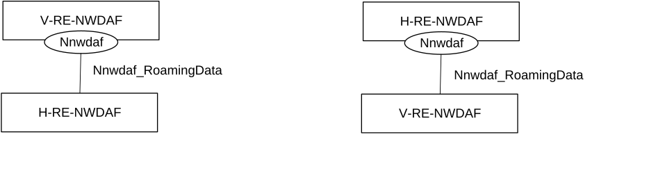
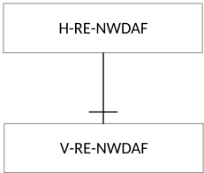

# 4.8.1 Service Description

## 4.8.1.1 Overview

The Nnwdaf_RoamingData service as defined in 3GPP TS 23.288 \[17\], is provided by the Network Data Analytics Function (NWDAF) with roaming exchange capability, which is called Roaming Exchange NWDAF (RE-NWDAF).

This service:

\- allows the NF service consumers to subscribe to and unsubscribe from the data of roaming UEs exposed by an RE-NWDAF;

\- allows the NF service consumers to modify the subscription to the data of roaming UEs exposed by an RE-NWDAF; and

\- notifies the NF service consumers about the data of roaming UEs exposed by an RE-NWDAF.

## 4.8.1.2 Service Architecture

The 5G System Architecture is defined in 3GPP TS 23.501 \[2\]. The Network Data Analytics Exposure architecture is defined in 3GPP TS 23.288 \[17\].

The Nnwdaf_RoamingData service is part of the Nnwdaf service-based interface exhibited by the Network Data Analytics Function (NWDAF).

Known consumers of the Nnwdaf_RoamingData service are:

\- Network Data Analytics Function with Roaming Exchange capability in HPLMN(H-RE-NWDAF), collecting data from V-RE-NWDAF for outbound roaming user(s);

\- Network Data Analytics Function with Roaming Exchange capability in VPLMN(V-RE-NWDAF), collecting data from H-RE-NWDAF for inbound roaming user(s);

Figure 4.8.1.2-1: Reference Architecture for the Nnwdaf_RoamingData Service; SBI representation

Figure 4.8.1.2-2: Reference Architecture for the Nnwdaf_RoamingData Service: reference point representation

## 4.8.1.3 Network Functions

### 4.8.1.3.1 Network Data Analytics Function (NWDAF)

The Network Data Analytics Function (NWDAF) with roaming exchange capability, i.e. the V-RE-NWDAF or H-RE-NWDAF, provides data information related to roaming UE(s) to NF service consumers.

The Network Data Analytics Function (NWDAF) allows NF service consumers to subscribe to and unsubscribe from one-time, periodic notification or notification when an event is detected.

### 4.8.1.3.2 NF Service Consumers

The Network Data Analytics Function (NWDAF) with roaming exchange capability, i.e. the H-RE-NWDAF or V-RE-NWDAF, supports (un)subscription to the notification of the data of roaming UEs exposed by an NWDAF.
