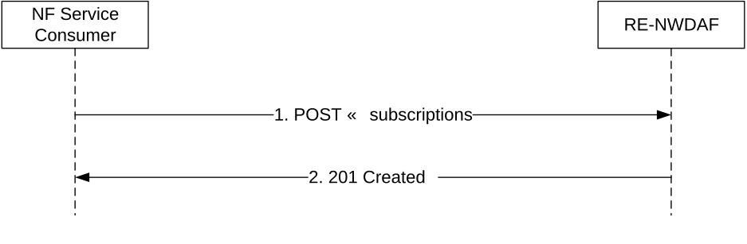
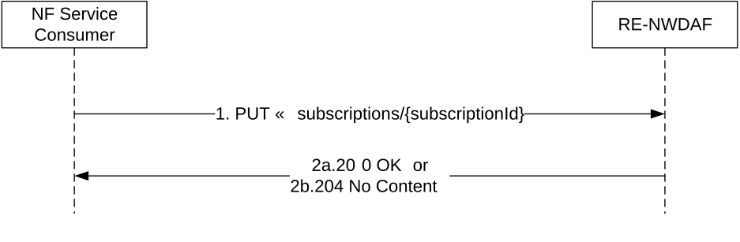
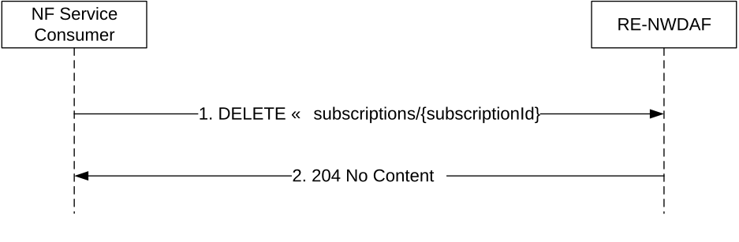
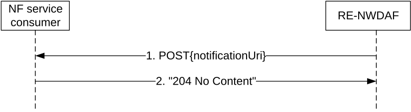
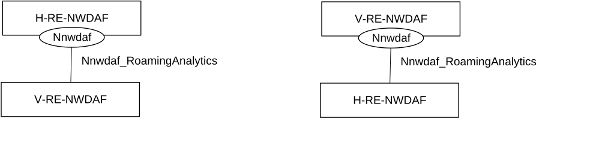
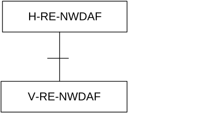

# 4.8.2 Service Operations

## 4.8.2.1 Introduction

Table 4.8.2.1-1: Operations of the Nnwdaf_RoamingData Service

| Service operation name         | Description                                                                                                                  | Initiated by                   |
|--------------------------------|------------------------------------------------------------------------------------------------------------------------------|--------------------------------|
| Nnwdaf_RoamingData_Subscribe   | This service operation is used by an NF service consumer to subscribe to the data of roaming UEs exposed by an RE-NWDAF.     | NF service consumer (RE-NWDAF) |
| Nnwdaf_RoamingData_Unsubscribe | This service operation is used by an NF service consumer to unsubscribe from the data of roaming UEs exposed by an RE-NWDAF. | NF service consumer (RE-NWDAF) |
| Nnwdaf_RoamingData_Notify      | This service operation is used by the NWDAF to notify the data of roaming UEs exposed by an RE-NWDAF.                        | RE-NWDAF                       |

## 4.8.2.2 Nnwdaf_RoamingData_Subscribe service operation

### 4.8.2.2.1 General

The Nnwdaf_RoamingData_Subscribe service operation is used by an NF service consumer to subscribe or update subscription for the data of roaming UEs exposed by an RE-NWDAF.

### 4.8.2.2.2 Subscription for event notifications

Figure 4.8.2.2.2-1 shows a scenario where the NF service consumer sends a request to the RE-NWDAF to subscribe for event notification(s).

Figure 4.8.2.2.2-1: NF service consumer subscribes to notifications

The NF service consumer shall invoke the Nnwdaf_RoamingData_Subscribe service operation to subscribe to event notification(s). The NF service consumer shall send an HTTP POST request with "{apiRoot}/nnwdaf-roamingdata/\<apiVersion\>/subscriptions" as Resource URI representing the "NWDAF Roaming Data Subscriptions", as shown in figure 4.8.2.2.2-1, step 1, to create a subscription for an "Individual NWDAF Roaming Data Subscription" according to the information in message body. The RoamingDataSub data structure provided in the request body shall include:

\- the notification URI within "notificationUri" attribute;

\- the notification correlation identifier within "notifCorrId" attribute;

\- the PLMN ID of the consumer within "plmnId" attribute;

\- either the analytics subscription information to be used by the NWDAF to determine the data that can be used to generate these analytics within the "anaSub" attribute or subscribed data events within the "dataSub" attribute;

and may include:

\- formatting instructions within the "formatInstruct" attribute;

\- processing instructions within the "procInstructs" attribute;

\- time window of the occurrence of the requested data collection within the "timePeriod" attribute; and

\- either a target NF identifier within the "targetNfId" attribute" or a target NF set identifier within the "targetNfSetId" attribute".

Upon the reception of an HTTP POST request with "{apiRoot}/nnwdaf-roamingdata/\<apiVersion\>/subscriptions" as Resource URI and RoamingDataSub data structure as request body, the RE-NWDAF shall:

\- create a new new subscription;

\- assign a subscriptionId;

\- store the subscription.

If the RE-NWDAF created an "Individual NWDAF Roaming Data Subscription" resource, the RE-NWDAF shall respond with "201 Created" with the message body containing a representation of the created subscription, as shown in figure 4.8.2.2.2-1, step 2. The RE-NWDAF shall include a Location HTTP header field. The Location header field shall contain the URI of the created profile, i.e. "{apiRoot}/nnwdaf-roamingdata/\<apiVersion\>/subscriptions/{subscriptionId}".

If an indication to perform immediate reporting is provided in the event subscription, the NWDAF shall include the reports of the events subscribed within "immReport" attribute, if available, in the HTTP POST response.

If the RE-NWDAF does not accept the request upon missing the corresponding roaming agreements, the RE-NWDAF shall reject the request with an HTTP "403 Forbidden" response including the "cause" attribute set to "MISSING_ROAMING_AGREEMENT".

NOTE: If the user consent needs to be checked, the RE-NWDAF checks the user consent as defined in clause X.7 and Annex V of TS 33.501 \[13\] and protection of data exchange in roaming case as defined in clause X.8 of TS 33.501 \[13\].If an error occurs when processing the HTTP POST request, the RE-NWDAF shall send an HTTP error response as specified in clause 5.7.7.

### 4.8.2.2.3 Update of subscription for event notifications

Figure 4.8.2.2.3-1 shows a scenario where the NF service consumer sends a request to the RE-NWDAF to update a subscription for event notification(s).

Figure 4.8.2.2.3-1: NF service consumer updates subscription to notifications

The NF service consumer shall invoke the Nnwdaf_RoamingData_Subscribe service operation to update a subscription to event notification(s) by sending an HTTP PUT request with "{apiRoot}/nnwdaf-roamingdata/\<apiVersion\>/subscriptions/{subscriptionId}" as Resource URI representing the "Individual NWDAF Roaming Data Subscription", as shown in figure 4.8.2.2.3-1, step 1, to update this "Individual NWDAF Roaming Data Subscription" according to the information in message body. The RoamingDataSub data structure provided in the request body shall include the same contents as in clause 4.8.2.2.2.

Upon the reception of an HTTP PUT request with "{apiRoot}/nnwdaf-roamingdata/\<apiVersion\>/subscriptions{subscriptionId}" as Resource URI and RoamingDataSub data structure as request body, the RE-NWDAF shall:

\- update the subscription of corresponding subscriptionId; and

\- store the subscription.

If the RE-NWDAF succesfully update the "Individual NWDAF Roaming Data Subscription" resource, the RE-NWDAF shall respond with "200 OK" with the message body containing a representation of the created subscription, as shown in figure 4.8.2.2.3-1-1, step 2a, or with "204 No Content" as shown in figure 4.8.2.2.3-1-1, step 2b.

If an indication to perform immediate reporting is provided in the request, the RE-NWDAF shall include the reports of the events subscribed within "immReport" attribute, if available, in the HTTP PUT response.

If the RE-NWDAF does not accept the request upon missing the corresponding roaming agreements, the RE-NWDAF shall reject the request with an HTTP "403 Forbidden" response including the "cause" attribute set to "MISSING_ROAMING_AGREEMENT".

If an error occurs when processing the HTTP PUT request, the RE-NWDAF shall send an HTTP error response as specified in clause 5.7.7.

## 4.8.2.3 Nnwdaf_RoamingData_Unsubscribe service operation

### 4.8.2.3.1 General

The Nnwdaf_RoamingData_Unsubscribe service operation is used by an NF service consumer to unsubscribe from the data of roaming UEs exposed by an RE-NWDAF.

### 4.8.2.3.2 Unsubscribe from event notifications

Figure 4.8.2.3.2-1 shows a scenario where the NF service consumer sends a request to the RE-NWDAF to unsubscribe from notifications.

Figure 4.8.2.3.2-1: NF service consumer unsubscribes from notifications

The NF service consumer shall invoke the Nnwdaf_RoamingData_Unsubscribe service operation to unsubscribe to event notifications. The NF service consumer shall send an HTTP DELETE request with: "{apiRoot}/nnwdaf-roamingdata/\<apiVersion\>/subscriptions/{subscriptionId}" as Resource URI, where "{subscriptionId}" is the event subscription ID of the existing subscription that is to be deleted.

Upon the reception of an HTTP DELETE request with: "{apiRoot}/nnwdaf-roamingdata/\<apiVersion\>/subscriptions/{subscriptionId}" as Resource URI, if the RE-NWDAF successfully processed and accepted the received HTTP DELETE request, the RE-NWDAF shall:

\- remove the corresponding subscription; and

\- respond with HTTP "204 No Content" status code.

If the RE-NWDAF determines the received HTTP DELETE request needs to be redirected, the NWDAF shall send an HTTP redirect response as specified in clause 6.10.9 of 3GPP TS 29.500 \[6\].

If an error occurs when processing the HTTP DELETE request, the RE-NWDAF shall send an HTTP error response as specified in clause 5.7.7.

## 4.8.2.4 Nnwdaf_RoamingData_Notify service operation

### 4.8.2.4.1 General

The Nnwdaf_RoamingData_Notify service operation is used by an RE-NWDAF to notify NF service consumer about the subscribed data of roaming UEs exposed by an RE-NWDAF.

### 4.8.2.4.2 Notification about subscribed event

Figure 4.8.2.4.2-1 shows a scenario where the RE-NWDAF sends a request to notify for event notifications.

Figure 4.8.2.4.2-1: RE-NWDAF notifies the subscribed event

The RE-NWDAF shall invoke the Nnwdaf_RoamingData_Notify service operation to notify the subscribed event. The RE-NWDAF shall send an HTTP POST request with "{notificationUri}" received in the Nnwdaf_RoamingData_Notify service operation as Resource URI, as shown in figure 4.8.2.4.2-1, step 1. The HTTP POST message shall include NnwdafDataManagementNotif data structure as described in clause 5.3.6.2.2.

Upon the reception of an HTTP POST request, if the NF service consumer successfully processed and accepted the received HTTP POST request, the NF Service Consumer shall store the notification and respond with HTTP "204 No Content" status code.

If the RE-NWDAF determines the received HTTP POST request needs to be redirected, the RE-NWDAF shall send an HTTP redirect response as specified in clause 6.10.9 of 3GPP TS 29.500 \[6\].

If an error occurs when processing the HTTP POST request, the RE-NWDAF shall send an HTTP error response as specified in clause 5.7.7.

4.9 Nnwdaf_RoamingAnalytics Service

4.9.1 Service Description

4.9.1.1 Overview

The Nnwdaf_RoamingAnalytics service is provided by the Network Data Analytics Function (NWDAF) with roaming exchange capability, which is called Roaming Exchange NWDAF (RE-NWDAF).

This service:

\- allows NF service consumers to subscribe to and unsubscribe from different analytics events related to roaming UE(s); and

\- notifies NF service consumers with a corresponding subscription about observed events related to roaming UE(s).

## 4.9.1.2 Service Architecture

The 5G System Architecture is defined in 3GPP TS 23.501 \[2\]. The Network Data Analytics Exposure architecture, including the case of roaming, is defined in 3GPP TS 23.288 \[17\]. The Network Data Analytics signalling flows are defined in 3GPP TS 29.552 \[25\], the Policy and Charging related 5G architecture is also described in 3GPP TS 23.503 \[4\] and 3GPP TS 29.513 \[5\].

The Nnwdaf_RoamingAnalytics service is part of the Nnwdaf service-based interface exhibited by the Network Data Analytics Function (NWDAF), but it can be provided only by an NWDAF with the roaming exchange capability, which is called Roaming Exchange NWDAF (RE-NWDAF).

The only known consumer of the Nnwdaf_RoamingAnalytics service is the Roaming Exchange NWDAF (RE-NWDAF).

Both the RE-NWDAF that provides the Nnwdaf_RoamingAnalytics service and the RE-NWDAF that consumes the Nnwdaf_RoamingAnalytics service may be in the HPLMN (in which case it is denoted as H-RE-NWDAF) or in the VPLMN (in which case it is denoted as V-RE-NWDAF). If the NF service producer is the H-RE-NWDAF then the NF service consumer is the V-RE-NWDAF and vice versa.

Figure 4.9.1.2-1: Reference Architecture for the Nnwdaf_RoamingAnalytics Service; SBI representation

Figure 4.9.1.2-2: Reference Architecture for the Nnwdaf_RoamingAnalytics Service: reference point representation

## 4.9.1.3 Network Functions

### 4.9.1.3.1 Network Data Analytics Function (NWDAF)

The Network Data Analytics Function (NWDAF) with roaming exchange capability, i.e. the RE-NWDAF, provides analytics information for different analytics events related to roaming UE(s) to NF service consumers.

The Network Data Analytics Function (NWDAF) allows NF service consumers to subscribe to and unsubscribe from one-time, periodic notification or notification when an event is detected.

### 4.9.1.3.2 NF Service Consumers

The Network Data Analytics Function (NWDAF) with roaming exchange capability, i.e. the RE-NWDAF, supports (un)subscription to the notification of analytics information for all types of network analytics related to roaming UE(s) from the NWDAF.
