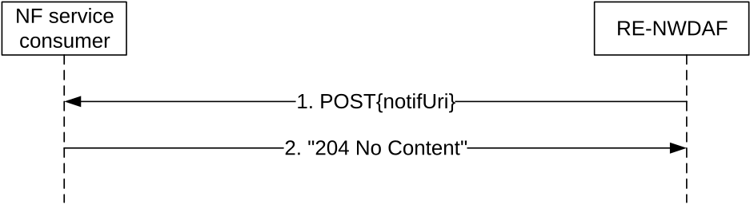

# 4.9.2 Service Operations

## 4.9.2.1 Introduction

Table 4.9.2.1-1: Operations of the Nnwdaf_RoamingAnalytics Service

<table>
<colgroup>
<col style="width: 33%" />
<col style="width: 45%" />
<col style="width: 20%" />
</colgroup>
<thead>
<tr class="header">
<th>Service operation name</th>
<th>Description</th>
<th>Initiated by</th>
</tr>
</thead>
<tbody>
<tr class="odd">
<td>Nnwdaf_RoamingAnalytics_Subscribe</td>
<td>
This service operation is used by an NF to subscribe or update subscription for event notifications of the analytics information related to roaming UE(s).

One-time, periodic notification or notification upon event detection can be subscribed.
</td>
<td>NF service consumer (RE-NWDAF)</td>
</tr>
<tr class="even">
<td>Nnwdaf_RoamingAnalytics_Unsubscribe</td>
<td>This service operation is used by an NF to unsubscribe from event notifications.</td>
<td>NF service consumer (RE-NWDAF)</td>
</tr>
<tr class="odd">
<td>Nnwdaf_RoamingAnalytics_Notify</td>
<td>This service operation is used by an RE-NWDAF to notify NF service consumers about subscribed events.</td>
<td>RE-NWDAF</td>
</tr>
</tbody>
</table>

## 4.9.2.2 Nnwdaf_RoamingAnalytics_Subscribe service operation

### 4.9.2.2.1 General

The Nnwdaf_RoamingAnalytics_Subscribe service operation is used by an NF service consumer to subscribe or update subscription for event notifications related to roaming UE(s) from the NWDAF.

### 4.9.2.2.2 Subscription for event notifications

Figure 4.9.2.2.2-1 shows a scenario where the NF service consumer sends a request to the RE-NWDAF to subscribe for event notification(s).

Figure 4.9.2.2.2-1: NF service consumer subscribes to notifications

The NF service consumer shall invoke the Nnwdaf_RoamingAnalytics_Subscribe service operation to subscribe to event notification(s) related to roaming UE(s) by sending an HTTP POST request with "{apiRoot}/nnwdaf-roaminganalytics/\<apiVersion\>/subscriptions" as Resource URI representing the "NWDAF Roaming Analytics Subscriptions" resource, as shown in figure 4.9.2.2.2-1, step 1, to create an "Individual NWDAF Roaming Analytics Subscription" resource according to the information in message body. The RoamingAnalyticsSubscription data structure provided in the request body shall include:

\- a URI where to receive the requested notifications as "notifUri" attribute;

\- a notification correlation identifier as "notifCorrId" attribute;

\- the PLMN ID of the NF service consumer as "consPlmnId" attribute;

\- a description of the subscribed events as "roamEventSubs" attribute with the same contents as specified for the "eventSubscriptions" attribute in clause 4.2.2.2.2 but excluding the attributes that are indicated as non applicable in Table 5.8.6.2.2-1.

NOTE: The features mentioned in clause 4.2.2.2.2 are not relevant here.

and may include:

\- event reporting information as the "evtReq" attribute with the same contents as specified for the "evtReq" attribute in clause 4.2.2.2.2.

Upon the reception of an HTTP POST request with: "{apiRoot}/nnwdaf-roaminganalytics/\<apiVersion\>/subscriptions" as Resource URI and RoamingAnalyticsSubscription data structure as request body, if no errors occur, the RE-NWDAF shall:

\- create a new subscription;

\- assign an event subscriptionId; and

\- store the subscription.

If the RE-NWDAF created an "Individual NWDAF Roaming Analytics Subscription" resource, the RE-NWDAF shall respond with "201 Created" status code with the message body containing a representation of the created subscription, as shown in figure 4.9.2.2.2-1, step 2. If not all the requested analytics events in the subscription are accepted, then the NWDAF may include the "failEventReports" attribute indicating the event(s) for which the subscription failed and the associated reason(s). The NWDAF shall include a Location HTTP header field. The Location header field shall contain the URI of the created subscription i.e. "{apiRoot}/nnwdaf-roaminganalytics/\<apiVersion\>/subscriptions/{subscriptionId}". If the immediate reporting indication in the "immRep" attribute within the "evtReq" attribute was set to true in the event subscription, the RE-NWDAF shall include the reports of the events subscribed, if available, in the HTTP POST response within the "roamEventNotifs" attribute.

When the "notifFlag" attribute is included and set to "DEACTIVATE" in the request, the RE-NWDAF shall mute the event notification and store the available events until the NF service consumer requests to retrieve them by setting the "notifFlag" attribute to "RETRIEVAL" or until a muting exception occurs (e.g. full buffer).

If the analytics target period provided in the body of the HTTP POST request includes the start time in the past and the end time in the future, the NWDAF shall reject the request with an HTTP "400 Bad Request" response including the "cause" attribute set to "BOTH_STAT_PRED_NOT_ALLOWED".

If the RE-NWDAF does not accept the upon missing the corresponding roaming agreements, the RE-NWDAF shall reject the request with an HTTP "403 Forbidden" response including the "cause" attribute set to "MISSING_ROAMING_AGREEMENT".

If the statistics in the past are requested but the necessary data to perform the service is unavailable, the RE-NWDAF shall reject the request with an HTTP "500 Internal Server Error" response including the "cause" attribute set to "UNAVAILABLE_DATA".

NOTE 2: If the user consent needs to be checked, the RE-NWDAF checks the user consent for analytics as defined in clause X.7 and Annex V of TS 33.501 \[13\] and protection of analytics exchange in roaming case as defined in clause X.8 of TS 33.501 \[13\].

If an error occurs when processing the HTTP POST request, the NWDAF shall send an HTTP error response as specified in clause 5.8.7.

4.9.2.2.3 Update subscription for event notifications

Figure 4.9.2.2.3-1 shows a scenario where the NF service consumer sends a request to the RE-NWDAF to update the subscription for event notifications.

Figure 4.9.2.2.3-1: NF service consumer updates subscription to notifications

The NF service consumer shall invoke the Nnwdaf_RoamingAnalytics_Subscribe service operation to update subscription to event notifications related to roaming UE(s) by sending an HTTP PUT request with "{apiRoot}/nnwdaf-roaminganalytics/\<apiVersion\>/subscriptions/{subscriptionId}" as Resource URI representing the "Individual NWDAF Roaming Analytics Subscription", as shown in figure 4.9.2.2.3-1, step 1, to update the subscription for an "Individual NWDAF Roaming Analytics Subscription" resource identified by the {subscriptionId}. The RoamingAnalyticsSubscription data structure provided in the request body shall include the same contents as described in clause 4.9.2.2.2.

Upon the reception of an HTTP PUT request with: "{apiRoot}/nnwdaf-roaminganalytics/\<apiVersion\>/subscriptions/{subscriptionId}" as Resource URI and RoamingAnalyticsSubscription data structure as request body, the NWDAF shall:

\- update the subscription of corresponding subscriptionId; and

\- store the subscription.

If the RE-NWDAF successfully processed and accepted the received HTTP PUT request, the RE-NWDAF shall update an "Individual NWDAF Roaming Analytics Subscription" resource, and shall respond with:

a\) HTTP "200 OK" status code with the message body containing a representation of the updated subscription, as shown in figure 4.9.2.2.3-1, step 2a. If not all the requested analytics events in the subscription are modified successfully, then the RE-NWDAF may include the "failEventReports" attribute indicating the event(s) for which the modification failed and the associated reason(s). If the immediate reporting indication in the "immRep" attribute within the "evtReq" attribute was set to true in the request, the RE-NWDAF shall include the reports of the events subscribed, if available, in the HTTP PUT response within the "roamEventNotifs" attribute; or

b\) HTTP "204 No Content" status code, as shown in figure 4.9.2.2.3-1, step 2b.

If errors occur when processing the HTTP PUT request, the RE-NWDAF shall send an HTTP error response as specified in clause 5.8.7.

If the analytics target period provided in the body of the HTTP PUT request includes the start time in the past and the end time in the future, the NWDAF shall reject the request with an HTTP "400 Bad Request" response including the "cause" attribute set to "BOTH_STAT_PRED_NOT_ALLOWED".

If the statistics in the past are requested but the necessary data to perform the service is unavailable, the RE-NWDAF shall reject the request with an HTTP "500 Internal Server Error" response including the "cause" attribute set to "UNAVAILABLE_DATA".

If the RE-NWDAF does not accept the request upon missing the corresponding roaming agreements, the RE-NWDAF shall reject the request with an HTTP "403 Forbidden" response including the "cause" attribute set to "MISSING_ROAMING_AGREEMENT".

If the RE-NWDAF determines that the received HTTP PUT request needs to be redirected, the RE-NWDAF shall send an HTTP redirect response as specified in clause 6.10.9 of 3GPP TS 29.500 \[6\].

When the "notifFlag" attribute is included in the request with the value "DEACTIVATE", the RE-NWDAF shall mute the event notification and store the available events until the NF service consumer requests to retrieve them by setting the "notifFlag" attribute to "RETRIEVAL" or until a muting exception occurs (e.g. full buffer); if the "notifFlag" attribute is set to the value "RETRIEVAL", the NWDAF shall send the stored events to the NF service consumer, mute the event notification again and store available events; if the "notifFlag" attribute is set to the value "ACTIVATE" and the event notifications are muted (due to a previously received "DECATIVATE" value), the NWDAF shall unmute the event notification, i.e. start sending again notifications for available events.

4.9.2.3 Nnwdaf_RoamingAnalytics_Unsubscribe service operation

4.9.2.3.1 General

The Nnwdaf_RoamingAnalytics_Unsubscribe service operation is used by an NF service consumer to unsubscribe from event notifications related to roaming UE(s).

4.9.2.3.2 Unsubscribe from event notifications

Figure 4.9.2.3.2-1 shows a scenario where the NF service consumer sends a request to the NWDAF to unsubscribe from event notifications related to roaming UE(s).

Figure 4.9.2.3.2-1: NF service consumer unsubscribes from notifications

The NF service consumer shall invoke the Nnwdaf_RoamingAnalytics_Unsubscribe service operation to unsubscribe to event notifications related to roaming UE(s) by sending an HTTP DELETE request with: "{apiRoot}/nnwdaf-roaminganalytics/\<apiVersion\>/subscriptions/{subscriptionId}" as Resource URI, where "{subscriptionId}" is the event subscriptionId of the existing subscription that is to be deleted.

Upon the reception of an HTTP DELETE request with: "{apiRoot}/nnwdaf-roaminganalytics/\<apiVersion\>/subscriptions/{subscriptionId}" as Resource URI, if the RE-NWDAF successfully processed and accepted the received HTTP DELETE request, the RE-NWDAF shall:

\- remove the corresponding subscription; and

\- respond with HTTP "204 No Content" status code.

If errors occur when processing the HTTP DELETE request, the RE-NWDAF shall send an HTTP error response as specified in clause 5.8.7.

If the RE-NWDAF determines that the received HTTP DELETE request needs to be redirected, the NWDAF shall send an HTTP redirect response as specified in clause 6.10.9 of 3GPP TS 29.500 \[6\].

## 4.9.2.4 Nnwdaf_RoamingAnalytics_Notify service operation

### 4.9.2.4.1 General

The Nnwdaf_RoamingAnalytics_Notify service operation is used by an RE-NWDAF to notify NF consumers about subscribed events related to roaming UE(s).

### 4.9.2.4.2 Notification about subscribed event

Figure 4.9.2.4.2-1 shows a scenario where the RE-NWDAF sends a request to the NF service consumer to notify for event notifications related to roaming UE(s).

Figure 4.9.2.4.2-1: RE-NWDAF notifies the subscribed event

The RE-NWDAF shall invoke the Nnwdaf_RoamingAnalytics_Notify service operation to notify the subscribed event related to roaming UE(s) by sending an HTTP POST request with the "{notifUri}" that was received in the Nnwdaf_RoamingAnalytics_Subscribe service operation as Resource URI, as shown in figure 4.9.2.4.2-1, step 1.

If both the repetition period ("repPeriod" or "repetitionPeriod") attribute and the "offsetPeriod" attribute were present in the subscription request for periodical notification, the RE-NWDAF shall produce a notification in every repetition period seconds, including the statistics in the past offset period if the "offsetPeriod" attribute value is negative, or including the prediction for the future offset period if the "offsetPeriod" attribute value is positive.

The RoamingAnalyticsNotification data structure provided in the request body shall include:

\- the notification correlation identifier as "notifCorrId" attribute;

\- a description of the notified event(s) as "roamEventNotifs" attribute with the same contents as specified for the "eventNotifications" attribute in clause 4.2.2.4.2 but excluding the attributes that are indicated as non applicable in Table 5.8.6.2.3-1.

NOTE: The features mentioned in clause 4.2.2.4.2 are not relevant here.

and may include:

\- a cause for termination in the "termCause" attribute if the RE-NWDAF wants to request the termination of this subscription, i.e. to indicate that it will send no further notifications for it.

If the time when analytics information is needed has been provided (via the "timeAnaNeeded" attribute within the "extraReportReq" attribute) during the subscription for an event (via the "event" attribute within the EventSubscription data type), if the time when analytics information is needed is reached but the subscribed analytics information is not ready, the consumer does not need to wait for the analytics information any longer. In this case, the RE-NWDAF may send an HTTP POST request as shown in step 1 of figure 4.9.2.4.2-1, which shall only provide (within the EventNotification data type in the RoamingAnalyticsNotification data type) an indication of the failure event via the "event" attribute and the corresponding failure reason via a "failNotifyCode" attribute, and may also provide a minimum time interval recommended by the RE-NWDAF for the event via a "rvWaitTime" attribute which will be used by the NF service consumer to determine the time when analytics information is needed in similar future analytics subscriptions.

Upon the reception of an HTTP POST request with: "{notifUri}" as Resource URI and RoamingAnalyticsNotification data structure as request body, if the NF service consumer successfully processed and accepted the received HTTP POST request, the NF service consumer shall:

\- store the notification; and

\- respond with HTTP "204 No Content" status code.

If errors occur when processing the HTTP POST request, the NF service consumer shall send an HTTP error response as specified in clause 5.8.7.

If the NF service consumer determines that the received HTTP POST request needs to be redirected, the NF service consumer shall send an HTTP redirect response as specified in clause 6.10.9 of 3GPP TS 29.500 \[6\].
