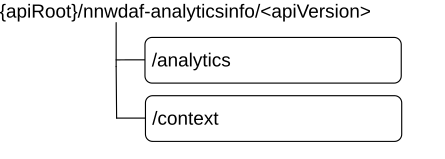

# 5.2.3 Resources

## 5.2.3.1 Resource Structure

This clause describes the structure for the Resource URIs, the resources and methods used for the service.

Figure 5.2.3.1-1 depicts the resource URIs structure for the Nnwdaf_AnalyticsInfo API.

Figure 5.2.3.1-1: Resource URI structure of the Nnwdaf_AnalyticsInfo API

Table 5.2.3.1-1 provides an overview of the resources and applicable HTTP methods.

Table 5.2.3.1-1: Resources and methods overview

|                 |              |                                 |                                                                             |
|-----------------|--------------|---------------------------------|-----------------------------------------------------------------------------|
| Resource name   | Resource URI | HTTP method or custom operation | Description                                                                 |
| NWDAF Analytics | /analytics   | GET                             | Retrieves the NWDAF analytics.                                              |
| NWDAF Context   | /context     | GET                             | Retrieves the NWDAF context information related to analytics subscriptions. |

## 5.2.3.2 Resource: NWDAF Analytics

### 5.2.3.2.1 Description

The NWDAF Analytics resource represents the analytics to the Nnwdaf_AnalyticsInfo service at a given NWDAF.

### 5.2.3.2.2 Resource definition

Resource URI: {apiRoot}/nnwdaf-analyticsinfo/\<apiVersion\>/analytics

The \<apiVersion\> shall be set as described in clause 5.2.1.

This resource shall support the resource URI variables defined in table 5.2.3.2.2-1.

Table 5.2.3.2.2-1: Resource URI variables for this resource

|         |           |                  |
|---------|-----------|------------------|
| Name    | Data type | Definition       |
| apiRoot | string    | See clause 5.2.1 |

### 5.2.3.2.3 Resource Standard Methods

### 5.2.3.2.3.1 GET

This method shall support the URI query parameters specified in table 5.2.3.2.3.1-1.

Table 5.2.3.2.3.1-1: URI query parameters supported by the GET method on this resource

|                                                                                                                                                                                                                                                                                                                                                                    |                           |       |                 |                                                                                                      |
|--------------------------------------------------------------------------------------------------------------------------------------------------------------------------------------------------------------------------------------------------------------------------------------------------------------------------------------------------------------------|---------------------------|-------|-----------------|------------------------------------------------------------------------------------------------------|
| **Name**                                                                                                                                                                                                                                                                                                                                                           | **Data type**             | **P** | **Cardinality** | **Description**                                                                                      |
| ana-req                                                                                                                                                                                                                                                                                                                                                            | EventReportingRequirement | O     | 0..1            | Identifies the analytics reporting requirement information.                                          |
| event-id                                                                                                                                                                                                                                                                                                                                                           | EventId                   | M     | 1               | Shall be included to identify the analytics.                                                         |
| event-filter                                                                                                                                                                                                                                                                                                                                                       | EventFilter               | C     | 0..1            | Shall be included to identify the analytics when filter information is needed for the related event. |
| supported-features                                                                                                                                                                                                                                                                                                                                                 | SupportedFeatures         | O     | 0..1            | To filter irrelevant responses related to unsupported features.                                      |
| tgt-ue                                                                                                                                                                                                                                                                                                                                                             | TargetUeInformation       | O     | 0..1            | Identifies the target UE information. (NOTE)                                                         |
| NOTE: All target UE(s) indicated by this attribute shall belong to the same PLMN. When the RoamingAnalytics feature is supported and the target UE(s) indicated by this attribute belong to a PLMN different than the PLMN of the NF service consumer, the request should contain only attributes that are applicable also in the Nnwdaf_RoamingAnalytics service. |                           |       |                 |                                                                                                      |

This method shall support the request data structures specified in table 5.2.3.2.3.1-2 and the response data structures and response codes specified in table 5.2.3.2.3.1-3.

Table 5.2.3.2.3.1-2: Data structures supported by the GET Request Body on this resource

|           |     |             |             |
|-----------|-----|-------------|-------------|
| Data type | P   | Cardinality | Description |
| n/a       |     |             |             |

Table 5.2.3.2.3.1-3: Data structures supported by the GET Response Body on this resource

<table>
<colgroup>
<col style="width: 31%" />
<col style="width: 2%" />
<col style="width: 11%" />
<col style="width: 10%" />
<col style="width: 44%" />
</colgroup>
<tbody>
<tr class="odd">
<td>Data type</td>
<td>P</td>
<td>Cardinality</td>
<td>
Response

codes
</td>
<td>Description</td>
</tr>
<tr class="even">
<td>AnalyticsData</td>
<td>M</td>
<td>1</td>
<td>200 OK</td>
<td>Containing the analytics with parameters as relevant for the requesting NF service consumer.</td>
</tr>
<tr class="odd">
<td>n/a</td>
<td></td>
<td></td>
<td>204 No Content</td>
<td>If the request NWDAF Analytics data does not exist, the NWDAF shall respond with "204 No Content"</td>
</tr>
<tr class="even">
<td>ProblemDetails</td>
<td>O</td>
<td>0..1</td>
<td>400 Bad Request</td>
<td>(NOTE 2)</td>
</tr>
<tr class="odd">
<td>ProblemDetails</td>
<td>O</td>
<td>0..1</td>
<td>403 Forbidden</td>
<td>(NOTE 2)</td>
</tr>
<tr class="even">
<td>ProblemDetailsAnalyticsInfoRequest</td>
<td>O</td>
<td>0..1</td>
<td>500 Internal Server Error</td>
<td>
The request is rejected by the NWDAF and more details (not only the ProblemDetails) are returned.

(NOTE 2)
</td>
</tr>
<tr class="odd">
<td>ProblemDetails</td>
<td>O</td>
<td>0..1</td>
<td>500 Internal Server Error</td>
<td>(NOTE 2)</td>
</tr>
<tr class="even">
<td colspan="5">
NOTE 1: The mandatory HTTP error status codes for the GET method listed in table 5.2.7.1-1 of 3GPP TS 29.500 [6] also apply.

NOTE 2: Failure cases are described in clause 5.2.7.
</td>
</tr>
</tbody>
</table>

### 5.2.3.2.4 Resource Custom Operations

None in this release of the specification.

## 5.2.3.3 Resource: NWDAF Context

### 5.2.3.3.1 Description

The NWDAF Context resource represents the context information related to analytics subscriptions at the Nnwdaf_AnalyticsInfo service at a given NWDAF.

### 5.2.3.3.2 Resource definition

Resource URI: {apiRoot}/nnwdaf-analyticsinfo/\<apiVersion\>/context

The \<apiVersion\> shall be set as described in clause 5.2.1.

This resource shall support the resource URI variables defined in table 5.2.3.3.2-1.

Table 5.2.3.3.2-1: Resource URI variables for this resource

|         |           |                  |
|---------|-----------|------------------|
| Name    | Data type | Definition       |
| apiRoot | string    | See clause 5.2.1 |

### 5.2.3.3.3 Resource Standard Methods

### 5.2.3.3.3.1 GET

This method shall support the URI query parameters specified in table 5.2.3.3.3.1-1.

Table 5.2.3.3.3.1-1: URI query parameters supported by the GET method on this resource

|                    |                   |     |             |                                                                                                                                                                                                          |
|--------------------|-------------------|-----|-------------|----------------------------------------------------------------------------------------------------------------------------------------------------------------------------------------------------------|
| Name               | Data type         | P   | Cardinality | Description                                                                                                                                                                                              |
| context-ids        | ContextIdList     | M   | 1           | Identifies specific context information related to analytics subscriptions.                                                                                                                              |
| req-context        | RequestedContext  | O   | 0..1        | Identfies the types of the analytics context information the consumer wishes to receive. Absence of this attribute means that the consumer wishes to receive available context information of all types. |
| supported-features | SupportedFeatures | O   | 0..1        | The features supported by the NF service consumer.                                                                                                                                                       |

This method shall support the request data structures specified in table 5.2.3.3.3.1-2 and the response data structures and response codes specified in table 5.2.3.3.3.1-3.

Table 5.2.3.3.3.1-2: Data structures supported by the GET Request Body on this resource

|           |     |             |             |
|-----------|-----|-------------|-------------|
| Data type | P   | Cardinality | Description |
| n/a       |     |             |             |

Table 5.2.3.3.3.1-3: Data structures supported by the GET Response Body on this resource

<table>
<colgroup>
<col style="width: 30%" />
<col style="width: 3%" />
<col style="width: 11%" />
<col style="width: 10%" />
<col style="width: 44%" />
</colgroup>
<tbody>
<tr class="odd">
<td>Data type</td>
<td>P</td>
<td>Cardinality</td>
<td>
Response

codes
</td>
<td>Description</td>
</tr>
<tr class="even">
<td>ContextData</td>
<td>M</td>
<td>1</td>
<td>200 OK</td>
<td>Contains the context information corresponding with the context identifiers provided in the request.</td>
</tr>
<tr class="odd">
<td>n/a</td>
<td></td>
<td></td>
<td>204 No Content</td>
<td>If the requested context information does not exist, the NWDAF shall respond with "204 No Content".</td>
</tr>
<tr class="even">
<td colspan="5">NOTE: The mandatory HTTP error status codes for the GET method listed in table 5.2.7.1-1 of 3GPP TS 29.500 [6] also apply.</td>
</tr>
</tbody>
</table>
