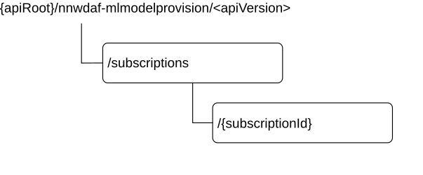

# 5.4.3 Resources

## 5.4.3.1 Resource Structure

This clause describes the structure for the Resource URIs and the resources and methods used for the service.

Figure 5.4.3.1-1 depicts the resource URIs structure for the Nnwdaf_MLModelProvision API.

Figure 5.4.3.1-1: Resource URI structure of the Nnwdaf_MLModelProvision API

Table 5.4.3.1-1 provides an overview of the resources and applicable HTTP methods.

Table 5.4.3.1-1: Resources and methods overview

|                                                  |                                 |                                 |                                                                                                                   |
|--------------------------------------------------|---------------------------------|---------------------------------|-------------------------------------------------------------------------------------------------------------------|
| Resource name                                    | Resource URI                    | HTTP method or custom operation | Description                                                                                                       |
| NWDAF ML Model Provision Subscriptions           | /subscriptions                  | POST                            | Creates a new Individual NWDAF ML Model Provision Subscription resource.                                          |
| Individual NWDAF ML Model Provision Subscription | /subscriptions/{subscriptionId} | DELETE                          | Deletes an Individual NWDAF ML Model Provision Subscription identified by subresource {subscriptionId}.           |
|                                                  |                                 | PUT                             | Modifies an existing Individual NWDAF ML Model Provision Subscription identified by subresource {subscriptionId}. |

## 5.4.3.2 Resource: NWDAF ML Model Provision Subscriptions

### 5.4.3.2.1 Description

The NWDAF ML Model Provision Subscriptions resource represents all subscriptions to the Nnwdaf_MLModelProvision service at a given NWDAF. The resource allows an NF service consumer to create a new Individual NWDAF ML Model Provision Subscription resource.

### 5.4.3.2.2 Resource definition

Resource URI: **{apiRoot}/nnwdaf-mlmodelprovision/\<apiVersion\>/subscriptions**

This resource shall support the resource URI variables defined in table 5.4.3.2.2-1.

Table 5.4.3.2.2-1: Resource URI variables for this resource

|         |           |                  |
|---------|-----------|------------------|
| Name    | Data type | Definition       |
| apiRoot | string    | See clause 5.4.1 |

### 5.4.3.2.3 Resource Standard Methods

### 5.4.3.2.3.1 POST

This method shall support the URI query parameters specified in table 5.4.3.2.3.1-1.

Table 5.4.3.2.3.1-1: URI query parameters supported by the POST method on this resource

|      |           |     |             |             |
|------|-----------|-----|-------------|-------------|
| Name | Data type | P   | Cardinality | Description |
| n/a  |           |     |             |             |

This method shall support the request data structures specified in table 5.4.3.2.3.1-2 and the response data structures and response codes specified in table 5.4.3.2.3.1-3.

Table 5.4.3.2.3.1-2: Data structures supported by the POST Request Body on this resource

|                       |     |             |                                                                          |
|-----------------------|-----|-------------|--------------------------------------------------------------------------|
| Data type             | P   | Cardinality | Description                                                              |
| NwdafMLModelProvSubsc | M   | 1           | Creates a new Individual NWDAF ML Model Provision Subscription resource. |

Table 5.4.3.2.3.1-3: Data structures supported by the POST Response Body on this resource

<table>
<colgroup>
<col style="width: 24%" />
<col style="width: 4%" />
<col style="width: 12%" />
<col style="width: 11%" />
<col style="width: 46%" />
</colgroup>
<tbody>
<tr class="odd">
<td>Data type</td>
<td>P</td>
<td>Cardinality</td>
<td>
Response

codes
</td>
<td>Description</td>
</tr>
<tr class="even">
<td>NwdafMLModelProvSubsc</td>
<td>M</td>
<td>1</td>
<td>201 Created</td>
<td>The creation of an Individual NWDAF ML Model Provision Subscription resource is confirmed and a representation of that resource is returned.</td>
</tr>
<tr class="odd">
<td>ProblemDetails</td>
<td>O</td>
<td>0..1</td>
<td>500 Internal Server Error</td>
<td>(NOTE 2)</td>
</tr>
<tr class="even">
<td colspan="5">
NOTE 1: The mandatory HTTP error status codes for the POST method listed in table 5.2.7.1-1 of 3GPP TS 29.500 [6] also apply.

NOTE 2: Failure causes are described in subclause 5.4.7.3.
</td>
</tr>
</tbody>
</table>

**Table 5.4.3.2.3.1-4: Headers suppor**ted by the 201 Response Code on this resource

|          |               |       |                 |                                                                                                                                                             |
|----------|---------------|-------|-----------------|-------------------------------------------------------------------------------------------------------------------------------------------------------------|
| **Name** | **Data type** | **P** | **Cardinality** | **Description**                                                                                                                                             |
| Location | string        | M     | 1               | Contains the URI of the newly created resource, according to the structure: {apiRoot}/nnwdaf-mlmodelprovision/\<apiVersion\>/subscriptions/{subscriptionId} |

### 5.4.3.2.4 Resource Custom Operations

None in this release of the specification.

## 5.4.3.3 Resource: Individual NWDAF ML Model Provision Subscription

### 5.4.3.3.1 Description

The Individual NWDAF ML Model Provision Subscription resource represents a single subscription to the Nnwdaf_MLModelProvision service at a given NWDAF.

### 5.4.3.3.2 Resource definition

Resource URI: **{apiRoot}/nnwdaf-mlmodelprovision/\<apiVersion\>/subscriptions/{subscriptionId}**

The \<apiVersion\> shall be set as described in clause 5.4.1.

This resource shall support the resource URI variables defined in table 5.4.3.3.2-1.

Table 5.4.3.3.2-1: Resource URI variables for this resource

|                |           |                                                                   |
|----------------|-----------|-------------------------------------------------------------------|
| Name           | Data type | Definition                                                        |
| apiRoot        | string    | See clause 5.4.1.                                                 |
| subscriptionId | string    | Identifies a subscription to the Nnwdaf_MLModelProvision service. |

### 5.4.3.3.3 Resource Standard Methods

### 5.4.3.3.3.1 PUT

This method shall support the URI query parameters specified in table 5.4.3.3.3.1-1.

Table 5.4.3.3.3.1-1: URI query parameters supported by the PUT method on this resource

|      |           |     |             |             |
|------|-----------|-----|-------------|-------------|
| Name | Data type | P   | Cardinality | Description |
| n/a  |           |     |             |             |

This method shall support the request data structures specified in table 5.4.3.3.3.1-2 and the response data structures and response codes specified in table 5.4.3.3.3.1-3.

Table 5.4.3.3.3.1-2: Data structures supported by the PUT Request Body on this resource

|                       |     |             |                                                                                         |
|-----------------------|-----|-------------|-----------------------------------------------------------------------------------------|
| Data type             | P   | Cardinality | Description                                                                             |
| NwdafMLModelProvSubsc | M   | 1           | Parameters to replace a subscription to NWDAF ML Model Provision Subscription resource. |

Table 5.4.3.3.3.1-3: Data structures supported by the PUT Response Body on this resource

<table>
<colgroup>
<col style="width: 26%" />
<col style="width: 4%" />
<col style="width: 13%" />
<col style="width: 17%" />
<col style="width: 38%" />
</colgroup>
<tbody>
<tr class="odd">
<td>Data type</td>
<td>P</td>
<td>Cardinality</td>
<td>Response codes</td>
<td>Description</td>
</tr>
<tr class="even">
<td>NwdafMLModelProvSubsc</td>
<td>M</td>
<td>1</td>
<td>200 OK</td>
<td>The Individual NWDAF ML Model Provision Subscription resource was modified successfully and a representation of that resource is returned.</td>
</tr>
<tr class="odd">
<td>n/a</td>
<td></td>
<td></td>
<td>204 No Content</td>
<td>The Individual NWDAF ML Model Provision Subscription resource was modified successfully.</td>
</tr>
<tr class="even">
<td>RedirectResponse</td>
<td>O</td>
<td>0..1</td>
<td>307 Temporary Redirect</td>
<td>
Temporary redirection, during Individual NWDAF ML Model Provision Subscription modification.

(NOTE 3)
</td>
</tr>
<tr class="odd">
<td>RedirectResponse</td>
<td>O</td>
<td>0..1</td>
<td>308 Permanent Redirect</td>
<td>
Permanent redirection, during Individual NWDAF ML Model Provision Subscription modification.

(NOTE 3)
</td>
</tr>
<tr class="even">
<td>ProblemDetails</td>
<td>O</td>
<td>0..1</td>
<td>500 Internal Server Error</td>
<td>(NOTE 2)</td>
</tr>
<tr class="odd">
<td colspan="5">
NOTE 1: The mandatory HTTP error status codes for the PUT method listed in table 5.2.7.1-1 of 3GPP TS 29.500 [6] also apply.

NOTE 2: Failure causes are described in subclause 5.4.7.3.

NOTE 3: The RedirectResponse data structure may be provided by an SCP (cf. clause 6.10.9.1 of 3GPP TS 29.500 [6]).
</td>
</tr>
</tbody>
</table>

Table 5.4.3.3.3.1-4: Headers supported by the 307 Response Code on this resource

<table>
<colgroup>
<col style="width: 16%" />
<col style="width: 14%" />
<col style="width: 4%" />
<col style="width: 11%" />
<col style="width: 52%" />
</colgroup>
<tbody>
<tr class="odd">
<td>Name</td>
<td>Data type</td>
<td>P</td>
<td>Cardinality</td>
<td>Description</td>
</tr>
<tr class="even">
<td>Location</td>
<td>string</td>
<td>M</td>
<td>1</td>
<td>
Contains an alternative URI of the resource located in an alternative NWDAF (service) instance towards which the request is redirected.

For the case where the request is redirected to the same target via a different SCP, refer to clause 6.10.9.1 of 3GPP TS 29.500 [6].
</td>
</tr>
<tr class="odd">
<td>3gpp-Sbi-Target-Nf-Id</td>
<td>string</td>
<td>O</td>
<td>0..1</td>
<td>Identifier of the target NWDAF (service) instance towards which the request is redirected.</td>
</tr>
</tbody>
</table>

Table 5.4.3.3.3.1-5: Headers supported by the 308 Response Code on this resource

<table>
<colgroup>
<col style="width: 16%" />
<col style="width: 14%" />
<col style="width: 4%" />
<col style="width: 11%" />
<col style="width: 52%" />
</colgroup>
<tbody>
<tr class="odd">
<td>Name</td>
<td>Data type</td>
<td>P</td>
<td>Cardinality</td>
<td>Description</td>
</tr>
<tr class="even">
<td>Location</td>
<td>string</td>
<td>M</td>
<td>1</td>
<td>
Contains an alternative URI of the resource located in an alternative NWDAF (service) instance towards which the request is redirected.

For the case where the request is redirected to the same target via a different SCP, refer to clause 6.10.9.1 of 3GPP TS 29.500 [6].
</td>
</tr>
<tr class="odd">
<td>3gpp-Sbi-Target-Nf-Id</td>
<td>string</td>
<td>O</td>
<td>0..1</td>
<td>Identifier of the target NWDAF (service) instance towards which the request is redirected.</td>
</tr>
</tbody>
</table>

### 5.4.3.3.3.2 DELETE

This method shall support the URI query parameters specified in table 5.4.3.3.3.2-1.

Table 5.4.3.3.3.2-1: URI query parameters supported by the DELETE method on this resource

|      |           |     |             |             |
|------|-----------|-----|-------------|-------------|
| Name | Data type | P   | Cardinality | Description |
| n/a  |           |     |             |             |

This method shall support the request data structures specified in table 5.4.3.3.3.2-2 and the response data structures and response codes specified in table 5.4.3.3.3.2-3.

Table 5.4.3.3.3.2-2: Data structures supported by the DELETE Request Body on this resource

|           |     |             |             |
|-----------|-----|-------------|-------------|
| Data type | P   | Cardinality | Description |
| n/a       |     |             |             |

Table 5.4.3.3.3.2-3: Data structures supported by the DELETE Response Body on this resource

<table>
<colgroup>
<col style="width: 16%" />
<col style="width: 4%" />
<col style="width: 12%" />
<col style="width: 11%" />
<col style="width: 54%" />
</colgroup>
<tbody>
<tr class="odd">
<td>Data type</td>
<td>P</td>
<td>Cardinality</td>
<td>
Response

codes
</td>
<td>Description</td>
</tr>
<tr class="even">
<td>n/a</td>
<td></td>
<td></td>
<td>204 No Content</td>
<td>Successful case: The Individual NWDAF ML Model Provision Subscription resource matching the subscriptionId was deleted.</td>
</tr>
<tr class="odd">
<td>RedirectResponse</td>
<td>O</td>
<td>0..1</td>
<td>307 Temporary Redirect</td>
<td>
Temporary redirection, during Individual NWDAF ML Model Provision Subscription deletion.

(NOTE 2)
</td>
</tr>
<tr class="even">
<td>RedirectResponse</td>
<td>O</td>
<td>0..1</td>
<td>308 Permanent Redirect</td>
<td>
Permanent redirection, during Individual NWDAF ML Model Provision Subscription deletion.

(NOTE 2)
</td>
</tr>
<tr class="odd">
<td colspan="5">
NOTE 1: The mandatory HTTP error status codes for the DELETE method listed in table 5.2.7.1-1 of 3GPP TS 29.500 [6] also apply.

NOTE 2: The RedirectResponse data structure may be provided by an SCP (cf. clause 6.10.9.1 of 3GPP TS 29.500 [6]).
</td>
</tr>
</tbody>
</table>

Table 5.4.3.3.3.2-4: Headers supported by the 307 Response Code on this resource

<table>
<colgroup>
<col style="width: 16%" />
<col style="width: 14%" />
<col style="width: 4%" />
<col style="width: 11%" />
<col style="width: 52%" />
</colgroup>
<tbody>
<tr class="odd">
<td>Name</td>
<td>Data type</td>
<td>P</td>
<td>Cardinality</td>
<td>Description</td>
</tr>
<tr class="even">
<td>Location</td>
<td>string</td>
<td>M</td>
<td>1</td>
<td>
Contains an alternative URI of the resource located in an alternative NWDAF (service) instance towards which the request is redirected.

For the case where the request is redirected to the same target via a different SCP, refer to clause 6.10.9.1 of 3GPP TS 29.500 [6].
</td>
</tr>
<tr class="odd">
<td>3gpp-Sbi-Target-Nf-Id</td>
<td>string</td>
<td>O</td>
<td>0..1</td>
<td>Identifier of the target NWDAF (service) instance towards which the request is redirected.</td>
</tr>
</tbody>
</table>

Table 5.4.3.3.3.2-5: Headers supported by the 308 Response Code on this resource

<table>
<colgroup>
<col style="width: 16%" />
<col style="width: 14%" />
<col style="width: 4%" />
<col style="width: 11%" />
<col style="width: 52%" />
</colgroup>
<tbody>
<tr class="odd">
<td>Name</td>
<td>Data type</td>
<td>P</td>
<td>Cardinality</td>
<td>Description</td>
</tr>
<tr class="even">
<td>Location</td>
<td>string</td>
<td>M</td>
<td>1</td>
<td>
Contains an alternative URI of the resource located in an alternative NWDAF (service) instance towards which the request is redirected.

For the case where the request is redirected to the same target via a different SCP, refer to clause 6.10.9.1 of 3GPP TS 29.500 [6].
</td>
</tr>
<tr class="odd">
<td>3gpp-Sbi-Target-Nf-Id</td>
<td>string</td>
<td>O</td>
<td>0..1</td>
<td>Identifier of the target NWDAF (service) instance towards which the request is redirected.</td>
</tr>
</tbody>
</table>

### 5.4.3.3.4 Resource Custom Operations

None in this release of the specification.
