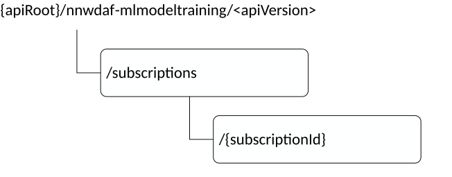

# 5.5.3 Resources

## 5.5.3.1 Resource Structure

This clause describes the structure for the Resource URIs and the resources and methods used for the service.

Figure 5.5.3.1-1 depicts the resource URIs structure for the Nnwdaf_MLModelTraining API.

Figure 5.5.3.1-1: Resource URI structure of the Nnwdaf_MLModelTraining API

Table 5.5.3.1-1 provides an overview of the resources and applicable HTTP methods.

Table 5.5.3.1-1: Resources and methods overview

|                                                 |                                 |                                 |                                                                                                                           |
|-------------------------------------------------|---------------------------------|---------------------------------|---------------------------------------------------------------------------------------------------------------------------|
| Resource name                                   | Resource URI                    | HTTP method or custom operation | Description                                                                                                               |
| NWDAF ML Model Training Subscriptions           | /subscriptions                  | POST                            | Creates a new Individual NWDAF ML Model Training Subscription resource.                                                   |
| Individual NWDAF ML Model Training Subscription | /subscriptions/{subscriptionId} | DELETE                          | Deletes an Individual NWDAF ML Model Training Subscription identified by subresource {subscriptionId}.                    |
|                                                 |                                 | PUT                             | Modifies an existing Individual NWDAF ML Model Training Subscription identified by subresource {subscriptionId}.          |
|                                                 |                                 | PATCH                           | Partial update of an existing Individual NWDAF ML Model Training Subscription identified by subresource {subscriptionId}. |

## 5.5.3.2 Resource: NWDAF ML Model Training Subscriptions

### 5.5.3.2.1 Description

The NWDAF ML Model Training Subscriptions resource represents all subscriptions to the Nnwdaf_MLModelTraining service at a given NWDAF. The resource allows an NF service consumer to create a new Individual NWDAF ML Model Training Subscription resource.

### 5.5.3.2.2 Resource definition

Resource URI: **{apiRoot}/nnwdaf-mlmodeltraining/\<apiVersion\>/subscriptions**

This resource shall support the resource URI variables defined in table 5.5.3.2.2-1.

Table 5.5.3.2.2-1: Resource URI variables for this resource

|         |           |                  |
|---------|-----------|------------------|
| Name    | Data type | Definition       |
| apiRoot | string    | See clause 5.5.1 |

### 5.5.3.2.3 Resource Standard Methods

### 5.5.3.2.3.1 POST

This method shall support the URI query parameters specified in table 5.5.3.2.3.1-1.

Table 5.5.3.2.3.1-1: URI query parameters supported by the POST method on this resource

|      |           |     |             |             |
|------|-----------|-----|-------------|-------------|
| Name | Data type | P   | Cardinality | Description |
| n/a  |           |     |             |             |

This method shall support the request data structures specified in table 5.5.3.2.3.1-2 and the response data structures and response codes specified in table 5.5.3.2.3.1-3.

Table 5.5.3.2.3.1-2: Data structures supported by the POST Request Body on this resource

|                        |     |             |                                                                         |
|------------------------|-----|-------------|-------------------------------------------------------------------------|
| Data type              | P   | Cardinality | Description                                                             |
| NwdafMLModelTrainSubsc | M   | 1           | Creates a new Individual NWDAF ML Model Training Subscription resource. |

Table 5.5.3.2.3.1-3: Data structures supported by the POST Response Body on this resource

<table>
<colgroup>
<col style="width: 24%" />
<col style="width: 4%" />
<col style="width: 12%" />
<col style="width: 11%" />
<col style="width: 46%" />
</colgroup>
<tbody>
<tr class="odd">
<td><strong>Data type</strong></td>
<td><strong>P</strong></td>
<td><strong>Cardinality</strong></td>
<td>
<strong>Response</strong>

<strong>codes</strong>
</td>
<td><strong>Description</strong></td>
</tr>
<tr class="even">
<td>NwdafMLModelTrainSubsc</td>
<td>M</td>
<td>1</td>
<td>201 Created</td>
<td>The creation of an Individual NWDAF ML Model Training Subscription resource is confirmed and a representation of that resource is returned.</td>
</tr>
<tr class="odd">
<td>ProblemDetails</td>
<td>O</td>
<td>0..1</td>
<td>403 Forbidden</td>
<td>(NOTE 2)</td>
</tr>
<tr class="even">
<td>ProblemDetails</td>
<td>O</td>
<td>0..1</td>
<td>500 Internal Server Error</td>
<td>(NOTE 2)</td>
</tr>
<tr class="odd">
<td colspan="5">
NOTE 1: The mandatory HTTP error status codes for the POST method listed in table 5.2.7.1-1 of 3GPP TS 29.500 [6] also apply.

NOTE 2: Failure causes are described in subclause 5.5.7.3.
</td>
</tr>
</tbody>
</table>

Table 5.5.3.2.3.1-4: Headers supported by the 201 Response Code on this resource

|          |           |     |             |                                                                                                                                                            |
|----------|-----------|-----|-------------|------------------------------------------------------------------------------------------------------------------------------------------------------------|
| Name     | Data type | P   | Cardinality | Description                                                                                                                                                |
| Location | string    | M   | 1           | Contains the URI of the newly created resource, according to the structure: {apiRoot}/nnwdaf-mlmodeltraining/\<apiVersion\>/subscriptions/{subscriptionId} |

### 5.5.3.2.4 Resource Custom Operations

None in this release of the specification.

## 5.5.3.3 Resource: Individual NWDAF ML Model Training Subscription

### 5.5.3.3.1 Description

The Individual NWDAF ML Model Training Subscription resource represents a single subscription to the Nnwdaf_MLModelTraining service at a given NWDAF.

### 5.5.3.3.2 Resource definition

Resource URI: **{apiRoot}/nnwdaf-mlmodeltraining/\<apiVersion\>/subscriptions/{subscriptionId}**

The \<apiVersion\> shall be set as described in clause 5.5.1.

This resource shall support the resource URI variables defined in table 5.5.3.3.2-1.

Table 5.5.3.3.2-1: Resource URI variables for this resource

|                |           |                                                                  |
|----------------|-----------|------------------------------------------------------------------|
| Name           | Data type | Definition                                                       |
| apiRoot        | string    | See clause 5.5.1.                                                |
| subscriptionId | string    | Identifies a subscription to the Nnwdaf_MLModelTraining service. |

### 5.5.3.3.3 Resource Standard Methods

### 5.5.3.3.3.1 PUT

This method shall support the URI query parameters specified in table 5.5.3.3.3.1-1.

Table 5.5.3.3.3.1-1: URI query parameters supported by the PUT method on this resource

|      |           |     |             |             |
|------|-----------|-----|-------------|-------------|
| Name | Data type | P   | Cardinality | Description |
| n/a  |           |     |             |             |

This method shall support the request data structures specified in table 5.5.3.3.3.1-2 and the response data structures and response codes specified in table 5.5.3.3.3.1-3.

Table 5.5.3.3.3.1-2: Data structures supported by the PUT Request Body on this resource

|                        |     |             |                                                                                        |
|------------------------|-----|-------------|----------------------------------------------------------------------------------------|
| Data type              | P   | Cardinality | Description                                                                            |
| NwdafMLModelTrainSubsc | M   | 1           | Parameters to replace a subscription to NWDAF ML Model Training Subscription resource. |

Table 5.5.3.3.3.1-3: Data structures supported by the PUT Response Body on this resource

<table>
<colgroup>
<col style="width: 26%" />
<col style="width: 4%" />
<col style="width: 13%" />
<col style="width: 17%" />
<col style="width: 38%" />
</colgroup>
<tbody>
<tr class="odd">
<td><strong>Data type</strong></td>
<td><strong>P</strong></td>
<td><strong>Cardinality</strong></td>
<td><strong>Response codes</strong></td>
<td><strong>Description</strong></td>
</tr>
<tr class="even">
<td>NwdafMLModelTrainSubsc</td>
<td>M</td>
<td>1</td>
<td>200 OK</td>
<td>The Individual NWDAF ML Model Training Subscription resource was modified successfully, and a representation of that resource is returned.</td>
</tr>
<tr class="odd">
<td>n/a</td>
<td></td>
<td></td>
<td>204 No Content</td>
<td>The Individual NWDAF ML Model Training Subscription resource was modified successfully.</td>
</tr>
<tr class="even">
<td>RedirectResponse</td>
<td>O</td>
<td>0..1</td>
<td>307 Temporary Redirect</td>
<td>Temporary redirection, during Individual NWDAF ML Model Training Subscription modification. The response shall include a Location header field containing an alternative URI of the resource located in an alternative NWDAF (service) instance.</td>
</tr>
<tr class="odd">
<td>RedirectResponse</td>
<td>O</td>
<td>0..1</td>
<td>308 Permanent Redirect</td>
<td>Permanent redirection, during Individual NWDAF ML Model Trainin Subscription modification. The response shall include a Location header field containing an alternative URI of the resource located in an alternative NWDAF (service) instance.</td>
</tr>
<tr class="even">
<td>ProblemDetails</td>
<td>O</td>
<td>0..1</td>
<td>403 Forbidden</td>
<td>(NOTE 2)</td>
</tr>
<tr class="odd">
<td>ProblemDetails</td>
<td>O</td>
<td>0..1</td>
<td>500 Internal Server Error</td>
<td>(NOTE 2)</td>
</tr>
<tr class="even">
<td colspan="5">
NOTE 1: The mandatory HTTP error status codes for the PUT method listed in table 5.2.7.1-1 of 3GPP TS 29.500 [6] also apply.

NOTE 2: Failure causes are described in subclause 5.5.7.3.
</td>
</tr>
</tbody>
</table>

Table 5.5.3.3.3.1-4: Headers supported by the 307 Response Code on this resource

|                       |           |     |             |                                                                                        |
|-----------------------|-----------|-----|-------------|----------------------------------------------------------------------------------------|
| Name                  | Data type | P   | Cardinality | Description                                                                            |
| Location              | string    | M   | 1           | An alternative URI of the resource located in an alternative NWDAF (service) instance. |
| 3gpp-Sbi-Target-Nf-Id | string    | O   | 0..1        | Identifier of the target NF (service) instance towards which the request is redirected |

Table 5.5.3.3.3.1-5: Headers supported by the 308 Response Code on this resource

|                       |           |     |             |                                                                                        |
|-----------------------|-----------|-----|-------------|----------------------------------------------------------------------------------------|
| Name                  | Data type | P   | Cardinality | Description                                                                            |
| Location              | string    | M   | 1           | An alternative URI of the resource located in an alternative NWDAF (service) instance. |
| 3gpp-Sbi-Target-Nf-Id | string    | O   | 0..1        | Identifier of the target NF (service) instance towards which the request is redirected |

### 5.5.3.3.3.2 PATCH

This method shall support the URI query parameters specified in table 5.5.3.3.3.2-1.

Table 5.5.3.3.3.2-1: URI query parameters supported by the PATCH method on this resource

|      |           |     |             |             |
|------|-----------|-----|-------------|-------------|
| Name | Data type | P   | Cardinality | Description |
| n/a  |           |     |             |             |

This method shall support the request data structures specified in table 5.5.3.3.3.2-2 and the response data structures and response codes specified in table 5.5.3.3.3.2-3.

Table 5.5.3.3.3.2-2: Data structures supported by the PATCH Request Body on this resource

|                             |     |             |                                                                                                  |
|-----------------------------|-----|-------------|--------------------------------------------------------------------------------------------------|
| Data type                   | P   | Cardinality | Description                                                                                      |
| NwdafMLModelTrainSubscPatch | M   | 1           | Partial update of parameters to a subscription to NWDAF ML Model Training Subscription resource. |

Table 5.5.3.3.3.2-3: Data structures supported by the PATCH Response Body on this resource

<table>
<colgroup>
<col style="width: 26%" />
<col style="width: 4%" />
<col style="width: 13%" />
<col style="width: 17%" />
<col style="width: 38%" />
</colgroup>
<tbody>
<tr class="odd">
<td><strong>Data type</strong></td>
<td><strong>P</strong></td>
<td><strong>Cardinality</strong></td>
<td><strong>Response codes</strong></td>
<td><strong>Description</strong></td>
</tr>
<tr class="even">
<td>NwdafMLModelTrainSubsc</td>
<td>M</td>
<td>1</td>
<td>200 OK</td>
<td>The Individual NWDAF ML Model Training Subscription resource was partial modified successfully and a representation of that resource is returned.</td>
</tr>
<tr class="odd">
<td>n/a</td>
<td></td>
<td></td>
<td>204 No Content</td>
<td>The Individual NWDAF ML Model Training Subscription resource was partial modified successfully.</td>
</tr>
<tr class="even">
<td>RedirectResponse</td>
<td>O</td>
<td>0..1</td>
<td>307 Temporary Redirect</td>
<td>Temporary redirection, during Individual NWDAF ML Model Training Subscription modification. The response shall include a Location header field containing an alternative URI of the resource located in an alternative NWDAF (service) instance.</td>
</tr>
<tr class="odd">
<td>RedirectResponse</td>
<td>O</td>
<td>0..1</td>
<td>308 Permanent Redirect</td>
<td>Permanent redirection, during Individual NWDAF ML Model Trainin Subscription modification. The response shall include a Location header field containing an alternative URI of the resource located in an alternative NWDAF (service) instance.</td>
</tr>
<tr class="even">
<td>ProblemDetails</td>
<td>O</td>
<td>0..1</td>
<td>403 Forbidden</td>
<td>(NOTE 2)</td>
</tr>
<tr class="odd">
<td>ProblemDetails</td>
<td>O</td>
<td>0..1</td>
<td>500 Internal Server Error</td>
<td>(NOTE 2)</td>
</tr>
<tr class="even">
<td colspan="5">
NOTE 1: The mandatory HTTP error status codes for the PATCH method listed in table 5.2.7.1-1 of 3GPP TS 29.500 [6] also apply.

NOTE 2: Failure causes are described in subclause 5.5.7.3.
</td>
</tr>
</tbody>
</table>

Table 5.5.3.3.3.2-4: Headers supported by the 307 Response Code on this resource

|                       |           |     |             |                                                                                        |
|-----------------------|-----------|-----|-------------|----------------------------------------------------------------------------------------|
| Name                  | Data type | P   | Cardinality | Description                                                                            |
| Location              | string    | M   | 1           | An alternative URI of the resource located in an alternative NWDAF (service) instance. |
| 3gpp-Sbi-Target-Nf-Id | string    | O   | 0..1        | Identifier of the target NF (service) instance towards which the request is redirected |

Table 5.5.3.3.3.2-5: Headers supported by the 308 Response Code on this resource

|                       |           |     |             |                                                                                        |
|-----------------------|-----------|-----|-------------|----------------------------------------------------------------------------------------|
| Name                  | Data type | P   | Cardinality | Description                                                                            |
| Location              | string    | M   | 1           | An alternative URI of the resource located in an alternative NWDAF (service) instance. |
| 3gpp-Sbi-Target-Nf-Id | string    | O   | 0..1        | Identifier of the target NF (service) instance towards which the request is redirected |

### 5.5.3.3.3.3 DELETE

This method shall support the URI query parameters specified in table 5.5.3.3.3.3-1.

Table 5.5.3.3.3.3-1: URI query parameters supported by the DELETE method on this resource

|      |           |     |             |             |
|------|-----------|-----|-------------|-------------|
| Name | Data type | P   | Cardinality | Description |
| n/a  |           |     |             |             |

This method shall support the request data structures specified in table 5.5.3.3.3.3-2 and the response data structures and response codes specified in table 5.5.3.3.3.3-3.

Table 5.5.3.3.3.2-2: Data structures supported by the DELETE Request Body on this resource

|           |     |             |             |
|-----------|-----|-------------|-------------|
| Data type | P   | Cardinality | Description |
|           |     |             |             |

Table 5.5.3.3.3.3-3: Data structures supported by the DELETE Response Body on this resource

<table>
<colgroup>
<col style="width: 16%" />
<col style="width: 4%" />
<col style="width: 12%" />
<col style="width: 11%" />
<col style="width: 54%" />
</colgroup>
<tbody>
<tr class="odd">
<td>Data type</td>
<td>P</td>
<td>Cardinality</td>
<td>
Response

codes
</td>
<td>Description</td>
</tr>
<tr class="even">
<td>n/a</td>
<td></td>
<td></td>
<td>204 No Content</td>
<td>Successful case: The Individual NWDAF ML Model Training Subscription resource matching the subscriptionId was deleted.</td>
</tr>
<tr class="odd">
<td>RedirectResponse</td>
<td>O</td>
<td>0..1</td>
<td>307 Temporary Redirect</td>
<td>Temporary redirection, during Individual NWDAF ML Model Training Subscription deletion. The response shall include a Location header field containing an alternative URI of the resource located in an alternative NWDAF (service) instance.</td>
</tr>
<tr class="even">
<td>RedirectResponse</td>
<td>O</td>
<td>0..1</td>
<td>308 Permanent Redirect</td>
<td>Permanent redirection, during Individual NWDAF ML Model Training Subscription deletion. The response shall include a Location header field containing an alternative URI of the resource located in an alternative NWDAF (service) instance.</td>
</tr>
<tr class="odd">
<td colspan="5">NOTE: The mandatory HTTP error status codes for the DELETE method listed in table 5.2.7.1-1 of 3GPP TS 29.500 [6] also apply.</td>
</tr>
</tbody>
</table>

Table 5.5.3.3.3.3-4: Headers supported by the 307 Response Code on this resource

|                       |           |     |             |                                                                                        |
|-----------------------|-----------|-----|-------------|----------------------------------------------------------------------------------------|
| Name                  | Data type | P   | Cardinality | Description                                                                            |
| Location              | string    | M   | 1           | An alternative URI of the resource located in an alternative NWDAF (service) instance. |
| 3gpp-Sbi-Target-Nf-Id | string    | O   | 0..1        | Identifier of the target NF (service) instance towards which the request is redirected |

Table 5.5.3.3.3.3-5: Headers supported by the 308 Response Code on this resource

|                       |           |     |             |                                                                                        |
|-----------------------|-----------|-----|-------------|----------------------------------------------------------------------------------------|
| Name                  | Data type | P   | Cardinality | Description                                                                            |
| Location              | string    | M   | 1           | An alternative URI of the resource located in an alternative NWDAF (service) instance. |
| 3gpp-Sbi-Target-Nf-Id | string    | O   | 0..1        | Identifier of the target NF (service) instance towards which the request is redirected |

### 5.5.3.3.4 Resource Custom Operations

None in this release of the specification.
