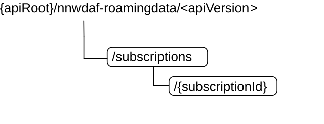

# 5.7 Nnwdaf_RoamingData Service API

## 5.7.1 Introduction

The Nnwdaf_RoamingData service shall use the Nnwdaf_RoamingData API.

The API URI of the Nnwdaf_RoamingData API shall be:

{apiRoot}/\<apiName\>/\<apiVersion\>

The request URIs used in each HTTP requests from the NF service consumer towards the RE-NWDAF shall have the Resource URI structure defined in clause 4.4.1 of 3GPP TS 29.501 \[7\], i.e.:

> **{apiRoot}/\<apiName\>/\<apiVersion\>/\<apiSpecificResourceUriPart\>**

with the following components:

\- The {apiRoot} shall be set as described in 3GPP TS 29.501 \[7\].

\- The\<apiName\> shall be "nnwdaf-roamingdata".

\- The \<apiVersion\> shall be "v1".

\- The \<apiSpecificResourceUriPart\> shall be set as described in clause 5.7.3.

## 5.7.2 Usage of HTTP

### 5.7.2.1 General

HTTP/2, IETF RFC 9113 \[9\], shall be used as specified in clause 5 of 3GPP TS 29.500 \[6\].

HTTP/2 shall be transported as specified in clause 5.3 of 3GPP TS 29.500 \[6\].

The OpenAPI \[11\] specification of HTTP messages and content bodies for the Nnwdaf_RoamingData is contained in Annex A.

### 5.7.2.2 HTTP standard headers

#### 5.7.2.2.1 General

See clause 5.2.2 of 3GPP TS 29.500 \[6\] for the usage of HTTP standard headers.

#### 5.7.2.2.2 Content type

JSON, IETF RFC 8259 \[10\], shall be used as content type of the HTTP bodies specified in the present specification as specified in clause 5.4 of 3GPP TS 29.500 \[6\]. The use of the JSON format shall be signalled by the content type "application/json".

"Problem Details" JSON object shall be used to indicate additional details of the error in a HTTP response body and shall be signalled by the content type "application/problem+json", as defined in IETF RFC 9457 \[15\].

### 5.7.2.3 HTTP custom headers

The Nnwdaf_RoamingData service API shall support mandatory HTTP custom header fields specified in clause 5.2.3.2 of 3GPP TS 29.500 \[6\] and may support HTTP custom header fields specified in clause 5.2.3.3 of 3GPP TS 29.500 \[6\].

In this release of the specification, no specific custom headers are defined for the Nnwdaf_RoamingData service API.

## 5.7.3 Resources

### 5.7.3.1 Resource Structure

This clause describes the structure for the Resource URIs, the resources and methods used for the service.

Figure 5.7.3.1-1 depicts the resource URIs structure for the Nnwdaf_RoamingData API.

Figure 5.7.3.1-1: Resource URI structure of the Nnwdaf_RoamingData API

Table 5.7.3.1-1 provides an overview of the resources and applicable HTTP methods.

Table 5.7.3.1-1: Resources and methods overview

|                                            |                                 |                                 |                                                                                                   |
|--------------------------------------------|---------------------------------|---------------------------------|---------------------------------------------------------------------------------------------------|
| Resource name                              | Resource URI                    | HTTP method or custom operation | Description                                                                                       |
| NWDAF Roaming Data Subscriptions           | /subscriptions                  | POST                            | Create a new Individual NWDAF Roaming Data Subscription resource on the NWDAF.                    |
| Individual NWDAF Roaming Data Subscription | /subscriptions/{subscriptionId} | PUT                             | Modifies an existing Roaming Data Subscription resource on the NWDAF.                             |
|                                            |                                 | DELETE                          | Delete an Individual NWDAF Roaming Data Subscription identified by {subscriptionId} on the NWDAF. |

### 5.7.3.2 Resource: NWDAF Roaming Data Subscriptions

#### 5.7.3.2.1 Description

The NWDAF Roaming Data Subscriptions resource represents all subscriptions to the Nnwdaf_RoamingData Service at a given RE-NWDAF. The resource allows an NF service consumer to create a new Individual NWDAF Roaming Data Subscription resource.

#### 5.7.3.2.2 Resource Definition

Resource URI: **{apiRoot}/nnwdaf-roamingdata/\<apiVersion\>/subscriptions**

The \<apiVersion\> shall be set as described in clause 5.7.1.

This resource shall support the resource URI variables defined in table 5.7.3.2.2-1.

Table 5.7.3.2.2-1: Resource URI variables for this resource

|         |           |                  |
|---------|-----------|------------------|
| Name    | Data type | Definition       |
| apiRoot | string    | See clause 5.7.1 |

#### 5.7.3.2.3 Resource Standard Methods

#### 5.7.3.2.3.1 POST

This method shall support the URI query parameters specified in table 5.7.3.2.3.1-1.

Table 5.7.3.2.3.1-1: URI query parameters supported by the POST method on this resource

|      |           |     |             |             |
|------|-----------|-----|-------------|-------------|
| Name | Data type | P   | Cardinality | Description |
| n/a  |           |     |             |             |

This method shall support the request data structures specified in table 5.7.3.2.3.1-2 and the response data structures and response codes specified in table 5.7.3.2.3.1-3.

Table 5.7.3.2.3.1-2: Data structures supported by the POST Request Body on this resource

|                |     |             |                                                                   |
|----------------|-----|-------------|-------------------------------------------------------------------|
| Data type      | P   | Cardinality | Description                                                       |
| RoamingDataSub | M   | 1           | Create a new Individual NWDAF Roaming Data Subscription resource. |

Table 5.7.3.2.3.1-3: Data structures supported by the POST Response Body on this resource

<table>
<colgroup>
<col style="width: 28%" />
<col style="width: 3%" />
<col style="width: 12%" />
<col style="width: 10%" />
<col style="width: 45%" />
</colgroup>
<tbody>
<tr class="odd">
<td><strong>Data type</strong></td>
<td><strong>P</strong></td>
<td><strong>Cardinality</strong></td>
<td>
<strong>Response</strong>

<strong>codes</strong>
</td>
<td><strong>Description</strong></td>
</tr>
<tr class="even">
<td>RoamingDataSub</td>
<td>M</td>
<td>1</td>
<td>201 Created</td>
<td>The creation of an Individual NWDAF Roaming Data Subscription resource is confirmed and a representation of that resource is returned.</td>
</tr>
<tr class="odd">
<td>ProblemDetails</td>
<td>O</td>
<td>0..1</td>
<td>403 Forbidden</td>
<td>(NOTE 2)</td>
</tr>
<tr class="even">
<td colspan="5">
NOTE 1: The mandatory HTTP error status codes for the POST method listed in table 5.2.7.1-1 of 3GPP TS 29.500 [6] also apply.

NOTE 2: Failure cases are described in clause 5.7.7.
</td>
</tr>
</tbody>
</table>

Table 5.7.3.2.3.1-4: Headers supported by the 201 Response Code on this resource

|          |           |     |             |                                                                                                                                                        |
|----------|-----------|-----|-------------|--------------------------------------------------------------------------------------------------------------------------------------------------------|
| Name     | Data type | P   | Cardinality | Description                                                                                                                                            |
| Location | string    | M   | 1           | Contains the URI of the newly created resource, according to the structure: {apiRoot}/nnwdaf-roamingdata/\<apiVersion\>/subscriptions/{subscriptionId} |

#### 5.7.3.2.4 Resource Custom Operations

None in this release of the specification.

### 5.7.3.3 Resource: Individual NWDAF Roaming Data Subscription

#### 5.7.3.3.1 Description

The Individual NWDAF Roaming Data Subscription resource represents a single subscription to the Nnwdaf_RoamingData Service at a given RE-NWDAF.

#### 5.7.3.3.2 Resource definition

Resource URI: **{apiRoot}/nnwdaf-roamingdata/\<apiVersion\>/subscriptions/{subscriptionId}**

The \<apiVersion\> shall be set as described in clause 5.7.1.

This resource shall support the resource URI variables defined in table 5.7.3.3.2-1.

Table 5.7.3.3.2-1: Resource URI variables for this resource

|                |           |                                                              |
|----------------|-----------|--------------------------------------------------------------|
| Name           | Data type | Definition                                                   |
| apiRoot        | string    | See clause 5.7.1.                                            |
| subscriptionId | string    | Identifies a subscription to the Nnwdaf_RoamingData Service. |

#### 5.7.3.3.3 Resource Standard Methods

#### 5.7.3.3.3.1 PUT

This method shall support the URI query parameters specified in table 5.7.3.3.3.1-1.

Table 5.7.3.3.3.1-1: URI query parameters supported by the PUT method on this resource

|      |           |     |             |             |
|------|-----------|-----|-------------|-------------|
| Name | Data type | P   | Cardinality | Description |
| n/a  |           |     |             |             |

This method shall support the request data structures specified in table 5.7.3.3.3.1-2 and the response data structures and response codes specified in table 5.7.3.3.3.1-3.

Table 5.7.3.3.3.1-2: Data structures supported by the PUT Request Body on this resource

|                |     |             |                                                                                   |
|----------------|-----|-------------|-----------------------------------------------------------------------------------|
| Data type      | P   | Cardinality | Description                                                                       |
| RoamingDataSub | M   | 1           | Parameters to replace a subscription to NWDAF Roaming Data Subscription resource. |

**Table 5.7.3.3.3.1-3: Data structures supported by the PUT Response Body on this reso**urce

<table>
<colgroup>
<col style="width: 28%" />
<col style="width: 4%" />
<col style="width: 12%" />
<col style="width: 17%" />
<col style="width: 37%" />
</colgroup>
<tbody>
<tr class="odd">
<td><strong>Data type</strong></td>
<td><strong>P</strong></td>
<td><strong>Cardinality</strong></td>
<td><strong>Response codes</strong></td>
<td><strong>Description</strong></td>
</tr>
<tr class="even">
<td>RoamingDataSub</td>
<td>M</td>
<td>1</td>
<td>200 OK</td>
<td>The Individual NWDAF Roaming Data Subscription resource was modified successfully and a representation of that resource is returned.</td>
</tr>
<tr class="odd">
<td>n/a</td>
<td></td>
<td></td>
<td>204 No Content</td>
<td>The Individual NWDAF Roaming Data Subscription resource was modified successfully.</td>
</tr>
<tr class="even">
<td>RedirectResponse</td>
<td>O</td>
<td>0..1</td>
<td>307 Temporary Redirect</td>
<td>
Temporary redirection, during Individual NWDAF Roaming Data Subscription modification.

(NOTE 3)
</td>
</tr>
<tr class="odd">
<td>RedirectResponse</td>
<td>O</td>
<td>0..1</td>
<td>308 Permanent Redirect</td>
<td>
Permanent redirection, during Individual NWDAF Roaming Data subscription modification.

(NOTE 3)
</td>
</tr>
<tr class="even">
<td>ProblemDetails</td>
<td>O</td>
<td>0..1</td>
<td>403 Forbidden</td>
<td>(NOTE 2)</td>
</tr>
<tr class="odd">
<td colspan="5">
NOTE 1: The mandatory HTTP error status codes for the PUT method listed in table 5.2.7.1-1 of 3GPP TS 29.500 [6] also apply.

NOTE 2: Failure cases are described in clause 5.7.7.

NOTE 3: The RedirectResponse data structure may be provided by an SEPP or SCP (cf. clause 6.10.9.1 of 3GPP TS 29.500 [6]).
</td>
</tr>
</tbody>
</table>

Table 5.7.3.3.3.1-4: Headers supported by the 307 Response Code on this resource

<table>
<colgroup>
<col style="width: 16%" />
<col style="width: 14%" />
<col style="width: 4%" />
<col style="width: 11%" />
<col style="width: 52%" />
</colgroup>
<tbody>
<tr class="odd">
<td>Name</td>
<td>Data type</td>
<td>P</td>
<td>Cardinality</td>
<td>Description</td>
</tr>
<tr class="even">
<td>Location</td>
<td>string</td>
<td>M</td>
<td>1</td>
<td>
Contains an alternative URI of the resource located in an alternative RE-NWDAF (service) instance towards which the request is redirected.

For the case where the request is redirected to the same target via a different SEPP or SCP, refer to clause 6.10.9.1 of 3GPP TS 29.500 [6].
</td>
</tr>
<tr class="odd">
<td>3gpp-Sbi-Target-Nf-Id</td>
<td>string</td>
<td>O</td>
<td>0..1</td>
<td>Identifier of the target NWDAF (service) instance towards which the request is redirected.</td>
</tr>
</tbody>
</table>

Table 5.7.3.3.3.1-5: Headers supported by the 308 Response Code on this resource

<table>
<colgroup>
<col style="width: 16%" />
<col style="width: 14%" />
<col style="width: 4%" />
<col style="width: 11%" />
<col style="width: 52%" />
</colgroup>
<tbody>
<tr class="odd">
<td>Name</td>
<td>Data type</td>
<td>P</td>
<td>Cardinality</td>
<td>Description</td>
</tr>
<tr class="even">
<td>Location</td>
<td>string</td>
<td>M</td>
<td>1</td>
<td>
Contains an alternative URI of the resource located in an alternative RE-NWDAF (service) instance towards which the request is redirected.

For the case where the request is redirected to the same target via a different SEPP or SCP, refer to clause 6.10.9.1 of 3GPP TS 29.500 [6].
</td>
</tr>
<tr class="odd">
<td>3gpp-Sbi-Target-Nf-Id</td>
<td>string</td>
<td>O</td>
<td>0..1</td>
<td>Identifier of the target RE-NWDAF (service) instance towards which the request is redirected.</td>
</tr>
</tbody>
</table>

#### 5.7.3.3.3.2 DELETE

This method shall support the URI query parameters specified in table 5.7.3.3.3.2-1.

Table 5.7.3.3.3.2-1: URI query parameters supported by the DELETE method on this resource

|      |           |     |             |             |
|------|-----------|-----|-------------|-------------|
| Name | Data type | P   | Cardinality | Description |
| n/a  |           |     |             |             |

This method shall support the request data structures specified in table 5.7.3.3.3.2-2 and the response data structures and response codes specified in table 5.7.3.3.3.2-3.

Table 5.7.3.3.3.2-2: Data structures supported by the DELETE Request Body on this resource

|           |     |             |             |
|-----------|-----|-------------|-------------|
| Data type | P   | Cardinality | Description |
| n/a       |     |             |             |

Table 5.7.3.3.3.2-3: Data structures supported by the DELETE Response Body on this resource

<table>
<colgroup>
<col style="width: 16%" />
<col style="width: 4%" />
<col style="width: 12%" />
<col style="width: 11%" />
<col style="width: 54%" />
</colgroup>
<tbody>
<tr class="odd">
<td>Data type</td>
<td>P</td>
<td>Cardinality</td>
<td>
Response

codes
</td>
<td>Description</td>
</tr>
<tr class="even">
<td>n/a</td>
<td></td>
<td></td>
<td>204 No Content</td>
<td>Successful case: The Individual NWDAF Roaming Data Subscription resource matching the subscriptionId was deleted.</td>
</tr>
<tr class="odd">
<td>RedirectResponse</td>
<td>O</td>
<td>0..1</td>
<td>307 Temporary Redirect</td>
<td>
Temporary redirection, during Individual Roaming Data Subscription deletion.

(NOTE 2)
</td>
</tr>
<tr class="even">
<td>RedirectResponse</td>
<td>O</td>
<td>0..1</td>
<td>308 Permanent Redirect</td>
<td>
Permanent redirection, during Individual Roaming Data Subscription deletion.

(NOTE 2)
</td>
</tr>
<tr class="odd">
<td colspan="5">
NOTE 1: The mandatory HTTP error status codes for the DELETE method listed in table 5.2.7.1-1 of 3GPP TS 29.500 [6] also apply.

NOTE 2: The RedirectResponse data structure may be provided by an SEPP or SCP (cf. clause 6.10.9.1 of 3GPP TS 29.500 [6]).
</td>
</tr>
</tbody>
</table>

Table 5.7.3.3.3.2-4: Headers supported by the 307 Response Code on this resource

<table>
<colgroup>
<col style="width: 16%" />
<col style="width: 14%" />
<col style="width: 4%" />
<col style="width: 11%" />
<col style="width: 52%" />
</colgroup>
<tbody>
<tr class="odd">
<td>Name</td>
<td>Data type</td>
<td>P</td>
<td>Cardinality</td>
<td>Description</td>
</tr>
<tr class="even">
<td>Location</td>
<td>string</td>
<td>M</td>
<td>1</td>
<td>
Contains an alternative URI of the resource located in an alternative RE-NWDAF (service) instance towards which the request is redirected.

For the case where the request is redirected to the same target via a different SEPP or SCP, refer to clause 6.10.9.1 of 3GPP TS 29.500 [6].
</td>
</tr>
<tr class="odd">
<td>3gpp-Sbi-Target-Nf-Id</td>
<td>string</td>
<td>O</td>
<td>0..1</td>
<td>Identifier of the target RE-NWDAF (service) instance towards which the request is redirected.</td>
</tr>
</tbody>
</table>

Table 5.7.3.3.3.2-5: Headers supported by the 308 Response Code on this resource

<table>
<colgroup>
<col style="width: 16%" />
<col style="width: 14%" />
<col style="width: 4%" />
<col style="width: 11%" />
<col style="width: 52%" />
</colgroup>
<tbody>
<tr class="odd">
<td>Name</td>
<td>Data type</td>
<td>P</td>
<td>Cardinality</td>
<td>Description</td>
</tr>
<tr class="even">
<td>Location</td>
<td>string</td>
<td>M</td>
<td>1</td>
<td>
Contains an alternative URI of the resource located in an alternative RE-NWDAF (service) instance towards which the request is redirected

For the case where the request is redirected to the same target via a different SEPP or SCP, refer to clause 6.10.9.1 of 3GPP TS 29.500 [6].
</td>
</tr>
<tr class="odd">
<td>3gpp-Sbi-Target-Nf-Id</td>
<td>string</td>
<td>O</td>
<td>0..1</td>
<td>Identifier of the target RE-NWDAF (service) instance towards which the request is redirected.</td>
</tr>
</tbody>
</table>

#### 5.7.3.3.4 Resource Custom Operations

None in this release of the specification.

## 5.7.4 Custom Operations without associated resources

None in this release of the specification.

## 5.7.5 Notifications

### 5.7.5.1 General

Notifications shall comply with clause 6.2 of 3GPP TS 29.500 \[6\] and clause 4.6.2.3 of 3GPP TS 29.501 \[7\].

Table 5.7.5.1-1: Notifications overview

|                    |                   |                                 |                                                   |
|--------------------|-------------------|---------------------------------|---------------------------------------------------|
| Notification       | Callback URI      | HTTP method or custom operation | Description (service operation)                   |
| Event Notification | {notificationUri} | POST                            | Report data information related to roaming UE(s). |

### 5.7.5.2 Event Notification

#### 5.7.5.2.1 Description

The Event Notification is used by the RE-NWDAF to report data information to the NF service consumer that has subscribed to such Notifications.

#### 5.7.5.2.2 Operation Definition

Callback URI: **{notificationUri}**

The operation shall support the callback URI variables defined in Table 5.7.5.2.2-1, the request data structures specified in table 5.7.5.2.2-2 and the response data structure and response codes specified in Table 5.7.5.2.2-3.

Table 5.7.5.2.2-1: Callback URI variables

|                 |           |                                                                                                                                                                            |
|-----------------|-----------|----------------------------------------------------------------------------------------------------------------------------------------------------------------------------|
| Name            | Data type | Definition                                                                                                                                                                 |
| notificationUri | Uri       | The Notification Uri is assigned within the Individual NWDAF Roaming Data Subscription Resource and described within the RoamingDataSub data type (see table 5.7.6.2.2-1). |

Table 5.7.5.2.2-2: Data structures supported by the POST Request Body on this resource

|                           |     |             |                                         |
|---------------------------|-----|-------------|-----------------------------------------|
| Data type                 | P   | Cardinality | Description                             |
| NnwdafDataManagementNotif | M   | 1           | Provides data related to roaming UE(s). |

Table 5.7.5.2.2-3: Data structures supported by the POST Response Body on this resource

<table style="width:100%;">
<colgroup>
<col style="width: 19%" />
<col style="width: 4%" />
<col style="width: 12%" />
<col style="width: 15%" />
<col style="width: 47%" />
</colgroup>
<tbody>
<tr class="odd">
<td>Data type</td>
<td>P</td>
<td>Cardinality</td>
<td>Response codes</td>
<td>Description</td>
</tr>
<tr class="even">
<td>n/a</td>
<td></td>
<td></td>
<td>204 No Content</td>
<td>The receipt of the Notification is acknowledged.</td>
</tr>
<tr class="odd">
<td>RedirectResponse</td>
<td>O</td>
<td>0..1</td>
<td>307 Temporary Redirect</td>
<td>
Temporary redirection, during the event notification.

(NOTE 2)
</td>
</tr>
<tr class="even">
<td>RedirectResponse</td>
<td>O</td>
<td>0..1</td>
<td>308 Permanent Redirect</td>
<td>
Permanent redirection, during the event notification.

(NOTE 2)
</td>
</tr>
<tr class="odd">
<td colspan="5">
NOTE 1: The mandatory HTTP error status codes for the POST method listed in table 5.2.7.1-1 of 3GPP TS 29.500 [6] also apply.

NOTE 2: The RedirectResponse data structure may be provided by an SEPP or SCP (cf. clause 6.10.9.1 of 3GPP TS 29.500 [6]).
</td>
</tr>
</tbody>
</table>

Table 5.7.5.2.2-4: Headers supported by the 307 Response Code on this resource

<table>
<colgroup>
<col style="width: 16%" />
<col style="width: 14%" />
<col style="width: 4%" />
<col style="width: 11%" />
<col style="width: 52%" />
</colgroup>
<tbody>
<tr class="odd">
<td>Name</td>
<td>Data type</td>
<td>P</td>
<td>Cardinality</td>
<td>Description</td>
</tr>
<tr class="even">
<td>Location</td>
<td>string</td>
<td>M</td>
<td>1</td>
<td>
Contains an alternative URI representing the end point of an alternative NF consumer (service) instance towards which the notification is redirected.

For the case where the notification is redirected to the same target via a different SEPP or SCP, refer to clause 6.10.9.1 of 3GPP TS 29.500 [6].
</td>
</tr>
<tr class="odd">
<td>3gpp-Sbi-Target-Nf-Id</td>
<td>string</td>
<td>O</td>
<td>0..1</td>
<td>Identifier of the target NF (service) instance towards which the notification request is redirected.</td>
</tr>
</tbody>
</table>

Table 5.7.5.2.2-5: Headers supported by the 308 Response Code on this resource

<table>
<colgroup>
<col style="width: 16%" />
<col style="width: 14%" />
<col style="width: 4%" />
<col style="width: 11%" />
<col style="width: 52%" />
</colgroup>
<tbody>
<tr class="odd">
<td>Name</td>
<td>Data type</td>
<td>P</td>
<td>Cardinality</td>
<td>Description</td>
</tr>
<tr class="even">
<td>Location</td>
<td>string</td>
<td>M</td>
<td>1</td>
<td>
Contains an alternative URI representing the end point of an alternative NF consumer (service) instance towards which the notification is redirected.

For the case where the notification is redirected to the same target via a different SEPP or SCP, refer to clause 6.10.9.1 of 3GPP TS 29.500 [6].
</td>
</tr>
<tr class="odd">
<td>3gpp-Sbi-Target-Nf-Id</td>
<td>string</td>
<td>O</td>
<td>0..1</td>
<td>Identifier of the target NF (service) instance towards which the notification request is redirected.</td>
</tr>
</tbody>
</table>

## 5.7.6 Data Model

### 5.7.6.1 General

This clause specifies the application data model supported by the API.

Table 5.7.6.1-1 specifies the data types defined for the Nnwdaf_RoamingData service based interface protocol.

Table 5.7.6.1-1: Nnwdaf_RoamingData specific Data Types

|                |                |                                                   |               |
|----------------|----------------|---------------------------------------------------|---------------|
| Data type      | Clause defined | Description                                       | Applicability |
| RoamingDataSub | 5.7.6.2.2      | Represents roaming data subscription information. |               |

Table 5.7.6.1-2 specifies data types re-used by the Nnwdaf_RoamingData service based interface protocol from other specifications, including a reference to their respective specifications and when needed, a short description of their use within the Nnwdaf_RoamingData service based interface.

Table 5.7.6.1-2: Nnwdaf_RoamingData re-used Data Types

|                           |                       |                                                                                        |               |
|---------------------------|-----------------------|----------------------------------------------------------------------------------------|---------------|
| Data type                 | Reference             | Comments                                                                               | Applicability |
| DataSubscription          | 3GPP TS 29.575 \[27\] | Subscription information for data retrieval from data source.                          |               |
| DateTime                  | 3GPP TS 29.571 \[8\]  | Identifies the time.                                                                   |               |
| FormattingInstruction     | 3GPP TS 29.574 \[26\] | DCCF formatting Instructions.                                                          |               |
| NfInstanceId              | 3GPP TS 29.571 \[8\]  | Identifies an NF instance                                                              |               |
| NfSetId                   | 3GPP TS 29.571 \[8\]  | Identifies an NF Set instance.                                                         |               |
| NnwdafDataManagementNotif | 5.3.6.2.3             | The data notification.                                                                 |               |
| NwdafEvent                | 5.1.6.3.4             | Indicates the NWDAF events.                                                            |               |
| NnwdafEventsSubscription  | 5.1.6.2.2             | Represents an NWDAF analytics subscription information.                                |               |
| PlmnId                    | 3GPP TS 29.571 \[8\]  | Identifies a PLMN Identifier.                                                          |               |
| ProcessingInstruction     | 3GPP TS 29.574 \[26\] | DCCF processing Instructions.                                                          |               |
| SupportedFeatures         | 3GPP TS 29.571 \[8\]  | Used to negotiate the applicability of the optional features defined in table 5.7.8-1. |               |
| TimeWindow                | 3GPP TS 29.122 \[19\] | Represents a time window.                                                              |               |
| Uinteger                  | 3GPP TS 29.571 \[8\]  | Unsigned Integer, i.e. only value 0 and integers above 0 are permissible.              |               |
| Uri                       | 3GPP TS 29.571 \[8\]  | Indicates the URI.                                                                     |               |

### 5.7.6.2 Structured data types

#### 5.7.6.2.1 Introduction

This clause defines the structures to be used in resource representations.

#### 5.7.6.2.2 Type RoamingDataSub

Table 5.7.6.2.2-1: Definition of type RoamingDataSub

<table>
<colgroup>
<col style="width: 17%" />
<col style="width: 15%" />
<col style="width: 4%" />
<col style="width: 11%" />
<col style="width: 25%" />
<col style="width: 25%" />
</colgroup>
<tbody>
<tr class="odd">
<td>Attribute name</td>
<td>Data type</td>
<td>P</td>
<td>Cardinality</td>
<td>Description</td>
<td>Applicability</td>
</tr>
<tr class="even">
<td>notificationUri</td>
<td>Uri</td>
<td>M</td>
<td>1</td>
<td>Notification target address.</td>
<td></td>
</tr>
<tr class="odd">
<td>notifCorrId</td>
<td>string</td>
<td>M</td>
<td>1</td>
<td>Notification correlation identifier.</td>
<td></td>
</tr>
<tr class="even">
<td>plmnId</td>
<td>PlmnId</td>
<td>M</td>
<td>1</td>
<td>PLMN ID of the consumer.</td>
<td></td>
</tr>
<tr class="odd">
<td>dataSub</td>
<td>DataSubscription</td>
<td>C</td>
<td>0..1</td>
<td>
Subscribed data events.

(NOTE 1)
</td>
<td></td>
</tr>
<tr class="even">
<td>anaSub</td>
<td>NnwdafEventsSubscription</td>
<td>C</td>
<td>0..1</td>
<td>
Analytics subscription information to be used by the NWDAF to determine the data that can be used to generate these analytics, specified by the "anaSub" attribute.

(NOTE 1)
</td>
<td></td>
</tr>
<tr class="odd">
<td>formatInstruct</td>
<td>FormattingInstruction</td>
<td>O</td>
<td>0..1</td>
<td>Formatting instructions to be used for sending event notifications. If provided, they take precedence over any potentially conflicting event reporting requirements provided within the "dataSub" attribute.</td>
<td></td>
</tr>
<tr class="even">
<td>procInstructs</td>
<td>array(ProcessingInstruction)</td>
<td>O</td>
<td>1..N</td>
<td>Processing instructions to be used for sending event notifications.</td>
<td></td>
</tr>
<tr class="odd">
<td>timePeriod</td>
<td>TimeWindow</td>
<td>O</td>
<td>0..1</td>
<td>
Represents a start time and a stop time during which the data was collected or is requested to be collected.

If provided, the time period related attributes contained in "dataSub" attribute shall be ignored.

(NOTE 2)
</td>
<td></td>
</tr>
<tr class="even">
<td>targetNfId</td>
<td>NfInstanceId</td>
<td>O</td>
<td>0..1</td>
<td>
The NF instance identifier from which the NWDAF may collect the requested data.

(NOTE 3)
</td>
<td></td>
</tr>
<tr class="odd">
<td>targetNfSetId</td>
<td>NfSetId</td>
<td>O</td>
<td>0..1</td>
<td>
NF set identifier from which the NWDAF may collect the requested data.

(NOTE 3)
</td>
<td></td>
</tr>
<tr class="even">
<td>immReport</td>
<td>NnwdafDataManagementNotif</td>
<td>O</td>
<td>0..1</td>
<td>Immediately reported roaming data notifications. It may only be provided in the HTTP POST response of a subscription creation/update and only if the immediate reporting flag was set to "true" in the HTTP POST request.</td>
<td></td>
</tr>
<tr class="odd">
<td>suppFeat</td>
<td>SupportedFeatures</td>
<td>C</td>
<td>0..1</td>
<td>
List of Supported features used as described in clause 5.7.8.

It shall be present in the POST request if at least one feature defined in clause 5.7.8 is supported, and it shall be present in the POST response if the NF service consumer included the"suppFeat" attribute in the POST request.
</td>
<td></td>
</tr>
<tr class="even">
<td colspan="6">
NOTE 1: One of these attributes shall be provided.

NOTE 2: It includes the time period either in the past or in the future (i.e., start time as past time and stop time as future time is not allowed).

NOTE 3: The "targetNfId" and "targetNfSetId" attributes are mutually exclusive.
</td>
</tr>
</tbody>
</table>

## 5.7.7 Error handling

### 5.7.7.1 General

HTTP error handling shall be supported as specified in clause 5.2.4 of TS 29.500 \[6\].

For the Nnwdaf_RoamingData API, HTTP error responses shall be supported as specified in clause 4.8 of TS 29.501 \[7\]. Protocol errors and application errors specified in table 5.2.7.2-1 of TS 29.500 \[6\] shall be supported for an HTTP method if the corresponding HTTP status codes are specified as mandatory for that HTTP method in table 5.2.7.1-1 of TS 29.500 \[6\]. In addition, the requirements in the following clauses shall apply.

### 5.7.7.2 Protocol Errors

In this Release of the specification, there are no additional protocol errors applicable for the Nnwdaf_RoamingData API.

5.7.7.3 Application Errors

The application errors defined for the Nnwdaf_RoamingData API are listed in table 5.7.7.3-1.

Table 5.7.7.3-1: Application errors

|                           |                      |                                                                     |                   |
|---------------------------|----------------------|---------------------------------------------------------------------|-------------------|
| **Application Error**     | **HTTP status code** | **Description**                                                     | **Applicability** |
| MISSING_ROAMING_AGREEMENT | 403 Forbidden        | Missing the corresponding roaming agreement to satisfy the request. |                   |

## 5.7.8 Feature negotiation

The optional features in table 5.7.8-1 are defined for the Nnwdaf_RoamingData API. They shall be negotiated using the extensibility mechanism defined in clause 6.6 of 3GPP TS 29.500 \[6\].

Table 5.7.8-1: Supported Features

|                |              |             |
|----------------|--------------|-------------|
| Feature number | Feature Name | Description |
|                |              |             |

## 5.7.9 Security

As indicated in TS 33.501 \[13\] and TS 29.500 \[6\], the access to the Nnwdaf_RoamingData API may be authorized by means of the OAuth2 protocol (see IETF RFC 6749 \[14\]), based on local configuration, using the "Client Credentials" authorization grant, where the NRF (see TS 29.510 \[12\]) plays the role of the authorization server.

If OAuth2 is used, an NF service consumer, prior to consuming services offered by the Nnwdaf_RoamingData API, shall obtain a "token" from the authorization server, by invoking the Access Token Request service, as described in TS 29.510 \[12\], clause 5.4.2.2.

NOTE: When multiple NRFs are deployed in a network, the NRF used as authorization server is the same NRF that the NF service consumer used for discovering the Nnwdaf_RoamingData service.

The Nnwdaf_RoamingData API defines a single scope "nnwdaf-roamingdata" for the entire service, and it does not define any additional scopes at resource or operation level.
