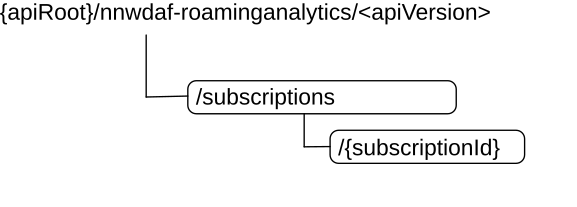

# 5.8 Nnwdaf_RoamingAnalytics Service API

## 5.8.1 Introduction

The Nnwdaf_RoamingAnalytics service shall use the Nnwdaf_RoamingAnalytics API.

The API URI of the Nnwdaf_RoamingAnalytics API shall be:

> {apiRoot}/\<apiName\>/\<apiVersion\>

The request URIs used in each HTTP requests from the NF service consumer towards the RE-NWDAF shall have the Resource URI structure defined in clause 4.4.1 of 3GPP TS 29.501 \[7\], i.e.:

> **{apiRoot}/\<apiName\>/\<apiVersion\>/\<apiSpecificResourceUriPart\>**

with the following components:

\- The {apiRoot} shall be set as described in 3GPP TS 29.501 \[7\].

\- The\<apiName\> shall be "nnwdaf-roaminganalytics".

\- The \<apiVersion\> shall be "v1".

\- The \<apiSpecificResourceUriPart\> shall be set as described in clause 5.8.3.

## 5.8.2 Usage of HTTP

### 5.8.2.1 General

HTTP/2, IETF RFC 9113 \[9\], shall be used as specified in clause 5 of 3GPP TS 29.500 \[6\].

HTTP/2 shall be transported as specified in clause 5.3 of 3GPP TS 29.500 \[6\].

The OpenAPI \[11\] specification of HTTP messages and content bodies for the Nnwdaf_RoamingAnalytics API is contained in Annex A.9.

### 5.8.2.2 HTTP standard headers

#### 5.8.2.2.1 General

See clause 5.2.2 of 3GPP TS 29.500 \[6\] for the usage of HTTP standard headers.

#### 5.8.2.2.2 Content type

JSON, IETF RFC 8259 \[10\], shall be used as content type of the HTTP bodies specified in the present specification as specified in clause 5.4 of 3GPP TS 29.500 \[6\]. The use of the JSON format shall be signalled by the content type "application/json".

"Problem Details" JSON object shall be used to indicate additional details of the error in an HTTP response body and shall be signalled by the content type "application/problem+json", as defined in IETF RFC 9457 \[15\].

### 5.8.2.3 HTTP custom headers

The Nnwdaf_RoamingAnalytics service API shall support mandatory HTTP custom header fields specified in clause 5.2.3.2 of 3GPP TS 29.500 \[6\] and may support HTTP custom header fields specified in clause 5.2.3.3 of 3GPP TS 29.500 \[6\].

In this release of the specification, no specific custom headers are defined for the Nnwdaf_RoamingAnalytics service API.

## 5.8.3 Resources

### 5.8.3.1 Resource Structure

This clause describes the structure for the Resource URIs, the resources and methods used for the service.

Figure 5.8.3.1-1 depicts the resource URIs structure for the Nnwdaf_RoamingAnalytics API.

Figure 5.8.3.1-1: Resource URI structure of the Nnwdaf_RoamingAnalytics API

Table 5.8.3.1-1 provides an overview of the resources and applicable HTTP methods.

Table 5.8.3.1-1: Resources and methods overview

|                                                 |                                 |                                     |                                                                                                                                                   |
|-------------------------------------------------|---------------------------------|-------------------------------------|---------------------------------------------------------------------------------------------------------------------------------------------------|
| **Resource name**                               | **Resource URI**                | **HTTP method or custom operation** | **Description**                                                                                                                                   |
| NWDAF Roaming Analytics Subscriptions           | /subscriptions                  | POST                                | Create a new Individual NWDAF Roaming Analytics Subscription resource on the NWDAF with roaming exchange capability.                              |
| Individual NWDAF Roaming Analytics Subscription | /subscriptions/{subscriptionId} | PUT                                 | Modifies an existing Individual NWDAF Roaming Analytics Subscription resource on the NWDAF with roaming exchange capability.                      |
|                                                 |                                 | DELETE                              | Delete the Individual NWDAF Roaming Analytics Subscription resource identified by {subscriptionId} on the NWDAF with roaming exchange capability. |

### 5.8.3.2 Resource: NWDAF Roaming Analytics Subscriptions

#### 5.8.3.2.1 Description

The NWDAF Roaming Analytics Subscriptions resource represents all subscriptions to the Nnwdaf_RoamingAnalytics Service at a given RE-NWDAF. The resource allows an NF service consumer to create a new Individual NWDAF Roaming Analytics Subscription resource.

#### 5.8.3.2.2 Resource Definition

Resource URI: **{apiRoot}/nnwdaf-roaminganalytics/\<apiVersion\>/subscriptions**

The \<apiVersion\> shall be set as described in clause 5.8.1.

This resource shall support the resource URI variables defined in table 5.8.3.2.2-1.

Table 5.8.3.2.2-1: Resource URI variables for this resource

|          |               |                  |
|----------|---------------|------------------|
| **Name** | **Data type** | **Definition**   |
| apiRoot  | string        | See clause 5.8.1 |

#### 5.8.3.2.3 Resource Standard Methods

#### 5.8.3.2.3.1 POST

This method shall support the URI query parameters specified in table 5.8.3.2.3.1-1.

Table 5.8.3.2.3.1-1: URI query parameters supported by the POST method on this resource

|          |               |       |                 |                 |
|----------|---------------|-------|-----------------|-----------------|
| **Name** | **Data type** | **P** | **Cardinality** | **Description** |
| n/a      |               |       |                 |                 |

This method shall support the request data structures specified in table 5.8.3.2.3.1-2 and the response data structures and response codes specified in table 5.8.3.2.3.1-3.

Table 5.8.3.2.3.1-2: Data structures supported by the POST Request Body on this resource

|                              |       |                 |                                                                        |
|------------------------------|-------|-----------------|------------------------------------------------------------------------|
| **Data type**                | **P** | **Cardinality** | **Description**                                                        |
| RoamingAnalyticsSubscription | M     | 1               | Create a new Individual NWDAF Roaming Analytics subscription resource. |

Table 5.8.3.2.3.1-3: Data structures supported by the POST Response Body on this resource

<table>
<colgroup>
<col style="width: 28%" />
<col style="width: 3%" />
<col style="width: 12%" />
<col style="width: 10%" />
<col style="width: 45%" />
</colgroup>
<tbody>
<tr class="odd">
<td><strong>Data type</strong></td>
<td><strong>P</strong></td>
<td><strong>Cardinality</strong></td>
<td>
<strong>Response</strong>

<strong>codes</strong>
</td>
<td><strong>Description</strong></td>
</tr>
<tr class="even">
<td>RoamingAnalyticsSubscription</td>
<td>M</td>
<td>1</td>
<td>201 Created</td>
<td>The creation of an Individual NWDAF Roaming Analytics subscription resource is confirmed and a representation of that resource is returned.</td>
</tr>
<tr class="odd">
<td>ProblemDetails</td>
<td>O</td>
<td>0..1</td>
<td>400 Bad Request</td>
<td>(NOTE 2)</td>
</tr>
<tr class="even">
<td>ProblemDetails</td>
<td>O</td>
<td>0..1</td>
<td>403 Forbidden</td>
<td>(NOTE 2)</td>
</tr>
<tr class="odd">
<td>ProblemDetails</td>
<td>O</td>
<td>0..1</td>
<td>500 Internal Server Error</td>
<td>(NOTE 2)</td>
</tr>
<tr class="even">
<td colspan="5">
NOTE 1: The mandatory HTTP error status codes for the POST method listed in table 5.2.7.1-1 of 3GPP TS 29.500 [6] also apply.

NOTE 2: Failure cases are described in clause 5.8.7.
</td>
</tr>
</tbody>
</table>

Table 5.8.3.2.3.1-4: Headers supported by the 201 Response Code on this resource

|          |               |       |                 |                                                                                                                                                             |
|----------|---------------|-------|-----------------|-------------------------------------------------------------------------------------------------------------------------------------------------------------|
| **Name** | **Data type** | **P** | **Cardinality** | **Description**                                                                                                                                             |
| Location | string        | M     | 1               | Contains the URI of the newly created resource, according to the structure: {apiRoot}/nnwdaf-roaminganalytics/\<apiVersion\>/subscriptions/{subscriptionId} |

#### 5.8.3.2.4 Resource Custom Operations

None in this release of the specification.

### 5.8.3.3 Resource: Individual NWDAF Roaming Analytics Subscription

#### 5.8.3.3.1 Description

The Individual NWDAF Roaming Analytics Subscription resource represents a single subscription to the Nnwdaf_RoamingAnalytics Service at a given RE-NWDAF.

#### 5.8.3.3.2 Resource definition

Resource URI: **{apiRoot}/nnwdaf-roaminganalytics/\<apiVersion\>/subscriptions/{subscriptionId}**

The \<apiVersion\> shall be set as described in clause 5.8.1.

This resource shall support the resource URI variables defined in table 5.8.3.3.2-1.

Table 5.8.3.3.2-1: Resource URI variables for this resource

|                |               |                                                                   |
|----------------|---------------|-------------------------------------------------------------------|
| **Name**       | **Data type** | **Definition**                                                    |
| apiRoot        | string        | See clause 5.8.1.                                                 |
| subscriptionId | string        | Identifies a subscription to the Nnwdaf_RoamingAnalytics Service. |

#### 5.8.3.3.3 Resource Standard Methods

#### 5.8.3.3.3.1 PUT

This method shall support the URI query parameters specified in table 5.8.3.3.3.1-1.

Table 5.8.3.3.3.1-1: URI query parameters supported by the PUT method on this resource

|          |               |       |                 |                 |
|----------|---------------|-------|-----------------|-----------------|
| **Name** | **Data type** | **P** | **Cardinality** | **Description** |
| n/a      |               |       |                 |                 |

This method shall support the request data structures specified in table 5.8.3.3.3.1-2 and the response data structures and response codes specified in table 5.8.3.3.3.1-3.

Table 5.8.3.3.3.1-2: Data structures supported by the PUT Request Body on this resource

|                              |       |                 |                                                                  |
|------------------------------|-------|-----------------|------------------------------------------------------------------|
| **Data type**                | **P** | **Cardinality** | **Description**                                                  |
| RoamingAnalyticsSubscription | M     | 1               | Parameters to replace a subscription to NWDAF Roaming Analytics. |

Table 5.8.3.3.3.1-3: Data structures supported by the PUT Response Body on this resource

<table>
<colgroup>
<col style="width: 28%" />
<col style="width: 4%" />
<col style="width: 12%" />
<col style="width: 17%" />
<col style="width: 37%" />
</colgroup>
<tbody>
<tr class="odd">
<td><strong>Data type</strong></td>
<td><strong>P</strong></td>
<td><strong>Cardinality</strong></td>
<td><strong>Response codes</strong></td>
<td><strong>Description</strong></td>
</tr>
<tr class="even">
<td>RoamingAnalyticsSubscription</td>
<td>M</td>
<td>1</td>
<td>200 OK</td>
<td>The Individual NWDAF Roaming Analytics subscription resource was modified successfully and a representation of that resource is returned.</td>
</tr>
<tr class="odd">
<td>n/a</td>
<td></td>
<td></td>
<td>204 No Content</td>
<td>The Individual NWDAF Roaming Analytics subscription resource was modified successfully.</td>
</tr>
<tr class="even">
<td>RedirectResponse</td>
<td>O</td>
<td>0..1</td>
<td>307 Temporary Redirect</td>
<td>
Temporary redirection, during Individual NWDAF Roaming Analytics subscription modification.

(NOTE 3)
</td>
</tr>
<tr class="odd">
<td>RedirectResponse</td>
<td>O</td>
<td>0..1</td>
<td>308 Permanent Redirect</td>
<td>
Permanent redirection, during Individual NWDAF Roaming Analytics subscription modification.

(NOTE 3)
</td>
</tr>
<tr class="even">
<td>ProblemDetails</td>
<td>O</td>
<td>0..1</td>
<td>400 Bad Request</td>
<td>(NOTE 2)</td>
</tr>
<tr class="odd">
<td>ProblemDetails</td>
<td>O</td>
<td>0..1</td>
<td>403 Forbidden</td>
<td>(NOTE 2)</td>
</tr>
<tr class="even">
<td>ProblemDetails</td>
<td>O</td>
<td>0..1</td>
<td>500 Internal Server Error</td>
<td>(NOTE 2)</td>
</tr>
<tr class="odd">
<td colspan="5">
NOTE 1: The mandatory HTTP error status codes for the PUT method listed in table 5.2.7.1-1 of 3GPP TS 29.500 [6] also apply.

NOTE 2: Failure cases are described in clause 5.8.7.

NOTE 3: The RedirectResponse data structure may be provided by an SCP or a SEPP (cf. clause 6.10.9.1 of 3GPP TS 29.500 [6]).
</td>
</tr>
</tbody>
</table>

Table 5.8.3.3.3.1-4: Headers supported by the 307 Response Code on this resource

<table>
<colgroup>
<col style="width: 16%" />
<col style="width: 14%" />
<col style="width: 4%" />
<col style="width: 11%" />
<col style="width: 52%" />
</colgroup>
<tbody>
<tr class="odd">
<td><strong>Name</strong></td>
<td><strong>Data type</strong></td>
<td><strong>P</strong></td>
<td><strong>Cardinality</strong></td>
<td><strong>Description</strong></td>
</tr>
<tr class="even">
<td>Location</td>
<td>string</td>
<td>M</td>
<td>1</td>
<td>
Contains an alternative URI of the resource located in an alternative RE-NWDAF (service) instance towards which the request is redirected.

For the case where the request is redirected to the same target via a different SCP or SEPP, refer to clause 6.10.9.1 of 3GPP TS 29.500 [6].
</td>
</tr>
<tr class="odd">
<td>3gpp-Sbi-Target-Nf-Id</td>
<td>string</td>
<td>O</td>
<td>0..1</td>
<td>Identifier of the target RE-NWDAF (service) instance towards which the request is redirected.</td>
</tr>
</tbody>
</table>

Table 5.8.3.3.3.1-5: Headers supported by the 308 Response Code on this resource

<table>
<colgroup>
<col style="width: 16%" />
<col style="width: 14%" />
<col style="width: 4%" />
<col style="width: 11%" />
<col style="width: 52%" />
</colgroup>
<tbody>
<tr class="odd">
<td><strong>Name</strong></td>
<td><strong>Data type</strong></td>
<td><strong>P</strong></td>
<td><strong>Cardinality</strong></td>
<td><strong>Description</strong></td>
</tr>
<tr class="even">
<td>Location</td>
<td>string</td>
<td>M</td>
<td>1</td>
<td>
Contains an alternative URI of the resource located in an alternative RE-NWDAF (service) instance towards which the request is redirected.

For the case where the request is redirected to the same target via a different SCP or SEPP, refer to clause 6.10.9.1 of 3GPP TS 29.500 [6].
</td>
</tr>
<tr class="odd">
<td>3gpp-Sbi-Target-Nf-Id</td>
<td>string</td>
<td>O</td>
<td>0..1</td>
<td>Identifier of the target RE-NWDAF (service) instance towards which the request is redirected.</td>
</tr>
</tbody>
</table>

#### 5.8.3.3.3.2 DELETE

This method shall support the URI query parameters specified in table 5.8.3.3.3.2-1.

Table 5.8.3.3.3.2-1: URI query parameters supported by the DELETE method on this resource

|          |               |       |                 |                 |
|----------|---------------|-------|-----------------|-----------------|
| **Name** | **Data type** | **P** | **Cardinality** | **Description** |
| n/a      |               |       |                 |                 |

This method shall support the request data structures specified in table 5.8.3.3.3.2-2 and the response data structures and response codes specified in table 5.8.3.3.3.2-3.

Table 5.8.3.3.3.2-2: Data structures supported by the DELETE Request Body on this resource

|               |       |                 |                 |
|---------------|-------|-----------------|-----------------|
| **Data type** | **P** | **Cardinality** | **Description** |
| n/a           |       |                 |                 |

Table 5.8.3.3.3.2-3: Data structures supported by the DELETE Response Body on this resource

<table>
<colgroup>
<col style="width: 16%" />
<col style="width: 4%" />
<col style="width: 12%" />
<col style="width: 11%" />
<col style="width: 54%" />
</colgroup>
<tbody>
<tr class="odd">
<td><strong>Data type</strong></td>
<td><strong>P</strong></td>
<td><strong>Cardinality</strong></td>
<td>
<strong>Response</strong>

<strong>codes</strong>
</td>
<td><strong>Description</strong></td>
</tr>
<tr class="even">
<td>n/a</td>
<td></td>
<td></td>
<td>204 No Content</td>
<td>Successful case: The Individual NWDAF Roaming Analytics subscription resource matching the subscriptionId was deleted.</td>
</tr>
<tr class="odd">
<td>RedirectResponse</td>
<td>O</td>
<td>0..1</td>
<td>307 Temporary Redirect</td>
<td>
Temporary redirection, during Individual Roaming Analytics subscription deletion.

(NOTE 2)
</td>
</tr>
<tr class="even">
<td>RedirectResponse</td>
<td>O</td>
<td>0..1</td>
<td>308 Permanent Redirect</td>
<td>
Permanent redirection, during Individual Roaming Analytics subscription deletion.

(NOTE 2)
</td>
</tr>
<tr class="odd">
<td colspan="5">
NOTE 1: The mandatory HTTP error status codes for the DELETE method listed in table 5.2.7.1-1 of 3GPP TS 29.500 [6] also apply.

NOTE 2: The RedirectResponse data structure may be provided by an SCP or a SEPP (cf. clause 6.10.9.1 of 3GPP TS 29.500 [6]).
</td>
</tr>
</tbody>
</table>

Table 5.8.3.3.3.2-4: Headers supported by the 307 Response Code on this resource

<table>
<colgroup>
<col style="width: 16%" />
<col style="width: 14%" />
<col style="width: 4%" />
<col style="width: 11%" />
<col style="width: 52%" />
</colgroup>
<tbody>
<tr class="odd">
<td><strong>Name</strong></td>
<td><strong>Data type</strong></td>
<td><strong>P</strong></td>
<td><strong>Cardinality</strong></td>
<td><strong>Description</strong></td>
</tr>
<tr class="even">
<td>Location</td>
<td>string</td>
<td>M</td>
<td>1</td>
<td>
Contains an alternative URI of the resource located in an alternative RE-NWDAF (service) instance towards which the request is redirected.

For the case where the request is redirected to the same target via a different SCP or SEPP, refer to clause 6.10.9.1 of 3GPP TS 29.500 [6].
</td>
</tr>
<tr class="odd">
<td>3gpp-Sbi-Target-Nf-Id</td>
<td>string</td>
<td>O</td>
<td>0..1</td>
<td>Identifier of the target RE-NWDAF (service) instance towards which the request is redirected.</td>
</tr>
</tbody>
</table>

Table 5.8.3.3.3.2-5: Headers supported by the 308 Response Code on this resource

<table>
<colgroup>
<col style="width: 16%" />
<col style="width: 14%" />
<col style="width: 4%" />
<col style="width: 11%" />
<col style="width: 52%" />
</colgroup>
<tbody>
<tr class="odd">
<td><strong>Name</strong></td>
<td><strong>Data type</strong></td>
<td><strong>P</strong></td>
<td><strong>Cardinality</strong></td>
<td><strong>Description</strong></td>
</tr>
<tr class="even">
<td>Location</td>
<td>string</td>
<td>M</td>
<td>1</td>
<td>
Contains an alternative URI of the resource located in an alternative RE-NWDAF (service) instance towards which the request is redirected

For the case where the request is redirected to the same target via a different SCP or SEPP, refer to clause 6.10.9.1 of 3GPP TS 29.500 [6].
</td>
</tr>
<tr class="odd">
<td>3gpp-Sbi-Target-Nf-Id</td>
<td>string</td>
<td>O</td>
<td>0..1</td>
<td>Identifier of the target RE-NWDAF (service) instance towards which the request is redirected.</td>
</tr>
</tbody>
</table>

#### 5.8.3.3.4 Resource Custom Operations

None in this release of the specification.

## 5.8.4 Custom Operations without associated resources

None in this release of the specification.

## 5.8.5 Notifications

### 5.8.5.1 General

Notifications shall comply with clause 6.2 of 3GPP TS 29.500 \[6\] and clause 4.6.2.3 of 3GPP TS 29.501 \[7\].

Table 5.8.5.1-1: Notifications overview

|                                |                  |                                     |                                            |
|--------------------------------|------------------|-------------------------------------|--------------------------------------------|
| **Notification**               | **Callback URI** | **HTTP method or custom operation** | **Description (service operation)**        |
| Roaming Analytics Notification | {notifUri}       | POST                                | Report analytics related to roaming UE(s). |

### 5.8.5.2 Roaming Analytics Notification

#### 5.8.5.2.1 Description

The Roaming Analytics Notification is used by the RE-NWDAF to report analytics related to roaming UE(s) to the NF service consumer that has subscribed to such notifications.

#### 5.8.5.2.2 Operation Definition

Callback URI: **{notifUri}**

The operation shall support the callback URI variables defined in Table 5.8.5.2.2-1, the request data structures specified in table 5.8.5.2.2-2 and the response data structure and response codes specified in Table 5.8.5.2.2-3.

Table 5.8.5.2.2-1: Callback URI variables

|          |               |                                                                                                                                                                       |
|----------|---------------|-----------------------------------------------------------------------------------------------------------------------------------------------------------------------|
| **Name** | **Data type** | **Definition**                                                                                                                                                        |
| notifUri | Uri           | The Notification Uri is assigned within the Individual NWDAF Roaming Analytics Subscription Resource and described within the RoamingAnalyticsSubscription data type. |

Table 5.8.5.2.2-2: Data structures supported by the POST Request Body on this resource

|                              |       |                 |                                              |
|------------------------------|-------|-----------------|----------------------------------------------|
| **Data type**                | **P** | **Cardinality** | **Description**                              |
| RoamingAnalyticsNotification | M     | 1               | Provides analytics related to roaming UE(s). |

Table 5.8.5.2.2-3: Data structures supported by the POST Response Body on this resource

<table style="width:100%;">
<colgroup>
<col style="width: 19%" />
<col style="width: 4%" />
<col style="width: 12%" />
<col style="width: 15%" />
<col style="width: 47%" />
</colgroup>
<tbody>
<tr class="odd">
<td><strong>Data type</strong></td>
<td><strong>P</strong></td>
<td><strong>Cardinality</strong></td>
<td><strong>Response codes</strong></td>
<td><strong>Description</strong></td>
</tr>
<tr class="even">
<td>n/a</td>
<td></td>
<td></td>
<td>204 No Content</td>
<td>The receipt of the Notification is acknowledged.</td>
</tr>
<tr class="odd">
<td>RedirectResponse</td>
<td>O</td>
<td>0..1</td>
<td>307 Temporary Redirect</td>
<td>
Temporary redirection, during the event notification.

(NOTE 2)
</td>
</tr>
<tr class="even">
<td>RedirectResponse</td>
<td>O</td>
<td>0..1</td>
<td>308 Permanent Redirect</td>
<td>
Permanent redirection, during the event notification.

(NOTE 2)
</td>
</tr>
<tr class="odd">
<td colspan="5">
NOTE 1: The mandatory HTTP error status codes for the POST method listed in table 5.2.7.1-1 of 3GPP TS 29.500 [6] also apply.

NOTE 2: The RedirectResponse data structure may be provided by an SCP or a SEPP (cf. clause 6.10.9.1 of 3GPP TS 29.500 [6]).
</td>
</tr>
</tbody>
</table>

Table 5.8.5.2.2-4: Headers supported by the 307 Response Code on this resource

<table>
<colgroup>
<col style="width: 16%" />
<col style="width: 14%" />
<col style="width: 4%" />
<col style="width: 11%" />
<col style="width: 52%" />
</colgroup>
<tbody>
<tr class="odd">
<td><strong>Name</strong></td>
<td><strong>Data type</strong></td>
<td><strong>P</strong></td>
<td><strong>Cardinality</strong></td>
<td><strong>Description</strong></td>
</tr>
<tr class="even">
<td>Location</td>
<td>string</td>
<td>M</td>
<td>1</td>
<td>
Contains an alternative URI representing the end point of an alternative NF consumer (service) instance towards which the notification is redirected.

For the case where the notification is redirected to the same target via a different SCP or SEPP, refer to clause 6.10.9.1 of 3GPP TS 29.500 [6].
</td>
</tr>
<tr class="odd">
<td>3gpp-Sbi-Target-Nf-Id</td>
<td>string</td>
<td>O</td>
<td>0..1</td>
<td>Identifier of the target NF (service) instance towards which the notification request is redirected.</td>
</tr>
</tbody>
</table>

Table 5.8.5.2.2-5: Headers supported by the 308 Response Code on this resource

<table>
<colgroup>
<col style="width: 16%" />
<col style="width: 14%" />
<col style="width: 4%" />
<col style="width: 11%" />
<col style="width: 52%" />
</colgroup>
<tbody>
<tr class="odd">
<td><strong>Name</strong></td>
<td><strong>Data type</strong></td>
<td><strong>P</strong></td>
<td><strong>Cardinality</strong></td>
<td><strong>Description</strong></td>
</tr>
<tr class="even">
<td>Location</td>
<td>string</td>
<td>M</td>
<td>1</td>
<td>
Contains an alternative URI representing the end point of an alternative NF consumer (service) instance towards which the notification is redirected.

For the case where the notification is redirected to the same target via a different SCP or SEPP, refer to clause 6.10.9.1 of 3GPP TS 29.500 [6].
</td>
</tr>
<tr class="odd">
<td>3gpp-Sbi-Target-Nf-Id</td>
<td>string</td>
<td>O</td>
<td>0..1</td>
<td>Identifier of the target NF (service) instance towards which the notification request is redirected.</td>
</tr>
</tbody>
</table>

## 5.8.6 Data Model

### 5.8.6.1 General

This clause specifies the application data model supported by the API.

Table 5.8.6.1-1 specifies the data types defined for the Nnwdaf_RoamingAnalytics service based interface protocol.

Table 5.8.6.1-1: Nnwdaf_RoamingAnalytics specific Data Types

|                              |                    |                                 |                   |
|------------------------------|--------------------|---------------------------------|-------------------|
| **Data type**                | **Clause defined** | **Description**                 | **Applicability** |
| RoamingAnalyticsSubscription | 5.8.6.2.2          | Roaming Analytics Subscription. |                   |
| RoamingAnalyticsNotification | 5.8.6.2.3          | Roaming Analytics Notification. |                   |

Table 5.8.6.1-2 specifies data types re-used by the Nnwdaf_RoamingAnalytics service based interface protocol from other specifications, including a reference to their respective specifications and when needed, a short description of their use within the Nnwdaf_RoamingAnalytics service based interface.

Table 5.8.6.1-2: Nnwdaf_RoamingAnalytics re-used Data Types

|                      |                       |                                                                                        |                   |
|----------------------|-----------------------|----------------------------------------------------------------------------------------|-------------------|
| **Data type**        | **Reference**         | **Comments**                                                                           | **Applicability** |
| EventNotification    | 5.1.6.2.5             | Contains NWDAF events that are being notified.                                         |                   |
| EventSubscription    | 5.1.6.2.3             | Contains NWDAF events to be subscribed.                                                |                   |
| FailureEventInfo     | 5.1.6.2.35            | Information about events for which the subscription failed.                            |                   |
| PlmnId               | 3GPP TS 29.571 \[8\]  | PLMN identifier.                                                                       |                   |
| ReportingInformation | 3GPP TS 29.523 \[20\] | Represents the type of reporting the subscription requires.                            |                   |
| SupportedFeatures    | 3GPP TS 29.571 \[8\]  | Used to negotiate the applicability of the optional features defined in table 5.8.8-1. |                   |
| TermCause            | 5.1.6.3.26            | Cause of termination of an analytics subscription.                                     |                   |
| Uri                  | 3GPP TS 29.571 \[8\]  | Indicates the URI.                                                                     |                   |

### 5.8.6.2 Structured data types

#### 5.8.6.2.1 Introduction

This clause defines the structures to be used in resource representations.

#### 5.8.6.2.2 Type RoamingAnalyticsSubscription

Table 5.8.6.2.2-1: Definition of type RoamingAnalyticsSubscription

<table>
<colgroup>
<col style="width: 17%" />
<col style="width: 15%" />
<col style="width: 4%" />
<col style="width: 11%" />
<col style="width: 25%" />
<col style="width: 25%" />
</colgroup>
<tbody>
<tr class="odd">
<td><strong>Attribute name</strong></td>
<td><strong>Data type</strong></td>
<td><strong>P</strong></td>
<td><strong>Cardinality</strong></td>
<td><strong>Description</strong></td>
<td><strong>Applicability</strong></td>
</tr>
<tr class="even">
<td>roamEventSubs</td>
<td>array(EventSubscription)</td>
<td>M</td>
<td>1..N</td>
<td>
Subscribed events.

(NOTE 1)
</td>
<td></td>
</tr>
<tr class="odd">
<td>evtReq</td>
<td>ReportingInformation</td>
<td>O</td>
<td>0..1</td>
<td>
Represents the reporting requirements of the event subscription.

(NOTE 2, NOTE 3)

If omitted, the default values within the ReportingInformation data type apply.
</td>
<td></td>
</tr>
<tr class="even">
<td>notifUri</td>
<td>Uri</td>
<td>M</td>
<td>1</td>
<td>Identifies the recipient of Notifications sent by the NWDAF.</td>
<td></td>
</tr>
<tr class="odd">
<td>notifCorrId</td>
<td>string</td>
<td>M</td>
<td>1</td>
<td>Notification correlation identifier.</td>
<td></td>
</tr>
<tr class="even">
<td>consPlmnId</td>
<td>PlmnId</td>
<td>M</td>
<td>1</td>
<td>The PLMN ID of the NF service consumer.</td>
<td></td>
</tr>
<tr class="odd">
<td>roamEventNotifs</td>
<td>array(EventNotification)</td>
<td>C</td>
<td>1..N</td>
<td>
Notifications about Individual Events.

Shall only be present in the response to a subscription creation or modification if the immediate reporting indication in the "immRep" attribute within the "evtReq" attribute was set to true in the request and the reports are available.

(NOTE 4)
</td>
<td></td>
</tr>
<tr class="even">
<td>failEventReports</td>
<td>array(FailureEventInfo)</td>
<td>O</td>
<td>1..N</td>
<td>It may be supplied by the NWDAF in the response to a subscription creation or modification. When available, it contains the event(s) for which the subscription was not successful including the failure reason(s).</td>
<td></td>
</tr>
<tr class="odd">
<td>suppFeat</td>
<td>SupportedFeatures</td>
<td>C</td>
<td>0..1</td>
<td>
List of Supported features used as described in clause 5.8.8.

This parameter shall be included in the response to the subscription creation or modification if it was included in the request.
</td>
<td></td>
</tr>
<tr class="even">
<td colspan="6">
NOTE 1: The attributes "useCaseCxt", "accuReq", "pauseFlg", "resumeFlg", as well as the attributes "anaMeta" and "anaMetaInd" within the "extraReportReq" attribute, are not applicable here.

NOTE 2: If the "evtReq" attribute (of data type ReportingInformation) is provided and contains the "notifMethod" attribute, the notification method indicated by the "notifMethod" attribute within the ReportingInformation data type takes precedence over the notification method indicated by the "notificationMethod" attribute within the EventSubscription data type.

NOTE 3: If the "evtReq" attribute (of data type ReportingInformation) is provided and contains the "repPeriod" attribute, the periodic reporting time indicated by the "repPeriod" attribute in the ReportingInformation data type takes precedence over the periodic reporting time indicated by the "repetitionPeriod" attribute in the EventSubscription data type.

NOTE 4: The attributes "anaMetaInfo", "accuInfo", "cancelAccuInd", "pauseInd", and "resumeInd" are not applicable here.
</td>
</tr>
</tbody>
</table>

#### 5.8.6.2.3 Type RoamingAnalyticsNotification

Table 5.8.6.2.3-1: Definition of type RoamingAnalyticsNotification

<table>
<colgroup>
<col style="width: 17%" />
<col style="width: 15%" />
<col style="width: 4%" />
<col style="width: 11%" />
<col style="width: 25%" />
<col style="width: 25%" />
</colgroup>
<tbody>
<tr class="odd">
<td><strong>Attribute name</strong></td>
<td><strong>Data type</strong></td>
<td><strong>P</strong></td>
<td><strong>Cardinality</strong></td>
<td><strong>Description</strong></td>
<td><strong>Applicability</strong></td>
</tr>
<tr class="even">
<td>roamEventNotifs</td>
<td>array(EventNotification)</td>
<td>M</td>
<td>1..N</td>
<td>
Notifications about Individual Events.

(NOTE)
</td>
<td></td>
</tr>
<tr class="odd">
<td>notifCorrId</td>
<td>string</td>
<td>M</td>
<td>1</td>
<td>Notification correlation identifier.</td>
<td></td>
</tr>
<tr class="even">
<td>termCause</td>
<td>TermCause</td>
<td>O</td>
<td>0..1</td>
<td>A cause for which the NWDAF will send no further notifications for this subscription. Its presence indicates that the NWDAF requests the termination of the subscription.</td>
<td></td>
</tr>
<tr class="odd">
<td colspan="6">NOTE: The attributes "anaMetaInfo", "accuInfo", "cancelAccuInd", "pauseInd", and "resumeInd" are not applicable here.</td>
</tr>
</tbody>
</table>

## 5.8.7 Error handling

### 5.8.7.1 General

HTTP error handling shall be supported as specified in clause 5.2.4 of TS 29.500 \[6\].

For the Nnwdaf_RoamingAnalytics API, HTTP error responses shall be supported as specified in clause 4.8 of TS 29.501 \[7\]. Protocol errors and application errors specified in table 5.2.7.2-1 of TS 29.500 \[6\] shall be supported for an HTTP method if the corresponding HTTP status codes are specified as mandatory for that HTTP method in table 5.2.7.1-1 of TS 29.500 \[6\]. In addition, the requirements in the following clauses shall apply.

### 5.8.7.2 Protocol Errors

In this Release of the specification, there are no additional protocol errors applicable for the Nnwdaf_RoamingAnalytics API.

5.8.7.3 Application Errors

The application errors defined for the Nnwdaf_RoamingAnalytics API are listed in table 5.8.7.3-1.

Table 5.8.7.3-1: Application errors

|                                                                                                                                                                            |                           |                                                                                                                                                                                                        |                   |
|----------------------------------------------------------------------------------------------------------------------------------------------------------------------------|---------------------------|--------------------------------------------------------------------------------------------------------------------------------------------------------------------------------------------------------|-------------------|
| **Application Error**                                                                                                                                                      | **HTTP status code**      | **Description**                                                                                                                                                                                        | **Applicability** |
| BOTH_STAT_PRED_NOT_ALLOWED                                                                                                                                                 | 400 Bad Request           | For the requested observation period, the start time is in the past and the end time is in the future, which means the NF service consumer requested both statistics and prediction for the analytics. |                   |
| MISSING_ROAMING_AGREEMENT                                                                                                                                                  | 403 Forbidden             | Missing the corresponding roaming agreement to satisfy the request.                                                                                                                                    |                   |
| UNAVAILABLE_DATA                                                                                                                                                           | 500 Internal Server Error | Indicates the requested statistics in the past is rejected since necessary data to perform the service is unavailable.                                                                                 |                   |
| NOTE: Including a "ProblemDetails" data structure with the "cause" attribute in the HTTP response is optional unless explicitly mandated in the service operation clauses. |                           |                                                                                                                                                                                                        |                   |

## 5.8.8 Feature negotiation

The optional features in table 5.8.8-1 are defined for the Nnwdaf_RoamingAnalytics API. They shall be negotiated using the extensibility mechanism defined in clause 6.6 of 3GPP TS 29.500 \[6\].

Table 5.8.8-1: Supported Features

|                    |                  |                 |
|--------------------|------------------|-----------------|
| **Feature number** | **Feature Name** | **Description** |
|                    |                  |                 |

## 5.8.9 Security

As indicated in TS 33.501 \[13\] and TS 29.500 \[6\], the access to the Nnwdaf_RoamingAnalytics API may be authorized by means of the OAuth2 protocol (see IETF RFC 6749 \[14\]), based on local configuration, using the "Client Credentials" authorization grant, where the NRF (see TS 29.510 \[12\]) plays the role of the authorization server.

If OAuth2 is used, an NF service consumer, prior to consuming services offered by the Nnwdaf_RoamingAnalytics API, shall obtain a "token" from the authorization server, by invoking the Access Token Request service, as described in TS 29.510 \[12\], clause 5.4.2.2.

> NOTE: When multiple NRFs are deployed in a network, the NRF used as authorization server is the same NRF that the NF service consumer used for discovering the Nnwdaf_RoamingAnalytics service.

The Nnwdaf_RoamingAnalytics API defines a single scope "nnwdaf-roaminganalytics" for the entire service, and it does not define any additional scopes at resource or operation level.
