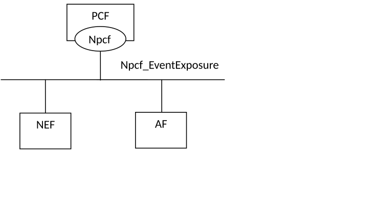
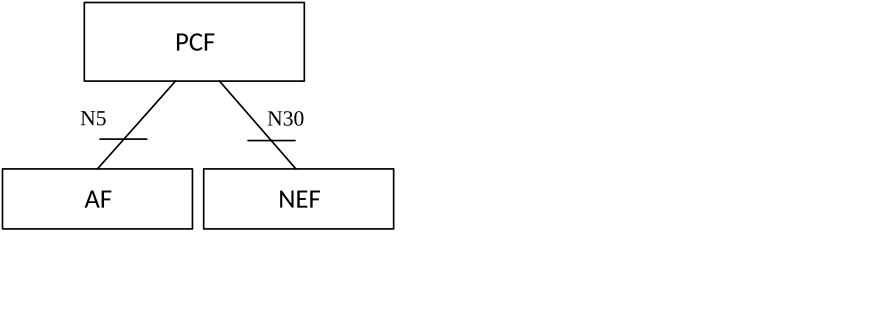

# 4.1 Service Description

## 4.1.1 Overview

The Policy Event Exposure Service, as defined in 3GPP TS 23.502 \[3\] and 3GPP TS 23.503 \[4\], is provided by the Policy Control Function (PCF).

This service:

\- allows NF service consumers to subscribe to, modify and unsubscribe from policy control events; and

\- notifies NF service consumers with a corresponding subscription about observed events on the PCF.

The types of observed events include:

\- PLMN identifier notification;

NOTE 1: Within the PLMN identifier notification event the PLMN Identifier or SNPN Identifier where the UE is currently located is provided. The SNPN Identifier consists of the PLMN Identifier and the NID.

NOTE 2: Mobility between non-equivalent SNPNs, and between SNPN and PLMN is not supported. When the UE is operating in SNPN access mode, the trigger reports changes of equivalent SNPNs.

\- access type change;

\- satellite backhaul category change;

\- service area coverage change;

\- successful or unsuccessful outcome of the UE Policy Delivery; and

\- application traffic detection events.

The target of the event reporting may include a group of UE(s) or any UE (i.e. all UEs). When an event occurs, to which the NF service consumer has subscribed, the PCF reports the requested information to the NF service consumer based on the event reporting information definition requested by the NF service consumer (see 3GPP TS 23.502 \[3\], clause 4.15.1).

## 4.1.2 Service Architecture

The 5G System Architecture is defined in 3GPP TS 23.501 \[2\]. The Policy and Charging related 5G architecture and signalling flows are also described in 3GPP TS 29.513 \[8\].

The Policy Event Exposure Service (Npcf_EventExposure) is part of the Npcf service-based interface exhibited by the Policy Control Function (PCF).

The known NF service consumers of the Npcf_EventExposure service are the Network Exposure Function (NEF) and the Application Function (AF).

The Npcf_EventExposure service is provided by the PCF and consumed by NF service consumers (e.g. NEF, AF), as shown in figure 4.1.2-1 for the SBI representation model and in figure 4.1.2-2 for reference point representation model.

Figure 4.1.2-1: Npcf_EventExposure service Architecture, SBI representation

Figure 4.1.2-2: Npcf_EventExposure service Architecture, reference point representation

NOTE: The NWDAF and the DCCF can be consumers of the Npcf_EventExposure service to perform data collection. However, there is no data collected from the PCF by the NWDAF or the DCCF defined in this release of the specification.

## 4.1.3 Network Functions

### 4.1.3.1 Policy Control Function (PCF)

The PCF (Policy Control Function) is a functional element that encompasses policy control decision and flow based charging control functionalities as defined in 3GPP TS 29.512 \[9\], access and mobility policy decisions for the control of the UE Service Area Restrictions and RAT/RFSP control as defined in 3GPP TS 29.507 \[10\] and UE Policy decisions for the control of Access network discovery and selection policy and UE Route Selection Policy (URSP) as defined in 3GPP TS 29.525 \[11\].

The policy control decision and flow based charging control functionalities enable the PCF to provide network control regarding the service data flow detection, gating, QoS and flow based charging (except credit management) towards the SMF/UPF. The PCF offers these capabilities to the NF service consumers (e.g. the AF and NEF) as defined in 3GPP TS 29.514 \[12\] and 3GPP TS 29.214 \[13\].

The PCF also offers the access and mobility policy control to the NF service consumers as defined in 3GPP TS 29.534 \[23\].

The Policy Event Exposure Service enables the PCF to report policy control events observed in one or more PCF services to NF service consumers.

### 4.1.3.2 NF Service Consumers

As indicated in clause 4.1.2 above, the known NF service consumer of the Npcf_EventExposure service are the Network Exposure Function (NEF) and the Application Function (AF).

The Network Exposure Function (NEF) is a functional element that supports the following functionalities:

\- The NEF securely exposes network capabilities and events provided by 3GPP NFs to AF.

\- The NEF provides a means for the AF to securely provide information to 3GPP network and can authenticate, authorize and assist in throttling the AF.

\- The NEF translates the information received from the AF to the one sent to internal 3GPP NFs, and vice versa.

\- The NEF supports exposing information (collected from other 3GPP NFs) to the AF.

The Application Function (AF) is a functional element offering control to applications that require the policy and charging control of traffic plane resources; specific user plane paths for the requested traffic, the monitoring of the required service QoS, and/or specific QoS and alternative QoS profiles. The AF uses the Npcf_EventExposure service to receive exposed information from the 5GC network.
