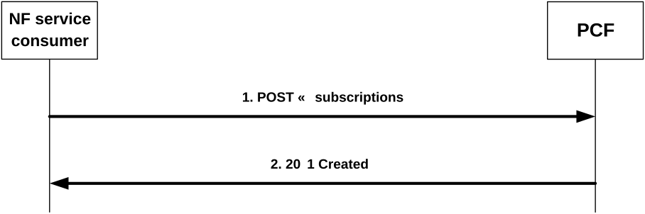
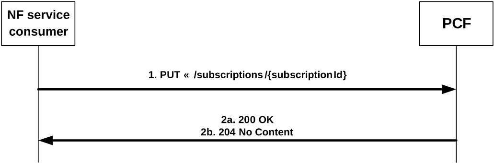
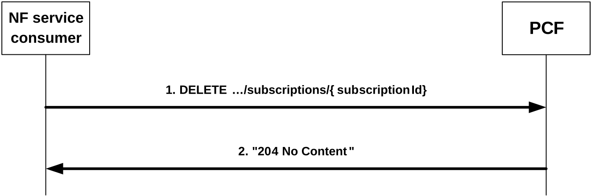
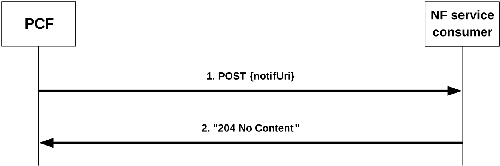

# 4.2 Service Operations

## 4.2.1 Introduction

Service operations defined for the Npcf_EventExposure Service are shown in table 4.2.1-1.

Table 4.2.1-1: Npcf_EventExposure Service Operations

| Service Operation Name         | Description                                                                                                                                                                                    | Initiated by                   |
|--------------------------------|------------------------------------------------------------------------------------------------------------------------------------------------------------------------------------------------|--------------------------------|
| Npcf_EventExposure_Subscribe   | This service operation is used by an NF service consumer to subscribe for event notifications on a specified policy control event for a group of UE(s) or any UE, or to modify a subscription. | NF service consumer (e.g. NEF) |
| Npcf_EventExposure_Unsubscribe | This service operation is used by an NF service consumer to unsubscribe from event notifications.                                                                                              | NF service consumer (e.g. NEF) |
| Npcf_EventExposure_Notify      | This service operation is used by the PCF to report UE related policy control event(s) to the NF service consumer which has subscribed to the event report service.                            | PCF                            |

## 4.2.2 Npcf_EventExposure_Subscribe service operation

### 4.2.2.1 General

This service operation is used by an NF service consumer to explicitly subscribe for policy events notifications on a specified context for a group of UE(s) or any UE, or to modify an existing subscription.

The following are the types of events for which a subscription can be made:

\- PLMN identifier notification;

NOTE 1: Within the PLMN identifier notification event the PLMN Identifier or SNPN Identifier where the UE is currently located is provided. The SNPN Identifier consists of the PLMN Identifier and the NID.

NOTE 2: Mobility between non-equivalent SNPNs, and between SNPN and PLMN is not supported. When the UE is operating in SNPN access mode, the trigger reports changes of equivalent SNPNs.

\- change of Access Type;

\- when the feature "AMPoliciesEvents" is supported, change of Service Area Coverage;

\- when the feature "SatelliteBackhaul" is supported, satellite backhaul category change;

\- when the feature "DeliveryOutcome" is supported, UE Policy delivery outcome; and

\- when the feature "AppDetection" is supported, application traffic detection (Start/Stop) event notification.

The following procedures using the Npcf_EventExposure_Subscribe service operation are supported:

\- creating a new subscription;

\- modifying an existing subscription.

NOTE 3: It is also possible to implicitly subscribe for policy events notifications for a single UE, for a group of UE(s) or any UE. Implicit subscription information is obtained from the UDR for application data. In this case, the PCF will use the callback URI provided by the AF to the UDR, see 3GPP TS 29.519 \[24\] for the details.

### 4.2.2.2 Creating a new subscription

Figure 4.2.2.2-1 illustrates the creation of a subscription.

Figure 4.2.2.2-1: Creation of a subscription

To subscribe to event notifications, the NF service consumer shall send an HTTP POST request with: "{apiRoot}/npcf-eventexposure/v1/subscriptions" as request URI as shown in figure 4.2.2.2-1, step 1, and the "PcEventExposureSubsc" data structure as request body.

The "PcEventExposureSubsc" data structure shall include:

\- identification of the policy events to subscribe as "eventSubs" attribute;

\- indication of the UEs to which the subscription applies via:

a\) identification of a group of UE(s) via a "groupId" attribute; or

b\) identification of any UE by omitting the "groupId" attribute;

\- a URI where to receive the requested notifications as "notifUri" attribute;

\- a Notification Correlation Identifier assigned by the NF service consumer for the requested notifications as "notifId" attribute; and

\- when the feature "AppDetection" is supported, to indicate the specific application(s) for which the application detection policy event report shall occur, the application identifier(s) in the "appIds" attribute and the concerned S-NSSAI and DNN within the "snssaiDnns" attribute.

NOTE: The subscription to "APPLICATION_START" and/or "APPLICATION_STOP" application detection policy event(s) for one or more application identifiers can impact the SMF/UPF performance. The restriction to a specific combination of S-NSSAI and DNN avoids excessive signalling load.

The "PcEventExposureSubsc" data structure may also include:

\- description of the event reporting information as "eventsRepInfo", which may include:

a\) event notification method (periodic, one time, on event detection) as "notifMethod" attribute;

b\) Maximum Number of Reports as "maxReportNbr" attribute;

c\) Monitoring Duration as "monDur" attribute;

d\) repetition period for periodic reporting as "repPeriod" attribute;

e\) immediate reporting indication as "immRep" attribute;

f\) sampling ratio as "sampRatio" attribute;

g\) group reporting guard time as "grpRepTime" attribute;

h\) partitioning criteria for partitioning the UEs before performing sampling as "partitionCriteria" attribute if the EneNA feature is supported; and/or

i\) a notification flag as "notifFlag" attribute if the EneNA feature is supported;

\- if the supported feature "ExtendedSessionInformation" is supported, to filter the AF sessions for which the policy event report shall occur, the identification of the services one or more AF sessions may belong to as "filterServices" attribute, which may include per service identification:

a\) a list of ethernet flows in the "servEthFlows" attribute; or

b\) a list of IP flows in the "servIpFlows" attribute; and/or

c\) an AF application identifier in the "afAppId" attribute;

\- to filter the DNNs for which the policy event report shall occur, the identification of the DNNs in the "filterDnns" attribute;

\- to filter the S-NSSAIs for which the policy event report shall occur, the identification of the S-NSSAIs in the "filterSnssais" attribute; and

\- when the feature "EneNA" is supported, to filter the specific DNN and S-NSSAI combination list for which the policy event report shall occur, the identification of each combination within the "snssaiDnns" attribute.

If the PCF cannot successfully fulfil the received HTTP POST request due to an internal PCF error or an error in the HTTP POST request, the PCF shall send an HTTP error response as specified in clause 5.7.

Upon successful reception of the HTTP POST request with "{apiRoot}/npcf-eventexposure/v1/subscriptions" as request URI and "PcEventExposureSubsc" data structure as request body, the PCF shall create a new "Individual Policy Events Subscription" resource, store the subscription and send a HTTP "201 Created" response as shown in figure 4.2.2.2-1, step 2. The PCF shall include in the "201 Created" response:

\- a Location header field; and

\- an "PcEventExposureSubsc" data type in the content.

The Location header field shall contain the URI of the created individual application session context resource i.e. "{apiRoot}/npcf-eventexposure/v1/subscriptions/{subscriptionId}".

The "PcEventExposureSubsc" data type in the response content shall contain the representation of the created "Individual Policy Events Subscription".

When the "monDur" attribute is included in the response, it represents a server selected expiry time that is equal or less than a possible expiry time in the request.

When the "immRep" attribute set to true is included in the subscription and the subscribed policy control events are available:

\- if the feature "ERIR" is not supported, the PCF shall immediately notify the NF service consumer with the current available value(s) for the subscribed event(s) using the Npcf_EventExposure_Notify service operation, as described in clause 4.2.4.2.

\- if the feature "ERIR" is supported, the PCF shall immediately notify the NF service consumer with the current available value(s) for the subscribed event(s) within the HTTP "201 Created" response as shown in figure 4.2.2.2-1, step 2. The "PcEventExposureSubsc" data type shall include the corresponding event(s) notification within the "eventNotifs" attribute, as described in clause 4.2.4.2.

When the sampling ratio as the "sampRatio" attribute is included in the subscription without a "partitionCriteria" attribute, the PCF shall select a random subset of UEs among the target UEs according to the sampling ratio and only report the event(s) related to the selected subset of UEs. If the "partitionCriteria" attribute is additionally included, then the PCF shall first partition the UEs according to the value of the "partitionCriteria" attribute and then select a random subset of UEs from each partition according to the sampling ratio and only report the event(s) related to the selected subsets of UEs.

When the group reporting guard time as the "grpRepTime" attribute is included in the subscription, the PCF shall accumulate all the event reports for the target UEs until the group reporting guard time expires. Then the PCF shall notify the NF service consumer using the Npcf_EventExposure_Notify service operation, as described in clause 4.2.4.2.

When the "notifFlag" attribute is included and set to "DEACTIVATE" in the request, the PCF shall mute the event notification and store the available events until the NF service consumer requests to retrieve them by setting the "notifFlag" attribute to "RETRIEVAL" or until a muting exception occurs (e.g. full buffer).

When the feature "AppDetection" is supported, and the "APPLICATION_START" and/or "APPLICATION_STOP" policy event(s) are included in the request, the PCF shall trigger the provisioning of the PCC rule(s) for application detection and control for the application identifier(s) included in the "appIds" attribute as specified in 3GPP TS 29.512 \[9\], clause 4.2.6.2.11, if not previously provisioned, and for every PDU session of the DNN and S-NSSAI included in the "snssaiDnns" attribute.

### 4.2.2.3 Modifying an existing subscription

Figure 4.2.2.3-1 illustrates the modification of an existing subscription.

Figure 4.2.2.3-1: Modification of an existing subscription

To modify an existing subscription to event notifications, the NF service consumer shall send an HTTP PUT request with: "{apiRoot}/npcf-eventexposure/v1/subscriptions/{subscriptionId}" as request URI, as shown in figure 4.2.2.3-1, step 1, where "{subscriptionId}" is the subscription correlation ID of the existing subscription. The "PcEventExposureSubsc" data structure is included as request body as described in clause 4.2.2.2.

NOTE 1: An alternate NF service consumer than the one that requested the generation of the subscription resource can send the PUT.

NOTE 2: The "notifUri" attribute within the PcEventExposureSubsc data structure can be modified to request that subsequent notifications are sent to a new NF service consumer.

If the PCF cannot successfully fulfil the received HTTP PUT request due to an internal PCF error or an error in the HTTP PUT request, the PCF shall send an HTTP error response as specified in clause 5.7.

If the feature "ES3XX" is supported, and the PCF determines the received HTTP PUT request needs to be redirected, the PCF shall send an HTTP redirect response as specified in clause 6.10.9 of 3GPP TS 29.500 \[5\].

Upon successful reception of an HTTP PUT request with: "{apiRoot}/npcf-eventexposure/v1/subscriptions/{subscriptionId}" as request URI and "PcEventExposureSubsc" data structure as request body, the PCF shall store the subscription and send an HTTP "200 OK" response with the "PcEventExposureSubsc" data structure as response body or an HTTP "204 No Content" response, as shown in figure 4.2.2.3-1, step 2.

The "PcEventExposureSubsc" data structure in the response content shall contain the representation of the modified "Individual Policy Events Subscription".

When the "monDur" attribute is included in the response, it represents a NF service producer selected expiry time that is equal or less than a possible expiry time received in the request.

When the "immRep" attribute set to true is included in the updated subscription and the subscribed policy control events are available:

\- if the feature "ERIR" is not supported, the PCF shall immediately notify the NF service consumer with the current available value(s) for the subscribed event(s) using the Npcf_EventExposure_Notify service operation, as described in clause 4.2.4.2.

\- if the feature "ERIR" is supported, the PCF shall immediately notify the NF service consumer with the current available value(s) for the subscribed event(s) within the HTTP "200 OK" response as shown in figure 4.2.2.3-1, step 2a. The "PcEventExposureSubsc" data type shall include the corresponding event(s) notification within the "eventNotifs" attribute, as described in clause 4.2.4.2.

When the sampling ratio as the "sampRatio" attribute is included in the subscription without a "partitionCriteria" attribute, the PCF shall select a random subset of UEs among the target UEs according to the sampling ratio and only report the event(s) related to the selected subset of UEs. If the "partitionCriteria" attribute is additionally included, then the PCF shall first partition the UEs according to the value of the "partitionCriteria" attribute and then select a random subset of UEs from each partition according to the sampling ratio and only report the event(s) related to the selected subsets of UEs.

When the group reporting guard time as the "grpRepTime" attribute is included in the subscription, the PCF shall accumulate all the event reports for the target UEs until the group reporting guard time expires. Then the PCF shall notify the NF service consumer using the Npcf_EventExposure_Notify service operation, as described in clause 4.2.4.2.

When the "notifFlag" attribute is included, and set to "DEACTIVATE" in the request, the PCF shall mute the event notification and store the available events until the NF service consumer requests to retrieve them by setting the "notifFlag" attribute to "RETRIEVAL" or until a muting exception occurs (e.g. full buffer); if the "notifFlag" attribute is set to "RETRIEVAL" in the request, the PCF shall send the stored events to the NF service consumer, mute the event notification again and store available events; if the "notifFlag" attribute is set to "ACTIVATE" and the event notifications are muted (due to a previously received "DECATIVATE" value), the PCF shall unmute the event notification, i.e. start sending again notifications for available events.

When the feature "AppDetection" is supported, and the "APPLICATION_START" and/or "APPLICATION_STOP" policy event(s) are included in the request, the PCF shall trigger the provisioning of the PCC rule(s) for application detection and control for the application identifiers indicated within the "appIds" attribute, (if not previously provisioned) and/or the removal application detection and control for the PCC rule(s) (if application detection and control is not required for other use cases) for the removed application identifier(s) as specified in 3GPP TS 29.512 \[9\], clause 4.2.6.2.11, and for every PDU session of the DNN and S-NSSAI included in the "snssaiDnns" attribute. If the APPLICATION_START" and/or "APPLICATION_STOP" policy event(s) are removed from the subscription, the PCF shall trigger the removal/update of application detection and control for the PCC rule(s) (if application detection and control is not required for other use cases) for the previously subscribed application identifier(s) as specified in 3GPP TS 29.512 \[9\], clause 4.2.6.2.11, and for every PDU session of the previously subscribed DNN and S-NSSAI.

## 4.2.3 Npcf_EventExposure_UnSubscribe service operation

### 4.2.3.1 General

This service operation is used by an NF service consumer to unsubscribe from event notifications.

The following procedure using the Npcf_EventExposure_UnSubscribe service operation is supported:

\- unsubscription from event notifications.

### 4.2.3.2 Unsubscription from event notifications

Figure 4.2.3.2-1 illustrates the unsubscription from event notifications.

Figure 4.2.3.2-1: Unsubscription from event notifications

To unsubscribe from event notifications, the NF service consumer shall send an HTTP DELETE request with: "{apiRoot}/npcf-eventexposure/v1/subscriptions/{subscriptionId}" as request URI, as shown in figure 4.2.3.2-1, step 1, where "{subscriptionId}" is the subscription correlation identifier of the existing resource subscription that is to be deleted.

If the PCF cannot successfully fulfil the received HTTP DELETE request due to an internal PCF error or an error in the HTTP DELETE request, the PCF shall send the HTTP error response as specified in clause 5.7.

If the feature "ES3XX" is supported, and the PCF determines the received HTTP DELETE request needs to be redirected, the PCF shall send an HTTP redirect response as specified in clause 6.10.9 of 3GPP TS 29.500 \[5\].

Upon successful reception of the HTTP DELETE request with: "{apiRoot}/npcf-eventexposure/v1/subscriptions/{subscriptionId}" as request URI, the PCF shall remove the corresponding subscription and send an HTTP "204 No Content" response as shown in figure 4.2.3.2-1, step 2.

## 4.2.4 Npcf_EventExposure_Notify service operation

### 4.2.4.1 General

The Npcf_EventExposure_Notify service operation enables the PCF to notify the NF service consumers that the previously (explicitly or implicitly) subscribed policy control event occurred.

The following procedure using the Npcf_EventExposure_Notify service operation is supported:

\- notification about subscribed events.

### 4.2.4.2 Notification about subscribed events

Figure 4.2.4.2-1 illustrates the notification about subscribed events.

Figure 4.2.4.2-1: Notification about subscribed events

If the PCF observes policy control related event(s) for which an NF service consumer has subscribed explicitly as defined in clause 4.2.2 or implicitly when the subscription information is obtained from the UDR for application data, the PCF shall send an HTTP POST request as shown in figure 4.2.4.2-1, step 1, with the "{notifUri}" as request URI containing the value previously provided by the NF service consumer within the corresponding subscription or containing the callback URI provided by the AF to the UDR, and the "PcEventExposureNotif" data structure.

The "PcEventExposureNotif" data structure shall include:

\- The notification correlation ID provided by the NF service consumer during the subscription as "notifId" attribute or obtained from the UDR as specified in 3GPP TS 29.519 \[24\]; and

\- information about the observed event(s) within the "eventNotifs" attribute that shall contain for each observed event an "PcEventNotification" data structure that shall include:

1\. the Policy Control event as "event" attribute;

2\. for an access type change:

a\) new access type as "accType" attribute;

b\) the new RAT type as "ratType" attribute, if applicable for the notified access type; and

c\) if the "ATSSS" feature is supported:

i\. if it is the first access type report for a PDU session, and both, 3GPP and non-3GPP access information is available, the "addAccessInfo" attribute. The "addAccessInfo" attribute contains the additional access type information, where the access type is encoded in the "accessType" attribute, and the RAT type is encoded in the "ratType" attribute when applicable for the notified access type;

ii\. if it is a subsequent access type change report:

\- if a new access type is added to the MA PDU session, the "addAccessInfo" attribute with the added access type encoded in the "accessType" attribute, and the RAT type encoded in the "ratType" attribute when applicable for the notified access type;

\- if an access type is released in the MA PDU session, the "relAccessInfo" attribute with the released access type encoded in the "accessType" attribute, and the RAT type encoded in the "ratType" attribute when applicable for the notified access type; and

NOTE 1: For a MA PDU session, if the "ATSSS" feature is not supported by the AF, the PCF includes the "accessType" attribute and the "ratType" attribute with a currently active combination of access type and RAT type (if applicable for the notified access type). When both 3GPP and non-3GPP accesses are available, the PCF includes the information corresponding to the 3GPP access.

d\) for EPC interworking scenarios, the ePDG address as "anGwAddr" attribute, if applicable for the notified access type;

3\. for a PLMN change:

a\) new network identity containing the PLMN Identifier or the SNPN Identifier in the "plmnId" attribute;

NOTE 2: The SNPN Identifier consists of the PLMN Identifier and the NID.

NOTE 3: Mobility between non-equivalent SNPNs, and between SNPN and PLMN is not supported. When the UE is operating in SNPN access mode, the trigger reports changes of equivalent SNPNs.

> 4\. when the feature "AMPoliciesEvents" is supported, for a service area coverage change, the new service area coverage in the "appliedCov" attribute, encoded as specified in 3GPP TS 29.534 \[23\], clause 4.2.7.4;

NOTE 4: The service area coverage change event is met and the notification is triggered when the PCF determines the tracking areas where the service is allowed in relation to the NF consumer requested service area coverage. The actual service area coverage for the UE might be larger than the one reported with the service area coverage change event.

5\. for a satellite backhaul category change:

a\) when the "SatelliteBackhaul" feature is supported:

i\) the satellite backhaul category (i.e., "GEO", "MEO", "LEO", or "OTHER_SAT") or the indication of non-satellite backhaul category (i.e., "NON_SATELLITE") in the "satBackhaulCategory" attribute; or

b\) when dynamic satellite backhaul is used by the NG-RAN and the feature "EnSatBackhaulCatChg" is supported:

i\) the dynamic satellite backhaul category (i.e., "DYNAMIC_GEO", "DYNAMIC_MEO", "DYNAMIC_LEO", or "DYNAMIC_OTHER_SAT") in the "satBackhaulCategory" attribute;

6\. when the feature "DeliveryOutcome" is supported, to report the unsuccessful outcome of the UE Policy Delivery related to the invocation of AF provisioned service parameters, the reason of failure within the "delivFailure" attribute;

7\. the identity of the affected UE in the "supi" attribute and, if available, in the "gpsi" attribute;

8\. the time at which the event was observed encoded as "timeStamp" attribute;

9\. if available, and if the feature "ExtendedSessionInformation" is supported, information about the PDU session involved in the reported event in the "pduSessionInfo" attribute, that shall include:

a\) the S-NSSAI of the PDU session in the "snssai" attribute;

b\) the DNN of the PDU session in the "dnn" attribute; and

c\) the IPv4 address in the "ueIpv4" attribute and/or the IPv6 prefix in the "ueIpv6" attribute, or the Ethernet MAC address in the "ueMac" attribute; and

if the IPv4 address is included in the "ueIpv4" attribute, may include the IP domain in the "ipDomain" attribute;

10\. if available, and if the feature "ExtendedSessionInformation" is supported, information about the services involved in the reported event in the indicated PDU session in the "repServices" attribute, which may include per identified service:

a\) a list of Ethernet flows in the "servEthFlows" attribute which contains an impacted Ethernet flow number within the "flowNumber" attribute in each EthernetFlowInfo data structure; or

b\) a list of IP flows in the "servIpFlows" attribute which contains an impacted IP flow number within the "flowNumber" attribute in each IpFlowInfo data structure; and/or

c\) an AF application identifier in the "afAppId" attribute.

11\. for an application detection event and if the feature "AppDetection" is supported:

a\) optionally, information about the PDU session involved in the reported event in the "pduSessionInfo" attribute; and

NOTE 5: In the case of subscriptions targeting any UE, the served UE IP address (an Ipv4Addr or Ipv6Prefix or both if available) can be necessary to be provided in the "pduSessionInfo" attribute for the AF to function properly.

b\) the application identifier for which the notification applies in the "appId" attribute.

If the NF service consumer cannot successfully fulfil the received HTTP POST request due to an internal error or an error in the HTTP POST request, the NF service consumer shall send an HTTP error response as specified in clause 5.7.

If the feature "ES3XX" is supported, and the NF service consumer determines the received HTTP POST request needs to be redirected, the NF service consumer shall send an HTTP redirect response as specified in clause 6.10.9 of 3GPP TS 29.500 \[5\].

Upon successful reception of the HTTP POST request with "{notifUri}" as request URI and a "PcEventExposureNotif" data structure as request body, the NF service consumer shall send a "204 No Content" HTTP response, as shown in figure 4.2.4.2-1, step 2, for a successful processing.
