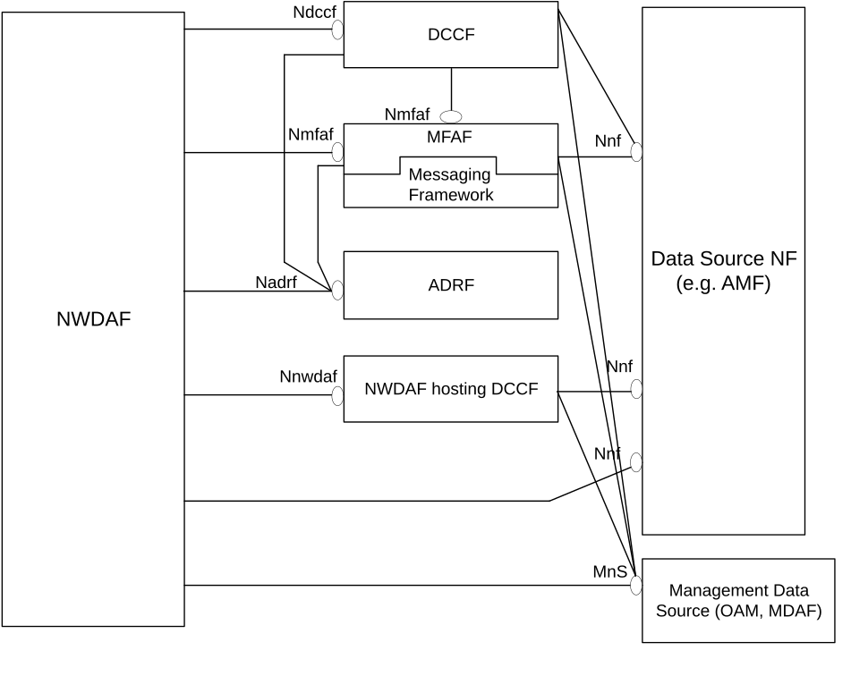
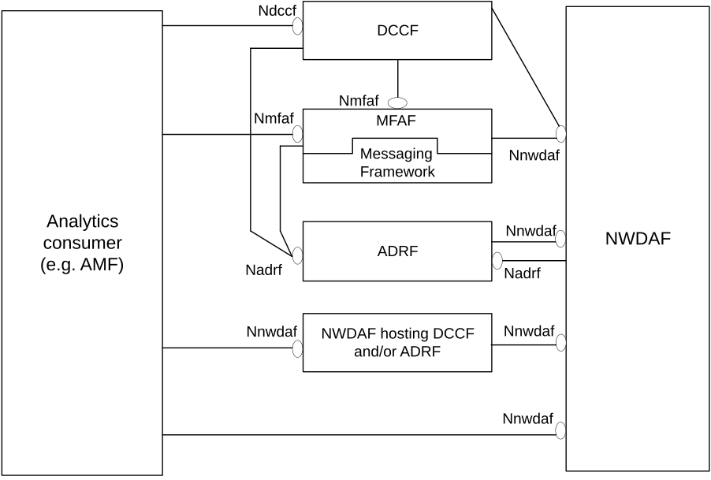
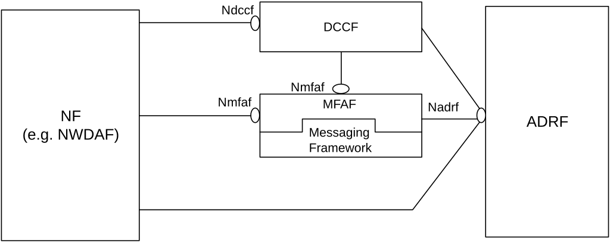
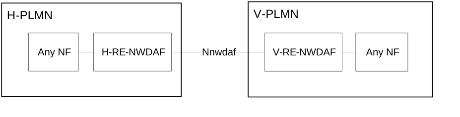

# 4 Reference Architecture for Data Analytics

## 4.1 General

For the enablement of network data analytics services, the NWDAF interacts with different entities for different purposes:

\- Data Collection:

a\) collecting Data from OAM, MDAF and/or 5GC NFs (e.g. AMF);

b\) collecting Data from untrusted AF via NEF; and/or

c\) collecting Analytics and/or Data from 5GC NFs via DCCF or via DCCF together with ADRF and/or MFAF or via NWDAF hosting DCCF i.e. an NWDAF that implements DCCF functionality internally and supports the Nnwdaf_DataManagement API for collecting data, the Nnwdaf_EventSubscription API for collecting analytics;

\- Analytics Exposure:

a\) Exposing Analytics to 5GC NFs;

b\) Exposing Analytics to untrusted AF via NEF; and/or

c\) Exposing Analytics to 5GC NFs via DCCF or via DCCF together with ADRF and/or MFAF or via NWDAF hosting DCCF and/or ADRF i.e. an NWDAF that implements DCCF and/or ADRF functionality internally and supports the Nnwdaf_EventSubscription API;

\- Storing and Retrieving data in ADRF.

The entities mentioned above interact also with each other as described in the procedures of clause 5.

## 4.2 Data Collection

As depicted in Figure 4.2-1, the 5G System architecture allows NWDAF to collect data from any 5GC NF (e.g. AMF, SMF), OAM and/or MDAF directly or via DCCF, DCCF together with ADRF and/or MFAF, or via NWDAF in non-roaming case. The roaming architecture for data collection is defined in clause 4.5.

Figure 4.2-1: Data Collection Architecture

When DCCF, ADRF, MFAF or NWDAF hosting DCCF are present in the network, whether the NWDAF directly contacts the Data Source NF or goes via the DCCF, or NWDAF hosting DCCF is based on configuration of the NWDAF.

The Data Source NF may be AMF, SMF, UDM, UPF, GMLC, AF, NSACF, NRF and/or NEF with the related data collection procedures described in clause 5.5. If the Data Source is OAM, the NWDAF may collect relevant management data from the services in the OAM as configured by the PLMN operator with NG RAN or 5GC performance measurements as defined in TS 28.552 \[27\] and 5G End to end KPIs as defined in TS 28.554 \[30\]. The NWDAF may use the OAM services e.g. generic performance assurance and fault supervision management services as defined in TS 28.532 \[19\], PM (Performance Management) services as defined in TS 28.550 \[31\] and/or FS (Fault Supervision) services as defined in TS 28.545 \[37\]. The procedure for data collection from OAM is defined in clause 6.2.3.2 of TS 23.288 \[2\]. The NWDAF may collect the analysis results from MDAF, e.g. service experience and energy saving state analysis and/or end-to-end latency analysis in TS 28.104 \[38\]. The procedure for analytics collection from MDAF is defined in clause 6.2.14.2 of TS 23.288 \[2\]. Before NWDAF requests analytics from the MDA Management Function, the NWDAF firstly discovers the MDAF via the MnS discovery service producer as defined in clause 5 of TS 28.537 \[42\].

For the specific analytics event, the applicable Data Source NF(s) and the related data collection procedures and scope are described in the corresponding analytics event subclause within clause 5.7.

## 4.3 Analytics Exposure

As depicted in Figure 4.3-1, the 5G System architecture allows NWDAF to expose data to any 5GC NF (e.g. AMF) directly or via DCCF/MFAF in non-roaming case. For roaming case, the roaming architecture as described in clause 4.5 is added between HPLMN and VPLMN.

Figure 4.3-1: Analytics Exposing Architecture

When DCCF, ADRF, MFAF or NWDAF are present in the network, whether the Analytics consumer directly contacts the NWDAF or goes via the DCCF or via the NWDAF hosting DCCF and/or ADRF is based on configuration of the Analytics consumer.

The Analytics consumer may be AMF, SMF, NSSF, PCF, LMF, AF, NEF, OAM and/or CEF when directly contacts NWDAF with the related analytics exposure procedures described in clause 5.2.2 and clause 5.2.3. The Analytics consumers may be AMF, SMF, NSSF, PCF, LMF, AF and/or NEF when contacts via the DCCF with the related analytics exposure procedures described in clause 5.2.4 and clause 5.2.5.

For the specific analytics event, the applicable Analytics consumer(s) and the related analytics exposure procedures and scope are descibed in the corresponding analytics event subcluase within clause 5.7.

## 4.4 Data Storage and Retrieval

As depicted in Figure 4.4-1, the 5G System architecture allows the consumer to store and retrieve the collected data in the ADRF directly or via DCCF/MFAF.

Figure 4.4-1: Data Storage and Retrieval Architecture

## 4.5 Roaming architecture for data collection and analytics exposure

Based on operator's policy and local regulations (e.g. privacy), data or analytics may be exchanged between PLMNs (i.e. HPLMN and VPLMN) via RE-NWDAF (i.e. an NWDAF with roaming exchange capability in each PLMN used as exchange point to exchange data and/or analytics with other PLMNs) using the architecture shown in Figure 4.5-1.

Figure 4.5-1: Roaming Architecture to exchange Data or Analytics between V-PLMN and H-PLMN

In roaming scenario, the H-RE-NWDAF is the enforcement point to check user consent. The H-RE-NWDAF retrieves the roaming-related user consent for a user from the UDM.
